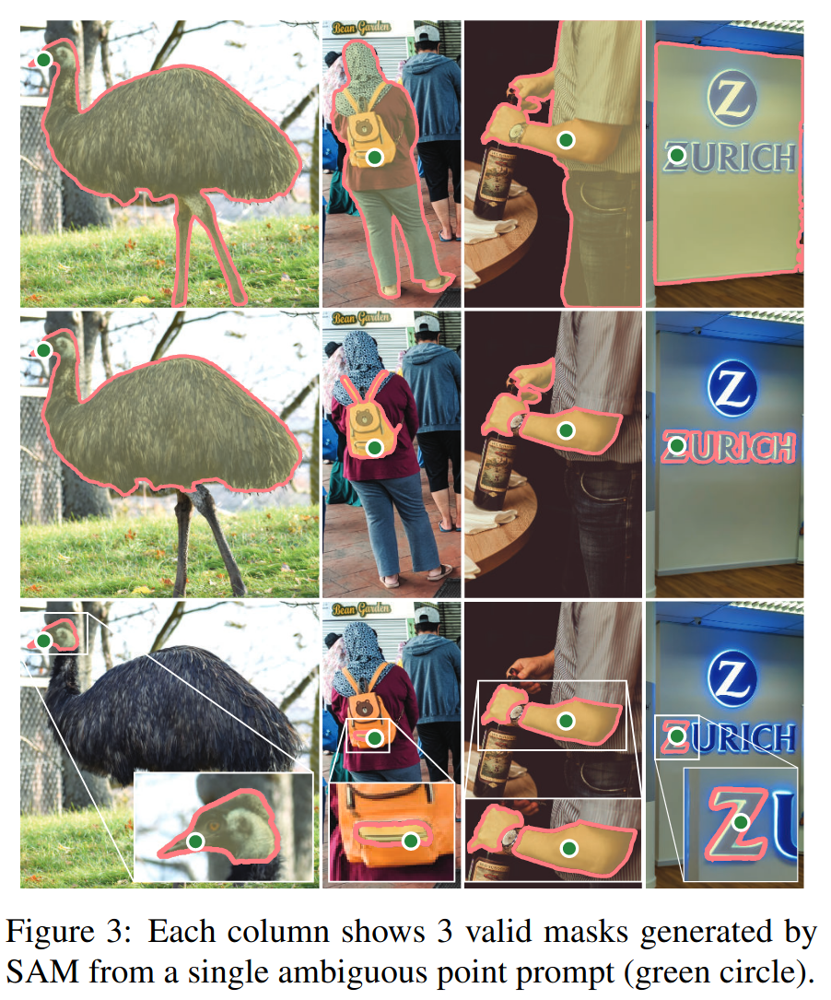
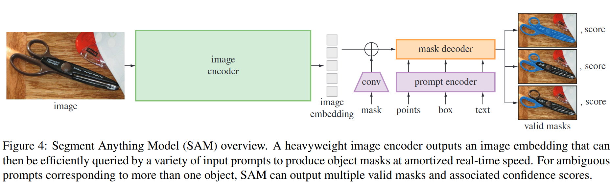
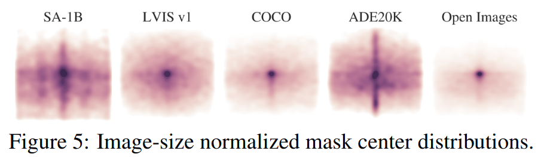
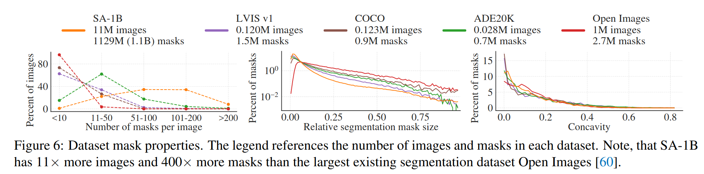
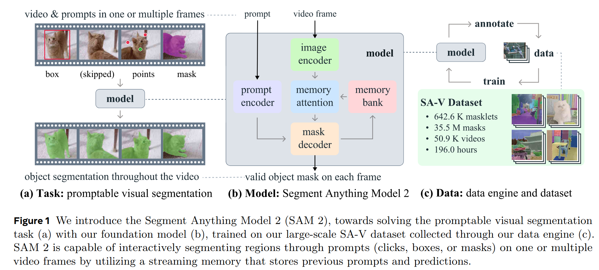
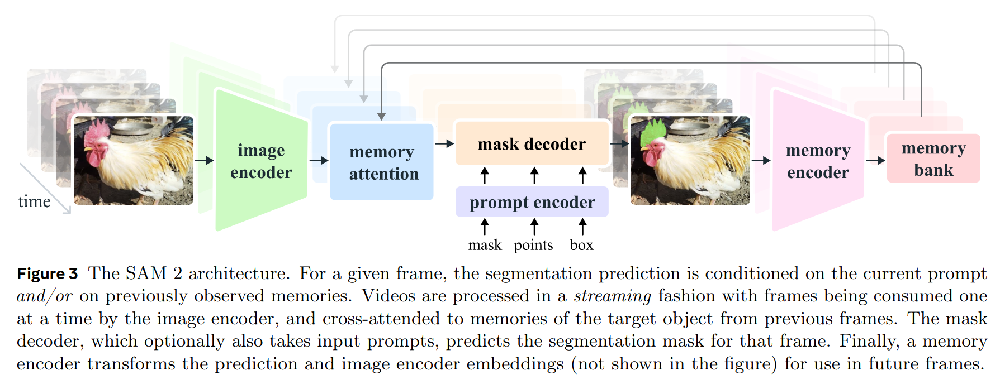

# SAM

>论文名称：Segment Anything
>
>Code： https://github.com/facebookresearch/segment-anything

> 官网： https://segment-anything.com

## 摘要

我们介绍了“Segment Anything (SA)”项目：一项 **新的图像分割任务、模型和数据集** 。我们使用高效的模型在数据收集循环中，构建了迄今为止最大的分割数据集（远超以往），包含超过 10 亿个掩码和 1100 万张获得许可且尊重隐私的图像。该模型被设计和训练成**可提示的**，因此它可以零样本转移到新的图像分布和任务中。我们在众多任务上评估了它的能力，并发现它的零样本性能令人印象深刻——通常与之前的完全监督结果相媲美，甚至更优。

为了开发 SAM，针对图像分割提出了以下问题：

1. 什么样的任务可以实现零样本泛化？
2. 对应的模型架构是什么？
3. 什么数据可以支持这样的任务和模型？

关键词：大型数据、提示工程、零样本泛化能力。

## 介绍和相关工作

### Foundation Model

在网络规模数据集上预训练的大型语言模型正在以强大的零样本和少样本泛化能力革新自然语言处理，这些基础模型能够在训练期间未见过的任务和数据分布上泛化。**这种能力通常通过提示工程实现。**

基础模型也在计算机视觉领域进行了探索，尽管程度较小。例如，CLIP 和 ALIGN 使用对比学习来训练文本和图像编码器，使这两种模态对齐。一旦训练完成，经过设计的文本提示可以实现对新视觉概念和数据分布的零样本泛化。这样的编码器也能有效组合其他模块以实现下游任务，如图像生成（例如，DALL·E  ）。虽然在视觉和语言编码器方面取得了很大进展，但计算机视觉包括了超出这个范围的广泛问题，对于这些问题中的许多，并不存在丰富的训练数据。

## Segment Anything Task

NLP 中使用 Next-Token Prediction 的形式训练基础模型，并通过提示工程来解决多样化的下游任务，为了构建一个用于分割的基础模型，本文定义一个具有类似能力的任务。

本文使用前景/背景点、粗略的框/掩码和自由形式的文本来表示类比 NLP 中的提示概念，因此 Promptable Segment Task 表示在给定的提示下可以返回一组有效的分割掩码，如下图所示：

## Segment Anything Model

AM 有三个组成部分，如图 4 所示：一个图像编码器、一个灵活的提示编码器和一个快速掩码解码器。基于 Transformer 视觉模型构建，针对实时性能进行了特定的权衡。

为了实现可扩展性和强大的预训练方法，使用了一个掩码自动编码器（MAE）预训练的 ViT，它经过最小程度的调整以处理高分辨率输入。

考虑两组提示：稀疏（点、框、文本）和密集（掩码）。通过位置编码表示点和框，并为每种提示类型加上学习到的嵌入，用现成的文本编码器从 CLIP 表示自由形式文本。密集提示（即掩码）使用卷积嵌入，并与图像嵌入逐元素相加。

掩码解码器有效地将图像嵌入、提示嵌入和一个输出标记映射到掩码。后面跟着一个动态掩码预测头，使用提示自注意力和交叉注意力在两个方向上（提示到图像嵌入和反之亦然）更新所有嵌入。运行两个块后，上采样图像嵌入，并且一个 MLP 将输出标记映射到一个动态线性分类器，然后计算每个图像位置的掩码前景概率。

若给定一个模糊提示，模型能为单个提示预测多个输出掩码，训练期间，只反向传播掩码上的最小损失（这里有相关工作），为了对掩码排名，模型为每个掩码预测置信度分数。

模型使用 focal loss 与 dice loss 的线性组合进行监督，并且对每张掩码随即采样 11 轮来模拟交互式设置。

## Segment Anything Data Engine

由于互联网上分割掩码并不丰富，构建了一个数据引擎来收集 SA-1B。数据引擎有三个阶段：

1. 模型辅助手动标注阶段，使用 SAM 驱动（使用常见公共分割数据集训练的）的网页交互式分割工具；并且随着数据的不断增加，该阶段重新训练了模型 6 次，使得标注速度提升，从 12 万张图像中收集了 430 万个掩码；
2. 半自动阶段，结合自动预测掩码和模型辅助标注，旨在增加掩码的多样性，首先标注了置信度高的掩码，要求标注者标注其他未标注的对象，同样定期训练了 5 次模型，最终额外收集了 18 万张图像中的 590 万个掩码（总计 1020 万）；
3. 全自动阶段，模型在没有标注者输入的情况下生成掩码，使用一个 $32\times 32$ 的网格提示模型，对于每个点模型将返回子部分、部分和整个对象，模型的 IoU 预测模块用于选择置信度高的掩码，识别并仅选择稳定的掩码（认为一个掩码是稳定的，如果在概率图上阈值处理 0.5 − δ和 0.5 + δ得到类似的掩码）。最后，在选择了置信度高且稳定的掩码后，应用非极大值抑制（NMS）来过滤重复项。为了进一步提高较小掩码的质量，还处理了多个重叠的放大图像裁剪。

具体看论文。

## Segment Anything Dataset

> SA-1B 由 1100 万张多样化、高分辨率、获得许可且保护隐私的图像组成，以及使用我们的数据引擎收集的 11 亿个高质量的分割掩码。我们将 SA-1B 与现有数据集进行比较，并分析掩码的质量和属性。我们发布 SA-1B 以帮助未来计算机视觉基础模型的发展。我们注意到，SA-1B 将在对某些研究用途有利的许可协议下发布，并对研究人员提供保护。

更多细节看论文。

**掩码属性**：可视化 SA-1B 中对象中的空间分布，与现有最大分割数据集进行了对比，如下图所示：

这些数据集都存在常见的摄影师偏见。

左图显示了不同掩码数量图片所占比例，可以看到其他数据集的掩码数量都较小；中图展示了掩码的相对大小，可以发现 SA-1B 拥有更多小型的掩码；右图表示了掩码的形状复杂度，使用掩码凹陷度（1- 掩码面积除以其凸包面积），由于形状复杂性与掩码大小相关，首先通过对分箱掩码大小进行分层抽样来控制数据集的掩码大小分布，可以观察到，SA-1B 的掩码的凹陷度分布大致与其他数据集相似。

## Segment Anything RAI Analysis

见论文

## Zero-Shot Transfer Experiments

提示 SAM 执行以下任务：(1) 执行边缘检测，(2) 分割一切，即对象提议生成，(3) 分割检测到的对象，即实例分割，以及 (4) 作为概念验证，从自由形式文本中分割对象。

# SAM 2

>Demo: https://sam2.metademolab.com
>
>Code: https://github.com/facebookresearch/segment-anything-2
>
>Website: https://ai.meta.com/sam2

## 摘要

1. Segment Anything Model 2（SAM 2），旨在解决图像和视频中的可提示视觉分割问题；
2. 构建了一个数据引擎，通过用户交互来改进模型和数据，以收集迄今为止最大的视频分割数据集；
3. 图像分割中，SAM 2 比 Segment Anything Model（SAM）更准确，速度提高了 6 倍；

## 介绍和相关工作

图像只是现实世界的一个静态快照，随着多媒体内容的快速增长，现在有相当一部分内容是以时间维度记录的，特别是在视频数据中。在增强现实/虚拟现实（AR/VR）、机器人技术、自动驾驶汽车和视频编辑等许多重要应用中，都需要超出图像级分割的时间定位。

**我们认为一个通用的视觉分割系统应该适用于图像和视频。**

**挑战**：

1. 由于运动、变形、遮挡、光照变化和其他因素，实体的外观可能会发生显著变化；
2. 与图像相比，视频通常由于相机运动、模糊和较低的分辨率而质量较低；
3. 效处理大量帧是一个关键挑战。

SAM 2 能够产生单个图像中和视频帧序列中感兴趣对象的分割掩码，配备了一个存储有关对象和先前交互信息的内存，这使得它能够在整个视频中生成掩码片段预测，并且也能够基于先前观察到的帧中对象的存储内存上下文有效地纠正这些预测。该流式架构是将 SAM 自然推广到视频领域的版本，它一次处理一个视频帧，并配备了一个内存注意力模块来关注目标对象的先前记忆。当应用于图像时，内存为空，模型的行为就像 SAM 一样。

### Interactive Video Object Segmentation (iVOS)

交互式视频对象分割已成为一种关键任务，它通过用户指导（通常以涂鸦、点击或边界框的形式）高效地获取视频中的对象分割（掩码片段）。一些早期方法采用基于图的优化来指导分割注释过程。更近期的方法通常采用模块化设计，将用户输入转换为单帧上的掩码表示，然后将其传播到其他帧。我们的工作与这些工作有类似的目标，即在视频中分割对象并提供良好的交互体验，为了实现这一目标，本文构建了一个强大的模型以及一个庞大且多样化的数据集。

也有一些基于 SAM 的交互式视频分割工作，但 SAM 无法很好的进行跟踪和细化掩码。

### Semi-supervised Video Object Segmentation (VOS)

半监督视频对象分割通常从第一帧中的对象掩码作为输入开始，该掩码必须在整个视频中准确跟踪。它被称为“半监督”，因为输入掩码可以被视为仅对第一帧可用的对象外观的监督信号。这项任务由于其在视频编辑、机器人技术和自动背景移除等多种应用中的相关性而受到了显著关注。

早期基于神经网络的方法经常使用在线微调来适应目标对象，这包括仅在第一帧视频帧上进行微调，或者在所有帧上进行微调。通过离线训练的模型，可以更快地进行推断，这些模型仅依赖于第一帧，或者也整合了前一帧。这种多条件调整已经扩展到所有帧上，使用了递归神经网络（RNNs）和交叉注意力。最近的方法扩展了一个单一的视觉变换器，以联合处理当前帧以及所有先前的帧和相关的预测，从而实现了一个简单的架构，但推断成本过高。半监督 VOS 可以看作是我们的可提示视觉分割（Promptable Visual Segmentation, PVS）任务的一个特例，因为它等同于仅在第一帧视频帧中提供掩码提示。**尽管如此，实际上在第一帧中注释所需的高质量对象掩码是具有挑战性和耗时的。**

## Model

为了实时处理任意长度的视频，SAM 2 采取流式处理方法，随着视频帧的可用而进行处理。图像编码器仅在整个交互过程中运行一次，其作用是提供代表每一帧的未条件化（Unconditioned）令牌 （特征嵌入）。使用了一个 MAE 预训练的 Hiera 图像编码器，它是分层的，允许解码过程中使用多尺度特征。

与 SAM 不同，在 PVS 任务中，有些帧可能不存在有效的对象进行分割（例如，由于遮挡）。为了考虑这种新的输出模式，我们增加了一个额外的头部，用于预测当前帧上是否存在感兴趣的对象。与 SAM 的另一个区别是，我们使用来自分层图像编码器的跳跃连接（绕过内存注意力）来为掩码解码整合高分辨率信息。

内存编码器使用卷积对输出掩码进行下采样，并与图像的未条件化帧嵌入逐元素相加，然后使用轻量级的卷积层融合信息，从而生成 memory bank。

Memory banck 通过维护一个最多包含 N 个最近帧的 FIFO（先进先出）队列来保留有关视频目标对象过去预测的信息，并在最多包含 M 个提示帧的 FIFO 队列中存储提示信息。例如，在 VOS 任务中，初始掩码是唯一的提示，内存库持续保留第一帧的内存以及最多 N 个最近的（未提示的）帧的内存。这两组内存都存储为空间特征图。

将时间位置信息嵌入到 N 个最近帧的记忆中，允许模型表示短期对象运动，但不会嵌入到提示帧的记忆中，因为来自提示帧的训练信号更稀疏，而且更难泛化到推理设置中，提示帧可能来自与训练期间看到的时间范围非常不同的时间范围。

训练。模型在图像和视频数据上联合训练。与先前工作类似，我们使用图像数据来训练模型对单个帧进行分割，使用视频数据来训练模型在时间上一致地跟踪对象。我们的目标是优化模型在图像分割和视频分割任务上的性能。训练过程中，我们使用各种损失函数，包括像素级损失来确保掩码的准确性，以及对齐损失来确保跨帧的一致性。此外，我们还使用了一个记忆损失函数，以确保模型能够正确地更新和利用其内存来改进预测。这些损失函数结合起来，使得模型能够在各种情况下有效地学习和泛化。

## Data Engine

具体看论文，同样分为了三个阶段用于标注与生成数据集。
