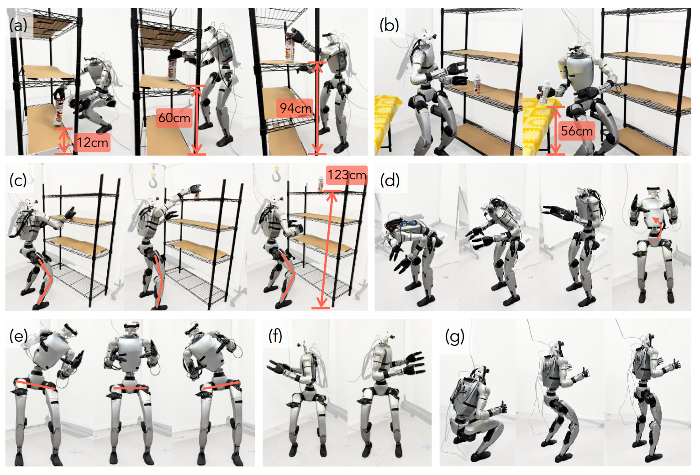
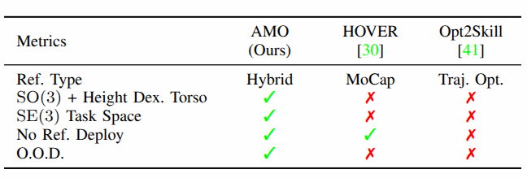
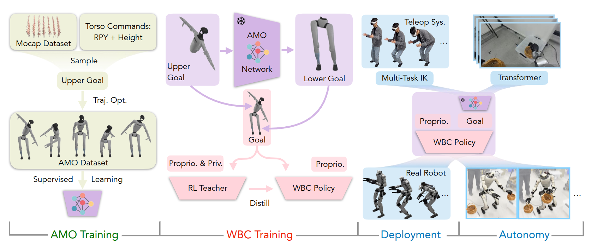
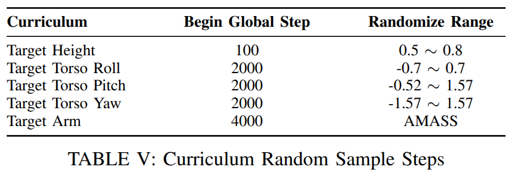
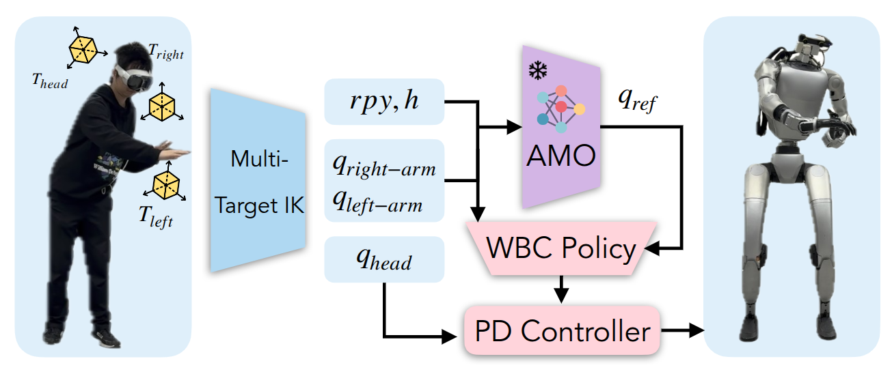

:::info

用于超灵巧人形机器人全身控制的自适应运动优化

:::

> Paper:  https://arxiv.org/abs/2505.03738
> Code: https://github.com/OpenTeleVision/AMO

## 引言

本文提出了自适应运动优化（AMO）框架，该框架将仿真到真实环境的强化学习（RL）与轨迹优化相结合，以实现实时、自适应的全身控制。为减轻运动模仿 RL 中的分布偏差，我们构建了一个混合 AMO 数据集，并训练了一个能够按需提供稳健控制的网络对可能超出操作范围的指令进行适应。我们在模拟环境中以及在 29 自由度的 Unitree G1 人形机器人上对 AMO 进行了验证，结果表明其稳定性更优，工作空间也更大，优于强大的基准模型。最后，我们展示了 AMO 的稳定性能支持通过模仿学习实现自主任务执行，突显了该系统的通用性和鲁棒性。

如上所示，人型机器人不在只是单纯的上半身操作，或者下肢行走，而遇到了越来越多的 **loco-manipulation** 问题——_既涉及运动控制也涉及操作_，最简单的比如搬运箱子，以及从地面拾取物品。这涵盖了对不同高度物体的操作，腿部姿态髋部姿态，站立蹲伏等。

## Introduction

:::info

虽然人形机器人的关节配置紧密模仿了人类的功能和自由度，但在实现实时控制的类似运动方面面临着挑战，这是由于人全身控制的 **动态性、高维性、高度非线性和接触丰富性。**

传统的基于模型的最优控制方法需要对机器人和环境进行精确建模，需要高计算能力，并且需要降阶（reduced-order）模型以获得可实现的计算结果，这对于在现实世界中利用超冗余人形机器人的所有自由度（29 个）是不可行的。

:::

近年来，强化学习（RL）与仿真到现实（sim-to-real）技术的结合在实现现实世界中的人形机器人行走 - 操作（loco-manipulation）任务方面展现出巨大潜力 （Mobile-television），强化学习为人形机器人的高自由度（DoF）机器人实现了稳健的实时控制，但它们通常依赖于**广泛的人类专业知识和对奖励函数的手动调整**。为了解决这一限制，研究人员将运动模仿框架与 RL 结合起来，利用重新定位的人类动作捕捉（MoCap）轨迹（etargeted human motion capture (MoCap) trajectories）来定义指导策略学习的奖励目标（ExBody, Omnih2o）。然而，这些轨迹通常是运动学可行的，但未能考虑目标人形平台的动态约束，从而在模拟运动和硬件可执行行为之间引入了体现差距。另一种方法是将轨迹优化（TO）与 RL 结合起来来弥合这一差距 (Opt2skill)*。

基于动作捕捉的方法存在固有的运动学偏差：它们的参考数据集主要包含双足行走序列（例如，行走、转弯），而缺乏协调的手臂 - 躯干运动。相反，基于轨迹优化（TO）的技术面临互补的限制——它们依赖于有限的运动原语库，以及计算效率低下，泛化弱。这严重阻碍了在需要快速适应非结构化输入的动态场景中的部署，例如反应式遥操作或环境干扰。

为了弥合这一差距，提出了一种通过两个协同创新实现人形机器人实时全身控制的分层框架：

1. 混合运动合成：将动作捕捉数据中的手臂轨迹与概率采样的躯干方向融合，制定了混合上肢命令集，**系统地消除了训练分布中的运动学偏差**。这些命令驱动一个动态感知的轨迹优化器，产生满足运动学可行性和动态约束的全身参考运动，从而构建了 AMO 数据集——第一个专门为人形机器人的灵巧行走和操作而设计的**动作库**。
2. 可泛化的策略训练：虽然直接的解决方案是**通过离散查找表将命令映射到运动**，但这些方法本质上仅限于**离散的、在分布内的场景**。我们的 AMO 网络则学习连续映射，能够在连续输入空间和分布外（O.O.D.）遥操作命令之间进行**稳健的插值**，同时保持**实时响应性**。在部署过程中，首先从 VR 遥操作系统中提取**稀疏姿态**，并输出上肢目标，使用**多目标逆运动学**，经过训练的 AMO 网络和 RL 策略共同输出机器人的控制信号。
:::info

与两项最近的代表性人形运动模仿工作的比较。Dex. Torso 表示机器人是否能够调整其躯干的方向和高度以扩展工作空间。Task Space 指的是末端执行器。No Ref. Deploy 表示机器人在部署过程中是否需要参考运动。O.O.D. 表示该工作是否评估了分布外性能，这在机器人由人类操作员控制且控制信号高度不可预测时是一个典型情况。

:::

## 相关工作

### 人形机器人全身控制

由于人形机器人具有**高自由度**和**非线性特性**，全身控制仍然是一个具有挑战性的问题。

此前，这主要是通过动态建模和基于模型的控制来实现的。最近，深度强化学习方法在实现足式机器人的稳健行走性能方面显示出潜力。研究人员已经研究了从高维输入进行全身控制的方法，包括四足机器人和人形机器人。Humanplus 训练了一个用于控制的 Transformer 和另一个用于模仿学习的 Transformer。Exbody 只让人形机器人的上半身模仿运动，而下半身控制则是解耦的。H2O 训练了用于下游任务的目标条件策略。以上工作都只展示了有限的全身控制能力，**强制人形机器人的躯干和骨盆保持静止**。Exbody2 展示了人形机器人的全身动作，但并未强调利用全身控制来扩展机器人的行走和操作任务空间。

### 人形机器人遥操

人形机器人的遥操作对于实时控制和机器人数据收集至关重要。Humanplus 和 H2O 使用**第三人称** RGB 相机获取人类操作员的**关键点**。一些研究使用虚拟现实（VR）为人形机器人的遥操作员提供**以自我为中心的观察视角**。Open-television 使用 Apple VisionPro 控制头部和具有灵巧双手的上半身。Mobile-television 使用 Vision Pro 控制头部和上半身，同时使用踏板进行行走控制。

:::info

人形机器人的全身控制需要遥操作员为人形机器人提供**物理上可实现**的全身坐标。

:::

### 行走和操作的模仿学习

模仿学习已被研究用于帮助机器人自主完成任务。根据示范数据源对现有工作进行分类，可以分为:

1. 真实机器人专家数据学习 (RT-1、RT-2、diffusion policy、UMI、Mobile ALOHA、Droid: A large-scale in-thewild robot manipulation dataset、Openx-embodiment、The surprising effectiveness of representation learning for visual imitation、Yell at your robot、Perceiver-actor、3d diffusion policy 和 ALOHA ACT)；
2. 从游戏数据学习 （From play to policy: Conditional behavior generation from uncurated robot data、Alan : Autonomously exploring robotic agents in the real world、Mimicplay: Long-horizon imitation learning by watching human play）；
3. 从人类示范学习 （Exbody、Adversarial motion priors make good substitutes for complex reward functions、Humanplus、Opt-mimic、H2O、Learning agile robotic locomotion skills by imitating animals、AMP: adversarial motion priors for stylized physics-based character control、Unicon: Universal neural controller for physicsbased character motion、Generalized animal imitator: Agile locomotion with versatile motion prior）。

这些模仿学习研究大多限于操作技能，而关于行走和操作的模仿学习研究则很少。Mobile aloha 研究了行走和操作的模仿学习，使用的是轮式机器人。本文使用模仿学习使人形机器人能够自主完成行走和操作任务。

## 自适应运动优化

系统被分解为四个阶段：

1. 通过轨迹优化收集 AMO 数据集进行 AMO 模块训练
2. 通过在仿真中采用师生蒸馏进行强化学习（RL）策略训练
3. 通过逆运动学（IK）和重定向实现真实机器人远程操作
4. 结合 transformer，通过模仿学习（IL）进行真实机器人自主策略训练

### 问题表述和符号定义

对于人形机器人全身控制问题，关注两种不同的设置：遥操和自主控制。

在遥操设置中，全身控制问题被表述为学习一个目标条件策略 $\pi'$：$G \times S \rightarrow A$，其中 $G$ 表示目标空间，$S$ 表示观测空间，$A$ 表示动作空间。

在自主设置中，学习到的策略 $\pi$：$S \rightarrow A$ 仅基于观测生成动作，不依赖人类输入。

目标条件遥操策略接收来自遥操作员的控制信号 $g \in G$，其中 $g = [p_{\text{head}}, p_{\text{left}}, p_{\text{right}}, v]$。$p_{\text{head}}$、$p_{\text{left}}$、$p_{\text{right}}$ 表示操作员头部和双手的关键点姿态，而 $v = [v_x, v_y, v_{\text{yaw}}]$ 指定基座速度。观测 $s \in S$ 包括视觉和本体感知数据：$s = [\text{img}_{\text{left}}, \text{img}_{\text{right}}, s_{\text{proprio}}]$。动作 $a \in A$ 包括上身和下身的关节角度命令：$a = [q_{\text{upper}}, q_{\text{lower}}]$。

- 目标条件遥操策略：目标条件策略采用分层设计：$\pi' = [\pi'_{\text{upper}}, \pi'_{\text{lower}}]$。上层策略 $\pi'_{\text{upper}}(p_{\text{head}}, p_{\text{left}}, p_{\text{right}}) = [q_{\text{upper}}, g']$ 输出上身的动作和一个中间控制信号 $g' = [\text{rpy}, h]$，其中 $\text{rpy}$ 指挥躯干方向，$h$ 指挥基座高度。下层策略 $\pi'_{\text{lower}}(v, g', s_{\text{proprio}}) = q_{\text{lower}}$ 使用这个中间控制信号、速度命令和本体感知观测来生成下身的动作。
- 自主导航策略：自主策略 $\pi = [\pi_{\text{upper}}, \pi_{\text{lower}}]$ 与遥操作策略具有相同的分层设计。下层策略是相同的：$\pi_{\text{lower}} = \pi'_{\text{lower}}$，而上层策略独立于人类输入生成动作和中间控制信号：$\pi_{\text{upper}}(\text{img}_{\text{left}}, \text{img}_{\text{right}}, s_{\text{proprio}}) = [q_{\text{upper}}, v, g']$。

### 自适应模块预训练

下层策略遵循形式为 $[v_x, v_y, v_{\text{yaw}}, \text{rpy}, h]$ 的命令。跟随速度命令 $[v_x, v_y, v_{\text{yaw}}]$ 的行走能力可以通过在仿真环境中随机采样**定向向量**轻松学习，其策略与 ExBody 相同。然而，学习躯干和高度跟踪技能并非易事，因为它们需要全身协调。与行走任务不同，在行走任务中，我们可以基于 Raibert 启发式设计足部跟踪奖励来促进技能学习，而对于全身控制，缺乏这样的启发式方法来指导机器人完成全身控制。一些研究 （Omnih2o, Exbody2）通过跟踪人类参考来训练这样的策略，但它们的策略并未建立人类姿态与全身控制指令之间的联系。

为了解决这一问题，我们提出了一个自适应运动优化（AMO）模块。AMO 模块表示为 $\phi(q_{\text{upper}}, \text{rpy}, h) = q_{\text{ref}}^{\text{lower}}$。在接收到来自上层的全身控制命令 $\text{rpy}$ 和 $h$ 后，它将这些命令转换为下层策略明确跟踪的所有下身执行器的关节角度参考。为了训练这一自适应模块，我们首先通过 **随机采样上身命令** 并执行 **基于模型的轨迹优化** 来获取下身关节角度，从而收集 AMO 数据集。轨迹优化可以表述为一个多接触最优控制问题（MCOP），其代价函数如下：

$$
L = L_x + L_u + L_{\text{CoM}} + L_{\text{rpy}} + L_h
$$

其中：

$$
L_x = \|x_t - x_{\text{ref}}\|_{Q_x}^2
$$

$$
L_u = \|u_t\|_R^2
$$

$$
L_{\text{CoM}} = \|c_t - c_{\text{ref}}\|_{Q_{\text{CoM}}}^2
$$

$$
L_{\text{rpy}} = \|R_{\text{torso}} - R_{\text{ref}}(\text{rpy})\|_{Q_{\text{torso}}}^2
$$

$$
L_h = w_h(h_t - h)^2
$$

代价函数包括对状态 $x$ 和控制 $u$ 的正则化项、目标跟踪项 $L_{\text{rpy}}$ 和 $L_h$，以及一个质心（CoM）正则化项，以确保在执行全身控制时保持平衡。

在收集数据集时，首先从 AMASS 数据集中随机选择上身运动，并采样随机躯干命令。然后执行轨迹优化，以跟踪躯干目标，同时保持稳定的质心并遵守力矩锥约束，从而**生成动态可行的参考关节角度**。由于没有考虑行走场景，因此机器人的两只脚都被认为与地面接触。参考关节角度是通过 Crocoddyl 使用控制受限的可行性驱动的微分动态规划（BoxFDDP）生成的。这些数据被收集起来，用于训练一个将躯干命令转换为参考下身姿态的 AMO 模块。AMO 模块是一个三层多层感知机（MLP），在下层策略训练的后期阶段被冻结。

### 下层策略训练

使用大规模并行仿真来训练我们的下层策略，使用的是 IsaacGym。下层策略的目标是跟踪 $g'$ 和 $v$，同时利用本体感知观测 $s_{\text{proprio}}$，其定义如下：

$$
[\theta_t, \omega_t, q_{\text{whole-body}, t}, \dot{q}_{\text{whole-body}, t}, a_{\text{whole-body}, t-1}, \phi_t, q_{\text{ref}}^{\text{lower}}]
$$

上述公式包含了基座方向 $\theta_t$、基座角速度 $\omega_t$、当前位置、速度以及上一次的位置目标。值得注意的是，下层策略的观测包括上身执行器的状态，以便更好地协调上下身。 $\phi_t$ 是类似于 中定义的步态循环信号。 $q_{\text{ref}}^{\text{lower}}$ 是由 AMO 模块生成的下身参考关节角度。下层动作空间 $q_{\text{lower}} \in \mathbb{R}^{15}$ 是一个 15 维向量，包括双腿的 2 $\times$ 6 个目标关节位置以及腰部电机的 3 个目标关节位置。

使用教师 - 学生框架来训练我们的下层策略。首先训练一个能够在仿真中观察特权信息的教师策略，使用现成的 PPO。然后通过监督学习将教师策略蒸馏到学生策略中。学生策略只能观察在现实世界中可用的信息，并且可以用于遥操作和自主任务。

教师策略可以表述为：

$$
\pi_{\text{teacher}}(v, g', s_{\text{proprio}}, s_{\text{priv}}) = q_{\text{lower}}
$$

额外的特权观测 $s_{\text{priv}}$ 定义如下：

$$
[v^{gt}_{t}, rpy^{gt}_{t}, h_{t}^{gt}, c_t]
$$

其中包含了基座速度 $v_{\text{gt}, t}$、躯干方向 $rpy_{t}^{gt}$ 和基座高度 $h_{t}^{gt}$ 的真实值，这些值在现实世界中跟踪它们对应的目标时是不可用的。 $c_t$ 是脚与地面之间的接触信号。教师 RL 训练过程的详细内容见附录 B。

学生策略可以写为：

$$
\pi_{\text{student}}(v, g', s_{\text{proprio}}, s_{\text{hist}}) = q_{\text{lower}}
$$

为了弥补 $s_{\text{proprio}}$，学生策略利用本体感知观测的 $25$ 步历史作为额外的输入信号：

$$
s_{\text{hist}, t} = s_{\text{proprio}, t-1} \sim s_{\text{proprio}, t-25}
$$

:::tip

对于教师训练课程，作者采用精心设计的课程来规范强化学习训练中的不同任务

1. 最初，下层策略被视为纯粹的行走策略，并随机化目标高度
2. 随后，引入延迟以减少仿真到现实的差距
3. 接着，随机化目标躯干的横滚、俯仰和偏航，并激活相关奖励
4. 最后，从 AMASS 数据集中采样手臂动作，并直接在环境中设置手臂关节的目标位置。按照训练计划，教师策略逐步掌握复杂的全身控制设定，并能够监督现实世界中的学生

最开始目标高度被设定为 0.8，目标躯干横滚、俯仰和偏航被设定为 0，目标手臂关节位置被设定为默认手臂关节位置，之后会从上表中随机采样。

:::

### 遥操上层策略

遥操作上层策略生成一系列全身控制指令，包括手臂和手部运动、躯干方向和基座高度。使用基于优化的技术来实现该策略，以满足操作任务所需的精度。

具体而言，手部运动通过重定向生成，而其他控制信号则通过逆运动学（IK）计算。前者实现基于 dex - retargeting 。

将传统的 IK 扩展到多目标加权 IK，最小化到三个关键目标的 6D 距离：头部、左腕和右腕。机器人调动所有上肢执行器同时匹配这三个目标。

$$
\min _{q} L_{\text {head }}+L_{\text {left }}+L_{\text {right }}
$$

$$
L_{\text {head }}=\left\|p_{\text {head }}-p_{\text {head - link }}\right\|^{2}+\lambda\left\|R_{\text {head }}-R_{\text {head - link }}\right\|_{F}^{2}
$$

$$
L_{\text {left }}=\left\|p_{\text {left }}-p_{\text {left - link }}\right\|^{2}+\lambda\left\|R_{\text {left }}-R_{\text {left - link }}\right\|_{F}^{2}
$$

$$
L_{\text {right }}=\left\|p_{\text {right }}-p_{\text {right - link }}\right\|^{2}+\lambda\left\|R_{\text {right }}-R_{\text {right - link }}\right\|_{F}^{2}
$$

$$
q=\left[q_{\text {head }}, q_{\text {left - arm }}, q_{\text {right - arm }}, rpy, h\right]
$$

如图所示。优化变量 $q$ 包括机器人上身的所有驱动自由度（DoFs）：$q_{head}$、$q_{left - arm}$ 和 $q_{right - arm}$。除了电机指令外，它还求解一个中间指令以实现全身协调：$rpy$ 和 $h$ 用于躯干方向和高度控制。

为了确保上身控制的平稳性，不同优化变量 $q$ 的组成部分的姿势成本被赋予不同的权重：$W_{q_{head},q_{left - arm},q_{right - arm}} < W_{rpy,h}$。这促使策略优先使用上身执行器来完成简单的任务。

然而，对于需要全身运动的任务，例如弯腰捡东西或够远处的目标，会生成并发送额外的控制信号 $[rpy, h]$ 到下层策略。下层策略协调其电机角度以满足上层策略的要求，从而实现全身目标定位。我们的 IK 实现采用 Levenberg - Marquardt（LM）算法，基于 Pink。

### 自主上层策略训练

通过模仿学习来学习自主上层策略。

1. 人类操作员使用我们的目标条件策略对机器人进行遥操作，记录观察结果和动作作为演示。
2. 采用 ACT，并以 DinoV2 视觉编码器作为策略骨干。视觉观察包括两个立体图像 $img_{left}$ 和 $img_{right}$ 。DinoV2 将每个图像划分为 $16\times22$ 个块，并为每个块生成一个 $384$ 维的视觉标记，从而产生形状为 $2\times16\times22\times384$ 的组合视觉标记。该视觉标记与通过投影 $o_t=[s^{upper}_{proprio},t,v_{t−1},rpy_{t−1},h_{t−1}]$ 获得的状态标记进行拼接。其中，supperproprio,t 是上身本体感知观察结果，而 $[v_{t−1},rpy_{t−1},h_{t−1}]$ 构成了发送给下层策略的最后一条指令。

上层策略观察这些下层策略指令，而不是直接的下身本体感知。策略的输出表示为：

$$
[q_{\text {head }}^{t}, q_{\text {dual - arm }}^{t}, q_{\text {dual - hand }}^{t}, v^{t}, rpy^{t}, h^{t}]
$$

包括所有上身关节角度以及下层策略的中间控制信号。
