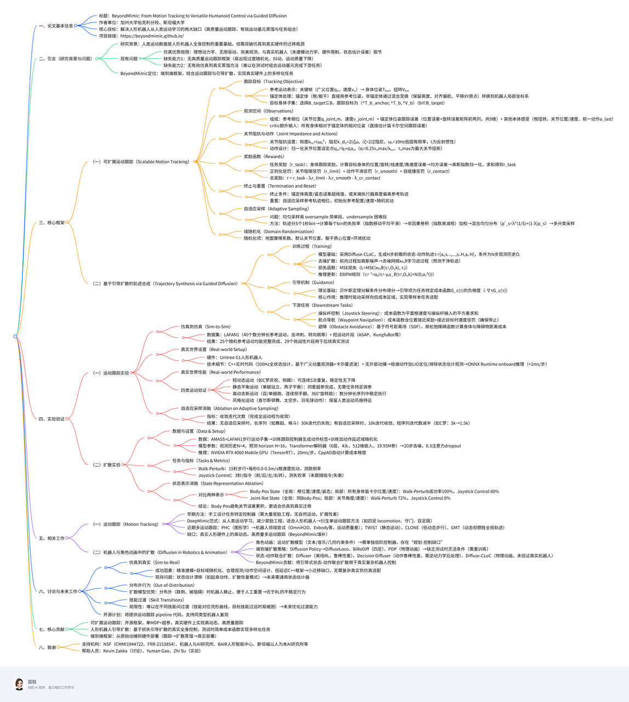
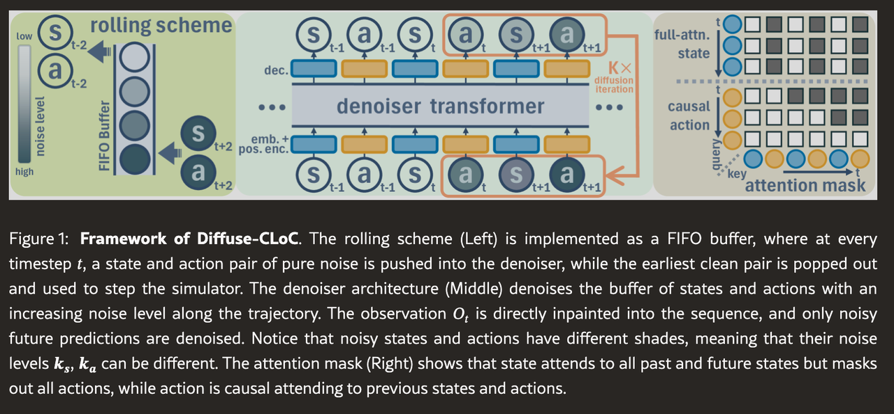
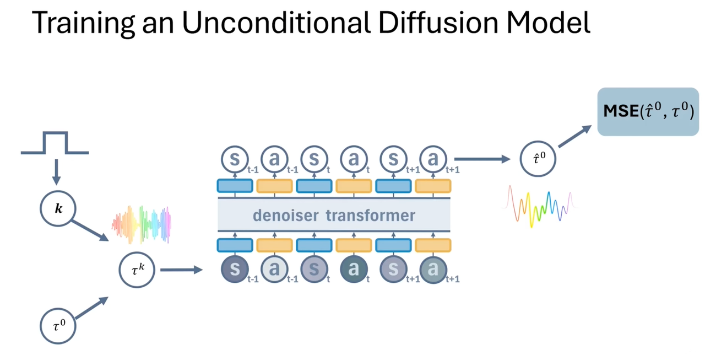
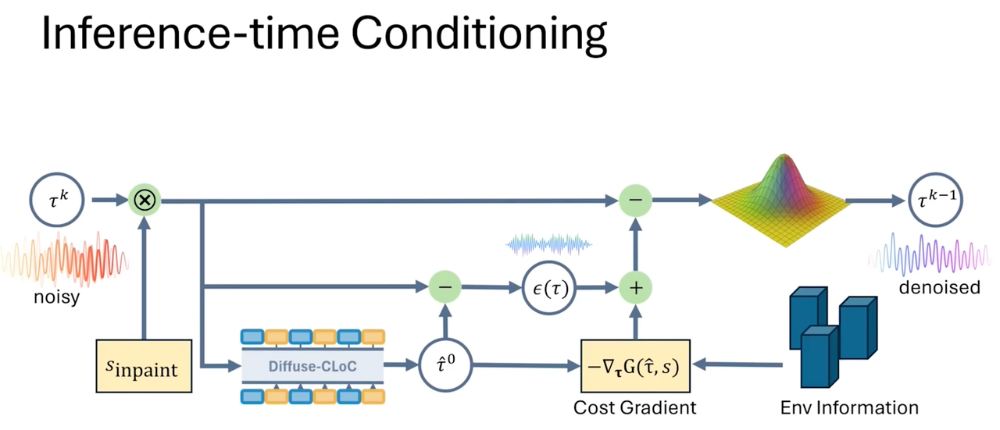
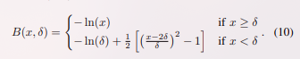
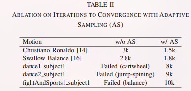
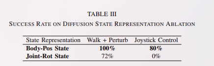

> BeyondMimic——一个面向真实世界的框架，通过引导扩散模型从人类动作中学习，实现多功能且自然的人形控制。
>
> 在简单模仿现有动作的基础上，进一步引入统一的扩散策略，使系统在测试阶段仅凭简单代价函数即可实现零样本任务专用控制。
>
> 部署到硬件后，BeyondMimic 能够在测试时完成多种任务，包括航点导航、摇杆遥操作和避障，从而弥合仿真到现实的动作跟踪与人类动作基元灵活合成之间的鸿沟，实现真正的全身控制。
>
> https://arxiv.org/pdf/2508.08241
>
> https://beyondmimic.github.io/
> **UC Berkeley**

## 动作跟踪

1. 早期基于学习的足式机器人控制方法主要依赖人工设计任务专用控制器 ，虽然可以实现稳健行走，但每个任务都需要大量奖励工程，动作缺乏自然性，且难以扩展到通用控制所需的多样化技能集。
2. DeepMimic 提出借助人类动作参考学习自然、动力学可行的行为，显著减轻奖励工程负担，尤其适用于人形机器人。
3. ASAP 提出 real-to-sim 流程，通过硬件实验学习 Δ-动作模型，提升仿真保真度；但该方法需为每段动作单独训练 Δ-模型，易对短动作过拟合。
4. KungfuBot （PBHC）与 HuB 则通过精心手工设计域随机化实现高质量 sim-to-real 迁移，但也仅限单段短动作。

> 为突破单动作策略的局限，近期研究开始探索可扩展的动作跟踪框架，使单一策略能学习多样化动作。

- PHC启发了机器人学界构建通用动作跟踪器的尝试。早期机器人多动作跟踪器，如 OmniH2O、ExBody、HumanPlus，证明了可行性，但动作质量较图形学方法显著下降。
- TWIST 虽能实现高质量跟踪，但主要针对静态动作；
- CLONE 与 UniTracker 则聚焦于低动态行走并兼顾上半身响应。
- GMT \[可处理部分动态动作，却牺牲全局轨迹跟踪，转而采用相对速度跟踪与步态正则奖励来提升稳健性。Grandia 等人 实现了迄今最高质量的多动作跟踪，但仅用于小型机器人且不含动态动作。

### 扩散模型

1. 两阶段方法常出现“规划-控制鸿沟”：规划器生成脱离分布的动作，控制器难以稳健跟踪 。此外，重规划频率难以权衡：频率过低难以适应环境变化，频率过高又使策略缺乏连贯性。尽管在线重规划在仿真中前景可期，尚未在真实世界验证。
2. 为避免规划-控制鸿沟，另一条研究路线直接学习端到端策略，将状态映射到动作分布。
   - Diffusion Policy 将这一思想自然扩展到行走与角色控制。
   - DiffuseLoco 与 BiRoDiff 学得统一策略，编码大量技能，实现流畅步态切换并在四足机器人上稳健部署。
   - 在 RL 训练中使用扩散策略缺乏灵活的测试时条件机制（如损失引导扩散），原因在于状态空间中的任务目标难以与关节空间中的动作序列直接比较；因此，针对新任务通常需重新训练。
3. 第三类方法试图融合规划器的灵活指导与端到端策略的稳健性，通过对“状态-动作”联合分布进行扩散，实现测试时通过基于分类器的奖励 或未来状态目标进行引导。
   - Diffuser率先将该思路用于离线强化学习，但稳健性有限。
   - Decision Diffuser 同样建模状态-动作轨迹，最终发现动作缺乏稳健性，转而采用逆动力学后处理。
   - Diffuse-CLoC 利用 PDP 进行稳健的离线蒸馏，展示了该联合扩散策略在基于物理的动画中的强劲性能。

## 动作跟踪

> 跟踪和历史信息无关

从重定向后的参考动作出发，记为广义位置与速度的关键帧 ($q_m$, $v_m$)。利用正向运动学得到每个刚体 $b ∈ B$（$B$ 为所有机器人刚体集合）在参考动作中的位姿 $T_{b,m}$与速度 $V_{b,m}$。目标是在硬件上以全局坐标系高保真地复现该动作。

训练中的扰动和 sim-to-real 差异常导致全局漂移。为在允许漂移的同时保持动作风格，控制器不应跟踪绝对刚体位姿。因此，我们选取一个锚定刚体 $b_{anchor} ∈ B$（通常为根或躯干），并按以下方式重锚定参考动作：

- 对锚定刚体，直接使用参考动作：$T̂_{b_{anchor}} = T_{b_{anchor},m}$；
- 对非锚定刚体 $b ∈ B /\ {b_{anchor}}$，其期望位姿为

$$T̂_b = T_Δ · T^{-1}{b_{anchor},m} · T{b,m}，$$

其中 $T_Δ = (p_Δ, R_Δ)，p_Δ = [p_{b_{anchor},x}, p_{b_{anchor},y}, p_{b_{anchor},z,m}]$且 $R_Δ = R_z(yaw(R_{b_{anchor}} · R^⊤{b_{anchor,m}}))$。该混合变换通过保持高度、对齐偏航角、将 xy 原点平移到机器人下方，把动作转到机器人局部坐标系。期望速度保持不变：$V_b = V_{b,m}, ∀b ∈ B$。

机器人往往拥有大量紧密排列的刚体，逐一跟踪既低效又非必要。因此选取目标刚体子集 $B_{target} ⊆ B$，将跟踪目标定义为

$$g_{tracking} = (T̂_{b_{anchor}}, T̂_b, V̂_b), ∀b ∈ B_{target}$$

## 观测空间

策略观测空间设计为单时间步向量，包含三部分：

1. 参考相位信息：$c = [q_{joint,m}, v_{joint,m}]$，仅用于提供相位线索，策略并不直接跟踪这些关节值；
2. 锚定刚体位姿跟踪误差$ξ_{b_{anchor}} ∈ ℝ^9$，包含三维位置误差与旋转误差矩阵的前两列。由于参考动作在世界坐标系中预定义，该误差项隐式提供平衡所需朝向及用于修正漂移的全局位置；
3. 其余本体感知：机器人在根坐标系下的根速度 $^{b_{root}}V_{b_{root}}$、关节位置 $q_{joint}$ 与速度 $v_{joint}$，以及上一动作 $a_{last}$。

完整观测向量为$o = [c, ξ_{b_{anchor}}, ^{b_{root}}V_{b_{root}}, q_{joint}, v_{joint}, a_{last}]$。

当无需位置漂移补偿或状态估计不可靠时，可省略线性分量（即 $ξ_{b_{anchor}}$ 的平移部分与 $^{b_{root}}V_{b_{root}}$ 的线速度部分）。

采用非对称 Actor–Critic 结构以提升训练效率。除策略观测外，Critic 还接收所有刚体相对锚定刚体的相对位姿 $T^{-1}_{b_{anchor}} · T_b$，使其可直接在笛卡尔空间估计逐刚体跟踪误差。

## 关节抗阻

在动画与机器人领域，引入关节阻抗是常见做法。

许多角色动画工作采用高阻抗以获得精确跟踪，几乎将自由空间控制退化为纯运动学问题。然而，高阻抗策略在硬件部署时常放大传感器噪声，削弱冲击吸收所需的被动柔顺性，并阻碍由电流/历史指令隐式传递的力矩信息。

采用 Raibert 等人的启发式方法设定关节刚度与阻尼：

$k_{p,j} = I_j ω_n²， k_{d,j} = 2 I_j ζ ω_n，$

其中 $ω_n$ 为自然频率，$ζ$ 为阻尼比，$I_j = k_{g,j}² I_{motor,j}$ 为第 $j$ 关节的反射惯量。选取 $ζ = 2$（过阻尼）而非 Raibert 原文的 $ζ = 1$（临界阻尼），因为仅考虑电机惯量时惯量常被低估。自然频率设为较低值 10 Hz，以在适中增益下保证柔顺性。

策略动作为归一化关节位置设定点：

$q_{j,t} = q̄_j + α_j a_{j,t}$，

其中 $a_{j,t}$ 为策略输出，$q̄_j$ 为恒定名义关节构型，$α_j = 0.25 τ_{j,max} / k_{p,j}，τ_{j,max}$ 为关节 $j$ 的最大允许力矩。该启发式假设接触一般发生在 $q̄_j$ 附近，且机器人硬件设计确保最大关节力矩与期望负载成正比。低增益下，这些设定点并非期望位置目标，而是作为生成期望力矩的中间变量，因此有意不裁剪关节运动学极限。

## 奖励设置

1. 任务奖励（身体跟踪奖励）对每个目标刚体 $b ∈ B_{target}$，根据期望位姿/速度 $(T̂_b, V̂_b)$ 与实际值 $(T_b, V_b)$ 计算误差
   1. 位置误差 $e_{p,b} = p̂_b − p_b$
   2. 旋转误差 $e_{R,b} = log(R̂_b R_b^⊤)$
   3. 线速度误差 $e_{v,b} = v̂_b − v_b$
   4. 角速度误差 $e_{ω,b} ≈ ω̂_b − ω_b$ （假设朝向误差较小）
2. 对所有目标刚体求均方误差：$ē_χ = 1/|B_{target}| Σ_{b∈B_{target}} ‖e_{χ,b}‖²， χ ∈ {p, R, v, ω}$，每项误差用高斯型指数函数归一化，$r(ē_χ, σ_χ) = exp(−ē_χ / σ_χ²)$，其中 $σ_χ$ 为经验确定的标称误差。
3. 综合任务奖励：$r_{task}  = Σ_{χ∈{p,R,v,ω}} r(ē_χ, σ_χ)$
4. 最小化正则化惩罚 ：

   - 关节限位惩罚 $r_{limit}$：鼓励关节位置保持在软限位内。
   - 动作平滑惩罚 $r_{smooth}$：鼓励相邻动作连续，抑制过度抖动。
   - 自碰撞惩罚 $r_{contact}$：统计非末端执行器刚体 $b ∉ B_{ee}$ 中自接触力超过阈值的个数作为惩罚。

可选地，可加入针对锚定刚体 $b_{anchor}$的全局跟踪奖励，其结构与 $r_{task}$ 相同，但使用 $e_{p,b_{anchor}}$ 与 $e_{R,b_{anchor}}$。

## 终止和重置

1. 锚定刚体 $b_{anchor}$ 的高度或姿态（仅俯仰与横滚角）误差超过预设阈值；
2. 任一末端执行器刚体 $b ∈ B_{ee}$ 的高度与参考轨迹显著偏离。

## 自适应采样

> 训练长序列动作时，不可避免地会遇到“并非所有片段难度相同”的问题。在整个轨迹上均匀采样——往往会过度采样简单片段、忽视困难片段，导致奖励方差大、训练效率低。
>
> 把整个动作的起始时刻按 1 秒为单位切成 S 个区间（bin），然后根据经验失败统计来采样这些区间。

设 $N_s$ 和 $F_s$ 分别表示从区间 $s$ 出发的回合总数与失败次数。为了防止短期波动导致采样概率突变，对失败率做指数移动平均平滑。

由于失败往往是由终止前很短时间内的次优动作引起的，用一个指数衰减核 $k(u)=γ^u$（$γ$ 为衰减系数）对失败信号进行非因果卷积，使最近的失败拥有更大权重。

区间 s 的最终采样概率定义为：

$p_s = (Σ_{u=0}^{K-1} α^u \bar r_{s+u}) / (Σ_{j=1}^{S} Σ_{u=0}^{K-1} α^u \bar r_{j+u}) ，$

其中 $\bar r_s$是区间 $s$ 的平滑失败率。

为保留对简单区间的覆盖并缓解灾难性遗忘，再把 $p_s$ 与均匀分布混合：

$p′_s = λ·(1/B) + (1-λ)·p_s ，$

$λ$ 为均匀采样比例。起始区间随后从 $Multinomial(p′_1,…,p′_S)$ 中抽取，从而优先选择更具挑战性的区域。

## 域随机化

施加三项域随机化：地面摩擦系数、默认关节位置 $q̄_j$（同时作用于动作与观测，相当于模拟关节零偏标定误差）、以及躯干质心位置。此外，训练过程中还会对环境施加扰动，以促使机器人学习对环境变化具有鲁棒性的策略。

## 基于引导扩散的轨迹合成（Diffuse-cloc）

### 训练

采用 Diffuse-CLoC 构建一个“状态–动作共扩散”框架，通过在状态空间中进行引导采样来生成符合物理规律的机器人动作。

模型预测未来 H 步的轨迹
$τ_t = [a_t, s_{t+1}, …, s_{t+H}, a_{t+H}]，$
条件为包含过去 $N$ 步观测的历史 $O_t = [s_{t-N}, a_{t-N}, …, s_t]。$

训练采用标准去噪扩散流程。

### 推理

- 用diffusion生成的state

为状态与动作使用独立的噪声调度。

## 下游任务

**摇杆操控**

代价函数衡量预测轨迹与摇杆输入之间的平方误差：

$G_js(τ) = ½ ∑_{t′=t}^{t+H} ‖V_xy,t′(τ_t′) − g_v‖²$

其中 $V_xy,t′$ 提取 $t′$ 时刻机器人在平面上的根速度，$g_v∈ℝ²$ 为摇杆给定的目标根速度。

**航点任务**

代价函数鼓励靠近目标点，同时在接近目标时逐步加重速度惩罚，确保到达即停止：

$G_wp(τ) = ∑_{t′=t}^{t+H} (1 − e^{−2d})‖P_x(s_t′) − g_p‖² + e^{−2d}‖V_x,t′(τ_t′)‖²$

其中 $d = ‖P_x(s_t′) − g_p‖$ 为当前到目标 $g_p$ 的欧氏距离（stop grad）。

**碰撞规避**

构建有向距离场（SDF），获取身体各部位与最近障碍物的距离及其梯度，定义代价函数：

$G_sdf(τ) = ∑{t′=t}^{t+H} ∑{b∈B} B(SDF(P_b,t′(τ)) − r_i, δ)$

其中 $P_b,t(τ)$ 为轨迹 $τ$ 在 $t$ 时刻身体 $b$ 的位置，$r_i$ 为身体 $b$ 的近似球半径，$B(x,δ)$ 为松弛势垒函数

## Sim-to-Sim性能 ;

使用由 Unitree 重新定向的 LAFAN1 数据集 ，其中包含冲刺、转身跳跃、匍匐等多种敏捷人体运动，以及来自先前工作的若干单动作短片段。

LAFAN1 共有 40 条、每条数分钟长的参考序列，涵盖多个大类，每类又含大量不同动作。随机抽取 25 条参考序列（确保每个大类至少 1 条），在 sim-to-sim 评估中全部可完整复现。

## 真实世界实验设置 ;

全部部署代码用 C++ 编写并针对实时执行做了优化。全状态估计以 500 Hz 运行，采用低层广义动量观测器结合卡尔曼滤波器；全程未使用外部动作捕捉系统。

对于极端、富含接触的动作（如从地面起身），额外融合 LiDAR-惯性里程计 (LIO) 进行位置修正，或直接剔除依赖状态估计的观测量。

所有策略均通过 ONNX Runtime 在机器人 CPU 上本地推理，单次前向耗时 < 1.0 ms，可无缝嵌入实时估计与控制回路。

## 真实世界性能 ;

### 先前已展示的短时高动态动作

首先复现先前工作专为此类动作设计的示范，如 ASAP中 Cristiano Ronaldo 的标志性庆祝动作、KungfuBot 的侧踢。

以往工作仅展示单次，而本文可连续重复 5 次而稳定性与跟踪质量毫无衰减（通过手动切换控制器实现）。

### 需要强平衡能力的静态动作

单腿站立、HuB中的“燕式平衡”。

HuB 需为每个动作做任务特定的域随机化与参数微调，而本文使用与所有其他动作完全一致的超参数。

### 极富挑战性且此前未公开演示的极动态动作

- 单/双腿连续跳跃
- 连续两次侧手翻
- 折返冲刺
- 带 180°/360° 旋转的前跃

其中 360° 旋转跳跃对成人亦极具挑战。

值得强调的是，这些并非孤立剪辑，而是整段三分钟长参考序列的一部分，表明框架能在超长序列中保持精度与极限敏捷性。

### 风格化与表现力动作

运动跟踪的根本目标不仅是“不倒”，还要复现原动作的节奏、姿态与情感，使其一眼可辨。舞蹈与多样步态是最具风格化的类别之一。展示了大量风格化动作：

- Charleston 舞、Moonwalk ;
- 行走 ↔ 爬行过渡 ;
- 老人式行走 ;
- 羽毛球、网球等运动姿态 ;

框架忠实地保留了这些风格特征，动作对普通观众亦一目了然，说明其已超越“稳定”层面，实现了高保真、类人化的行为。

## 自适应采样消融实验

以“收敛速度”作为度量指标。这里的“收敛”定义为：在 sim-to-sim 评估中能够完整复现整段动作。

对于长序列中的困难片段，自适应采样至关重要。若关闭该机制，即便训练 30k 次迭代，表中所列长序列在 MuJoCo 中也全部无法通过 sim-to-sim 评估——训练会在诸如平衡、侧手翻等难点动作处停滞。启用自适应采样后，这些序列仅需约 10k 次迭代即可收敛。

对于诸如 ASAP 中 Cristiano Ronaldo 这类短动作，自适应采样也将所需迭代次数减半（1.5k vs. 3k）。

针对引导扩散策略的 sim-to-real 迁移，我们进行了关键消融实验，重点检验**状态表征（state representation）**的选取对性能的决定性作用。

A. 数据 ;

- 使用 AMASS \[48] 与 LAFAN1 \[43] 中多样的行走动作子集。
- 为每个动作技能训练运动跟踪控制器以产生动作标签。
- 由于扩散模型在推理时需要多步去噪，观测到执行之间存在显著延迟，训练时加入**动作延迟域随机化**以补偿。
- 跟踪器训练完成后，参考 PDP \[34] 与 Diffuse-CLoC \[3] 的做法，用专家策略 rollout 收集离线数据集，并以“加入域随机化”作为关键差异。

## Diffusion实验和结果

### 数据

使用 AMASS 全部数据与 LAFAN1 中多样的行走动作子集。

为每个动作技能训练运动跟踪控制器以产生动作标签。

由于扩散模型在推理时需要多步去噪，观测到执行之间存在显著延迟，训练时加入动作延迟域随机化以补偿。

跟踪器训练完成后，参考 PDP 与 Diffuse-CLoC 的做法，用专家策略 rollout 收集离线数据集，并以“加入域随机化”作为关键差异。

### 实验设置

- 观测历史 N = 4，预测未来 H = 16；通过 loss masking 将动作预测步长限制为 8 步。
- 网络：6 层 Transformer decoder，4 头注意力，512 维嵌入，总参数量 19.95 M。
- 训练：20 步去噪，attention dropout 0.3。
- 测试：扩散策略 NVIDIA RTX 4060 Mobile GPU 上通过 TensorRT 运行；因延迟，推理在独立线程异步完成，20 步去噪约 20 ms/次。
- 引导代价的梯度在每个去噪迭代内用 CppAD自动计算。
- 为关节扩散模型提供运动捕捉数据：既用于代价计算的环境上下文，也用于评测中的状态估计增强。

## 任务与指标

1. Walk-Perturb：15 s 行走期间，每秒施加一次沿根速度的瞬时扰动，幅值 0–0.5 m/s 均匀采样；统计仿真中跌倒率。
2. Joystick Control：连续发送 3 s 一换的方向指令（前、后、左转、右转）；无法按指令行走或失去平衡记为失败。

- 跌倒定义：头部高度低于 0.2 m。
- 每任务各跑 50 次。

## 状态表征消融

选取合适的状态表征对 sim-to-real 迁移至关重要。

- **Local joint 表征**紧凑、计算快，适合实时控制；
- **直接预测 body 位置**表征维度高、模型大、推理慢，但在笛卡尔空间提供显式几何锚点。

权衡计算效率与空间可解释性，比较两种表征：

1. **BodyPos 表征**

   - Global：根位置 (ℝ³)、线速度 (ℝ³)、朝向（旋转向量 ℝ³），均以当前角色坐标系表示。
   - Local：所有 body 在该z坐标系下的笛卡尔位置 (ℝ³ᴮ) 与线速度 (ℝ³ᴮ)。

2. **JointPos 表征**

   - Global：同上。
   - Local：关节角 (ℝᴶ) + 关节角速度 (ℝᴶ)，J 为关节数。

- **BodyPos 表征显著优于 JointPos**。
- 虽然从理论上 Joint-Rot 更具马尔可夫性，但关节位置估计的小误差会在运动链中累积，导致扩散预测误差被放大；而直接预测笛卡尔 body pose 避免了这一问题。
- 在 Joint-Rot 状态上加摇杆引导时，即使仔细调参也很快崩溃，推测是底层控制器鲁棒性不足，引导使其进一步偏离分布。

## 未来工作

### Sim-to-Real（仿真到现实迁移）

1. 精准建模 + 有针对性而非过度的域随机化；
2. 观测与动作空间的精心设计；
3. 低延迟 C++ 框架用于通信与策略 I/O 处理。

无需复杂的 real-to-sim 再适应或动作特定随机化参数，就获得了极小的 sim-to-real 差距。

尽管如此，状态估计漂移仍偶尔导致失败，尤其在末端接触假设被破坏时（例如跟踪策略的起身动作或扩散策略的恢复模式）。如何设计能泛化到如此多样动作的状态估计器仍是难题，留给未来工作。

## 分布外行为

一个显著发现是：扩散模型在面对分布外场景时表现得“迟钝”。例如机器人跌倒或被龙门架物理阻挡时，机器人倾向于基本保持静止。操作员可简单安全地将其重新摆回分布内。相比之下，传统 RL 策略在此类场景下往往产生剧烈或不稳定动作。

## 技能切换

当前基于动作的扩散模型在跨技能切换上存在关键局限。可将模型理解为学习一个流形：每个技能对应一条特定曲线，切换发生在曲线交点。分类器引导能让模型“跳到”不同曲线，但当目标技能在流形上相距过远时，模型往往困在当前模式，无法完成切换。未来工作可探索如何提升模型在技能间的过渡能力。

## 代码

### 观测设置 (Observations)

观测分为两个组：**Policy（学生策略）** 和 **Privileged（老师/评论家）**。这种结构通常用于非对称 Actor-Critic 训练。

 **Policy Group (受限观测)**

这是策略网络在推理时能看到的信息，加入了**噪声（Noise）** 和**数据腐蚀（Corruption）** 以提高鲁棒性：

- **命令信息**：来自 `motion` 生成器的目标命令。
- **锚点运动**：相对于本体的参考锚点位置（`pos_b`）和姿态（`ori_b`），用于告诉机器人“参考动作现在在哪”。
- **本体状态**：基座的线速度、角速度，以及关节的相对位置和速度。
- **历史信息**：上一步执行的动作（`last_action`）。

**Privileged Group (特权观测)**

这是 Critic 网络（评论家）在训练时看到的信息，包含了更完整、无噪声的数据：

- **高精度本体状态**：不带噪声的基座和关节状态。
- **全身链接位姿**：包含了所有 Body Links（如手、脚、躯干）相对于参考运动的位置和姿态。这是 Policy 组没有的，能帮助 Critic 更好地评估动作质量。

### 奖励设置 (Rewards)

**运动追踪奖励 (Tracking)**

这部分采用指数型奖励（`exp`），意味着偏差越小，奖励增长越快：

- **全局锚点追踪**：基座（Anchor）在全球坐标系下的位置和姿态误差奖励（权重各 0.5）。
- **全身位姿追踪**：机器人各链接（Body Parts）相对于参考运动的位置和姿态误差奖励（权重各 1.0）。
- **速度追踪**：各链接的线速度和角速度与参考运动的一致性奖励（权重各 1.0）。

**惩罚项 (Regularization & Constraints)**

- **动作平滑 (action_rate_l2)**：惩罚动作突变（权重 -0.1），防止电机抖动。
- **关节极限 (joint_limit)**：强力惩罚关节接近软极限的情况（权重 -10.0）。
- **非法碰撞 (undesired_contacts)**：惩罚除了脚踝（ankle）和手腕（wrist）以外任何部位的触地行为（权重 -0.1），用于防止摔倒或肘部着地。

---

### 关键终止条件 (Terminations)

为了辅助训练，环境设置了严格的“出界”重置条件：

- **Z轴偏差重置**：如果锚点或末端执行器（手脚）的 **Z轴（高度）** 偏差超过 0.25m，环境立即重置。
- **姿态偏差重置**：如果锚点姿态偏差过大（超过 0.8），判定为追踪失败。
