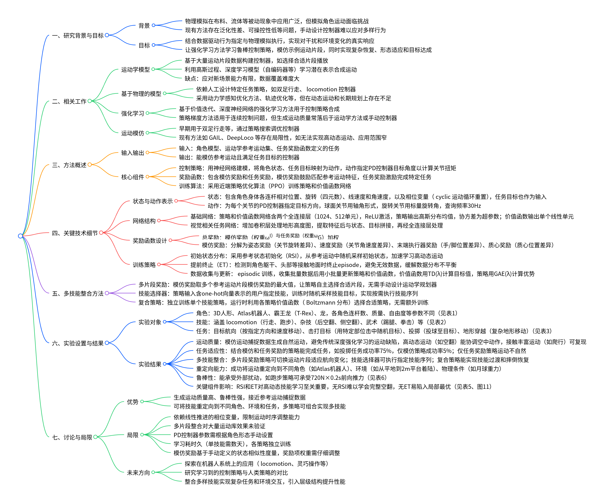
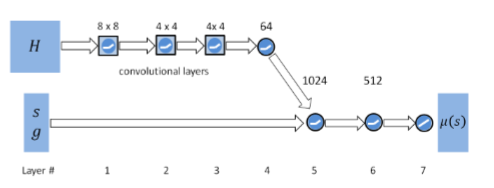
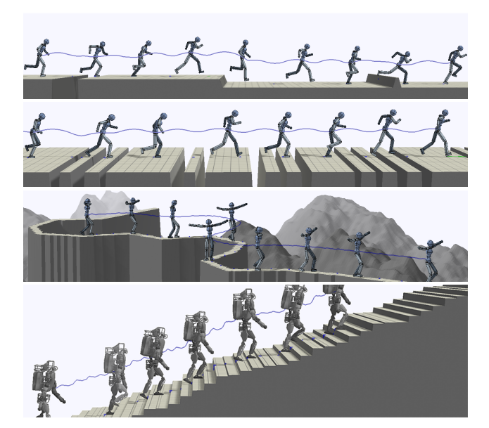
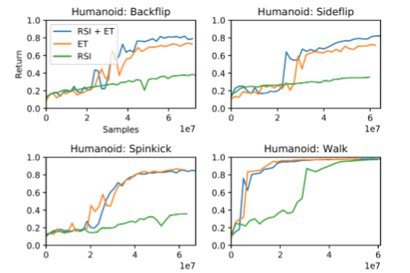

:::info

1. **核心目标**：解决角色动画中“数据驱动行为”与“物理模拟执行”的融合问题，让角色在物理模拟环境中既能复现指定运动，又能应对干扰与环境变化。
2. **方法核心**：改进强化学习方法，引入“运动模仿目标+任务目标”双驱动机制，同时探索多运动片段整合策略，平衡运动质量与功能灵活性。
3.  **能力范围**：支持关键帧、高动态（如翻转）、重定向等多种运动类型，可训练角色完成方向行走、目标投掷等交互任务。
https://github.com/xbpeng/MimicKit

https://github.com/xbpeng/DeepMimic

https://xbpeng.github.io/projects/DeepMimic/index.html

https://arxiv.org/pdf/1804.02717

:::

## 相关工作

在从生物力学到机器人学再到动画学的众多领域中，对多关节模型熟练运动的建模有着悠久的历史。近年来，随着用于控制的机器学习算法逐渐成熟，机器学习领域对这些问题的关注度也在不断提升。本文将重点关注与动画学和强化学习（RL）领域联系最为紧密的相关研究。

1. **运动学模型（Kinematic Models）**：以数据为核心，在数据充足时运动质量高，但对新场景的泛化能力弱，复杂场景下数据覆盖难度极大，需结合物理先验知识弥补不足。
	1. 给定一组运动片段数据集，研究人员可构建控制器，在特定场景下选择合适的片段进行播放；
	2. 高斯过程曾被用于学习潜在表示，进而在运行时合成运动 。
2. 基**于物理的模型（Physics-based Models）**：依赖人工设计特定任务策略，部分方法（如轨迹优化）在高动态、接触密集型运动或长期规划上存在局限，而本文方法凭借无模型特性，在运动技能覆盖范围、任务与模仿结合能力上更具通用性。
3. 强化学习（Reinforcement Learning）
	1. 价值迭代方法曾被用于开发运动学控制器，在特定任务场景下对运动片段进行排序。类似方法也被应用于模拟角色研究 。
	2. 策略梯度方法已成为许多连续控制问题的首选算法。
	3. 尽管强化学习算法能够在 “最小化特定任务控制结构” 的情况下合成控制器，但生成的行为在自然度上通常不如人工设计的控制器。部分挑战源于 “为自然运动设计奖励函数” 的难度 —— 尤其是在缺乏生物力学模型和 “能实现自然模拟运动” 的目标函数时 。例如，针对扭矩驱动运动的简单目标（如前进或维持期望速度），往往会导致肢体多余运动、步态不对称等不良缺陷。为减轻这些缺陷，研究人员会加入 “努力惩罚”“冲击惩罚” 等额外目标，但设计此类目标函数需要大量人类认知，且效果通常有限。
	4. 另一种思路是：近期基于 “模仿运动捕捉数据” 的强化学习方法（如生成对抗模仿学习 GAIL），通过数据构建目标函数，以解决奖励函数设计难题。但运动质量仍落后于动画标准方法。
	5. DeepLoco 系统采用了与本文类似的思路，即在奖励函数中加入模仿项，但存在明显局限：它使用固定初始状态，无法实现高动态运动；仅在 “由高层控制器计算足部位置目标” 的运动任务中进行了验证；且仅适用于单一无臂双足模型。此外，其多片段演示还需通过人工设计流程选择适合转向运动的目标片段。
4. 运动模仿（Motion Imitation）：在计算机动画领域，参考运动模仿的研究历史悠久。
	1. 早期应用见于平面角色的双足运动控制，通过策略搜索对控制器进行调优。
	2. 基于模型的参考运动跟踪方法也已在 3D 人形角色运动控制中得到验证 。
	3. 参考运动还被用于构建深度强化学习的奖励函数，以生成更自然的运动步态和扑翼飞行运动。

在功能上与本文最接近的研究是 “基于采样的控制器（SAMCON）”[2016, 2010]。SAMCON 已成功复现了一系列丰富的技能，且据我们所知，它是目前唯一能通过模拟角色实现 “高动态、杂技类多样运动库” 的系统。然而，该系统结构复杂（包含多个组件和迭代步骤），且需要为合成的线性反馈结构定义低维状态表示。其生成的控制器在模仿原始参考运动方面表现出色，但在 “扩展至任务目标（尤其是涉及大量感知输入的任务）” 方面的方法尚不明确。

# 策略

给定一个参考运动片段（用目标姿态序列$\hat{q}_t$表示），策略的目标是在物理模拟环境中复现期望运动，同时满足额外的任务目标。由于参考运动仅以目标姿态形式提供运动学信息，策略需负责确定“每个时间步应执行何种动作”，以实现期望轨迹。

### 状态与动作

状态$s$描述角色的身体配置
1. 各连杆相对于根节点（设定为骨盆）的相对位置、以四元数表示的旋转角度，以及各连杆的线速度与角速度
2. 所有特征均在角色局部坐标系中计算（根节点位于原点，$z$轴沿根连杆朝向方向）。
3. **相位变量**$\phi$：$\phi=0$表示运动起始，$\phi=1$表示运动结束；对于周期性运动，每个周期结束后$\phi$重置为0。

针对“按特定方向行走”“击打目标”等需完成额外任务目标的策略，还会为其提供目标$g$，目标的处理方式与状态类似。

策略输出的动作$a$为每个关节的比例-微分（PD）控制器指定目标姿态：策略的查询频率为30Hz，球面关节的目标姿态以轴角形式表示，旋转关节的目标姿态则用标量旋转角度表示。与直接操作扭矩的标准基准任务不同，本文使用PD控制器可抽象掉“局部阻尼”“局部反馈”等低层级控制细节；且已有研究表明，相较于扭矩控制，PD控制器能提升部分运动控制任务的性能与学习速度。

### 网络

每个策略$\pi$由神经网络表示，该网络将给定的状态$s$和目标$g$映射为动作的概率分布$\pi(a \mid s, g)$。动作分布建模为高斯分布：网络输出状态依赖的均值$\mu(s)$，固定对角协方差矩阵$\Sigma$作为算法的超参数。

网络输入先经过两个全连接层（分别含1024个和512个单元），再通过一个线性输出层；所有隐藏单元均采用ReLU激活函数。价值函数由结构相似的网络建模，唯一区别是输出层仅含一个线性单元。

对于**视觉相关任务**，输入会增加“角色周围地形的高度图$H$”（在均匀网格上采样得到）。策略网络与价值网络会相应增加卷积层以处理高度图：高度图先经过一系列卷积层处理，再通过一个全连接层；得到的特征与输入状态$s$和目标$g$拼接后，由与“非视觉任务”相同的全连接网络处理。

高度图先通过3个卷积层（分别含16个8×8滤波器、32个4×4滤波器、32个4×4滤波器），特征图再经过64个单元的全连接层；最终特征与状态$s$、目标$g$拼接后，通过两个全连接层（1024个、512个单元）处理，最后由线性单元输出$\mu(s)$。所有隐藏层均采用ReLU激活函数；对于无需高度图的任务，网络仅包含第5-7层（即全连接层部分）。

### 奖励

每个时间步$t$的奖励$r_t$包含两项，分别激励角色“匹配参考运动”与“满足额外任务目标”：

$$ r_t = \omega^I r_t^I + \omega^G r_t^G $$

其中，$r_t^I$和$r_t^G$分别代表模仿奖励与任务目标奖励，$\omega^I$和$\omega^G$为各自的权重。

模仿奖励$r_t^I$用于激励角色遵循给定的参考运动$\hat{q}_t$，进一步分解为“奖励角色匹配参考运动特定特征”的子项，具体形式如下：

$$ r_t^I = r_t^P + r_t^V + r_t^E + r_t^C $$

- **姿态奖励$r_t^P$**：激励角色在每个时间步匹配参考运动的关节旋转角度，计算方式为“模拟角色与参考运动的关节旋转四元数差异”：$$ r_t^P = -\sum_j \left\| q_t^j \ominus \hat{q}_t^j \right\| $$

其中，$q_t^j$和$\hat{q}_t^j$分别表示模拟角色与参考运动中第$j$个关节的旋转角度，$q_1 \ominus q_2$表示四元数差异，$\|q\|$计算四元数绕其轴的标量旋转角度（单位：弧度）。

- **速度奖励$r_t^V$**：由“局部关节角速度差异”计算得到，$\dot{q}_t^j$为第$j$个关节的角速度，目标角速度$\hat{\dot{q}}_t^j$通过数据的有限差分法计算：$$ r_t^V = -\sum_j \left\| \dot{q}_t^j - \hat{\dot{q}}_t^j \right\| $$
- **末端执行器奖励$r_t^E$**：激励角色的手和脚匹配参考运动的位置，$p_t^e$表示末端执行器$e$（左脚、右脚、左手、右手）的3D世界坐标（单位：米）：$$ r_t^E = -\sum_e \left\| p_t^e - \hat{p}_t^e \right\| $$
- **质心****奖励$r_t^C$**：惩罚角色质心$p_t^C$与参考运动质心$\hat{p}_t^C$的偏差：$$ r_t^C = -\left\| p_t^C - \hat{p}_t^C \right\| $$

## 训练

采用PPO，训练以 episode（回合）为单位进行：

1. **episode 初始化与数据收集**：每个 episode 开始时，从参考运动中均匀采样初始状态；随后通过“在每个时间步从策略中采样动作”生成轨迹。每个 episode 要么模拟到固定时间范围，要么在触发终止条件时停止。
2. **网络更新**：收集一批数据后，从数据集中采样小批量数据，用于更新策略和价值函数。价值函数的更新采用 TD(λ) 计算目标值；策略的更新则基于代理目标的梯度，优势值$A_t$通过广义优势估计器 GAE(λ) 计算。

### 初始状态分布

初始状态分布$p(s_0)$决定智能体在每个 episode 开始时的状态。$p(s_0)$的常见选择是让智能体始终从固定状态启动，但在模仿期望运动的任务中，这种设计存在明显缺陷：

- **学习顺序依赖问题**：若仅从运动起始状态初始化，策略需按“先掌握运动前期阶段，再逐步推进到后期阶段”的顺序学习。例如，学习后空翻时，“学会落地”是“从跳跃中获得高回报”的前提；若策略无法成功落地，跳跃反而会导致更低回报，阻碍学习进程。
- **探索效率低下**：策略仅能在访问状态后获得回溯性奖励，因此在未访问高奖励状态前，无法知晓该状态的价值。对于对初始条件高度敏感的运动（如空翻），智能体难以通过随机探索触发成功轨迹，进而无法发现高奖励状态。

而参考运动恰好提供了丰富且具有指导意义的状态分布，可用于引导训练——在每个 episode 开始时，从参考运动中采样一个状态，用于初始化智能体的状态。

将这种策略称为**参考状态初始化（RSI）**。类似策略此前已用于平面双足行走与操作任务。通过从参考运动中采样初始状态，智能体在掌握“到达这些状态的能力”前，就能接触到运动中的期望状态，相当于为智能体额外提供了“从参考运动中获取信息”的渠道（而非仅通过奖励函数），有效缓解上述缺陷。

:::info
类比于骑自行车，一开始上车最难，但是有人帮你扶着骑起来就简单很多；等找到骑车的感觉在上车就不难了。
:::

### 提前终止

对于周期性技能，任务可建模为无限时间范围的 MDP，但训练时每个 episode 的模拟时长是有限的：episode 要么在固定时间后终止，要么在触发特定终止条件时提前终止。

常见条件是“检测到角色摔倒”，例如角色躯干接触地面或特定连杆低于高度阈值。尽管这类策略应用广泛，但往往被一笔带过，其性能影响尚未得到充分评估。

本研究采用与类似的终止条件：当躯干、头部等特定连杆接触地面时，立即终止 episode，且该 episode 剩余时间步的奖励均设为0。

提前终止的核心作用体现在两方面：

1. **奖励函数塑形**：通过惩罚“摔倒”等不良行为，间接引导策略学习更安全、更合理的运动。
2. **数据分布优化**：作为一种数据筛选机制，减少“角色在地面徒劳挣扎”等无效样本的比例，缓解数据分布不平衡问题（类似监督学习中的类别不平衡）。若不采用提前终止，训练初期的数据将被无效样本主导，导致网络大量能力被用于建模无意义状态，阻碍有效策略的学习。

## 多技能整合

探索了三种将多个参考运动片段整合到单一策略或策略集合中的方法，以实现这种灵活性。

### 多片段奖励

扩展奖励函数，使其能处理多个参考运动片段：总模仿奖励取所有片段模仿奖励的最大值。具体而言，给定$K$个参考运动片段$\{\hat{q}_t^1, \hat{q}_t^2, …, \hat{q}_t^K\}$，每个片段都有对应的相位变量$\phi_k$（独立循环），则模仿奖励为：

$$ r_t^I = \max_k \left( r_t^{I,k} + \alpha \cdot \text{progress}_k \right) $$

其中$r_t^{I,k}$是第$k$个片段的模仿奖励，$\text{progress}_k$是第$k$个片段的完成进度（从0到1），$\alpha$为进度奖励权重（鼓励策略完成整个片段）。

这种方法让策略自主选择“与当前状态最匹配的参考片段”，无需人工设计运动学规划器来切换片段。例如，在“按指定方向移动”的任务中，策略可根据目标航向，在“向左走、向右走、向前走”的片段中自动选择最合适的运动。

### 技能选择器

训练一个能执行多种技能的单一策略，通过“技能目标”明确指定当前应执行的技能。策略输入中包含一个one-hot向量$c \in \{0,1\}^K$（$K$为技能总数），其中只有一个元素为1，代表当前选中的技能。训练时，每个episode随机采样一个技能目标$c$，策略的模仿奖励仅针对该技能对应的参考片段计算；测试时，用户可通过改变$c$触发不同技能，实现技能序列的指定（如“先走路、再跳跃、最后踢腿”）。

这种方法的优势是策略能学习技能间的平滑过渡（如从行走自然切换到跑步），且无需额外的高层决策模块。

### 复合策略

独立训练多个单技能策略，再通过“元控制器”在运行时选择合适的策略执行。元控制器基于各策略的价值函数估计进行决策：给定当前状态$s$和目标$g$，计算每个单技能策略$\pi_k$的价值函数$V_k(s, g)$，然后按Boltzmann分布选择策略：

$$ p(k \mid s, g) = \frac{\exp(\beta V_k(s, g))}{\sum_{k'} \exp(\beta V_k'(s, g))} $$

其中$\beta$为温度参数（控制选择的确定性）。

这种方法的优势是各技能可独立训练（降低单个策略的复杂度），且新增技能无需重新训练已有策略。例如，先训练“行走”“踢腿”策略，后续可直接添加“空翻”策略并整合到复合系统中。

## 任务

除模仿参考运动片段外，我们训练的策略还需在保持参考运动风格的同时，完成多样化任务。这些任务相关的行为需求被编码到任务目标奖励$r_t^G$中，以下将详细介绍实验中评估的各类任务。

### 目标航向

目标方向$d_t^*$表示为水平面上的二维单位向量，该任务的奖励函数定义为：

$$ r_t^G = \max\left( 0, v_t \cdot d_t^* - v^* \right) $$

其中，$v^*$是角色沿目标方向$d_t^*$的期望速度，$v_t$是模拟角色质心的实际速度。该目标函数的核心逻辑是：仅奖励“沿目标方向的速度达到或超过期望速度”的行为，不惩罚速度超出期望的情况。目标方向$d_t^*$作为任务目标$g_t$输入至策略：训练阶段，目标方向在每个episode中随机变化；运行阶段，用户可手动指定$d_t^*$以控制角色转向。

### 击打目标

角色需使用特定身体部位（如脚）击打随机放置的球形目标。奖励函数定义为：

$$ r_t^G = \exp\left( -k \cdot \left\| p_t^e - p_t^{tar} \right\| \right) $$

其中，$p_t^{tar}$是目标位置，$p_t^e$是角色用于击打的身体部位（如脚）的位置，$k$为衰减系数（实验中设为5）。当击打部位中心与目标位置的距离小于0.2米时，判定为“击中目标”。

任务目标$g_t = (p_t^{tar}, h)$包含两部分：目标位置$p_t^{tar}$和二进制变量$h$（标记目标在之前时间步是否已被击中）。由于所有策略均采用前馈神经网络（无记忆能力），变量$h$的作用相当于“记录目标状态的简易记忆”。

训练时，目标位置的生成规则为：与角色的水平距离在0.6-0.8米之间，高度在0.8-1.25米之间，初始方向与角色的夹角在0-2弧度之间；每个运动周期开始时，目标位置与变量$h$均重置。若采用循环神经网络，可移除变量$h$，但本研究的简化方案在无需复杂循环结构的情况下，仍能实现良好性能。

### 投掷

该任务是“击打目标”的变体：角色需将球投掷至指定目标，而非用身体部位直接击打。每个episode开始时，球通过球面关节固定在角色手部；在episode的固定时间点（如投掷动作的“释放瞬间”），关节约束解除，球被抛出。

该任务的目标$g_t$与奖励$r_t^G$定义与“击打目标”任务一致，但角色状态$s_t$需额外包含球的位置、旋转角度、线速度和角速度。训练时，目标与角色的水平距离在2.5-3.5米之间，高度在1-1.25米之间，初始方向夹角在0.7-0.9弧度之间。

### 地形穿越

此类任务要求角色在布满障碍物的环境中移动，任务目标$g_t$与奖励$r_t^G$的定义与“目标航向”任务类似，区别在于“目标航向固定为前进方向”，即仅奖励角色沿前进方向的有效移动。

设计了四类地形环境，分别是混合障碍物地形、密集缝隙地形、蜿蜒平衡木地形和楼梯地形：
- **混合障碍物地形**：包含缝隙、台阶和墙体障碍物的设计）。缝隙宽度为0.2-1米，墙体高度为0.25-0.4米，台阶高度为-0.35-0.35米（负高度表示下坡）；障碍物之间间隔5-8米的平坦地形。
- **密集缝隙地形**：由1-4个连续缝隙组成的序列构成，单个缝隙宽度为0.1-0.3米，相邻缝隙间距为0.2-0.4米；缝隙序列之间间隔1-2米的平坦地形。
- **蜿蜒平衡木地形**：在不规则地形中开辟出一条狭窄的蜿蜒路径，路径宽度约为0.4米，要求角色沿路径移动以避免掉落。
- **楼梯地形**：角色需攀爬高度为0.01-0.2米、深度为0.28米的不规则台阶。

为加速训练，采用 “渐进式学习” 策略：
1. 在平坦地形上训练仅含全连接层的基础网络（无高度图输入与卷积层），使其掌握参考运动的模仿；
2. 为网络添加高度图输入与对应卷积层，在不规则地形中继续训练。
3. 其中，混合障碍物与密集缝隙地形为线性布局，采用 100 个采样点、覆盖 10 米范围的 1 维高度图；蜿蜒平衡木地形需全方向感知，采用 32×32 分辨率、覆盖 3.5×3.5 米范围的 2 维高度图。

## 消融实验

将完整方法与“移除部分组件的简化方案”进行了对比，发现“参考状态初始化（RSI）”和“提前终止（ET）”是训练过程中最重要的两个组件。

对比方案包括“使用RSI与固定初始状态”“使用ET与不使用ET”，其中“不使用ET”时，每个episode均模拟完整20秒。

ET对多数技能的复现至关重要：通过严厉惩罚“角色与地面发生非预期接触”的行为，ET能帮助策略避开“角色摔倒后在地面模仿动作”这类局部最优解。RSI则对“含长时间空中运动的高动态技能”（如后翻）不可或缺：尽管“不使用RSI的策略”最终回报可能与“使用RSI的策略”接近，但运动效果显示，前者往往无法复现期望行为。例如在“后翻”任务中，不使用RSI的策略从未学会“空中完整旋转”，仅能完成“小幅度向后跳跃且保持直立”的动作。

## 讨论与局限性

1. **运动时序调整受限**：策略需要“与参考运动同步的相位变量”，且该变量随时间线性推进，这限制了策略对运动时序的调整能力；若能突破这一限制，干扰恢复动作可能会更自然、更灵活。
2. **多片段整合规模有限**：现有多片段整合方法对“少量片段”有效，但尚未在“大规模运动库”上验证效果。
3. **PD控制器参数依赖人工调整**：作为角色底层驱动的PD控制器，其参数需根据角色形态人工设置，缺乏自动化方案。
4. **训练效率低**：学习过程耗时较长，单个技能往往需要数天训练时间，且每个策略需独立训练。
5. **奖励函数依赖人工设计**：尽管所有运动均使用同一套模仿奖励，但该奖励基于“人工定义的状态相似度度量”，且奖励项的权重也需仔细调整。
