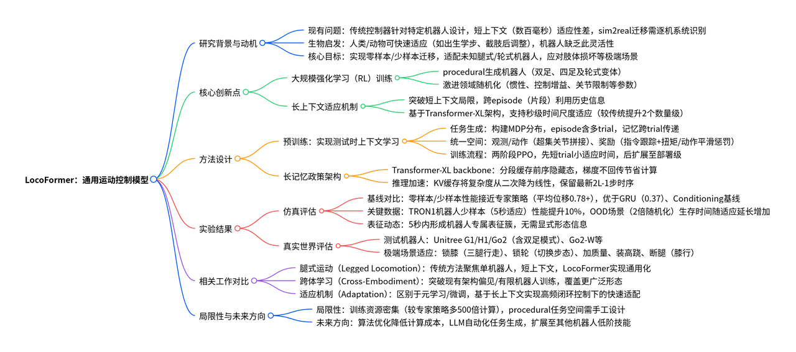
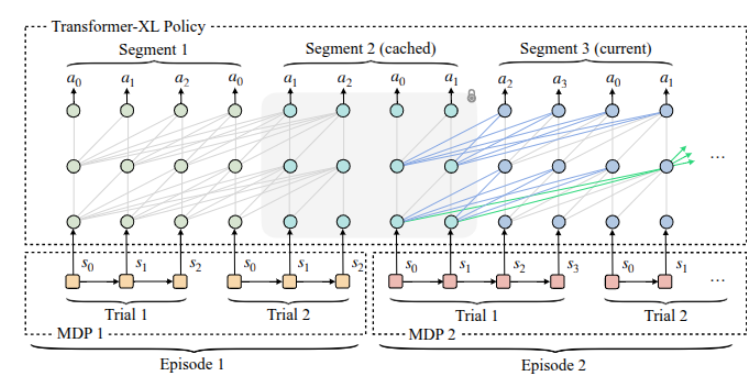
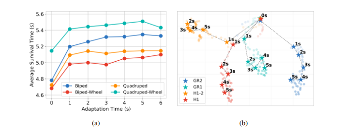
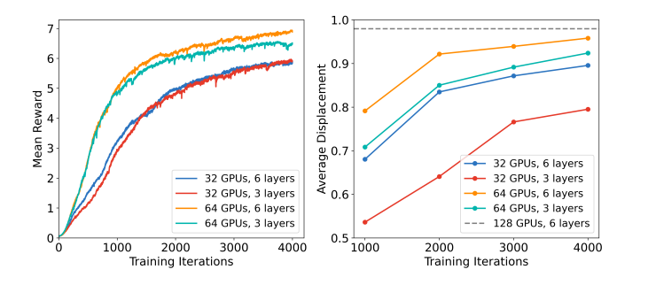

作者机构：Skild AI

相关链接：

1. https://generalist-locomotion.github.io/resources/locoformer\_corl\_2025.pdf
2. https://arxiv.org/html/2509.23745v1
3. https://generalist-locomotion.github.io/

发表年月：2509

> 现代运动控制器需针对特定机器人机体进行人工调参。
>
> 本文提出通用型全机体运动控制模型 LocoFormer，能够控制此前未接触过的腿式与轮式机器人（泛化），即便在不掌握这些机器人精确运动学参数的情况下仍可实现控制。在测试阶段，LocoFormer 还能适配机器人形态与动力学特性的变化。
>
> 在程序化生成的机器人上，通过激进的领域随机化策略开展大规模强化学习（RL）训练；
>
> 不同于以往上下文长度较短、存在 “短视性” 的策略，将上下文长度提升多个数量级，使其能够跨越片段（episode）边界。
>
> 将同一 LocoFormer 模型部署于不同类型的机器人，结果表明，即便在重量变化、电机故障等强干扰场景下，模型仍能实现稳定控制。
>
> 在极端场景中，可观察到模型跨片段的涌现式适配行为 ——LocoFormer 会从早期片段中的摔倒经历中学习，进而在后续片段中优化控制策略。

## 摘要

人类和动物在移动能力方面表现出极强的适应性，例如

1. 出生后不久就能学会行走
2. 在肢体截肢后逐步适应
3. 人类婴儿也具备交替踏步等反射行为

而当今机器人的移动能力：

1. 通过RL从零开始学习
2. 需要针对特定本体调参
3. 适应范围有限，几百毫秒
4. 仅考虑分布内场景，通用性弱

本文在覆盖范围广泛的任务分布上，结合极端领域随机化（extreme domain randomization）进行训练。

当训练过程中面临高度多样化的任务时，控制策略必须学习通用型策略 —— 先高效完成任务识别，再通过调整控制方式以实现良好的任务性能 。

这一现象与大型语言模型（LLMs）的特性类似：在 LLMs 中，网页级规模的预训练使其能够在测试阶段通过 “上下文内适应”（in-context adaptation）完成新任务。

设计了一个规模庞大的 “程序化生成机器人” 空间，其中包含双足机器人、四足机器人，以及它们的腿式与轮式变体；同时对这些机器人的参数进行了激进的随机化处理，包括惯性、控制增益和关节限制等参数的大幅变动。

## 方法

### 上下文学习预训练

对于不同的本体

1. 一种思路是策略以详细的运动学和动力学为条件进行学习，但是，该方法通常需要大量的系统辨识工作，且容易受到机器人长期使用过程中磨损老化所导致的参数偏差影响
2. 让模型在测试阶段具备上下文学习能力

当前运控模型都存在短视性，但有时候我们甚至需要跨越试次（trial）便捷，即训练时模型在一个片段（episode）内进行多次尝试，同时保留尝试之间的信息，训练目标是最大化整个片段内的期望累计奖励。

为实现长上下文适配，让 LocoFormer 能够关联先前试次（trial）的状态信息。采用长上下文 Transformer 作为骨干网络，该网络会将上下文划分为固定长度的片段（segment）。在处理当前片段时，会同时利用前一个（缓存的）片段中的状态计算关键值（keys）和价值（values），但不会反向传播梯度（蓝色线条所示）。随着网络层数的增加，这一设计使 LocoFormer 甚至能够利用缓存片段之前的更早片段中的信息（绿色线条所示）。

### 任务生成

通过程序化方式生成各类腿式机器人，并对其物理参数进行随机化处理，以构建多样化的 MDP 实例。

主要聚焦于双足、四足机器人及其轮式变体等常见形态，且未纳入市场上任何真实机器人的精确参数。

对于每种形态，参考现有腿式机器人的通用设计原则，对关节类型、关节顺序等常见运动学参数进行随机化，同时也对质量、质心位置等动力学参数进行随机化。

### 统一的观测、动作与奖励空间

为了训练一个可在不同腿式机器人间共享的控制策略，采用了一种简洁的 “统一关节空间” 来实现一致的观测和动作表示 —— 通过拼接一个 “关节超集”（该超集包含了大多数现代腿式机器人的电机数量）来构建这一空间。控制策略在统一关节空间内输出目标关节位置，之后再为每个特定机器人提取对应的关节状态。

在奖励设计上，采用了受Legged locomotion in challenging terrains using egocentric vision 启发的方案，包含 “指令跟踪奖励” 和若干惩罚项：惩罚项用于减少扭矩消耗、鼓励动作平滑性，并防止硬件损坏。

### 仿真环境中的大规模强化学习

运动控制任务的试次通常持续时间较长。为了突出适配学习过程，我们对公式定义稍作修改：不再直接采样固定数量的试次，而是采样一个时长为u秒的 “适配时间预算”$u \sim Uniform(0, U)

$，允许控制策略在最终试次前，于该时间预算内执行任意数量的试次。

在修改后的设定下，在物理仿真环境中基于PPO算法对控制策略进行大规模优化。训练分为两个阶段：

1. 初期采用较短的试次时长和较小的U值，优先让模型掌握适配行为
2. 随后延长试次时长和适配时间，为策略的真实世界部署做准备。

### 部署

预训练完成的策略可通过零样本（zero-shot）和少样本（few-shot）两种方式实现上下文内学习：

- 在零样本场景$(u=0)$下，策略可在数秒内快速适配未接触过的机器人机体，通常能立即实现稳定运动；
- 但初始探索过程中偶尔会出现失败，此时策略可借助少样本学习 —— 通过利用先前试次的经验逐步提升性能。

### Transformer-XL策略

假设$o_t$为每个时间步的观测数据，这些数据会被编码为令牌（token）$x_t$。Transformer-XL（简称TXL）将令牌划分为长度为$L$的片段（segment），考虑两个连续的片段：$\sigma_z = [x_{z,1}, \dots, x_{z,L}]$与$\sigma_{z+1} = [x_{z+1,1}, \dots, x_{z+1,L}]$。设$h_z^n \in \mathbb{R}^{L \times d}$表示片段$\sigma_z$在Transformer第$n$层的隐藏状态。

Transformer-XL会利用来自前序片段的缓存隐藏状态计算当前注意力机制的关键值（keys）和价值（values），但不会向这些缓存状态反向传播梯度，以此节省计算资源与内存。形式化地，给定前序片段的隐藏状态$h_z^{n-1}$，Transformer-XL按以下方式计算：

$\tilde{h}_{z+1}^{n-1} = \left[ SG(h_z^{n-1}) \circ h_{z+1}^{n-1} \right] \tag{2}$

$q_{z+1}^n, k_{z+1}^n, v_{z+1}^n = h_{z+1}^{n-1} W_q,\ \tilde{h}_{z+1}^{n-1} W_k,\ \tilde{h}_{z+1}^{n-1} W_v \tag{3}$

$h_{z+1}^n = \text{Transformer-Layer}(q_{z+1}^n, k_{z+1}^n, v_{z+1}^n) \tag{4}$

其中，$SG(\cdot)$表示停止梯度（stop-gradient）操作，$\circ$表示沿序列长度维度进行拼接，$W_q$、$W_k$、$W_v$均为模型的可学习参数。

在强化学习（RL）训练过程中，每个片段都会被缓存，以作为后续迭代的条件。这种片段级的循环机制使得有效上下文长度以$O(NL)$的规模增长（其中$N$为网络层数，$L$为片段长度）。

例如，一个包含6层、片段长度为128的Transformer，其最大可用记忆可覆盖896个时间步；若控制频率为50Hz，这一时间步长度对应约18秒的实际时间。需注意，片段可能会跨越片段（episode）边界，在此情况下，需调整注意力掩码（attention mask），确保注意力机制不会跨越episode边界进行关联。

### 推理加速

利用键值缓存（KV-cache），在训练阶段的轨迹生成（rollout）过程中，先利用前序片段隐藏状态导出的关键值（keys）和价值（values）初始化KV-cache，再逐步追加新的时间步数据。在实时部署场景中，KV-cache仅保留最近的

$2\times L -1$ 个时间步数据——对应训练过程中遇到的最大直接条件化历史长度。

## 性能对比

| 方法                  | 双足机器人（Biped） |           |           |           |           | 四足机器人（Quadruped） |           |           | 轮式机器人（Wheeled） |           | 平均值（Average） |
| ------------------- | ------------ | --------- | --------- | --------- | --------- | ---------------- | --------- | --------- | -------------- | --------- | ------------ |
|                     | G1           | H1        | GR1       | TRON1     | BK-H      | A1               | Spot      | AnyMal C  | TRON1-W        | Go2-W     |              |
| 本文方法（零样本）           | 0.96±0.16    | 0.98±0.12 | 0.95±0.21 | 0.87±0.31 | 0.98±0.11 | 0.92±0.26        | 1.00±0.06 | 0.95±0.22 | 0.99±0.07      | 0.97±0.16 | 0.96±0.19    |
| 本文方法（少样本）           | 0.98±0.11    | 0.99±0.08 | 0.99±0.09 | 0.96±0.18 | 0.99±0.09 | 0.94±0.23        | 1.00±0.05 | 0.96±0.19 | 1.00±0.04      | 0.98±0.10 | 0.98±0.13    |
| 门控循环单元（GRU）         | 0.09±0.06    | 0.08±0.11 | 0.09±0.11 | 0.03±0.03 | 0.47±0.40 | 0.46±0.44        | 0.68±0.37 | 0.42±0.45 | 0.66±0.34      | 0.74±0.36 | 0.37±0.41    |
| 条件控制（Conditioning）  | 0.94±0.17    | 0.94±0.16 | 0.81±0.33 | 0.07±0.15 | 0.62±0.38 | 0.93±0.24        | 0.99±0.09 | 0.89±0.28 | 0.72±0.40      | 0.92±0.22 | 0.78±0.37    |
| 专家策略（Expert Policy） | 1.00±0.00    | 1.00±0.00 | 1.00±0.00 | 1.00±0.00 | 1.00±0.00 | 0.97±0.18        | 0.99±0.08 | 1.00±0.04 | 1.00±0.00      | 0.98±0.12 | 0.99±0.07    |

3类共10个未接触过的机器人上对各方法进行评估，每个机器人对应1000个仿真环境，且环境包含崎岖地形与大范围领域随机化。表中每个数值均表示机器人向随机采样目标点移动的平均位移，已归一化至\[0,1]区间。LocoFormer在零样本场景下表现具备竞争力，且经过短暂的5秒适应窗口后性能进一步提升（在TRON1机器人上提升10%）。平均来看，其性能接近专家策略，且优于门控循环单元（GRU）与条件控制（Conditioning）这两个基线方法。

### 适配性能

为评估 LocoFormer 的适配能力，将领域随机化强度提升一倍，并将程序化生成的机器人部署于崎岖地形。在不同适应时间预算下（每种设置对应 5 万次片段测试），记录了 6 秒轨迹内机器人的平均摔倒时间。

如图 6c 所示，即便在零样本场景下，LocoFormer 也能有效适配复杂领域；短时间的适应即可带来显著性能提升。随着适应时间增加，所有形态机器人的生存时间均有所延长，这充分体现了长上下文学习的优势。

### 表征动态

为进一步分析适配过程，对内部表征的时间演化进行了跟踪。具体而言，在四种人形机器人变体的 4096 次零样本轨迹测试中，监测了 Transformer 第二层的平均输出（如图 6d 所示）。

初始阶段（前 1 秒内），各机器人的嵌入表征（embedding）较为相似；随着时间推移，表征逐渐分化，这反映出控制策略对不同机体的特化程度不断提升。5 秒时，已形成明显的表征簇，这表明该策略无需显式输入机器人描述信息，即可构建稳定的、特定于机体的内部模型。

### 真实世界测试

**关节锁定**（将PD控制器的设定值改为固定值进行锁定），LocoFormer 最初会出现前倾，但经过 2-3 秒的适应后，能学会将重心后移至三条腿上，甚至实现稳定行走。类似现象也出现在轮式四足机器人上：当一条或两条腿被锁定时，LocoFormer 会调整步态以重新分配负载，即便驱动能力下降，仍能保持平衡与移动能力。

在高度不稳定的场景中，单次试次内的适配可能无法成功。让 LocoFormer 控制一款 “无踝关节电机 + 单点支撑” 的双足机器人：该平台稳定性极差，在失效前几乎没有足够时间调整平衡。由于 LocoFormer 此前未接触过这种形态，第一次试次以失败告终。

但模型会将失败轨迹的信息存储在 Transformer-XL 的缓存中，并在后续试次中调用这些信息 —— 到第三次试次时，机器人已能以双足模式稳定行走，甚至能抵抗外力推搡与额外负载。

**车轮锁定**，Go2-W 轮式机器人初始状态为滚动行驶，通过软件将车轮控制器的增益设为零，在运行过程中程序性锁定车轮。这一操作会瞬间改变机器人的动力学特性（无法再通过滚动移动）。LocoFormer 能检测到这种 “指令与效果不匹配”（向车轮发送指令但无预期运动），并快速适配：切换为类似标准腿式双足机器人的行走步态。

当车轮重新解锁后，LocoFormer 会再次检测到状态变化，切换回能耗更低的滚动步态。此外，当机器人加载外部质量时，模型也能调整步态以维持平衡。

**加装高跷**，在机器人腿部加装高跷，使其 “腿身长度比” 远超训练过程中接触过的范围。这一改动会通过抬高质心、改变摆动 / 支撑阶段的力臂，同时改变机器人的运动学与动力学特性。

初始阶段，机器人仅能迈出几步不稳定的步伐；但 LocoFormer 会快速调整协调方式（如改变步频、调整落足点），以适配加长的肢体形态，最终实现稳定、可重复的向前行走。

**腿部截断**，将机器人的小腿部分截断至大腿处，这一操作会减少 4 个自由度，并缩短肢体长度 —— 该形态同样未包含在训练数据中。初始时，机器人无法有效移动，仅能原地踏步；但经过 7-8 秒的适应后，模型发现需通过大腿关节的大振幅摆动实现移动，后续即可高效完成 locomotion（运动控制）。

## 训练

专用策略的训练成本约为每个机器人1天，而LocoFormer的总训练成本虽为专用策略的500倍，但摊销到10万个机器人后，单位机器人成本仅为0.005天

- 实验中使用32 GPU、64 GPU和128 GPU进行训练，不同配置对性能有直接影响。128 GPU搭配6层Transformer-X能获得最佳性能。
- 以6层TXL架构为例，在32 GPU上训练4000轮需约28小时；若提升GPU数量或增加网络层数，时长会相应调整，但性能也会同步提升。
- 训练初期使用较短的 trial 时长和较小的适应时间预算，优先学习基础适应行为；后期再延长时长，为真实场景部署做准备，避免前期资源浪费。
- 采用KV缓存（KV-cache）将推理复杂度从时间步的二次依赖降至线性依赖，同时仅保留最近的2×L-1个时间步（L为segment长度），满足实时控制需求，同时使用了混合精度，和ZeRO内存优化

## 局限

1. 与专用控制策略相比，LocoFormer 的训练对资源需求极高。尽管考虑到其覆盖的任务分布更广、上下文更长，这一结果并不意外，但在大规模并行强化学习场景下，仍有通过算法优化降低资源消耗的空间。
2. LocoFormer 依赖手工设计的程序化生成任务空间，这种设计方式在通用性上存在挑战。未来研究可探索通过大型语言模型（LLMs）或其他网页级数据源实现任务自动化生成，以获得更具扩展性的方案。

## 相关工作对比

### Legged Locomotion

现有腿部运动控制方法以 “特定形态优化” 为核心，难以泛化到新机器人或极端场景，具体差异如下：

- **训练目标与泛化能力**：多针对单一机器人形态（如特定四足、双足）训练，依赖 “仿真 - 现实” 迁移时的精细参数校准；LocoFormer 则通过程序生成机器人 + 激进域随机化 ，覆盖双足、四足及轮式变体，无需针对目标机器人调参，可直接零样本部署。
- **上下文长度与适应能力**：现有控制器仅依赖数百毫秒的短上下文，无法应对形态突变（如断腿、锁轮）；LocoFormer 将上下文扩展至**秒级（最长约 18 秒）**，能跨 episode 学习，从早期摔倒中优化后续控制策略。

### Cross-Embodiment Learning

跨形态学习旨在让单一策略适配多种机器人，但现有方法存在 “结构依赖” 或 “场景局限”，具体差异如下：

- **策略结构设计**：部分工作通过图神经网络（GNN）或 Transformer 注意力掩码，将机器人形态作为结构先验嵌入策略；LocoFormer 无需显式形态信息，仅通过**统一观测 / 动作空间 + 长上下文记忆**，自动学习不同形态的控制模式（如轮式锁死后切换为步行步态）。
- **训练规模与场景覆盖**：现有方法仅在少量选定机器人（如特定四足）上训练，场景局限于单一运动类型；LocoFormer 在**10 万 + 生成机器人**上大规模训练，覆盖腿式、轮式及混合形态，能适配训练中未见过的真实机器人（如 Unitree G1、H1）。

### 自适应学习（Adaptation）

自适应学习关注 “快速适应新任务 / 环境”，但现有方法多针对低频率任务或需额外微调，具体差异如下：

- **适应场景与频率**：元学习或微调方法需针对新动态（如负载变化）额外训练，且多适用于低频率决策任务；LocoFormer 在**高频控制场景（50Hz）** 下无需微调，仅通过 5 秒内的试错即可适应极端变化（如腿长增加、断腿）。
- **上下文利用方式**：部分工作虽能跨 episode 适应，但局限于游戏类开放任务；LocoFormer 通过**Transformer-XL 的段级循环机制**，将上下文记忆扩展至多层级（如 6 层 + 128 段长实现 896 步记忆），确保高频控制中高效利用历史信息。

## Takeaway

核心是解决传统控制器“特定形态依赖、适应能力弱”的痛点，主要通过：

1. 程序生成十万+机器人（覆盖双足、四足、轮式及混合形态）+ 激进的域随机化方法
2. Transformer-XL上下文记忆架构，使得记忆可跨episode传递，能从早期失败（如摔倒）中提取信息，优化后续控制。

实际部署发现拥有强大的零样本泛化能力、秒级的适应能力。

论文指出当前方案的不足：

1. **训练资源消耗高，**&#x4C;ocoFormer的大规模训练需500倍于“单形态专家政策”的计算资源（虽分摊到10万+机器人后“单位机器人成本更低”，但整体门槛仍高），未来需通过算法优化（如并行RL、混合精度训练）降低成本。
2. **任务生成依赖人工设计，**&#x73B0;有程序生成机器人生成需手动定义形态范围（如关节类型、肢体数量），难以覆盖所有真实机器人的特殊性（如某些机器人的关节轴偏移）。未来可结合LLM等工具实现“自动化任务生成”，进一步扩大训练多样性。

## 问题

1. 没有用Diffusion Policy吗？输出的动作空间怎么定义的？序列动作如何输出？
   1. 纯Transformer，动作空间就是上面说的统一空间，序列动作论文没有用没有类似action chunk的东西，但是提到用了kv cache加速推理，可能还是单步推理。
2. 如何实现新动作？
   1. 纯靠泛化，只能走路，失败的状态会保存到kv cache，后面再尝试就能成功。
3. 能否实现参考视频动作的机器人动作镜像？
   1. 貌似不太行
4. 罗列下复现有哪些困难点？
   1. 论文很多细节没说、分布式强化学习代码编写、训练资源、走路目前对我们来说没用

## 一句话总结

跨本体 + 大数据量RL + 统一关节空间 （Unified Observation, Action and Reward Space）+ 长上下文 带来超强泛化能力

具体是 Transformer-XL 还是 Diffusion Policy应该影响不大，无非是推理效率问题
