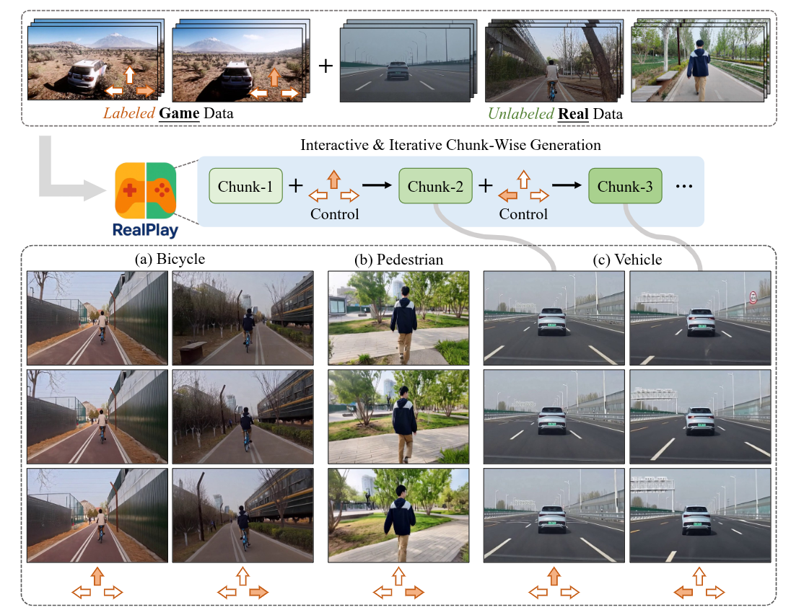

> Page: https://wenqsun.github.io/RealPlay/
> Code: https://github.com/wenqsun/Real-Play

## Abstract

RealPlay 是一个基于神经网络的现实世界游戏引擎，能够根据用户控制信号生成交互式视频。与以往专注于游戏风格视觉效果的作品不同，RealPlay 旨在生成逼真且时间上连贯的视频序列，使其看起来像现实世界的画面。它通过交互式循环运行：用户观察生成的场景，发出控制命令，并获得一段简短视频作为响应。为了实现这种逼真且响应迅速的生成，我们解决了关键挑战，包括用于低延迟反馈的迭代分块预测、跨迭代的时间连贯性以及准确的控制响应。RealPlay 在标记的游戏数据和未标记的现实世界视频的组合上进行训练，无需现实世界的动作注释。值得注意的是，我们观察到两种泛化形式：

1. 控制转移——RealPlay 有效地将控制信号从虚拟场景映射到现实世界场景；
2. 实体转移——尽管训练标签仅来自一款赛车游戏，但 RealPlay 能够泛化以控制各种现实世界的实体，包括自行车和行人，而不仅仅是车辆。

## Introduction

近期的研究成果，如 GameFactory 和 GameNGen ，表明神经网络能够有效地模拟游戏，甚至可以作为游戏引擎运行。这些方法通常采用两阶段流程：

1. 收集大规模游戏数据，其中每一帧或每一段都标注了控制信号（例如，在赛车游戏中标注“向前移动”或“向左转弯”）；
2.  在这些标注数据上训练交互式视觉内容生成器——例如视频生成模型——以根据当前视觉上下文和对应的控制信号预测未来的视觉帧。

尽管神经网络能够有效地模拟和复制游戏环境，但它们生成的视觉质量的上限最终受到底层游戏引擎的限制。尽管现代游戏引擎（如虚幻引擎 5）能够生成高度逼真的图形，但人类仍然可以轻松区分游戏渲染的视觉效果和现实世界的画面。换句话说，当前的游戏引擎难以生成与现实无法区分的视觉效果，或者无法忠实地捕捉现实世界的复杂物理规律。这促使我们探索使用神经网络开发视觉输出比传统游戏引擎渲染的更逼真的游戏的可行性。

值得注意的是，RealPlay 并不依赖于标注的现实世界数据；相反，它利用标注的游戏数据和未标注的现实世界数据，展现出从虚拟环境到现实场景的强大控制转移能力。RealPlay 应对了交互式视频生成中的四个关键挑战：

1. 分块生成。RealPlay 由一个预训练的图像到视频生成器提供支持，该生成器最初设计为在一次前向传递中生成长时视频。然而，每次迭代生成长片段可能会导致明显的延迟，降低交互的响应性。为了解决这一问题，我们将预训练的视频生成器调整为在每次迭代中仅生成较短的片段——仅包含几帧——从而实现更具响应性的用户体验。
2. 迭代生成。现有的视频生成模型通常设计为一次性图像到视频生成，这与我们的用例不一致，因为视频片段必须迭代生成，RealPlay 在每次迭代中接收新的控制信号。为了支持这种迭代生成过程，我们将一个预训练的视频生成器——最初基于单张图像生成整个视频——调整为分块生成框架，其中每个新片段基于之前生成的视频片段而非仅静态图像。
3. 跨迭代的一致性。在推理过程中，RealPlay 根据当前观察结果生成视觉输出——该观察结果本身是在前一次迭代中生成的——以及用户提供的控制信号。换句话说，每个新的视频片段是基于预测的观察结果生成的，而不是在训练中使用的真值观察结果。这种差异引入了训练和推理之间的分布差距，通常会导致累积的伪影、视觉漂移或跨迭代的时间不连贯性。为缓解这一问题，采用了扩散强制策略，该策略已被证明在缩小这一差距方面是有效的。具体而言，在训练过程中向条件片段引入噪声，促使模型在推理过程中更好地处理不完美的条件。
4. 精确控制。标注游戏数据相对容易且高度可扩展，因为控制信号可以在游戏过程中自动记录。相比之下，标注现实世界数据既耗时又模糊，通常需要人工操作。RealPlay 探索了一种混合训练范式，结合了标注的游戏数据和未标注的现实世界数据。研究发现这种方法使 RealPlay 能够在游戏领域学习有效的控制策略，并成功地将其转移到现实场景中——在不需要明确的现实世界标注的情况下，展现出有希望的控制转移能力。有趣的是，尽管我们的标注游戏数据仅来自赛车游戏《极限竞速：地平线 5》，但控制信号（即“向前移动”、“向左转弯”和“向右转弯”）可以有效地转移到控制现实世界中的实体——如自行车和行人——而不仅仅是车辆。

## Method

目标是使用一个标记过的汽车竞速数据集来训练 RealPlay，在该数据集中，用户操作（即“向前移动”、“向左转弯”和“向右转弯”）以固定的频率记录下来，同时还有一个未标记的数据集，包含捕捉到车辆行驶、自行车骑行和行人行走的真实世界视频。训练完成后，RealPlay 能够将游戏环境中的基于汽车的操作转移到现实世界中的实体，包括车辆、自行车和行人。它支持交互式和迭代式视频生成：在每次迭代中，用户观察上一步生成的场景并发出新的控制指令。然后，RealPlay 生成一个新的、时间上连贯的视频片段，反映用户的输入。

形式上，设 $G = \{G_i\}_{i=1}^{M_1}$ 表示包含 $M_1$ 个训练样本的标记游戏数据集。每个样本 $G_i = \{(C_k, a_k)\}_{k=1}^{K}$ 由 $K$ 对视频片段及其对应的控制命令组成。相邻的视频片段对之间存在固有的时间关联性：第 $k$ 个视频片段 $C_k$ 与控制命令 $a_k$ 结合后，会导致第 $k+1$ 个视频片段 $C_{k+1}$ 的出现。每个控制命令 $a_k$ 被表示为一个三维的独热向量，分别对应于离散集合 \{向前移动、向左转弯、向右转弯\}。设 $R = \{R_i\}_{i=1}^{M_2}$ 表示包含 $M_2$ 个样本的未标记真实世界数据集。每个样本 $R_i = \{C_k\}_{k=1}^{K}$ 包含一个由 $K$ 个视频片段组成的序列，其中相邻片段表现出时间连贯性。每个序列捕捉了真实世界中涉及车辆、自行车或行人的运动模式，这些元素在给定的序列中分别单独出现。
