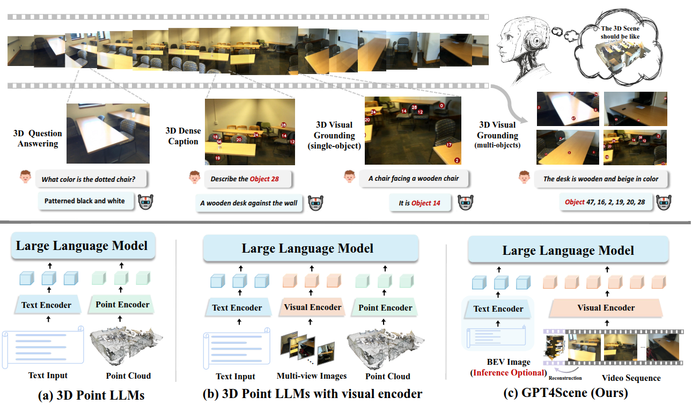
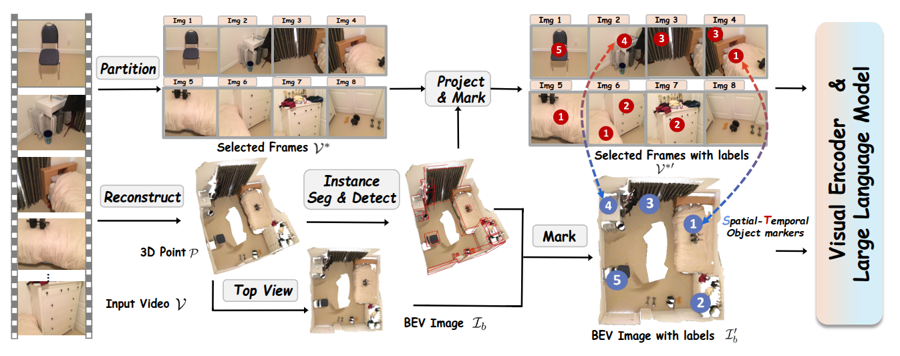

>  Paper: https://arxiv.org/abs/2501.01428
>
>  Code: https://github.com/Qi-Zhangyang/GPT4Scene-and-VLN-R1

## Abstract

近年来，二维视觉 - 语言模型（VLM）在图像 - 文本理解任务中取得了显著进展。然而，它们在三维空间理解方面的表现仍然有限，而三维空间理解对于具身智能至关重要。最近的研究利用三维点云和多视图图像作为输入，取得了令人鼓舞的结果。

提出探索一种纯粹基于视觉的解决方案，该方案受人类感知的启发，**仅依赖视觉线索进行三维空间理解**。本文实证研究了 VLM 在三维空间知识方面的局限性，揭示了其主要缺点在于场景与单个帧之间缺乏全局 - 局部对应关系。为解决这一问题，引入了 GPT4Scene，这是**一种新颖的 VLM 训练和推理中的视觉提示范式**，有助于建立全局 - 局部关系，显著提高了室内场景的三维空间理解能力。

具体而言，GPT4Scene 从视频中构建鸟瞰图（BEV）图像，并在帧和 BEV 图像中标记一致的对象 ID。然后，模型将带有标记的拼接 BEV 图像和视频帧作为输入。在零样本评估中，GPT4Scene 的表现优于 GPT-4o 等闭源 VLM。此外准备了一个包含 165K 文本注释的处理过的视频数据集，用于微调开源 VLM，在所有三维理解任务上均取得了最先进的性能。令人惊讶的是，在采用 GPT4Scene 范式进行训练后，即使在推理过程中没有对象标记提示和 BEV 图像作为明确的对应关系，VLM 的性能也始终有所提高。这表明所提出的范式有助于 VLM 发展出理解三维场景的内在能力，为将预训练的 VLM 扩展到三维场景理解开辟了道路。

## Introduction

三维场景理解旨在理解周围复杂环境的整体布局以及物体之间的空间关系，它在具身智能、虚拟现实和智能城市等应用中发挥着关键作用。随着大语言模型的快速发展，视觉 - 语言模型在图像和视频理解方面表现出色 。研究人员通过引入点云，将这一范式扩展到三维感知，以提高场景理解能力。最近的三维点大语言模型利用与大语言模型特征对齐的点云进行室内场景理解。尽管在点云和图像结合的点 - 视觉 - 大语言模型范式中，通过更丰富的视觉线索提高了性能，**但将这些模态与文本对齐仍然具有挑战性。**

本工作旨在利用预训练的视觉 - 语言模型，而不修改其架构，最大限度地发挥其视觉感知能力。然而，它们在理解沉浸式三维室内场景方面的有效性仍然有限。分析表明，直接将场景视频输入视觉 - 语言模型，在三维场景理解方面失败，原因是两个因素：

1. 缺乏全局场景表示；
2. 每帧的局部观察与其时空上下文之间的错位。

为解决这一问题，提出了 GPT4Scene 框架，以增强视觉 - 语言模型的空间理解能力。

1. 首先对输入视频进行三维重建，生成鸟瞰图（BEV）图像，提供全面的场景布局。
2. 在 BEV 图像和二维帧中引入时空对象标记（STO - 标记）。这些标记在帧之间保持一致的对象 ID（时间层面），并与 BEV 图像对齐（空间层面），弥合全局 - 局部关系。

实证结果表明，GPT4Scene 对重建质量和标记精度具有鲁棒性，因为它优先学习全局 - 局部对应关系，而不是精确的几何重建。

首先在无需训练的方法下探索了 GPT4Scene 的有效性。实验结果表明，它对强大的大规模视觉 - 语言模型（如 Qwen2 - VL - 72B）以及闭源模型（如 GPT - 4o 和 Gemini - 1.5 - Pro）非常有效，显著增强了它们的三维场景理解能力，甚至达到了与以前基于点的最先进的方法相当的水平。

然而，对于较小规模的模型，改进有限。对于较小的开源视觉 - 语言模型，引入了 ScanAlign，这是一个包含 165K 对齐数据对的多模态数据集，其中包含带有 STO - 标记的视频帧、BEV 图像和文本描述。在 ScanAlign 上微调 Qwen2 - VL - 7B，实现了最先进的性能，在三维问答（SQA3D）上实现了 48% 的相对改进（40.7 → 60.7 EM - 1 分数），超过了以前的 SOTA Chat - Scene 11.0%（54.6 对比 60.7）。该模型在 Multi3DRef 上的三维视觉定位能力甚至更强，超过了 Chat - Scene 13.0%（57.1 → 64.5）。这些进步突显了 GPT4Scene 在无缝增强具有强大三维空间理解能力的视觉 - 语言模型方面的有效性。

## Methodology

### GPT4Scene Framework

### Overview

给定一个由在室内场景中移动拍摄的视频 $V = \{I_1, \ldots, I_N\}$，我们首先使用以下索引近似均匀地采样 $n$ 帧：$s_i = \left\lfloor \frac{(i - 1) N}{n} \right\rfloor + 1$，对于所有 $i \in \{1, \ldots, n\}$，从而形成 $V^* = \{I_{s_1}, \ldots, I_{s_n}\}$。这种策略在保留场景上下文的同时减少了视觉 - 语言模型（VLMs）的标记数量和计算开销，而不会显著丢失信息。

然后利用完整的时序序列进行三维场景重建，生成一个整体的鸟瞰图（BEV）地图。随后的三维实例分割实现了精确的对象定位，这些定位被投影到 BEV 地图和二维视频帧上，以建立时空对象标记（STO - markers）。技术细节如下所述。

以自我为中心的视频缺乏全局场景上下文，通过将三维场景重建为点云并渲染鸟瞰图（BEV）图像来解决这一问题，以实现整体的视觉 - 语言模型（VLMs）理解。给定带有相机外参 $E = \{E_1, E_2, \ldots, E_N\}$ 的视频 $V = \{I_1, I_2, \ldots, I_N\}$，使用三维重建技术生成三维网格和点云：

$$
P = R\left(\{(I_t, E_t)\}_{t=1}^N\right) \quad (1)
$$

这里，$R(\cdot)$ 表示重建过程，假设已知相机内参。然后从全局点云生成场景的鸟瞰图：

$$
I_b = T(P, E_{\text{top}}) \quad (2)
$$

这里，$E_{\text{top}} \in SE(3)$ 表示顶视图的相机外参，$T(\cdot)$ 表示根据相机外参渲染相应视图的过程，从而生成场景的鸟瞰图。特别是，以顶视图图像的形式向视觉 - 语言模型（VLMs）提供全局三维信息，而不是以点的形式。

为了帮助视觉 - 语言模型（VLMs）专注于特定对象，引入了时空对象标记（STO - markers），以确保二维帧和三维鸟瞰图（BEV）图像之间的一致性。从输入视频 $V$ 重建的三维点云 $P$ 中，应用如 Mask3D 的三维实例分割，得到实例掩码 $M = \{M_1, M_2, \ldots, M_K\}$，其中 $K$ 表示场景中物体的总数。

对于鸟瞰图 $I_b$，首先将三维分割掩码 $M$ 投影到 $xy$ 平面上。然后提取得到的边界框的中心坐标，记为 $C_{xy} = \{C_{xy}^1, C_{xy}^2, \ldots, C_{xy}^K\}$。这些坐标随后被叠加到鸟瞰图上。

对于选定的**以自我为中心**的视频帧 $V^*$，根据每个帧对应的相机姿态，将三维实例掩码 $M$ 投影到每个帧上。对于每个帧 $i$，我们提取每个物体的二维掩码的质心作为其二维标记，定义为 $C_{uv}^i = \{C_{uv}^{i,1}, C_{uv}^{i,2}, \ldots, C_{uv}^{i,K}\}$，其中 $C_{uv}^{i,k}$ 表示第 $i$ 帧中第 $k$ 个物体的二维标记。带有标记的处理过的二维帧和带有标记的鸟瞰图定义如下：

$$
V^{*'} = \{F(I_i, C_{uv}^i) | i = s_1, s_2, \ldots, s_n\} \quad (3)
$$

$$
I_b' = F(I_b, C_{xy}) \quad (4)
$$

这里，$F(\cdot)$ 表示将标记叠加到图像上的操作，$V^{*'}$ 和 $I_b'$ 分别表示带有 STO - markers 的视频帧和鸟瞰图。值得注意的是，每个帧中的二维标记及其在鸟瞰图中对应的三维标记保持空间对齐，确保它们代表相同的物体。此外，$C_{uv}^i$ 在物体级别上在各帧之间保持一致，保持时间连贯性。

### Unlocking VLMs with Zero-shot Prompts

对零样本视觉 VLMs 进行评估，重点关注强大的闭源模型（例如 GPT - 4o），以测试 GPT4Scene 在三维场景理解中的有效性。这一过程被称为“解锁”，它通过提示在 VLMs 中实现无需训练的三维场景理解。具体而言，输入带有标记的视频帧 $V^{*'}$ 和带有标记的鸟瞰图 $I_b'$。为了降低成本，我们将 $V^{*'}$ 中的图像拼接成一张大图像。我们评估了以下三项任务：

1. **三维问答**：目标是回答与场景相关的问题，例如“地板是什么颜色？”。
2. **密集描述**：任务是描述特定对象，例如“描述由 C5 表示的对象”。
3. **视觉定位**：目标是从描述中识别对象 ID，例如“窗户旁边的黑色椅子的 ID 是什么？”。

虽然问答任务与对象标签无关，但密集描述和视觉定位需要对象标记。这些任务涉及检测对象，并根据其边界框的交并比（IoU）进行过滤。与 Chat - Scene 和 Robin3D 一致，使用 Mask3D 分割结果作为预测的边界框来计算 IoU。

通过输入 $V^{*'}$ 和 $I_b'$，视觉 - 语言模型（VLMs）能够理解室内场景的全局特征。GPT - 4o 仍然可以接受额外的第一人称视角帧，使其能够理解场景中的当前位置并规划后续动作。此外，以 GPT - 4o 作为代理，VLMs 可以根据给定的问题确定任务类型并选择适当的提示。因此，GPT4Scene 框架显示出作为下一代具身智能核心技术的巨大潜力。

### Enhancing VLMs with ScanAlign Fine-Tuning

### 零样本提示与微调

零样本提示并不能改善较小的 VLMs。因此希望通过微调来增强开源的较小 VLMs。

首先构建了一个基于 ScanNet 的室内场景数据集 ScanAlign，其中包含以自我为中心的图像、鸟瞰图（BEV）图像和文本注释。该数据集包括三种与三维视觉相关的任务，表示为 $(V^{*'}, I_b', T)$。视觉输入包括带有 STO - markers 的选定视频帧和鸟瞰图，而 $T$ 表示从五个 ScanNet 注释中派生的文本注释，使用提示随机改变注释格式，以增加注释的多样性。该数据集总共包含 165K 个注释。

由于我们的方法不需要额外的模态对齐步骤，因此我们可以直接在 ScanAlign 数据集上进行单阶段指令微调，以增强模型的三维空间理解能力。在训练阶段，训练损失是语言模型的交叉熵损失。目标是最小化目标答案 $ta$ 的负对数似然来优化可学习参数，记为 $\theta$。我们将系统消息和用户问题统一为 $tq$。因此，损失函数可以表示为：

$$
L(\theta) = - \sum_{i=1}^{k} \log P(ta_i | ta_{[1,\ldots,i-1]}, tq), \quad (5)
$$

其中，$k$ 表示响应序列中的标记数量，$ta_{[1,\ldots,i-1]}$ 表示响应中前 $i - 1$ 个标记。可学习参数集 $\theta$ 是视觉 - 语言投影层。

经过在 ScanAlign 数据集上的微调，可以观察到较小模型的性能显著提升。
