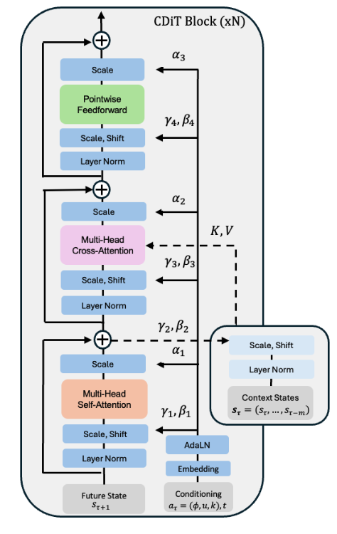
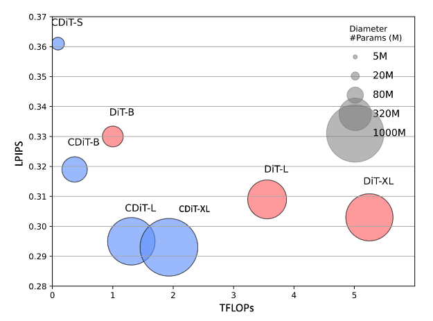

>  Page: https://www.amirbar.net/nwm/
>
>  Code: https://github.com/facebookresearch/nwm/

## Abstract

导航是具有视觉 - 运动能力的智能体的一项基本技能。

本文介绍了一种导航世界模型（NWM），一种可控的视频生成模型，可以根据过去的观测和导航动作预测未来的视觉观测。

为了捕捉复杂环境的动态，NWM 采用了一种条件扩散 Transformer（CDiT），该模型在人类和机器人智能体的多样化第一人称视频集合上进行训练，并扩展到 10 亿参数。在熟悉的环境中，NWM 可以通过模拟导航轨迹并评估它们是否达到期望目标来规划导航轨迹。与具有固定行为的监督导航策略不同，NWM 可以在规划过程中动态地纳入约束条件。

实验表明，它在从头开始规划轨迹或通过对外部策略采样的轨迹进行排名来规划轨迹方面是有效的。此外，NWM 利用其学到的视觉先验知识，可以从单个输入图像在不熟悉的环境中想象轨迹，使其成为下一代导航系统中灵活且强大的工具。

##  Introduction

导航是任何具有视觉能力的生物的一项基本技能，通过帮助智能体寻找食物、住所和躲避天敌，在生存中发挥着至关重要的作用。为了成功地在环境中导航，智能体主要依赖视觉，这使它们能够构建周围环境的表征，评估距离并捕捉环境中的地标，所有这些都有助于规划导航路线。

当人类智能体进行规划时，他们通常**会考虑约束条件和反事实情况**来想象未来的轨迹。另一方面，目前最先进的机器人导航策略（Gnm: A general navigation model to drive any robo，Nomad: Goal masked diffusion policies for navigation and exploration.） 是“硬编码”的，训练完成后，很难引入新的约束条件（例如“禁止左转”）。当前监督视觉导航模型的另一个限制是，它们无法动态分配更多的计算资源来解决复杂问题。我们的目标是设计一种能够缓解这些问题的新模型。

NWM 在概念上与最近的基于扩散的世界模型相似，这些模型用于离线基于模型的强化学习，例如 DIAMOND 和 GameNGen。然而，与这些模型不同的是，NWM 在多种环境和体现（embodiment）中进行训练，利用来自机器人和人类智能体的多样化导航数据。这使我们能够训练一个大型扩散 Transformer 模型，该模型能够有效地随着模型大小和数据扩展以适应多种环境。我们的方法也与新颖视图合成（NVS）方法（如 NeRF、Zero-1-2-3 和 GDC）有相似之处，我们从中汲取灵感。然而，与 NVS 方法不同的是，我们的目标是训练一个单一模型，用于在多样化环境中导航，并从自然视频中建模时间动态，而不依赖于 3D 先验。

与 DiT 不同，CDiT 的计算复杂度与上下文帧的数量呈线性关系，并且对于在多样化环境和体现中训练的模型，其扩展性良好，模型大小可达 10 亿参数，与标准 DiT 相比，计算量减少了 4 倍，同时实现了更好的未来预测结果。

在未知环境中，我们的结果表明，NWM 从 Ego4D 的无标签、无动作和无奖励的视频数据中受益。从定性上看，我们在单个图像上观察到改进的视频预测和生成性能。从定量上看，随着额外无标签数据的加入，NWM 在保留的斯坦福 Go 数据集上评估时产生了更准确的预测。

## Related Work

目标条件视觉导航是机器人学中的一个重要任务，需要感知和规划技能。**给定上下文图像和指定导航目标的图像**，目标条件视觉导航模型的目标是在环境已知的情况下生成一条通往目标的有效路径，或者在环境未知的情况下进行探索。最近的视觉导航方法，如 NoMaD，通过行为克隆和时间距离目标训练一个扩散策略，以在条件设置中遵循目标，或在无条件设置中探索新环境。先前的方法，如 Active Neural SLAM，使用神经 SLAM 与分析规划器相结合，在三维环境中规划轨迹，而其他方法 则通过强化学习学习策略。在这里，我们展示了世界模型可以利用探索性数据来规划或改进现有的导航策略。

与学习策略不同，世界模型的目标是模拟环境，例如，给定当前状态和动作，预测下一个状态和相关奖励。先前的研究表明，在 Atari、模拟机器人环境甚至真实世界机器人中，联合学习策略和世界模型可以提高样本效率。最近，《Td-mpc2: Scalable, robust world models for continuous control.》提出使用一个单一的世界模型，通过引入动作和任务嵌入来跨任务共享，而（Learning to model the world with language， Learning interactive real-world simulators）提出用语言描述动作，《Genie: Generative interactive environments》提出学习潜在动作。世界模型也在游戏模拟的背景下进行了探索。DIAMOND （Diffusion for world modeling: Visual details matter in atari） 和 GameNGen 提出使用扩散模型来学习像 Atari 和 Doom 这样的电脑游戏的游戏引擎。我们的工作受到这些研究的启发，旨在学习一个单一通用的扩散视频 Transformer，使其可以在许多环境和不同体现中共享用于导航。

在计算机视觉中，视频生成一直是一个长期的挑战 。最近，随着像 Sora 和 MovieGen 这样的方法的出现，文本到视频合成取得了巨大进展。先前的研究提出了在给定结构化的动作 - 对象类别 或动作图 的情况下控制视频合成。视频生成模型以前曾被用于强化学习中的奖励 、预训练方法 、模拟和规划操作动作 以及在室内环境中生成路径。有趣的是，扩散模型 不仅适用于视频任务，如生成和预测，还适用于视图合成。与这些方法不同，条件扩散 Transformer 模拟轨迹以进行规划，而无需明确的三维表示或先验。

## Navigation World Models

### Formulation

直观上，NWM 是一个接收世界当前状态（例如图像观测）和描述移动方向及旋转的导航动作的模型。然后，该模型生成相对于智能体视角的世界的下一个状态。

我们有一个第一人称视频数据集，以及智能体的导航动作 $D = \{(x_0, a_0, \ldots, x_T, a_T)\}_{i=1}^n$，其中 $x_i \in \mathbb{R}^{H \times W \times 3}$ 是一张图像，而 $a_i = (u, \phi)$ 是一个导航指令，由平移参数 $u \in \mathbb{R}^2$ 给出，该参数控制前后和左右运动的变化，以及 $\phi \in \mathbb{R}$ 控制偏航旋转角度的变化。

导航动作 $a_i$ 可以被完全观测到（如在 Habitat 中），例如，向前移动靠近墙壁会触发基于物理的环境响应，导致智能体停留在原地，而在其他环境中，导航动作可以根据智能体位置的变化来近似。

目标是学习一个世界模型 $F$，这是一个从过去的潜在观测 $s_\tau$ 和动作 $a_\tau$ 到未来潜在状态表征 $s_{t+1}$ 的随机映射：

$$
s_i = \text{enc}_\theta(x_i)\ \ 

s_{\tau+1} \sim F_\theta(s_{\tau+1} | s_\tau, a_\tau) \quad (1)
$$

其中 $s_\tau = (s_\tau, \ldots, s_{\tau-m})$ 是通过预训练的 VAE 编码的过去的 $m$ 个视觉观测。使用 VAE 的好处是可以处理压缩后的潜在变量，并且可以将预测解码回像素空间以便于可视化。

由于这种公式化的简单性，它可以自然地在不同环境中共享，并且可以轻松扩展到更复杂的动作空间，例如控制机械臂。与《Dream to control: Learning behaviors by latent imagination》不同，我们旨在跨环境和体现训练一个单一的世界模型，而不是像《Td-mpc2: Scalable, robust world models for continuous control》那样使用任务或动作嵌入。

公式（1）中的建模了动作，但不允许控制时间动态。我们通过添加一个时间偏移输入 $k \in [T_{\min}, T_{\max}]$ 来扩展，设置 $a_\tau = (u, \phi, k)$，因此现在 $a_\tau$ 指定了时间变化 $k$，用于确定模型应该向未来（或过去）移动多少步。因此，给定当前状态 $s_\tau$，我们可以随机选择一个时间偏移 $k$，并使用相应的时间偏移视频帧作为我们的下一个状态 $s_{\tau+1}$。然后，导航动作可以近似为从时间 $\tau$ 到 $m = \tau + k - 1$ 的累加：

$$
u_{\tau \to m} = \sum_{t=\tau}^{m} u_t \ \ 

\phi_{\tau \to m} = \left( \sum_{t=\tau}^{m} \phi_t \right) \mod 2\pi \quad (2)
$$

这种建模允许学习导航动作以及环境的时间动态。在实践中，允许时间偏移最多为 ±16 秒。

可能出现的一个挑战是动作和时间的纠缠。例如，如果到达特定位置总是发生在特定时间，模型可能会学会仅依赖时间而忽略随后的动作，反之亦然。在实践中，数据可能包含自然的反事实情况——例如在不同时间到达同一区域。为了鼓励这些自然的反事实情况，在训练期间为每个状态采样多个目标。

### Diffusion Transformer as World Model

 $F_\theta$ 是一个随机映射，以便它可以模拟随机环境。这是通过使用条件扩散 Transformer（CDiT）模型实现的，接下来将对其进行描述。

**条件扩散 Transformer 架构**

使用一个时间自回归 Transformer 模型，利用高效的 CDiT 模块，并带有输入动作条件。

CDiT 通过将**第一个注意力块的注意力限制在正在去噪的目标帧的标记上**，实现了时间高效的时间自回归建模。为了对过去帧的标记进行条件化，引入了一个交叉注意力层，使得**当前目标帧的每个查询标记都关注过去帧的标记**。交叉注意力随后通过一个跳跃连接层上下文化表示。

为了对导航动作 $a \in \mathbb{R}^3$ 进行条件化，我们首先将每个标量映射到 $\mathbb{R}^d$，通过提取正弦 - 余弦特征，然后应用一个两层的 MLP，并将它们连接成一个单一向量 $\psi_a \in \mathbb{R}^d$。采用类似的过程将时间偏移 $k \in \mathbb{R}$ 映射到 $\psi_k \in \mathbb{R}^d$，以及将扩散时间步 $t \in \mathbb{R}$ 映射到 $\psi_t \in \mathbb{R}^d$。最后，我们将所有嵌入向量相加，得到一个用于条件化的单一向量：

$$
\xi = \psi_a + \psi_k + \psi_t \quad (3)
$$

然后将 $\xi$ 输入到 AdaLN 模块中，生成用于调节 Layer Normalization 输出以及注意力层输出的缩放和偏移系数。为了在无标签数据上进行训练，我们在计算 $\xi$ 时简单地省略显式的导航动作。

另一种方法是直接使用 DiT ，然而，将 DiT 应用于整个输入在计算上是昂贵的。假设 $n$ 是每帧的输入标记数量，$m$ 是帧的数量，$d$ 是标记的维度。缩放多头注意力层 的复杂度主要由注意力项 $O(m^2 n^2 d)$ 主导，这与上下文长度呈二次关系。相比之下，CDiT 模块主要由交叉注意力层的复杂度 $O(m n^2 d)$ 主导，这与上下文呈线性关系，从而允许我们使用更长的上下文大小。与原始 Transformer 模块相似，但不应用昂贵的上下文标记自注意力。

**扩散训练**

在正向过程中，根据随机选择的时间步 $t \in \{1, \ldots, T\}$ 向目标状态 $s_{\tau+1}$ 添加噪声。噪声状态 $s_{\tau+1}^{(t)}$ 可以定义为：

$$
s_{\tau+1}^{(t)} = \sqrt{\alpha_t} s_{\tau+1} + \sqrt{1 - \alpha_t} \epsilon,
$$

其中 $\epsilon \sim \mathcal{N}(0, I)$ 是高斯噪声，而 $\{\alpha_t\}$ 是一个控制方差的噪声时间表。随着 $t$ 的增加，$s_{\tau+1}^{(t)}$ 收敛为纯噪声。反向过程尝试从噪声版本 $s_{\tau+1}^{(t)}$ 中恢复原始状态表征 $s_{\tau+1}$，条件是上下文 $s_\tau$、当前动作 $a_\tau$ 和扩散时间步 $t$。定义 $F_\theta(s_{\tau+1} | s_\tau, a_\tau, t)$ 为由 $\theta$ 参数化的去噪神经网络模型。遵循 DiT 中相同的噪声时间表和超参数。

**训练目标**

模型的训练目标是最小化干净目标与预测目标之间的均方误差，旨在学习去噪过程：

$$
L_{\text{simple}} = \mathbb{E}_{s_{\tau+1}, a_\tau, s_\tau, \epsilon, t} \left[ \| s_{\tau+1} - F_\theta(s_{\tau+1}^{(t)} | s_\tau, a_\tau, t) \|_2^2 \right].
$$

在这个目标中，时间步 $t$ 是随机采样的，以确保模型能够学习在不同程度的噪声干扰下进行去噪。通过最小化这个损失函数，模型学会了从其噪声版本 $s_{\tau+1}^{(t)}$ 中重建 $s_{\tau+1}$，条件是上下文 $s_\tau$ 和动作 $a_\tau$，从而能够生成逼真的未来帧。按照《Scalable diffusion models with transformers》的方法，我们还预测噪声的协方差矩阵，并使用变分下界损失 $L_{\text{vlb}}$ （Improved denoising diffusion probabilistic models）进行监督。

### Navigation Planning with World Models

直观上，如果我们的世界模型对某个环境很熟悉，我们就可以用它来模拟导航轨迹，并选择那些能够到达目标的轨迹。在未知的、分布外的环境中，长期规划可能需要依靠想象。

**形式化描述**

给定初始潜在编码 $s_0$ 和导航目标 $s^*$，我们寻找一个动作序列 $(a_0, \ldots, a_{T-1})$，以最大化到达 $s^*$ 的可能性。设 $S(s_T, s^*)$ 表示在初始条件 $s_0$ 下，通过动作 $a = (a_0, \ldots, a_{T-1})$ 和状态 $s = (s_1, \ldots, s_T)$（通过自回归展开 NWM 得到：$s \sim F_\theta(\cdot | s_0, a)$）到达状态 $s^*$ 的未归一化得分。

我们定义能量函数 $E(s_0, a_0, \ldots, a_{T-1}, s_T)$，使得最小化能量对应于最大化未归一化的感知相似性得分，并遵循对状态和动作的潜在约束：

$$
E(s_0, a_0, \ldots, a_{T-1}, s_T) = -S(s_T, s^*) + \sum_{\tau=0}^{T-1} I(a_\tau \notin A_{\text{valid}}) + \sum_{\tau=0}^{T-1} I(s_\tau \notin S_{\text{safe}}), \quad (4)
$$

其中，相似性是通过使用预训练的 VAE 解码器将 $s^*$ 和 $s_T$ 解码为像素，然后测量感知相似性来计算的。约束条件，如“永远不要先左转再右转”，可以通过将 $a_\tau$ 限制在有效的动作集合 $A_{\text{valid}}$ 中来编码；而“永远不要靠近悬崖边缘”则通过确保这样的状态 $s_\tau$ 在 $S_{\text{safe}}$ 中来实现。$I(\cdot)$ 表示指示函数，如果违反任何动作或状态约束，则施加一个很大的惩罚。

然后，问题就归结为找到最小化这个能量函数的动作：

$$
\arg \min_{a_0, \ldots, a_{T-1}} \mathbb{E}_s [E(s_0, a_0, \ldots, a_{T-1}, s_T)] \quad (5)
$$

这个目标可以重新表述为一个模型预测控制（MPC）问题，我们使用交叉熵方法来优化它，这是一种**简单且无导数的基于种群的优化方法**，最近被用于与世界模型结合进行规划。

**对导航轨迹进行排名**

假设现有的导航策略 $\Pi(a | s_0, s^*)$，使用 NWM 来对采样的轨迹进行排名。这里使用 NoMaD，一种最先进的机器人导航策略。为了对轨迹进行排名，从 $\Pi$ 中抽取多个样本，并选择能量最低的那个，如公式（5）。

## 实验与结果

我们描述了实验设置、我们的设计选择，并将 NWM 与以往的方法进行了比较。补充材料中包含了额外的结果。

###  实验设置

**数据集**

SCAND 、TartanDrive 、RECON 和 HuRoN，获取机器人的位置和旋转信息，从而推断出相对于当前位置的相对动作（见公式 2）。为了使不同智能体之间的步长标准化，将智能体在帧之间行进的距离除以它们的平均步长（以米为单位），确保不同智能体的动作空间相似。进一步过滤掉向后移动的情况，遵循 NoMaD 的方法。此外，使用未标记的 Ego4D 视频，其中考虑的唯一动作是时间偏移。SCAND 提供了在多样化环境中进行社交合规导航的视频片段，TartanDrive 专注于越野驾驶，RECON 涵盖了开放世界的导航，HuRoN 捕捉了社交互动。在未标记的 Ego4D 视频上进行训练，而 GO Stanford 作为未知的评估环境。

**指标**

使用绝对轨迹误差（ATE）来评估预测导航轨迹的准确性，使用相对位姿误差（RPE）来评估位姿的一致性。为了检查世界模型预测与真实图像在语义上的相似性，采用 LPIPS 和 DreamSim，通过比较深度特征来衡量感知相似性，并使用 PSNR 来衡量像素级质量。对于图像和视频合成质量，我们使用 FID 和 FVD。

**基线**

考虑了以下所有基线。

- DIAMOND 是一种基于 UNet 架构的扩散世界模型。按照其公开代码在离线强化学习设置中使用 DIAMOND。扩散模型被训练为自回归地预测 56x56 分辨率的图像，并配备一个上采样器以获得 224x224 分辨率的预测结果。为了适应连续动作，使用了一个线性嵌入层。
- GNM 是一种通用的目标条件导航策略，它在多个机器人导航数据集的混合数据集上进行训练，使用了一个全连接的轨迹预测网络。GNM 在多个数据集上进行了训练，包括 SCAND、TartanDrive、GO Stanford 和 RECON。
- NoMaD 在 GNM 的基础上进行了扩展，使用扩散策略来预测机器人探索和视觉导航的轨迹。NoMaD 在 GNM 使用的相同数据集以及 HuRoN 上进行了训练。

**实现细节**

在默认的实验设置中，使用了一个拥有 1B 参数的 CDiT-XL，上下文为 4 帧，总批量大小为 1024，并设置了 4 个不同的导航目标，最终总批量大小为 4096。使用了 Stable Diffusion 的 VAE 分词器，类似于 DiT 。使用 AdamW 优化器，学习率为 8e-5。训练完成后，从每个模型中采样 5 次以报告平均值和标准差结果。XL 规格的模型在 8 台 H100 机器上进行训练，每台机器配备 8 个 GPU。除非另有说明，否则使用与 DiT-*/2 模型相同的设置。

###  消融实验

模型在已知环境 RECON 的验证集轨迹上进行单步 4 秒未来预测的评估。通过测量 LPIPS、DreamSim 和 PSNR 来评估模型性能与真实帧的对比。

**模型大小和 CDiT**

将 CDiT 与所有上下文标记都作为输入的标准 DiT 进行了比较。假设对于在已知环境中的导航，模型的容量是最重要的，图 5 中的结果表明，CDiT 确实表现更好，且在拥有高达 1B 参数的模型时，其消耗的 FLOPs 不到 2 倍。令人惊讶的是，即使在参数量相等的情况下（例如，CDiT-L 与 DiT-XL 相比），CDiT 的速度快 4 倍，且表现更好。

**目标数量**： 在给定固定上下文的情况下，训练具有不同数量目标状态的模型，将目标数量从 1 个变化到 4 个。每个目标都是在当前状态周围的±16 秒窗口内随机选择的。

**上下文大小**：在变化条件帧数量（从 1 到 4）的情况下训练模型。不出所料，更多的上下文有助于提高性能，而在上下文较短的情况下，模型经常会“丢失跟踪”，导致预测结果较差。

**时间和动作条件**：用时间和动作条件一起训练模型，并测试每个输入对预测性能的贡献。仅用时间运行模型会导致性能较差，而不对时间进行条件限制也会导致性能略有下降。这证实了这两个输入对模型都是有益的。

###  视频预测与合成

评估模型在遵循真实动作以及预测未来状态方面的表现。模型以第一帧图像和上下文帧为条件，然后利用真实动作自回归地预测下一个状态，并将每次预测的结果反馈回去。在 1 秒、2 秒、4 秒、8 秒和 16 秒时将预测结果与真实图像进行比较，并在 RECON 数据集上报告 FID 和 LPIPS。图 4 展示了与 DIAMOND 在 4FPS 和 1FPS 下的性能随时间的变化情况，表明 NWM 的预测结果显著比 DIAMOND 更准确。最初，NWM 的 1FPS 变体表现更好，但在 8 秒后，由于累积误差和上下文丢失，预测结果开始退化，而 4FPS 变体则变得更为优越。

为了评估视频质量，在 4FPS 下自回归地预测 16 秒的视频，同时以真实动作为条件。然后我们使用 FVD 对生成的视频质量进行评估，并与 DIAMOND 进行比较。
