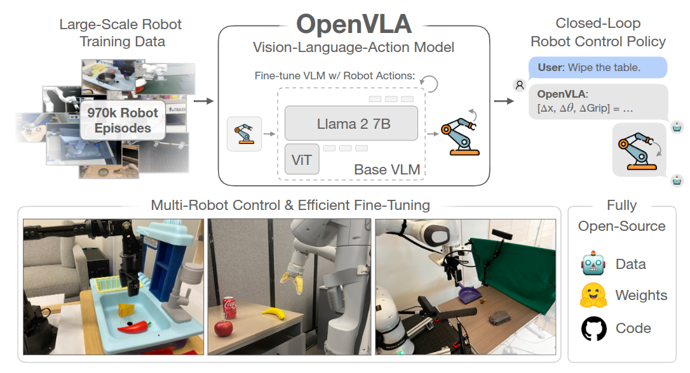

> Paper: https://arxiv.org/abs/2406.09246
>
> Code: https://github.com/openvla/openvla

## Overview



70 亿参数的开源视觉 - 语言 - 动作模型 VLA，一个预训练的视由觉条件语言模型骨干组成，**该模型在 Open-X Embodiment 数据集中的 970k 机器人操作轨迹的大型多样数据集上进行了微调**。

是第一个开源的 VLM 模型。

## 背景

可学习或可训练的机器人操作策略的一个关键弱点是它们无法超出其训练数据进行**泛化**：虽然现有的针对单个技能或语言指令训练的策略能够将行为外推到新的初始条件，如物体位置或光照条件，但它们缺乏对场景干扰物或新颖物体的鲁棒性，并且难以执行未见过的任务指令。

1. 在互联网数据集上训练的 VLM 则有更好的泛化性；
2. 尽管在机器人领域复制这种规模的预训练仍然是一个未解决的挑战——即使是最大规模的机器人操作数据集也只有 10 万到 100 万的例子——这种不平衡表明了一个机会：使用现有的视觉和语言基础模型作为核心构建模块来训练能够泛化到超出其训练数据的物体、场景和任务的机器人策略，即 **使用 VLM 作为基础模型**。

有两个关键原因阻碍了现有 VLAs 的广泛使用：

1. 当前模型是封闭的，对模型架构、训练过程和数据组合的可见性有限；
2. 现有工作未提供将 VLAs 部署和适应于新机器人、环境和任务的最佳实践，尤其是在商品硬件 (例如消费级 GPU) 上。

为了为未来的研究和开发奠定丰富的基础，机器人需要开源、通用的 VLAs，以支持有效的微调和适应，类似于现有的围绕开源语言模型的生态系统。

## 架构

模型架构 (基于 Prismatic-7B VLM) 使用**SigLIP、DinoV2、Llama 2**

> 这里使用了两个视觉编码器可见 [此](../Multimodal/EyesWideShut)，作者还实验了一个 OpenVLA 模型的版本——即 openvla-v 01-7 b：开发期间使用的早期模型，由 Prismatic siglip-224 pxVLM（单一 SigLIP 视觉主干和 Vicuña v 1.5 LLM）训练而成，该版本使用较小的机器人数据混合进行预训练（与 Octo 相同的 OpenX 数据集混合）
> 有意思的是，这种「仅使用 SigLIP [79] 视觉骨干而不是融合的 Dino + SigLIP 编码器的架构」在微调任务和“开箱即用”任务中仍能取得强劲的性能

视觉编码器后使用一个小型 2 层 MLP 投影器，输入分辨率为 224，384 并无明显增益并会延长计算时间。

典型的 LLM 或 VLM 训练最多只通过其训练数据集一到两次。相比之下，发现对于 VLA 训练来说，通过训练数据集的次数要显著增加，实际机器人性能会不断提高，直到训练动作 token 准确率超过 95%，最终使用 27 个 epoch。

## 训练

将连续的机器人动作映射到语言模型的分词器使用的离散 token 来表示 LLM 的输出空间中的动作，将每个 action 离散为 256 个 bin 中的一个，对于每个动作维度，作者设置箱子的宽度以均匀划分训练数据中动作的 $1^{\mathrm{st}}$ 和 $99^{\mathrm{th}}$ 分位数之间的区间（不是最大最小，排除极端值的影响），使用这种离散化方法，作者为一个 N 维的机器人动作获得了 N 个离散数。不幸的是，OpenVLA 的 Llama 分词器仅为微调期间新引入的词保留了 100 个“特殊词”，这对于作者动作离散化的 256 个词来说太少了

因此，遵循 Brohan 等人的方法，简单地用动作词覆盖 Llama 分词器词汇中使用最少的 256 个词 (对应于最后的 256 个词)

`prismatic/vla/action_tokenizer.py`

ActionTokenizer 类的主要功能是将连续的机器人动作离散化为多个维度上的 N 个区间，并将其映射到最少使用的 token 上

```python
class ActionTokenizer:
    def __init__(
        self, tokenizer: PreTrainedTokenizerBase, bins: int = 256, min_action: int = -1, max_action: int = 1
    ) -> None:
        """
        Discretizes continuous robot actions into N bins per dimension and maps to the least used tokens.

        NOTE =>> by default, assumes a BPE-style tokenizer akin to the LlamaTokenizer, where *the least used tokens*
                 appear at the end of the vocabulary!

        :param tokenizer: Base LLM/VLM tokenizer to extend.
        :param bins: Number of bins for each continuous value; we'll adopt a uniform binning strategy.
        :param min_action: Minimum action value (for clipping, setting lower bound on bin interval).
        :param max_action: Maximum action value (for clipping, setting upper bound on bin interval).
        """
        self.tokenizer, self.n_bins, self.min_action, self.max_action = tokenizer, bins, min_action, max_action

        # Create Uniform Bins + Compute Bin Centers
        self.bins = np.linspace(min_action, max_action, self.n_bins)
        self.bin_centers = (self.bins[:-1] + self.bins[1:]) / 2.0

        # [Contract] Set "action_token_begin_idx" based on `self.tokenizer.vocab_size - (self.n_bins + 1)`
        #   =>> Assumes we're always overwriting the final `n_bins` tokens of the vocabulary!
        self.action_token_begin_idx: int = int(self.tokenizer.vocab_size - (self.n_bins + 1))

    def __call__(self, action: np.ndarray) -> Union[str, List[str]]:
        """Clip & bin actions to *the last `n_bins` tokens* of the vocabulary (e.g., tokenizer.vocab[-256:])."""
        action = np.clip(action, a_min=float(self.min_action), a_max=float(self.max_action))
        discretized_action = np.digitize(action, self.bins)

        # Handle single element vs. batch
        if len(discretized_action.shape) == 1:
            return self.tokenizer.decode(list(self.tokenizer.vocab_size - discretized_action))
        else:
            return self.tokenizer.batch_decode((self.tokenizer.vocab_size - discretized_action).tolist())

    def decode_token_ids_to_actions(self, action_token_ids: np.ndarray) -> np.ndarray:
        """
        Returns continuous actions for discrete action token IDs.

        NOTE =>> Because of the way the actions are discretized w.r.t. the bins (and not the bin centers), the
                 digitization returns bin indices between [1, # bins], inclusive, when there are actually only
                 (# bins - 1) bin intervals.

                 Therefore, if the digitization returns the last possible index, we map this to the last bin interval.

        EXAMPLE =>> Let's say self._bins has 256 values. Then self._bin_centers has 255 values. Digitization returns
                    indices between [1, 256]. We subtract 1 from all indices so that they are between [0, 255]. There
                    is still one index (i==255) that would cause an out-of-bounds error if used to index into
                    self._bin_centers. Therefore, if i==255, we subtract 1 from it so that it just becomes the index of
                    the last bin center. We implement this simply via clipping between [0, 255 - 1].
        """
        discretized_actions = self.tokenizer.vocab_size - action_token_ids
        discretized_actions = np.clip(discretized_actions - 1, a_min=0, a_max=self.bin_centers.shape[0] - 1)

        return self.bin_centers[discretized_actions]

    @property
    def vocab_size(self) -> int:
        return self.n_bins
```

`prismatic/models/action_openvla.py`

```python
		predicted_action_token_ids = generated_ids[0, -self.get_action_dim(unnorm_key) :]
        normalized_actions = self.action_tokenizer.decode_token_ids_to_actions(predicted_action_token_ids.cpu().numpy()) # [-1, 1]

        # Un-normalize Actions
        action_norm_stats = self.get_action_stats(unnorm_key)
        mask = action_norm_stats.get("mask", np.ones_like(action_norm_stats["q01"], dtype=bool))
        action_high, action_low = np.array(action_norm_stats["q99"]), np.array(action_norm_stats["q01"])
        actions = np.where(
            mask,
            0.5 * (normalized_actions + 1) * (action_high - action_low) + action_low,
            normalized_actions,
        )

        return actions
```

## 数据

一方面，OpenVLA 用 Open X-Embodiment 数据集（OpenX）作为基础来策划训练数据集。完整的 OpenX 数据集由超过 70 个单独的机器人数据集组成，包含超过 200 万条机器人轨迹。

为了使在这些数据上进行训练变得可行，作者对原始数据集应用了多个步骤的数据整理

1. 所有训练数据集之间的输入、输出空间一致，限制训练数据集仅包含至少有一个第三人称摄像机的操作数据集，并使用单臂末端执行器控制
2. 在最终训练组合中具有平衡的 embodiment，利用 Octo 的数据混合权重来处理所有通过第一轮筛选的数据集，Octo 启发式的降低或移除多样性较低的数据集，并增大任务和场景多样性比较大的数据集的权重
3. 尝试将自 Octo 发布以来添加到 OpenX 数据集中的一些额外数据集整合到 OpenVLA 的训练混合中，包括 DROID 数据集，虽然其混合权重保守设定为 10%

考虑到在实践中，发现 DROID 上的动作 token 准确率在整个训练过程中保持较低，表明未来可能需要更大的混合权重或模型来适应其多样性，为了不影响最终模型的质量，作者在最后三分之一的训练中将 DROID 从数据混合中移除。

## 训练和推理

最终的 OpenVLA 模型在一个由 64 个 A 100 GPU 组成的集群上训练了 14 天，总计 21,500 A 100 小时，使用的批量大小为 2048

在推理过程中，OpenVLA 在加载为 bfloat 16 精度（即未量化）的情况下需要 15 GB 的 GPU 内存，并在一块 NVIDIA RTX 4090 GPU 上以大约 6 Hz 的速度运行（未进行编译、推测解码或其他推理加速技巧）。
