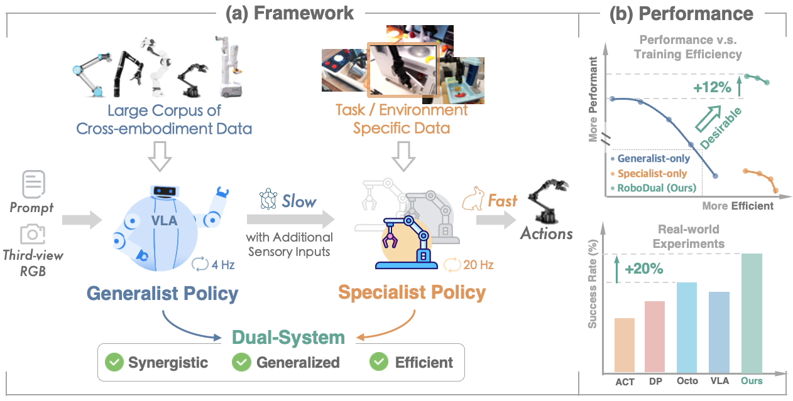
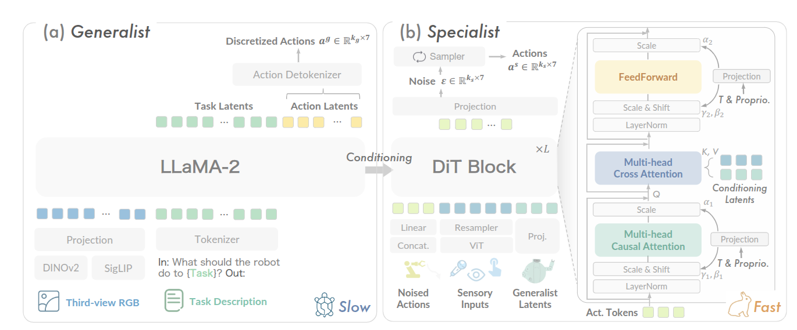

> Paper： https://link.zhihu.com/?target=https%3A//arxiv.org/abs/2410.08001
>
> Code: https://github.com/OpenDriveLab/RoboDual

## 摘要

对在不同和动态环境中操作的通用机器人系统的日益增长的需求强调了通才（generalist）策略的重要性，该策略利用大型跨实施例数据语料库来促进广泛的适应性和高级推理。然而，多面手将与低效的推理和昂贵的培训作斗争。相反，专家策略是针对特定领域数据制定的，在任务级精度和效率方面表现出色。然而，它缺乏广泛应用的推广能力。受这些观察的启发，我们引入了 RoboDual，一个协同的双系统，补充了通才和专家政策的优点。一个基于扩散变压器的专家被设计用于多步动作展开，精致地以基于 VLA 的多面手的高级任务理解和离散化动作输出为条件。与 OpenVLA 相比，RoboDual 通过引入仅具有 **20M** 可训练参数的专家策略，在现实世界设置中实现了 26.7% 的改进，在 CALVIN 上实现了 12% 的增益。它仅使用 5% 的演示数据就能保持强劲的性能，并在实际部署中实现 3.8 倍的控制频率。代码将向公众开放。

## 引言

几十年来，追求多功能且适应性强的机器人智能一直是机器人学领域的一个核心目标。传统的机器人学习方法通常通过为指定机器人及其特定任务精心策划的数据集来开发策略。所得策略可被视为专家策略，包括流行的 ACT 和 Diffusion Policy。这些**策略在特定场景和任务中表现出高精度，但往往泛化能力有限**。随着机器人越来越多地被应用于开放式和多任务环境中，对能够处理多种任务并在不同实体间无缝适应的系统的需求激增。这推动了通用型机器人的发展，如 RT-2 和 Octo。它们**利用广泛且异构的数据集来增强跨域泛化能力**，并旨在将网络知识迁移到机器人控制中。最近，VLA 方法的进步展示了通用型策略满足不断变化需求的潜力。VLA 整合了庞大的跨实体数据与预训练的大型（视觉 -）语言模型，促进了常识推理和指令遵循等能力。

虽然基于 VLA 的通用型机器人在跨场景的知识迁移和泛化方面表现出色，但仍存在几个局限性：

1. 它们无法直接部署到新的实体或环境中，而无需进行适应。与专家策略相比，微调过程需要更多的数据和训练资源。
2. 尽管 VLA 擅长高级决策，但其大型模型特性导致推理延迟极高。这一关键瓶颈使其不适合在动态环境中进行精细控制。
3. 当前的通用型模型仅支持单帧 RGB 观测，虽然这能够在大规模数据集上进行训练，但在需要额外感官输入（如深度或触觉反馈）发挥关键作用的任务中，限制了其有效性。同时，融入这些额外模态需要资源密集型的重新训练，并存在灾难性遗忘的风险。

通用型模型提供了广泛的泛化能力，并受益于网络规模的预训练，而专家策略则在效率和快速适应特定任务方面表现出色。基于这些见解，我们提出了一个通用且高效的框架，其中两种策略相辅相成，以提高操作能力，如图 1（a）所示。我们的工作引入了一种新颖的双系统协同方法，即 RoboDual。它旨在利用双方的优势，并促进大型通用型策略的实际部署。

我们从大规模预训练的 OpenVLA 开始，建立我们的通用型策略。为实现两个模型之间的无缝合作，我们将专家模型实现为一个轻量级且可扩展的扩散变换器策略。专家通过学习任何感官输入和通用型输出的多模态动作分布，通过统一的条件机制进行自适应。来自通用型模型的潜在表示和离散化动作输出使专家能够高效地适应新任务或环境，同时最大限度地减少数据和训练成本。在推理过程中，通用型模型提供有意但相对较慢的条件，支持快速反应专家的多步展开，以实现精确且泛化的控制。通过这种方式，RoboDual 结合了通用型模型的**高级任务理解和泛化能力**，以及专家策略的**高效动作优化**，在各种任务中均表现出色。

总计一下：

1. 传统专家系统精度高但是泛化弱，并且数据与场景绑定；
2. 通用系统兴起，有效利用 VLM 的先验知识如高级任务理解和泛化能力，但是微调资源多，推理延迟高，模态单一，目前仅有 RGB 和文字。

**贡献**

- 提出了一种新颖的方法，将通用型和专家策略整合到一个协同框架中，利用了双方的优点，并为 VLA 模型的实际应用铺平了道路。
- 提出了一种基于扩散变换器的专家策略，该策略能够**实现实时控制**，并根据通用型输出和各种感官输入进行自适应调节。该框架促进了不同模态的灵活集成，并允许从训练数据的角度对两个模型进行解构，从而增强了它们的各自优势和功能。
- 通过大量的现实世界和模拟实验证明，双系统方法在各种任务中均优于仅使用专家或通用型模型的方案。

##架构

基于 OpenVLA，专家系统使用 DiTBlock，额外输入加噪的 action，传感器输入，以及专家系统的 latents
