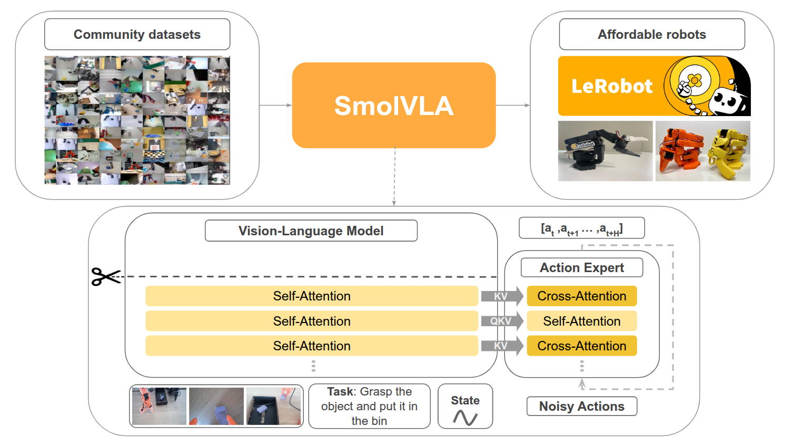
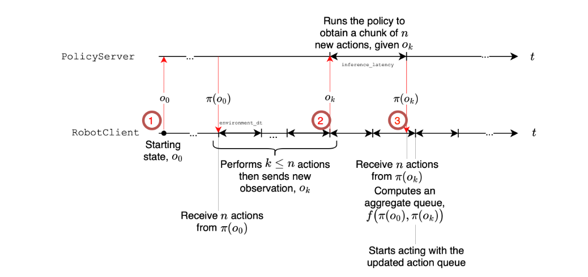
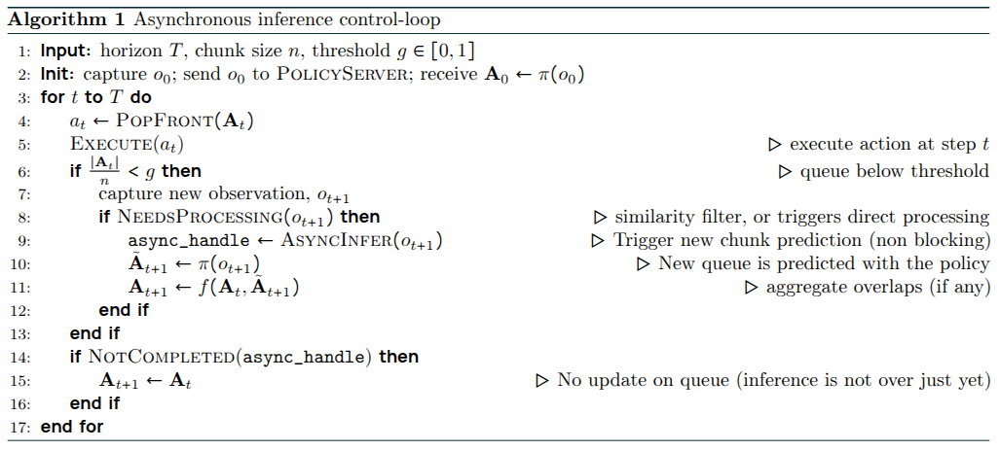
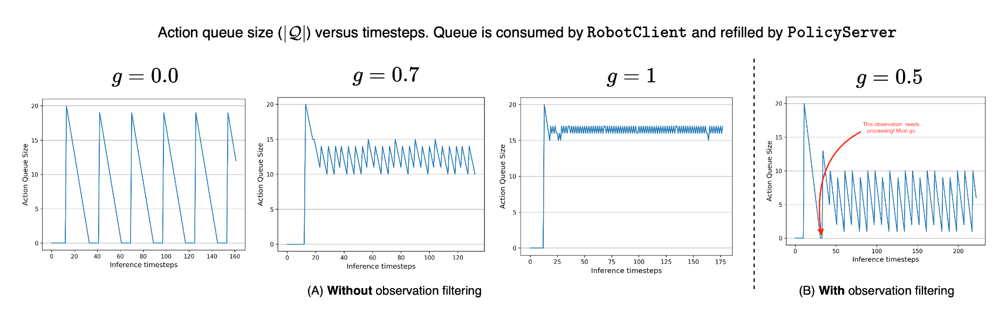

> Paper: [SmolVLA: A Vision-Language-Action Model for Affordable and Efficient Robotics](https://arxiv.org/abs/2506.01844)
>
> Code: https://github.com/huggingface/lerobot

## Abstract

最近的方法将 VLMs 适应为视觉 - 语言 - 行动（VLA）模型，从而实现自然语言驱动的感知和控制。

1. 现有的 VLA 通常规模庞大——常常拥有数十亿参数——这导致训练成本高昂且在现实世界中的可部署性有限。
2. 依赖于学术界和工业界的数据集，却忽视了来自价格实惠的机器人平台的社区收集数据的日益增长的可用性。

提出了 SmolVLA，这是一种小型、高效且由社区驱动的 VLA，极大地降低了训练和推理成本，同时保持了具有竞争力的性能。

SmolVLA 被设计为可以在单个 GPU 上进行训练，并在消费级 GPU 甚至 CPU 上进行部署。为了进一步提高响应能力，引入了一个异步推理堆栈，将感知和行动预测与行动执行解耦，从而通过分块行动生成实现更高的控制率。尽管尺寸紧凑，但 SmolVLA 实现了与比其大 10× 的 VLA 相当的性能。

## Introduction

VLM 尽管在数字世界取得了显著成就，但基础模型在现实世界的应用——特别是在机器人技术中——仍然有限。具体来说，机器人策略在泛化到不同物体类型、位置、环境和任务方面仍面临挑战。机器人应该能够适应新的环境和新的物体，这需要强大的技能和对世界的常识性理解。然而，这一方向的进展似乎**常常受到高质量和多样化数据可用性的限制**。

为了克服这一限制，越来越多的研究开始探索以视觉 - 语言 - 行动（VLA）模型形式存在的机器人基础模型。VLA 模型旨在整合预训练的大语言模型和视觉 - 语言模型中嵌入的抽象推理、世界知识和决策技能。这些模型接收多模态输入——例如视觉观察和自然语言指令——并预测相应的机器人动作。早期结果表明，这些模型在泛化能力方面取得了有希望的提升。

SmolVLA 是一个开源项目，它包含一个紧凑但功能强大的 VLA 模型，并附带可复现且高效的训练和推理配方：

  - **轻量化架构** ：SmolVLA 是一个紧凑且高效的视觉 - 语言代理，针对在消费级 GPU 上进行训练和在 CPU 上进行部署进行了优化。关键设计选择包括
    1. 在 VLM 中跳过层
    2. 使用最少数量的视觉标记
    3. 利用小型预训练 VLM，
    4. 交替使用自注意力层和更轻的交叉注意力层。

  - **在社区驱动的数据集上进行预训练** ：SmolVLA 完全在公开可用的、社区贡献的数据集上进行端到端训练，仅使用不到 30k 个剧集，展示了强大的性能，同时使用的数据量比现有技术少了一个数量级。

  - **异步推理** ：优化的异步推理堆栈，将动作执行与观察处理和动作预测解耦，减少了延迟，并实现了快速、高效的推理。

## Related work

机器人研究中一个日益受到关注的领域是开发通用策略——能够在不同环境中执行广泛任务并在不同机器人形态中泛化的模型。一个突出的策略是利用 VLAs，这些模型能够处理

1. 以自然语言给出的任务指令
2. 视觉观察（例如来自摄像头流的图像）
3. 本体感知输入以输出控制动作。

早期的努力，如 Octo 和 RT-1，在大规模机器人演示数据集上从头开始训练基于 Transformer 的模型。为了提高性能和泛化能力，RT-2 利用预训练的 VLMs，并在特定于机器人的数据上进一步训练它们。为了促进开放性和可复现性，OpenVLA 发布了一个 70 亿参数的 VLA，该模型在公开可用的数据上进行训练，以生成离散的动作标记。由于动作标记化对连续控制存在限制，π0 和 DexVLA 提出使用基于扩散的解码器进行连续动作生成。这两种方法都对预训练的 VLM RDT-1B 进行适应，引入了一个大型扩散组件——称为动作专家——直接在机器人演示上进行训练。最近，Pertsch 等人（Fast: Efficient action tokenization for vision-language-action models）提出了一种全新的自回归方法，使用一种新颖的动作标记器，虽然这种方法优于传统的分箱方法（OpenVLA），但仍受到缓慢（自回归）推理的限制。为了提高 VLA 的效率，TinyVLA 从头开始在多模态数据上训练了一个轻量级的不到 10 亿参数的模型，然后在机器人数据集上对其进行微调，尽管缺乏在机器人数据上的大规模预训练限制了其更广泛的泛化能力。SmolVLA 与这些努力中的大多数有着类似的目标，旨在开发并发布开源模型，这些模型在训练和推理方面既高效又具有高性能。

## SmolVLA: small, efficient and capable

### Model architecture

采用了 VLM+diffusion action experts 的架构，与 pi0 类似。

VLM 采用 SmolVLM-2，这是一个针对多图像和视频输入进行了优化的高效模型，视觉编码器为 SigLIP ，在 SmolVLA 通过一种令牌洗牌技术减少令牌数量以提高效率（应该就是叠进通道）。使用线性层将感知运动状态投影为**一个单独的 token**。最后，视觉、语言和状态令牌被拼接并传递给语言解码器。通过解码器层获得的结果随后用于调节动作专家。

SmolVLM-2 通过图像分块技术进行训练，对同一图像的多个裁剪区域以及全局图像进行处理。为了获得更快的推理时间，SmolVLA 没有使用分块。用全局图像，并结合像素洗牌操作，将每帧的视觉 token 限制为 64 个。

为了获得更快的推理时间，在 VLM 中跳过了某些计算。先前的研究（Skipping computations in multimodal llms, Dynamic early exiting for accelerating unified vision language model）已经证明了在预训练模型中跳过某些层并不会导致性能显著下降。最近，一些工作（Scalable pre-training of large autoregressive image models,The best visual embeddings are not at the output of the network,An empirical study of autoregressive pre-training from videos.An empirical study of autoregressive pre-training from videos.）表明，用于下游任务的最佳特征并不一定来自 VLM 的最后一层。因此，SmolVLA 并没有使用最后一层的特征，而是让动作专家能够访问到指定层 N 之前的所有特征。在实践中，发现将 N 设置为总层数的一半（N=L/2）可以在速度和性能之间取得良好的平衡，有效地将 LLM 和动作专家的计算成本减半。

动作专家 $v_{\theta}$ 被训练用于从 VLM 特征中预测一个动作块 $A_t = (a_t, \ldots, a_{t+n})$。与先前的研究一致，对 $v_{\theta}$ 的实现依赖于 Transformer 架构。不同的是，交错使用交叉注意力层和自注意力层，因此使用条件流匹配 Transformer 作为 $v_{\theta}$。动作专家的训练目标由以下公式定义：

$$
L_{\tau}(\theta) = \mathbb{E}_{p(A_t|o_t), q(A_{\tau}^t|A_t)} \left[ \| v_{\theta}(A_{\tau}^t, o_t) - u(A_{\tau}^t|A_t) \|_2 \right],
$$

其中 $o_t$ 表示从第 $N$ 层 VLM 提取的观察特征 $o_t$，而 $A_{\tau}^t = \tau A_t + (1 - \tau)\epsilon$，其中 $\epsilon \sim \mathcal{N}(0, I)$。具体来说，$v_{\theta}$ 被训练用于从 VLM 特征和带噪声的动作 $A_{\tau}^t$ 输出向量场 $u(A_{\tau}^t|A_t) = \epsilon - A_t$（也就是动作所带的噪声）。与 pi0 等一致，从 Beta 分布中采样 $\tau$。为了提高推理效率，将 $v_{\theta}$ 的隐藏层大小减少到 $0.75 \times d$，其中 $d$ 是 VLM 的隐藏层维度。

每个 block 包含一个 CA (Cross Attention) 层或一个 SA 层。CA 层对 VLM 的键和值进行交叉注意力，而 SA 层允许 $v_{\theta}$ 中的动作令牌相互注意。 SA 层使用因果注意力掩码，确保每个动作令牌只能注意块内的过去令牌，防止对未来的动作依赖。经验表明，交错使用 CA 和 SA 层可以提供更高的成功率和更快的推理时间。特别是，本文发现自注意力有助于生成更平滑的动作块 $A$，在对真实机器人进行评估时这一点尤为明显。

### Pretraining data collected by the community

机器人数据集的整合和规模化则显得复杂，原因在于：

1. 数据集之间的差异；2
2. 依赖人类专家进行遥操作来收集数据。此外，机器人形态、传感器、驱动模式、控制频率和数据格式的高度异质性导致了“数据孤岛”（groot-n1 里提到的）——这些分散的机器人数据集难以整合。

在这种背景下，低端机器人平台和标准化机器人库的出现直接缓解了这种数据异质性，这些数据集是在多样化的现实环境中收集的——从学术实验室到家庭。与遵循标准化协议的学术数据集不同，社区数据集自然涵盖了各种机器人实体、控制方案、相机视角和任务。此外，社区数据集通过嘈杂的演示、异质环境和多样化的物体交互反映了现实世界的复杂性，作为预训练数据具有很高的价值。本工作从 Hugging Face 获得了 481 个社区数据集的子集，根据机器人实体类型、剧集（episodes）数量（22.9K）、整体数据质量和帧覆盖范围 (10.6M) 进行了筛选。

依赖社区贡献的数据集带来了**标准化方面的挑战**。任务注释中存在大量噪声——这些注释是**对给定数据集中机器人预期行为的自然语言描述**。关键问题是，许多数据集包含了模糊的占位符，例如“任务描述”，过于笼统的指令，如“拿起”或“向上”，或者根本没有提供任何指令。为了提高注释质量，使用视觉语言模型（Qwen2.5-VL-3B-Instruct）来自动生成简洁的任务描述。对于每个数据集，抽取具有代表性的帧，并将它们与原始指令一起提供给模型。模型被提示生成一个简短的、以动作为导向的句子，概括机器人的行为。

另一个挑战是相机命名约定的高度变异性。例如，不同数据集中的 `images.laptop` 可能指代顶部、侧面或手腕安装的视角，具体取决于特定情况。我们发现这种不一致性对预训练是有害的，而在这个数据环境下，保持一致的相机顺序对训练是有益的。因此手动将每个相机映射到一个标准化的视角类型——优先考虑顶部、手腕和侧面视角——并将它们分别重命名为 `OBS_IMAGE_1`、`OBS_IMAGE_2` 和 `OBS_IMAGE_3`。对于包含额外视角的数据集，顺序得以保留，但在训练过程中未使用的视角被丢弃。未来的工作可能会利用 VLMs 自动化这一过程，或者提出/采用标准化的数据收集指南。

### Asynchronous inference

现代视觉运动策略输出动作块 (action chunks)——序列 $\pi(o_t) = A_t$，其中 $A_t = (a_t, a_{t+1}, \ldots, a_{t+n})$ 是一个包含 $n$ 个（远大于 1）低级命令的序列，这些命令被排队到动作队列中，源自环境观察 $o_t$。

通常情况下，机器人会在将新的观察 $o_{t+n}$ 传递给策略 $\pi$ 以预测下一个块之前，执行整个动作块 $A_t$。这导致了在每 $n$ 个时间步捕获的观察之间进行**开环推理**。另一种策略是机器人控制器交错执行动作块预测 $A_t \leftarrow \pi(o_t)$ 和动作块消费 $a_t \leftarrow \text{PopFront}(A_t)$，在每个时间步 $t$ 计算一个新的动作块，并在重叠部分聚合预测的动作块。尽管这种方法是自适应的——每个时间步的观察 $o_t$ 都会被处理——但这些方法依赖于持续运行推理，这在资源受限的场景中（如边缘部署）可能是不可行的。（消耗算力）

一种资源消耗较少的方法是在预测新的动作块之前完全耗尽当前的动作块 $A$，称这种策略为**同步（sync）推理**。此外，同步推理每 $n$ 个时间步高效地分配计算资源，从而在控制时减少了平均计算负担。然而，它本质上阻碍了机器人系统的响应能力，因为机器人在计算 $A$ 时处于空闲状态，从而引入了**盲滞后**。

通过将动作块预测 $A$ 与动作执行 $a_t \leftarrow \text{PopFront}(A_t)$ 解耦，直接评估机器人系统由于开环操作而缺乏适应性，以及运行时存在滞后的问题。

开发了一个**异步（async）推理栈**，其中机器人客户端（RobotClient）将观察 $o_t$ 发送给策略服务器（PolicyServer），一旦推理完成，就会收到一个动作块 $A_t$。通过在控制循环仍在消耗先前可用的队列时触发块预测，并在新队列可用时将其与新队列聚合，避免了执行滞后。反过来，异步推理通过增加处理观察以进行块预测的频率，紧密了动作预测与动作执行之间的循环。至关重要的是，将动作预测与动作执行解耦也直接允许在远程策略服务器上分配更多的计算资源，该服务器通过网络向机器人客户端发送动作，这在资源受限的情景中（如低功耗机器人）可能非常有效。

流程如下：

1. 初始化，最大时间步 T，动作快大小 n，阈值 g，范围从零到一。机器人发送观测进行推理，得到动作块（队列）
2. 在 T 个时间步内循环，得到最近的动作并执行，如果 $\frac{|A_{t}|}{n} < g$，（剩余动作数量不足时，g 为 0 就是同步）获取新的观测，并判断是否需要处理（就是为了避免冗余的推理，该观察会在关节空间中比较，若和之前的重复，即二者距离小于某个阈值，则丢弃），若需要则得到新的动作块之后入队
3. 若是没有完成推理则仍然使用之前时间步预测的动作队列

异步推理

1. 通过更频繁地捕获观察来紧密控制循环，直接消除了运行时的空闲间隔，
2. 直接允许在比自主机器人平台上通常可用的更强大的计算资源上运行推理。（就是解耦推理和 zhi xign）

:::tip 阈值 g 的确定

有趣的是，异步推理的行为可以通过分析进行研究。首先，设 $\ell$ 是一个随机变量，用于模拟在发送观察 $o$ 之后接收动作块 $A$ 所需的时间，即

1. 在机器人客户端和策略服务器之间发送观察 $o$ 所需的时间 $t_{C\rightarrow S}$
2. 策略服务器上的推理延迟 $\ell_S$
3. 在策略服务器和机器人客户端之间发送 $A$ 所需的时间 $t_{S\rightarrow C}$。

假设它们相互独立，那么 $E[\ell] = E[t_{C\rightarrow S}] + E[\ell_S] + E[t_{S\rightarrow C}]$，这可以进一步简化为 $E[\ell] \approx E[\ell_S]$（假设通信时间在两个方向上相等，且与推理延迟相比可以忽略不计）其次，设 $\Delta t$ 为环境的控制周期。以实际的帧率为每秒 30 帧为例，$\Delta t = 33\text{ms}$。因此，为了避免运行时队列耗尽——即在等待新的动作块时处于空闲状态——阈值 $g$ 应满足 $g \geq E[\ell_S]/\Delta t \times n$。在这个场景中，队列阈值 $g$ 对于机器人客户端动作的可用性起着关键作用。

:::

## Experiments

主要收集了一些数据，模拟环境的指标为成功率，成功为 1，失败为 0，真实世界则使用更细致的评分，如抓取放置任务，成功抓取立方体得 0.5 分，正确将其放置到目标容器中再得 0.5 分。
