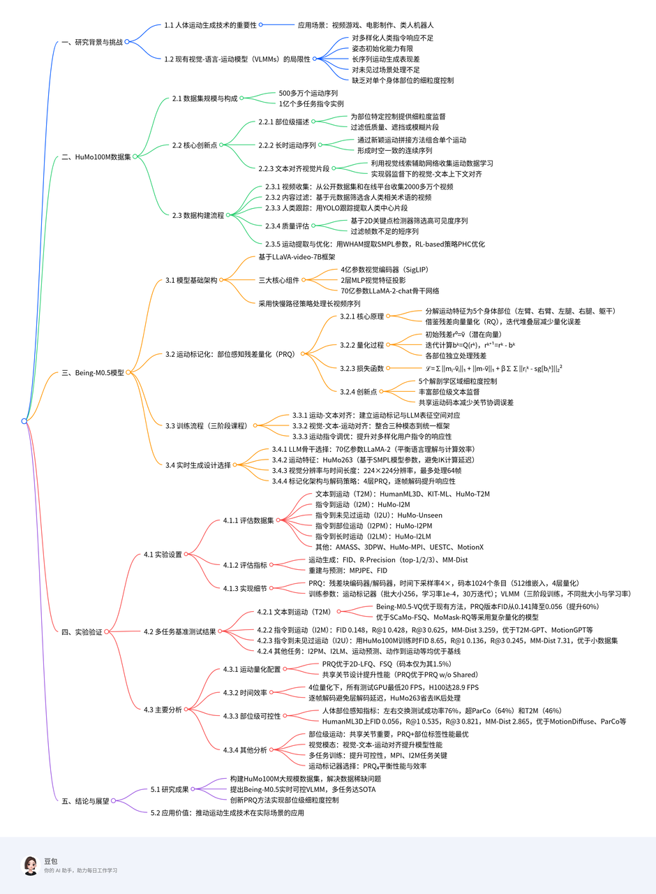
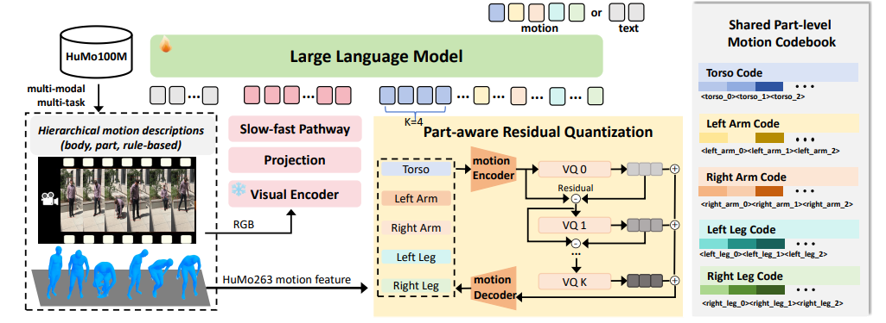
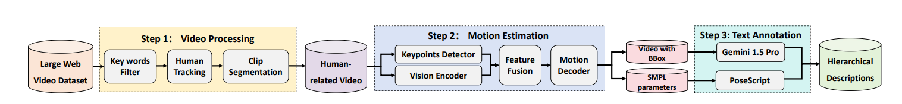

:::info
“可控性”

1. 对多样化人类指令响应不足
 2. 姿态初始化能力有限
 3. 长时序列性能差
 4. 对未见场景处理不充分
5. 缺乏对各个身体部位的细粒度控制。

HuMo100M，迄今为止规模最大、最全面的人体动作数据集，包含 500 余万条自主采集的动作序列、1 亿条多任务指令实例，以及详细的部位级标注，弥补了现有数据集的关键空白。

 提出一种新颖的“部位感知残差量化”动作标记化技术，可在生成过程中对单个身体部位实现精准、细粒度的控制。
  https://arxiv.org/pdf/2508.07863
 https://beingbeyond.github.io/Being-M0.5
中科院自动化所
:::

## 介绍

HuMo100M——迄今最大的动作生成数据集，包含 500 余万条动作序列和 1 亿条跨任务的指令实例。

1. 部位级描述：为各身体部位提供细粒度监督，实现精确对齐，并过滤低质量、遮挡或模糊片段，提升数据可靠性；
2. 长时动作序列：通过新颖的动作拼接方法，将单个动作组合成时空一致的连续序列，使 VLMM 能够生成超越短时片段的真实长时动作；
3. 文本对齐视觉片段：不同于以往方法，我们利用视觉线索对网络采集的动作尤为重要，通过视觉-文本上下文对齐让 VLMM 在动作数据质量欠佳时仍能进行弱监督学习。

## 相关工作

### 人体动作生成

人体动作生成通常依据所采用的控制信号进行分类

- 文本描述
- 动作标签
- 关键帧姿态
- 不完整动作片段。

1. 早期的确定性文本到动作（T2M）方法往往产生模糊或不真实的结果 ；
2. 随后引入 VAE 与 GAN 等随机技术来缓解这一问题。
3. 近年来
   1. MotionGPT 等代表性工作将大语言模型（LLM）融入动作生成，以更好理解人类意图并生成更贴合语境的动作；
   2. MotionChain 进一步支持多轮对话式动作生成；
   3. MotionLLM 则提供了统一的动作理解、字幕生成与推理框架。
   4. LMM 以及近期多模态方法探索了以人为中心的视频理解，以增强动作生成能力。

尽管取得诸多进展，现有研究往往忽视动作生成可控性的关键环节，且难以在模型性能与计算效率之间取得平衡，特别是在实时应用场景。

### 动作标记化

**高效的动作表征是高质量生成的关键**

1. 向量量化（VQ）为鲁棒的人体动作编码奠定了基石。
2. 用于迭代细化的残差量化（RQ）
3. 多尺度表征的层级量化（HQ）
4. 高效的无查找量化（LFQ）
5. 增强表达力的有限标量量化（FSQ）。

同时，学界开始探索部位级动作标记化以实现更细粒度的控制：

1. 部分方法将身体划分为上下两段
2. 另一些则聚焦身体与手部等特定部位。

这些方法普遍缺乏对四肢的独立控制能力，也缺少相应的文本标注与评估基准。

## 方法

Being-M0.5（7B），在 500 万条人体动作序列和 1 亿条动作指令实例上训练。

### 模型

基于 LLaVA-video-7B 框架。

1. 4 亿参数视觉编码器（SigLIP）；
2. 2 层 MLP 用于视觉特征投影；
3. 70 亿参数的 LLaMA-2-chat 主干。

采用“慢-快”策略高效处理长视频序列。

模型将人体动作视为一种结构化语言，拥有自身的“词汇”与“语法”。给定动作序列 $m₁:T$，其中 $mᵢ ∈ ℝᴰ$ 表示 D 维动作特征向量，$T$ 为序列长度，我们使用动作标记器 $Q$

 将连续动作数据量化为离散 token。

- 在基础 VLM 词表中新增 K 个动作专用码；
- 引入特殊边界 token \<MOT\> 与 \</MOT\> 以界定文本中的动作序列范围。

每条训练样本均遵循指令跟随格式 $\{XQ, XA\}$，表示用户-VLMM 对话对。我们从网络视频中整理成对的、交错的视觉、语言与动作数据，支持文本到动作生成、动作预测、多模态动作理解等多样任务。给定查询 XQ，VLMM 生成响应 $XA = {y₁, y₂, …, yₙ}$，其中每个 $y_i$ 可以是文本 token 或动作码。

训练采用三阶段：

1. 动作-文本对齐：将动作 token 映射到 LLM 表征空间；
2. 视觉-文本-动作对齐：把三种模态整合进统一框架；
3. 动作指令微调：提升模型对多样化用户指令的响应性与可控性。

### 可控动作生成

从五个维度定义“可控性”，并通过系统化数据策划与专项指令任务设计来培养这些能力。

1. 随机指令控制：现有 VLMM 处理任意用户指令的能力有限，难以落地。通过构建大规模指令模板库（如“请演示 \<CAPTION\> 动作”，\<CAPTION\> 为动作描述）并引入 Instruct-to-Motion（I2M）任务，显著提升指令响应性。
2. 随机姿态初始化控制：实用 VLMM 应能从任意初始姿态生成连贯动作，而非局限于 T-pose 等固定配置。由于训练数据多样性不足，当前模型在此表现欠佳。我们设计 Motion Prediction and In-between（MPI）任务：随机从动作序列中抽取前段、中段或后段，让模型补全其余部分。实现该任务需百万级数据，这促使我们构建 HuMo100M。
3. 长时动作控制：人类活动通常表现为连续、无缝的长序列。实用 VLMM 也应能生成扩展动作，而非孤立片段。利用 HuMo100M 中的拼接长序列，提出 Instruct-to-LongMotion（I2LM）任务，实现时序一致的长动作生成。
4. 未见动作控制：现有数据集规模不足以确保对训练中未见的新动作模式稳健泛化。我们通过大规模网络视频采集与多任务训练设计扩大数据覆盖。凭借 HuMo100M 前所未有的规模（数百万动作实例），模型在未见动作上表现出强泛化能力。引入 Instruct-to-Unseen（I2U）任务系统评估该泛化性能。
5. 随机部位控制：高阶 VLMM 应能对特定解剖区域进行精确控制（如“用左腿踢”或“挥右手”）。先前方法因缺乏部位级监督而难以实现，即使采用部位感知编码器也无济于事。借助 HuMo100M 的详尽部位级标注，提出 Instruct-to-PartMotion（I2PM）任务，要求模型在保持整体动作连贯与真实的前提下，生成指定身体部位的动作。

## 数据构建

1. **视频收集与初步过滤**：首先从公开数据集与在线平台收集超过 2000 万条视频，通过分析视频元数据，筛选出文本描述中包含“人（people）”“人类（human）”“个人（person）”等人类相关术语的内容，初步排除无关视频，实现大规模数据的快速筛选。
2. **人类跟踪与片段提取**：针对初步筛选后的视频，采用 YOLO 目标跟踪算法对视频中的每个人进行全程监测，精准识别并提取以人类为核心的视频片段；随后根据跟踪结果对视频进行分割，确保提取的运动数据是连续、时空一致的人类活动序列，避免碎片化或中断的运动片段混入。
3. **质量评估与过滤**：为解决实际视频中常见的遮挡、运动模糊及短序列信息不足问题，设计双重质量评估机制：

   - 基于预训练 2D 关键点检测器提取人体骨骼标记点，以高置信度关键点的数量为核心指标，过滤可见关键点数量低于预设阈值的高遮挡序列；
   - 通过序列长度过滤机制，移除帧数不足的短序列，确保保留的运动数据具备充足的时间上下文，保障运动分析与生成的可靠性。

4. **运动提取与优化**：使用 WHAM 算法从高质量视频片段中回归世界坐标系下的准确 3D 人体运动（即 SMPL 模型参数），作为数据集的基础运动表征；最后采用基于强化学习（RL）的策略 PHC 对运动质量进行优化，进一步提升数据精度。

相较于 HumanML3D、MotionX 等现有运动数据集，HuMo100M 在支撑可控运动生成方面具备三大独特优势，有效弥补了现有数据集的关键短板：

- **结构化部位标注**：将人体分为上半身（手臂、肩膀、躯干）与下半身（腿部、臀部、脚部），针对每个部位生成详细运动描述，例如“左臂上举指向周围”“右腿向前伸展”；
- **多来源标注增强**：通过 Gemini-1.5-Pro 大模型（结合精心设计的提示词）生成语义准确的部位描述，并整合 PoseScript 工具提升标注语义一致性；同时引入基于姿态编码的规则化描述，捕捉关节间的空间关系（如“左手位于右手下方”“右脚在左膝前方伸展”），为 VLMM 提供细粒度部位控制所需的监督信号。
- **Interpolation-based Concatenation**：通过三阶段对齐实现无缝拼接——先统一运动序列的方向（ orientation alignment ），再进行全局坐标平移对齐（ global coordinate alignment ），最后以中立站姿为参考，采用球面线性插值（ Slerp ）在序列间生成平滑过渡，确保角色在不同动作间回归标准姿态，兼顾连续性与物理合理性；
- **Learning-based Concatenation**：训练专门的“中间运动预测模型”，通过在训练中遮挡约 50% 的运动序列、让模型学习运动补全，实现不同运动序列间的上下文适配过渡；实际应用中，先通过插值法生成初始关键帧衔接序列，再由学习模型优化过渡效果，结合规则化方法的可靠性与数据驱动方法的适应性。
- 对于从网络视频中提取的噪声或不完整运动数据，VLMM 可通过文本对齐的视觉片段获取弱监督信号——利用视觉模态包含的环境、物体交互、运动动态等上下文信息，补偿运动估计误差，提升对运动的理解能力；
- 作为统一多模态框架，视觉片段的引入使 VLMM 能直接从视频输入中执行运动估计任务，模仿观察到的人类动作，突破传统“文本驱动运动生成”的局限，拓展模型在实际场景中的应用范围（如视频动作模仿）。

## 实验

- 文本到运动（T2M）：首先在两个经典基准上进行评测：HumanML3D（14,616 段动作，44,970 条文本描述）和 KIT-ML（3,911 段动作，6,278 条描述）。二者均采用 80 % 训练 / 5 % 验证 / 15 % 测试的划分方式。此外，我们从 HuMo100M 中采样 200,000 组高质量动作-文本对，构建大规模测试集 HuMo-T2M，以覆盖比传统基准更丰富的场景。
- 指令到运动（I2M）：基于 HuMo100M 构建包含一百万组高质量动作-指令对的综合基准 HuMo-I2M，并保持 80 %/5 %/15 % 的划分比例，用于评估模型对多样化自然语言指令的遵循能力。
- 指令到未见动作（I2U）：为了测试泛化能力，从 HuMo100M 中精选 200,000 段在训练阶段从未出现的新颖动作序列，构建 HuMo-Unseen，以严格评估模型生成全新动作模式的能力。
- 指令到部分动作（I2PM）：提出专门用于局部控制评估的 HuMo-I2PM 基准，包含 200,000 条带精细解剖区域标注的实例（150,000 测试、50,000 验证），重点评测模型对细粒度身体部位的控制能力。
- 指令到长序列运动（I2LM）：为评估长序列生成，利用提出的拼接方法构建 HuMo-I2LM，共 500,000 段拼接后的运动序列，并遵循标准划分比例，重点考察时间一致性与长期运动连贯性。
- 运动预测与插值（MPI）：在标准 AMASS 与 3DPW 之外，我们从 HuMo100M 中提取 200,000 条样本构建 HuMo-MPI。聚焦六个解剖区域（脊柱、手臂、腿部、头部），并排除全局平移与面部表情。
- 动作到运动：采用 UESTC 数据集，遵循上述协议进行以动作为条件的运动生成评估。
- 运动重建：在 HumanML3D、MotionX和 HuMo100M 三个数据集上评测重建能力，以评估模型在运动编码与解码上的质量。
- 运动到文本：使用 HumanML3D 基准评估运动字幕生成能力，考察模型根据运动序列生成描述性文本的表现。
