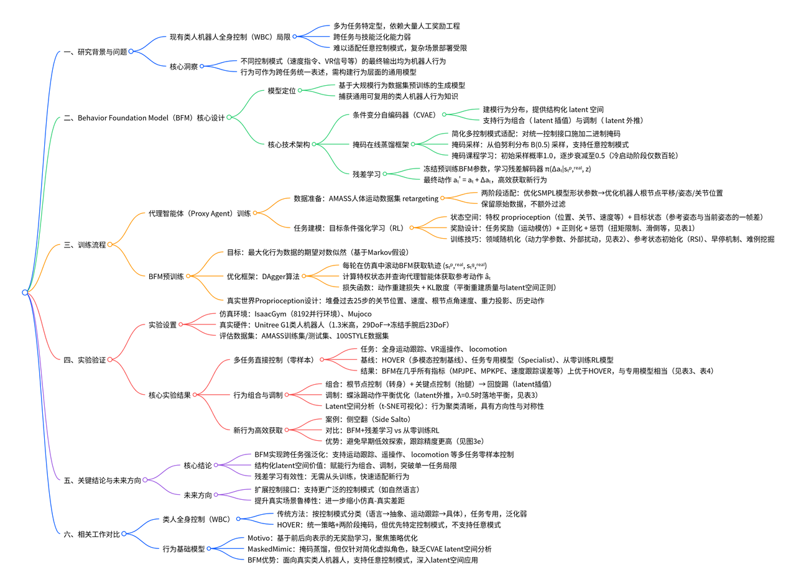
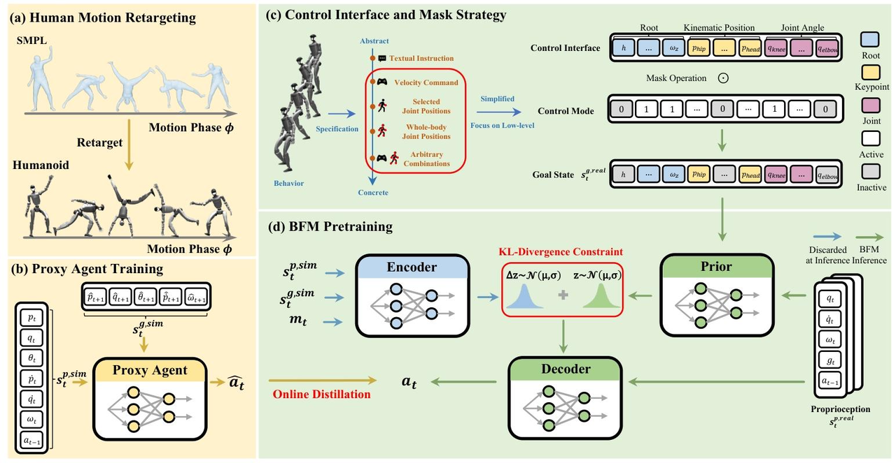
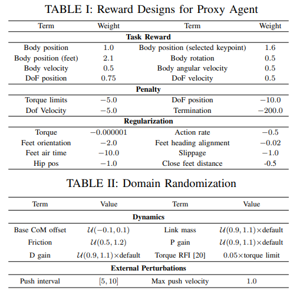
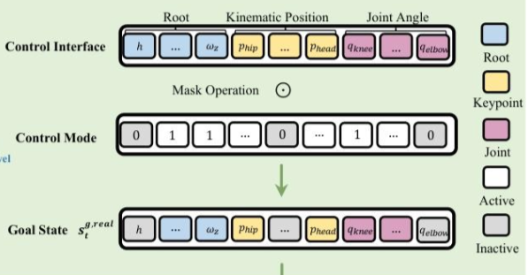
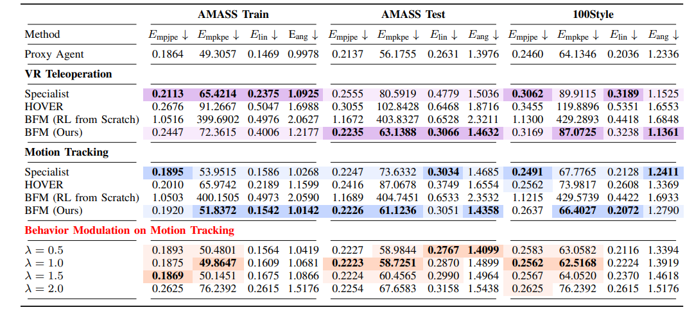
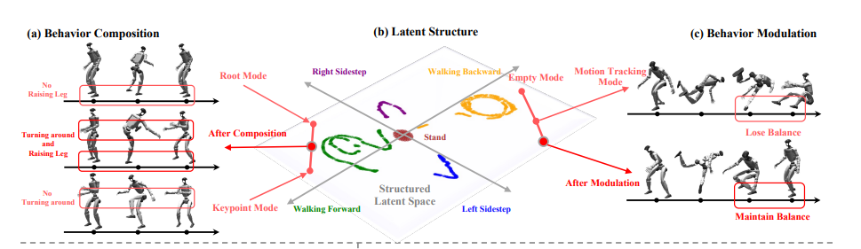
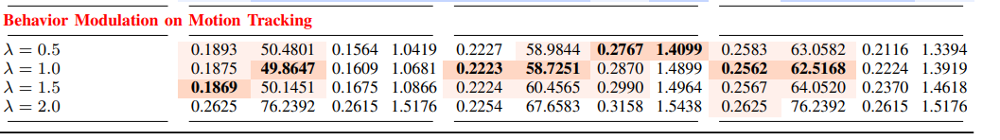

:::info

北大、港大、交大

https://arxiv.org/pdf/2509.13780

https://bfm4humanoid.github.io/

现有的WBC框架仍然大多针对特定任务，严重依赖劳动密集型的奖励工程，并且在任务和技能的泛化能力上表现出有限性。

提出了行为基础模型（BFM），这是一种在大规模行为数据集上预训练的生成模型，用于捕捉人形机器人的广泛可重用行为知识。

BFM结合了掩码在线蒸馏框架和条件变分自编码器（CVAE），以建模行为分布，从而能够在任意控制模式下灵活运行，并且无需从头开始重新训练即可高效地获取新行为。

:::

# 行为基础模型

强化学习领域的最新进展催生了行为基础模型（BFM），这类模型具备多样化行为生成能力，且在不同任务间具有较强的泛化性。现有研究已从不同视角实现了行为基础模型。

1. Motivo及其系列研究采用前后向表示法，在无奖励的状态转移过程中实现无监督学习，从而为各类任务的零样本推理提供接近最优的策略。
2. MaskedMimic与HOVER则采用在线掩码蒸馏技术训练目标条件策略，这同样能实现跨任务、跨场景的零样本泛化。

本文提出的框架从后一类研究中汲取灵感，但在关键方面存在差异

1. HOVER的两阶段掩码策略仍优先考虑特定控制模式，而本文的BFM通过直接应用稀疏掩码即可支持任意控制模式
2. MaskedMimic聚焦于简化的虚拟角色，且未通过隐空间分析阐明条件变分自编码器（CVAE）相较于其他生成模型的优势，而本文的BFM以真实世界类人机器人为目标，揭示了隐空间在行为组合、行为调制等应用场景下的特性。

# 方法

# 代理智能体训练

## 强化学习框架下的行为定义

将类人机器人控制问题构建为目标条件强化学习（RL）任务，其中策略$\pi$的训练目标是实现特定任务目标。

1. 状态$s_t$包含类人机器人的本体感知信息$s_t^p$与目标状态$s_t^g$。
2. 定义奖励函数$r_t = R(s_t^p, s_t^g)$，用于策略优化。
3. 动作$a_t$代表类人机器人的目标关节位置，该位置信息随后会输入PD控制器，以驱动机器人的自由度运动。
4. 采用PPO，以最大化累积奖励$E[\sum_{t=1}^{T}\gamma^{t-1}r_t]$。

将“行为”定义为类人机器人本体感知状态与动作的轨迹序列，排除了与任务相关的目标状态$s_t^g$。

为区分真实场景部署中可观测的状态与仿真环境中的特权状态，用$s_t^{p,sim}$和$s_t^{g,sim}$表示仿真环境中的特权状态，用$s_t^{p,real}$和$s_t^{g,real}$表示真实场景部署中可获取的观测状态。

行为被定义为基于$s_t^{p,real}$与动作的轨迹序列，表达式为$\tau = [s_1^{p,real}, a_1, s_2^{p,real},…, s_{T-1}^{p,real}, a_{T-1}, s_T^{p,real}]$。

## 人体运动重定向

选取公开可用的AMASS数据集，该数据集的每个运动样本均通过SMPL模型进行参数化处理。

采用两阶段重定向方法（H2O）：

1. 通过最小化机器人静止姿态下选定连杆的距离，优化SMPL模型的形状参数，使其适配类人机器人；
2. 在整个运动序列中最小化选定连杆的距离，优化类人机器人的根节点平移、姿态以及关节位置。
3. 添加额外的正则化项，以避免机器人产生剧烈动作，并确保运动的时间平滑性。

## 基于运动模仿的代理智能体训练

通过运动模仿训练一个名为$\pi^{proxy}$的代理智能体，根据当前本体感知状态与参考运动衍生的目标状态输出动作，并通过在线滚动（online rolling out）生成大量行为数据。

### 状态空间设计

代理智能体的状态空间由仿真环境中的特权本体感知信息与目标状态构成。

1. 特权本体感知定义为$s_t^{p,sim} \triangleq [p_t, q_t, \theta_t, \dot{p}_t, \dot{q}_t, \omega_t, a_{t-1}]$，包含刚体位置$p_t$、关节位置$q_t$、姿态$\theta_t$、线速度$\dot{p}_t$、关节速度$\dot{q}_t$、角速度$\omega_t$以及前一时刻动作$a_{t-1}$；
2. 特权目标状态定义为$s_t^{g,sim} \triangleq [\hat{p}_{t+1}-p_t, \hat{q}_{t+1}-q_t, \hat{\theta}_{t+1} \ominus \theta_t, \hat{v}_{t+1}-v_t, \hat{\omega}_{t+1}-\omega_t, \hat{p}_{t+1}-p_t^{root}, \hat{\theta}_{t+1} \ominus \theta_t^{root}]$，包含参考姿态$(\hat{p}_{t+1}, \hat{q}_{t+1}, \hat{\theta}_{t+1}, \hat{v}_{t+1}, \hat{\omega}_{t+1})$与当前姿态的单帧差值。其中，$p_t^{root}$代表当前姿态的根节点平移，$\theta_t^{root}$代表当前姿态的根节点姿态，所有目标状态均已旋转至当前帧的局部坐标系下。

### 奖励设计与领域随机化

1. 用于运动模仿的任务奖励
2. 正则化项
3. 惩罚项

在训练过程中，对正则化项与惩罚项采用课程学习策略，使策略初期优先聚焦于运动模仿，随后逐步利用惩罚项与正则化项优化行为形态。

### 参考状态初始化与早停机制

从参考运动中随机采样起始点，并根据对应参考姿态推导机器人的初始状态。

为提升训练效率，设计了早停机制以避免收集无效数据。与以往研究依赖多终止条件（如重力、高度阈值）不同，将终止条件简化为单一的跟踪误差容忍度：若机器人与参考姿态的平均连杆距离超过设定阈值，则该训练回合终止。这一设计可避免在RSI之后（如机器人从地面起身时），因触发重力或高度终止条件而导致的不必要早停。

### 难例挖掘与运动过滤

在大规模数据集上训练时，运动模仿策略可能会收敛到“平均表现”，导致无法充分覆盖整个数据集。为解决这一问题，采用难例挖掘策略：定期在整个数据集上评估当前策略，并动态调整每个运动样本的采样概率。若策略无法跟踪某个特定样本，则提高该样本的采样概率（按预定义系数增加）；若跟踪成功，则降低其采样概率。

当策略在整个数据集上的成功率进入平台期且不再提升时，对原始运动数据集执行过滤机制：识别出策略始终无法学习的样本，将其归类为“超出当前代理智能体能力范围的不可行样本”。

# BFM预训练

## 真实世界本体感知状态设计

真实世界场景中的本体感知状态$s_{t}^{p,real}$定义为$s_{t}^{p,real } \triangleq [q_{t-25:t}, \dot{q}_{t-25:t}, w_{t-25:t}^{root }, g_{t-25:t}, a_{t-25:t-1}]$，包含关节位置$q_t$、关节速度$\dot{q}_t$、根节点角速度$w_{t}^{root}$、投影重力$g_t$以及前一时刻动作$a_{t-1}$；为更全面地表征本体感知信息，上述各参数均采用过去25个时间步的堆叠数据。

## 控制接口与掩码策略

为简化控制逻辑，研究聚焦于直接指定根节点、运动学位置与关节角度目标状态的低级别控制模式，并设计了兼容所有这些模式的统一控制接口，该接口具体包含：

- 运动学位置控制：参考姿态局部坐标系下，连杆的目标刚体位置；
- 关节角度控制：每个电机的目标关节角度。

通过对该统一控制接口施加按位二进制掩码，可激活不同的低级别控制模式，从而实现跨多种任务的灵活、通用控制。与此前研究（如HOVER）采用的两阶段掩码策略不同，本研究中掩码的每个元素直接从伯努利分布$B(0.5)$中采样，更易适配任意控制模式；同时为保证预训练稳定性，引入掩码课程学习作为冷启动方案——当平均回合长度超过预设阈值时，伯努利试验的采样概率从初始值1.0逐步衰减至0.5，且实际应用中采用较大衰减系数，使冷启动阶段仅需覆盖数百个回合。

## 基于条件变分自编码器（CVAE）的BFM建模

研究采用条件变分自编码器（CVAE）对对数概率$log P(a_{t} | s_{t}^{p,real }, s_{t}^{g,real })$进行建模，其中，先验分布$\rho$、编码器$\epsilon$与解码器$D$均建模为高斯分布，且解码器采用固定方差设计。为促使 latent 空间编码更多行为知识，研究在解码器输入中移除了目标状态$s_{t}^{g,real}$；同时借鉴此前研究的设计思路，将编码器设计为先验分布的残差形式，并在编码器输入中纳入当前掩码$m_t$，其数学表达式分别为：

$$P(z|s_{t}^{p,real},s_{t}^{g,real})=\mathcal {N}(\mu ^{\rho }(s_{t}^{p,real},s_{t}^{g,real}),\sigma ^{\rho }(s_{t}^{p,real},s_{t}^{g,real}))$$

$$P\left(a_{t} | s_{t}^{p,real }, s_{t}^{g,real }, z\right)=\mathcal{N}\left(\mu^{D}\left(s_{t}^{p,real }, z\right), \sigma_{fixed }\right)$$

## 在线蒸馏

由于已将行为数据集以代理智能体（Proxy Agent）的形式准备就绪，研究采用DAgger框架优化BFM的预训练目标。具体流程为

1. 在每个训练回合中，在仿真环境中滚动当前BFM（即$\pi_{\theta}(a_{t} | s_{t}^{p,real }, s_{t}^{g,real }$），获取状态-目标状态轨迹$(s_{t}^{p,real }, s_{t}^{g,real })$；
2. 在每个时间步，同时计算对应的特权状态$(s_{t}^{p,sim }, s_{t}^{g,sim })$，并查询代理智能体以获取参考动作$\hat{a_t}$
3. 随后基于参考动作$\hat{a_t}$、当前BFM执行的动作$a_t$以及KL散度（$D_{KL}$，用于平衡重建质量与latent空间结构正则化，由$\lambda_{KL}$控制权重）更新BFM的参数。
4. 该阶段的领域随机化、终止条件与难例挖掘策略均与代理智能体训练阶段保持一致。

# 实验

1. **实验设置**：训练在IsaacGym（8192并行环境）进行，验证覆盖Mujoco仿真与Unitree G1真实机器人（1.3米高，29DoF→冻结手腕后23DoF），评估用AMASS训练/测试集、100STYLE数据集。

2. **多控制模式控制**：选全身运动跟踪、VR遥操作、移动三类任务，通过掩码激活对应控制模式；对比HOVER、任务专用模型等基线，BFM几乎全指标优于HOVER，与专用模型相当，且优于从零训练的BFM，验证泛化与预训练有效性。
3. **行为组合与调制**：latent空间经t-SNE可视化，呈清晰方向性与对称性；插值latent变量可组合出“回旋踢”新行为，外推latent变量（λ=0.5）可解决“蝶泳踢”失衡，中等λ提升运动跟踪效果。
4. **高效新行为获取**：冻结BFM，学残差解码器（最终动作aₜ'=aₜ+Δaₜ）；以“侧空翻”测试，该方法避免初期低效探索，跟踪更精准。

## 行为组合和调制

### Latent space分析

选取五种典型运动行为：

1. 静止站立
2. 向前行走
3. 向后行走
4. 左侧移步
5. 右侧移步

通采用 t-SNE 算法将高维潜在变量投影到二维平面进行可视化分析

1. 投影后的潜在变量具有清晰的方向性与对称性；
2. 尽管所有实验中机器人的初始姿态均为相同的静止站立姿态，但潜在变量并未从二维平面中心向各个方向扩散，而是呈现出预聚类特征，这一现象表明 BFM 的潜在空间已学习到强烈的行为先验知识。

### 行为组合

在潜在空间中进行插值操作

实验选取 “回旋踢” 这一较难实现的运动行为，并分别激活根节点控制模式与关键点控制模式。

1. 仅激活根节点控制模式时，机器人仅能完成转身动作，无法实现抬腿；
2. 仅激活关键点控制模式时，机器人仅能完成抬腿动作，无法实现转身。
3. 当采用系数为 0.5 的线性插值方法，对两种控制模式下的潜在变量进行插值处理后，机器人能够完整完成 “回旋踢” 动作。
4. 当插值系数从 0 到 1 逐步变化时，机器人的动作呈现出清晰的过渡特征：从纯根节点控制下的转身，逐步过渡到完整的回旋踢，最终过渡到纯关键点控制下的抬腿。

### 行为调制

实验选取 “蝴蝶踢” ，该行为在单纯的运动跟踪模式下，机器人落地时会出现失衡问题。为解决这一问题，本文借鉴扩散模型中的 “无分类器引导” 思想，设计如下潜在变量外推公式：

$$z=(1+\lambda) \mu^{\rho}\left(s_{t}^{p, real }, s_{t}^{g, real }\right)-\lambda \mu^{\rho}\left(s_{t}^{p, real }, ø\right), \lambda>0$$

当设置外推系数 λ=0.5 时，机器人在蝴蝶踢落地过程中能够保持平衡。

为进一步验证该方法的有效性，本文将其应用于运动跟踪任务。

当采用中等大小的外推系数时，运动跟踪任务的各项评价指标均得到不同程度的提升；而当外推系数过大时，跟踪性能出现下降，这一现象表明过度调制会偏离目标控制模式的需求。

### 外推和组合的区别

1. 目标：外推是修复缺陷，组合是生成新动作
2. 实现方式：外推基于潜在空间语义解耦，对单一动作外推以缓解其缺失部分，组合基于潜在空间连续
3. 外推针对同一动作，组合使用不同动作

# BFM UniTracker BeyondMimic的核心区别解析

:::info
BFM：通用行为基础模型，可以实现跨任务生成，统一的接口，更加灵活

UniTracker：通用全身运动跟踪器，只用于运动跟踪

Beyond mimic：高精度动态跟踪 与 零样本任务适配，
:::

1. BFM采用代理智能体预训练+CVAE掩码蒸馏的两阶段架构，掩码用于支持任意控制模式（速度指令、关节角度），并且CVAE的latent空间可以实现行为组合和调制（插值、调整组合参数等）。
2. UniTracker采用特权教师+CVAE学生的三阶段架构，特权教师作为参考动作生成器，CVAE蒸馏用于对齐全观测编码器和部分观测编码器
3. 对于高难度动作，二者都可使用残差微调
4. BeyondMimic
    1. 训练**高精度运动跟踪策略**，基于 LAFAN1/AMASS 数据集；
    2. **离线扩散蒸馏**，采用 Diffuse-CLoC 框架训练 “状态 - 动作联合扩散模型”；
    3. **引导式推理**，通过 “任务特定成本函数”（如摇杆速度误差、障碍物距离）引导扩散采样，实现零样本适配下游任务，无需额外训练。
