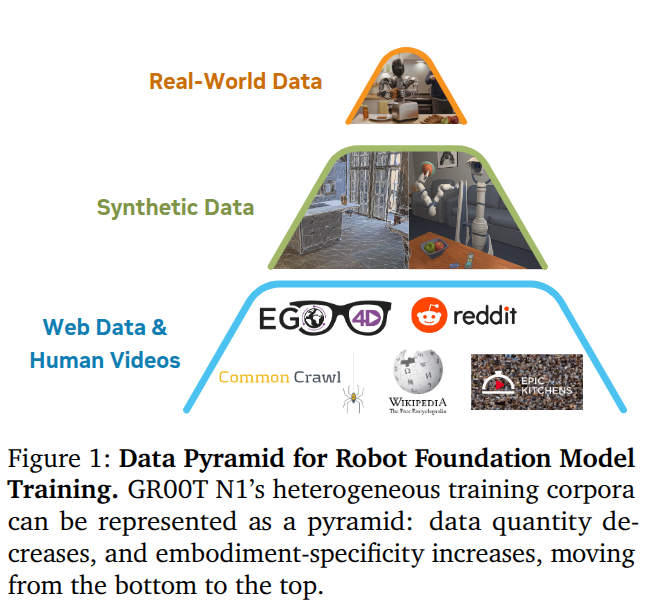
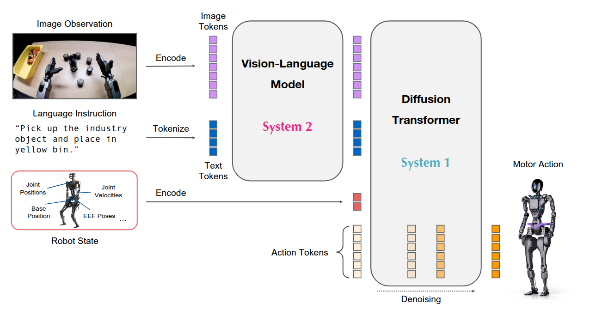
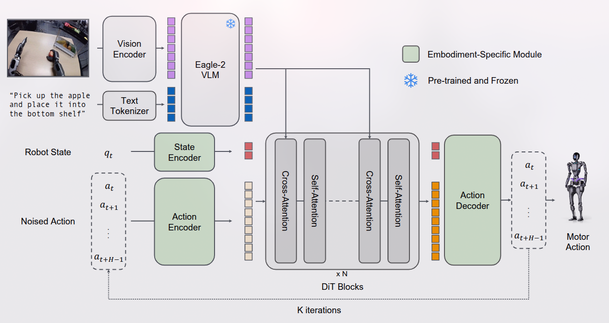
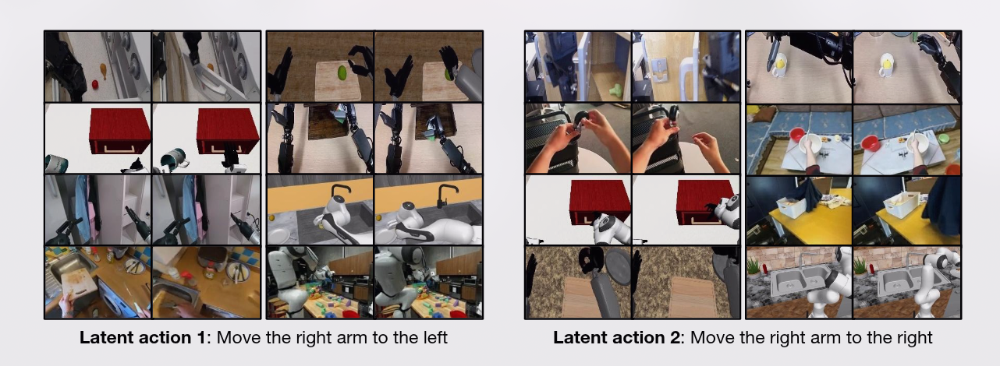
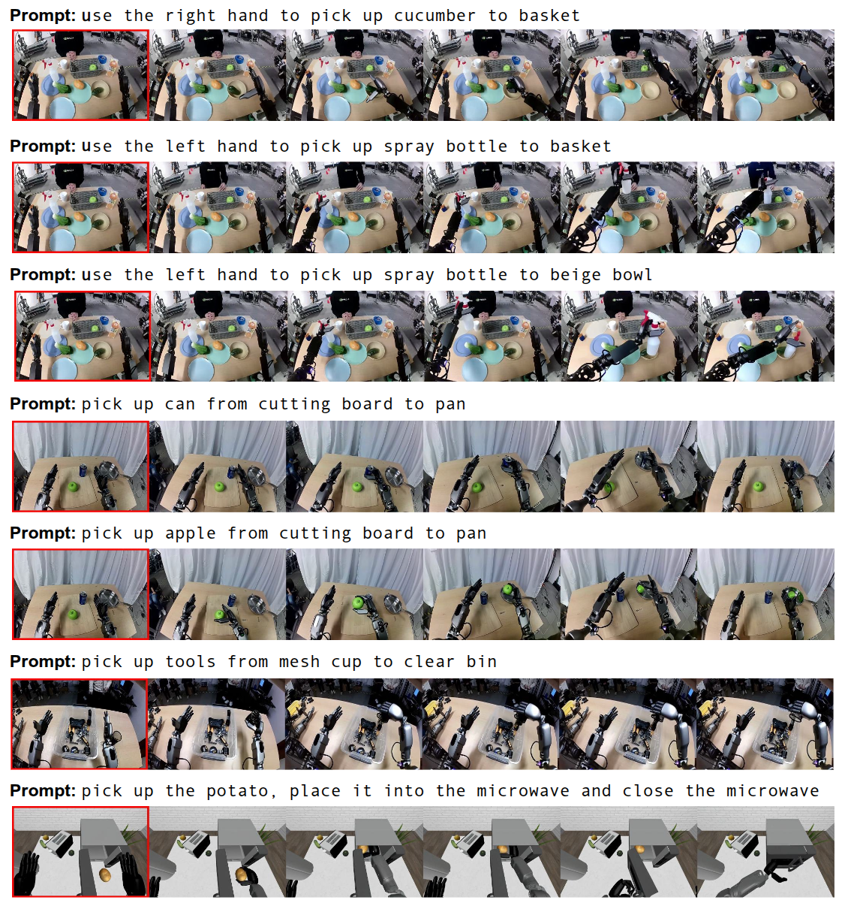

> Paper: https://arxiv.org/abs/2503.14734
>
> Code: https://github.com/NVIDIA/Isaac-GR00T/

## 摘要

通用机器人需要具备多功能的身体和智能的大脑。近期人形机器人领域的进展显示出其作为在人类世界中**构建通用自主能力**的硬件平台的巨大潜力。一个在海量且多样化数据源上训练的机器人基础模型对于使机器人能够推理新情境、稳健应对现实世界的多样性以及快速学习新任务至关重要。为此，我们推出了 GR00T N1，这是一款**面向人形机器人的开源基础模型**。GR00T N1 是一个具有双系统架构的 VLA 模型。

使用真实机器人的轨迹、人类视频以及合成生成的数据集的异构混合来训练 GR00T N1。 GR00T N1 在多个机器人实例的标准仿真基准测试中超越了最先进的模仿学习基线。此外在傅里叶 GR-1 人形机器人上部署了我们的模型，用于语言条件下的双臂操作任务，实现了高性能且数据效率高。

## 引言

在人类世界中创造能够执行日常任务的自主机器人长期以来一直是一个令人着迷的目标，同时也是一项重大的技术挑战。近期在机器人硬件、人工智能和加速计算方面的进展共同为开发通用机器人自主性奠定了基础。为了迈向人类水平的物理智能，我们倡导一种整合三个关键要素的全栈解决方案：硬件、模型和数据。首先，机器人是具身的物理代理，其硬件决定了它们的能力范围：

1. 由于人形机器人具有类似人类的体格和多功能性，因此它们是构建机器人智能的一个极具吸引力的形式因素。
2. 现实世界的多样性和易变性要求机器人能够在开放性目标上运行并执行广泛的任务。实现这一点需要一个足够富有表现力且能够处理各种任务的**通用机器人模型**。
3. 大规模获取真实世界的人形机器人数据既**昂贵又耗时**。我们需要一种有效的数据策略来训练大规模机器人模型。

近年来，基础模型在理解和生成视觉与文本数据方面取得了戏剧性的突破。它们证明了**在网页规模的数据上训练通用模型的有效性**，从而实现强大的泛化能力和对下游任务的快速适应。基础模型赋予它们一系列核心能力，并使它们能够在现实世界中快速学习和适应。然而，与文字和像素的数字领域不同，不存在用于大规模预训练的人形机器人数据集互联网。任何单一的人形硬件可用的数据量都会小几个数量级。机器人学习社区的最新努力（Open X-Embodiment Collaboration et al., 2024）已经探索了跨体现学习，通过汇集许多不同机器人的训练数据来扩大数据集。然而，机器人体现、传感器、执行器自由度、控制模式以及其他因素的巨大差异导致了一个个“**数据孤岛**”，而不是一个连贯的、互联网规模的数据集，这是训练真正通用模型所需要的。



为了解决前面提到的“**数据孤岛**”问题，将 VLA 训练语料库构建为一个数据金字塔，如图 所示。我们没有将训练数据集视为一个同质化的池，而是按规模对异构数据源进行组织：大量的网络数据和人类视频构成了金字塔的底层；通过物理仿真生成的合成数据和/或通过现成的神经模型增强的数据构成了中间层，而从物理机器人硬件上收集的真实世界数据构成了顶层。金字塔的下层提供了广泛的视觉和行为先验知识，而上层则确保了在实体机器人执行中的落地。

我们开发了一种有效的协同训练策略，以在预训练和后训练阶段跨整个数据金字塔进行学习。为了使用无动作数据源（例如人类视频和生成的视频）训练我们的模型，我们学习了一个潜在动作码本 (latent-action codebook)（Latent action pretraining from videos，Ye et al., 2025），并使用训练好的逆动力学模型（IDM）来推断伪动作。这些技术使我们能够在无动作视频上标注动作，从而有效地将它们视为模型训练中的额外机器人实例。通过整合数据金字塔中的所有数据源，我们构建了一个一致的数据集，其中输入包括机器人状态、视觉观察和语言指令，输出是相应的电机动作。我们通过跨这三种数据层（包括标注过的视频数据集、合成生成的数据集和真实机器人的轨迹）采样训练批次，端到端地预训练我们的模型。

## 架构



这里和 OpenVLA 以及 $\pi_{0}$ 不同，VLM 没有直接处理 actions。

/使用 NVIDIA Eagle-2 VLM 作为视觉语言骨干网络。具体来说，我们公开发布的 GR00T-N1-2B 模型总共拥有 22 亿参数，其中 VLM 部分有 13.4 亿参数。在 L40 GPU 上使用 bf16 时，采样 16 个动作片段的推理时间为 63.9 毫秒。 GR00T N1 的三个关键特点：

1. 设计了一个组合模型，将基于 VLM 的推理模块（系统 2）和基于 DiT 的动作模块整合到一个统一的学习框架中；
2. 开发了一种有效的预训练策略，使用人类视频、仿真和生成数据以及真实机器人的演示的混合数据，以实现泛化和鲁棒性；
3. 训练了一个大规模多任务、语言条件化的策略，支持广泛的机器人实例，并通过数据高效的后训练实现对新任务的快速适应。



结构如上图所示，$H=16$。

实验发现，使用中间层而不是最后一层的 LLM 嵌入，不仅提高了推理速度，还提高了下游策略的成功率。对于 GR00T-N1-2B，使用第 12 层的表示。

DiT 中包含交替使用的交叉注意力和自注意力，类似 flamingo。

去噪过程训练过程与 $\pi_{0}$ 相同，推理采样步数为 $4$。

## 训练数据生成

对于人类第一人称视频和神经轨迹，我们没有可以直接用于训练 GR00T N1 的动作。对于这些数据，我们通过训练一个 VQ-VAE 模型从视频中的连续图像帧中提取特征来生成潜在动作（Ye 等人，2025）。编码器接收视频中固定窗口大小 $H$ 的当前帧 $x_t$ 和未来帧 $x_{t+H}$，并输出潜在动作 $z_t$。解码器被训练为接收潜在动作 $z_t$ 和 $x_t$，并重建 $x_{t+H}$。该模型使用 VQ-VAE 目标进行训练，其中编码器的连续嵌入被映射到码本中最近的嵌入。训练完成后，我们取编码器并将其用作逆动力学模型；给定一个 $x_t$ 和 $x_{t+H}$ 对，我们提取连续的预量化嵌入，并将其用作预训练期间的潜在动作标签，使用相同的流匹配损失，但将其视为一个独立的“LAPA”实体。在所有异构数据上一起训练 VQ-VAE 模型，使我们能够统一所有数据，使其共享相同的已学习潜在动作空间，从而可能提高跨实体泛化能力。下图展示了来自 8 种不同实体（包括机器人和人类实体）的 $x_t$ 和 $x_{t+H}$ 对，所有这些对都是从相似的潜在动作中检索到的；第一个潜在动作显示所有实体将右臂向左移动，第二个潜在动作显示将右臂向右移动。



在收集的 88 小时内部远程操控数据上微调了图像到视频生成模型，并根据现有的初始帧和新颖的语言提示生成了 827 小时的视频数据，将其扩展了大约 10 倍。这使得能够生成训练数据，捕捉现实世界中更多的反事实场景，而无需为这些情况中的每一个实际收集远程操控数据（示例见图 5；更多梦想生成示例见图 13）。

为了增加神经轨迹的多样性，我们首先使用商业级多模态大语言模型来检测初始帧中的物体，并生成更多可能的“从地点 A 捡起 物体 放到 地点 B ”的组合，同时指示模型仅考虑物理上可行的组合。我们还对生成的视频应用后处理机制，包括过滤和重新标注。为此，我们还使用商业级多模态大语言模型作为评判，并输入降采样的 8 帧来过滤掉不符合语言指令的神经轨迹。然后我们对过滤掉的视频进行标注。

扩大人形机器人的现实世界数据收集成本极高，因为同时控制双臂和灵巧手存在挑战。最近的研究表明，在仿真环境中生成训练数据是一种实用的替代方案。我们使用 DexMimicGen 来合成大规模的机器人操作轨迹。

从少量的人类演示开始，DexMimicGen 通过在仿真中应用演示转换和回放来自动扩展数据集。每个任务被分解为一系列以物体为中心的子任务。初始的人类演示被分割成更小的操作序列，每个序列对应一个涉及单个物体的子任务。然后通过将这些片段与物体的位置对齐，同时保持机器人末端执行器与物体之间的相对姿态，将它们适配到新环境中。为了确保平稳执行，系统会在机器人当前状态和转换后的片段之间插值运动。机器人随后按照完整序列逐步执行，并在最后验证任务是否成功。只有成功的演示才会被保留，从而确保数据的高质量。通过使用 DexMimicGen，我们将有限的人类演示扩展为大规模的人形机器人操作数据集。考虑到预训练和后训练的数据集，我们在短短 11 小时内生成了 780,000 条仿真轨迹——相当于 6,500 小时，或九个月连续的人类演示数据。这些仿真数据以极低的人力成本显著补充了真实机器人的数据。



## 训练

在预训练阶段，GR00T N1 通过流匹配损失在多种体现形式和数据源上进行训练，这些数据源包括各种真实和合成的机器人数据集以及人类运动数据。对于人类视频，由于缺乏真实动作，我们提取了学习到的**潜在动作，并将其用作流匹配目标**。对于机器人数据集，例如我们的 GR-1 人形数据或 Open X-Embodiment 数据，我们**既使用真实机器人动作，也使用学习到的潜在动作作为流匹配目标**。在用于增强我们机器人数据集的神经轨迹的情况下，我们既使用潜在动作，也使用从真实机器人数据上训练的逆动力学模型预测的动作作为流匹配目标。

在后训练阶段，我们在每个单一体现形式对应的数据集上对预训练模型进行微调。与预训练一样，我们保持视觉语言主干网络的语言部分固定，并微调模型的其余部分。

为了克服后训练阶段数据稀缺的挑战，我们通过生成神经轨迹来为每个下游任务增强数据。对于基于多视图条件的下游任务，我们微调视频模型以在网格中生成多个子图像（见图 13）。对于仿真任务，我们从随机初始化的环境中收集多样化的初始帧。对于真实机器人的任务，我们手动随机初始化物体的姿态，并记录机器人的初始观测。也可以通过 img2img 扩散自动创建新的初始帧（图 13 中展示了示例），但我们将其进一步探索留待未来研究。我们还展示了（1）多轮视频生成，用于生成由原子任务组成的长时域轨迹，以及（2）液体和关节物体的神经轨迹，这些物体已知极难模拟，尽管我们将其下游任务的定量评估留待未来研究。

在我们的后训练流程中，我们仅使用人类收集的轨迹对仿真任务的视频生成模型进行微调，并且仅使用为后训练收集的真实世界基准数据中的 10%，以符合我们只有有限数量的遥操作数据的实际场景。由于生成的视频没有动作标签，我们使用潜在动作或逆动力学模型（IDM）标记的动作（Baker 等人，2022 年），并训练策略模型将这些伪动作视为不同体现形式的动作标签。在低数据场景中，我们也仅在低数据上训练 IDM 模型，以促进实际场景。关于如何训练 IDM 模型的详细信息在附录 F 中提供。在第 4.4 节中对潜在动作和 IDM 标记的动作进行了一些经验比较。在后训练期间，我们以 1:1 的采样比例共同训练策略模型，使其同时使用真实世界轨迹和神经轨迹。

## 数据格式

采用了 LeRobot 格式，见文档：

-  https://github.com/NVIDIA/Isaac-GR00T/blob/main/getting_started/LeRobot_compatible_data_schema.md
- https://github.com/huggingface/lerobot?tab=readme-ov-file#the-lerobotdataset-format

LeRobotDataset  Hugging Face 加载： `dataset = LeRobotDataset("lerobot/aloha_static_coffee")`，并且可以进行索引：`dataset[0]` 包含单个时间帧的观测值和动作。

LeRobotDataset 可以通过设置 `delta_timestamps` 为相对于索引帧的时间列表，根据它们与索引帧的时间关系检索多个帧。例如，通过 `delta_timestamps = {"observation.image": [-1, -0.5, -0.2, 0]}`，可以为给定索引检索 4 个帧：3 个“之前”的帧，分别在索引帧之前的 1 秒、0.5 秒和 0.2 秒，以及索引帧本身（对应于 0 ）。

以下是使用 `dataset = LeRobotDataset("lerobot/aloha_static_coffee")` 实例化的典型 LeRobotDataset 的重要细节和内部结构组织。确切的特征会因数据集而异，但主要方面不会改变：

数据集属性：

```
  ├ hf_dataset：一个Hugging Face数据集（由Arrow/parquet支持）。典型特征示例：
  │  ├ observation.images.cam_high (VideoFrame)：
  │  │   VideoFrame = {'path': mp4视频的路径，'timestamp' (float32)：视频中的时间戳}
  │  ├ observation.state (float32列表)：例如，手臂关节的位置
  │  …（更多观测值）
  │  ├ action (float32列表)：例如，手臂关节的目标位置
  │  ├ episode_index (int64)：此样本的剧集索引
  │  ├ frame_index (int64)：此样本在剧集中的帧索引；每个剧集从0开始
  │  ├ timestamp (float32)：剧集中的时间戳
  │  ├ next.done (bool)：表示剧集结束；每个剧集的最后一帧为True
  │  └ index (int64)：整个数据集中的通用索引
  ├ episode_data_index：包含每个剧集的开始和结束索引的两个张量
  │  ├ from (1D int64张量)：每个剧集的第一帧索引——形状（剧集数量，）从0开始
  │  └ to：(1D int64张量)：每个剧集的最后一帧索引——形状（剧集数量，）
  ├ stats：数据集中每个特征的统计信息（最大值、平均值、最小值、标准差）的字典，例如
  │  ├ observation.images.cam_high：{'max': 与维度相同的张量（例如，对于图像为`(c, 1, 1)`，对于状态为`(c,)`等）}
  │  …
  ├ info：数据集的元数据字典
  │  ├ codebase_version (str)：用于跟踪创建数据集时使用的代码库版本
  │  ├ fps (float)：数据集记录/同步的帧率
  │  ├ video (bool)：指示帧是否编码为mp4视频文件以节省空间，或者存储为png文件
  │  └ encoding (dict)：如果是视频，此文档记录了使用ffmpeg编码视频时使用的主要选项
  ├ videos_dir (Path)：存储/访问mp4视频或png图像的位置
  └ camera_keys (字符串列表)：在数据集返回的项中访问摄像头特征的键（例如`["observation.images.cam_high", …]`）
```

hf_dataset 使用 Hugging Face 数据集库的序列化功能存储为 **parquet** 格式

视频以 mp4 格式存储以节省空间

元数据以纯 json/jsonl 文件形式存储

数据集可以无缝地从 HuggingFace 中心上传/下载。如果要处理本地数据集，可以通过 `root` 参数指定其位置，如果它不在默认的 `~/.cache/huggingface/lerobot` 位置。

:::tip

Gr00t 增加了额外的结构，但与 LeRobot 2.0 保持了完全兼容。

额外的元数据和结构允许对您的机器人数据进行更详细的规范和语言注释。

:::

Gr00t 的数据格式要求如下：

```shell
.
├─meta 
│ ├─episodes.jsonl
│ ├─modality.json # -> GR00T LeRobot 特有
│ ├─info.json
│ └─tasks.jsonl
├─videos
│ └─chunk-000
│   └─observation.images.ego_view
│     └─episode_000001.mp4
│     └─episode_000000.mp4
└─data
  └─chunk-000
    ├─episode_000001.parquet
    └─episode_000000.parquet
```

### Video Observations (video/chunk-\*)

`videos` 文件夹将包含与每个剧集相关的 mp4 文件，文件命名格式为 `episode_00000X.mp4`，其中 `X` 表示剧集编号。要求如下：

- 必须以 MP4 文件格式存储。

- 应使用 `observation.images.<video_name>` 的格式命名。

### Data (data/chunk-\*)

数据文件夹将包含与每个剧集相关的所有 parquet 文件，文件命名格式为 episode_00000X.parquet，其中 X 表示剧集编号，与上文的视视频所对应。每个 parquet 文件将包含以下内容：

- 状态信息：以 observation.state 存储，是一个包含所有状态模态的 1D 拼接数组。
- 动作：以 action 存储，是一个包含所有动作模态的 1D 拼接数组。
- 时间戳：以 timestamp 存储，是起始时间的浮点数。
- 注释：以 annotation.\<annotation_source\>.\<annotation_type\>(.\<annotation_name\>) 存储（例如，参见示例配置中的注释字段以获取示例命名）。其他列不应带有 annotation 前缀。如果需要添加多个注释，请参见（multiple-annotation-support）。

### Example Parquet File

 demo_data 目录 robot_sim.PickNPlace 数据集的一个样本。

```json
{
    "observation.state":[-0.01147082911843003,…,0], // 根据 modality.json 文件拼接的状态数组
    "action":[-0.010770668025204974,…0], // 根据 modality.json 文件拼接的动作数组
    "timestamp":0.04999995231628418, // 观测的时间戳
    "annotation.human.action.task_description":0, // meta/tasks.jsonl 文件中任务描述的索引
    "task_index":0, // meta/tasks.jsonl 文件中任务的索引
    "annotation.human.validity":1, // meta/tasks.jsonl 文件中任务的索引
    "episode_index":0, // 剧集的索引
    "index":0, // 观测的索引。这是跨越整个数据集中所有观测的全局索引。
    "next.reward":0, // 下一个观测的奖励
    "next.done":false // 剧集是否结束
}
```

使用 **PyArrow** 读取：

```python
import pyarrow.parquet as pq

table = pq.read_table('example.parquet')

# 将数据转换为 Pandas DataFrame（可选）
import pandas as pd
df = table.to_pandas()

# 直接使用pandas也行
df = pd.read_parquet('example.parquet', engine='pyarrow')

print(df)
```

### Meta

`episodes.jsonl` 包含整个数据集中所有剧集的列表。每个剧集包含一个 **任务列表** 和剧集的长度。

```json
{"episode_index": 0, "tasks": […], "length": 416}
{"episode_index": 1, "tasks": […], "length": 470}
```

`tasks.jsonl` 包含整个数据集中所有任务的列表。

```json
{"task_index": 0, "task": "pick the squash from the counter and place it in the plate"}
{"task_index": 1, "task": "valid"}
```

可以通过 parquet 文件中的 `task_index` 来获取任务描述。因此，在这种情况下，第一个观测的 ` annotation.human.action.task_description ` 是 "pick the squash from the counter and place it in the plate"，而 ` annotation.human.validity ` 是 “valid”。

`modality.json` 包含模态配置，提供了关于状态和动作模态的详细元数据，能够实现以下功能：

- **分离数据存储和解释**：

    - **状态和动作**：以拼接的 float32 数组形式存储。`modality.json` 文件提供了将这些数组解释为具有额外训练信息的独立、细粒度字段所需的元数据。
    - **视频**：作为单独的文件存储，配置文件允许将它们重命名为标准化格式。
    - **注释**：跟踪所有注释字段。如果没有注释，则不在配置文件中包含注释字段。

- **细粒度拆分**：将状态和动作数组拆分为更具语义意义的字段。
- **清晰映射**：明确映射数据维度。
- **复杂数据转换**：支持在训练期间对特定字段进行归一化和旋转变换。
:::info schema

```shell
{
    "state": {
        "<state_key>": {
            "start": <int>,         // 状态数组中的起始索引
            "end": <int>,           // 状态数组中的结束索引
            "rotation_type": <str>,  // 可选：指定旋转格式
            "dtype": <str>,         // 可选：指定数据类型
            "range": <tuple[float, float]> // 可选：指定模态的范围
        }
    },
    "action": {
        "<action_key>": {
            "start": <int>,         // 动作数组中的起始索引
            "end": <int>,           // 动作数组中的结束索引
            "absolute": <bool>,      // 可选：true 表示绝对值，false 表示相对/增量值
            "rotation_type": <str>,  // 可选：指定旋转格式
            "dtype": <str>,         // 可选：指定数据类型
            "range": <tuple[float, float]> // 可选：指定模态的范围
        }
    },
    "video": {
        "<new_key>": {
            "original_key": "<original_video_key>" // 原始视频键
        }
    },
    "annotation": {
        "<annotation_key>": {}  // 空字典，以与其他模态保持一致
    }
}
```

支持的旋转类型：

- axis_angle
- quaternion
- rotation_6d
- matrix
- euler_angles_rpy
- euler_angles_ryp
- euler_angles_pry
- euler_angles_pyr
- euler_angles_yrp
- euler_angles_ypr
样例为：

```json
{
    "state": {
        "left_arm": { // 观测状态数组中的前 7 个元素是 parquet 文件中的左臂
            "start": 0,
            "end": 7
        },
        "left_hand": { // 观测状态数组中的接下来 6 个元素是 parquet 文件中的左手
            "start": 7,
            "end": 13
        },
		...
    },
    "action": {
        "left_arm": {
            "start": 0,
            "end": 7
        },
        "left_hand": {
            "start": 7,
            "end": 13
        },
        ...
    },
    "video": {
        "ego_view": { // 视频存储在 videos/chunk-*/observation.images.ego_view/episode_00000X.mp4 中
            "original_key": "observation.images.ego_view"
        }
    },
    "annotation": {
        "human.action.task_description": {}, // 任务描述存储在 meta/tasks.jsonl 文件中
        "human.validity": {}
    }
}
```

以宇树机器人 g1 为例，状态对应多种关节的角度或位置。

```python
class G1JointIndex:
    # Left leg
    LeftHipPitch = 0
    LeftHipRoll = 1
    LeftHipYaw = 2
    LeftKnee = 3
    LeftAnklePitch = 4
    LeftAnkleB = 4
    LeftAnkleRoll = 5
    LeftAnkleA = 5

    # Right leg
    RightHipPitch = 6
    RightHipRoll = 7
    RightHipYaw = 8
    RightKnee = 9
    RightAnklePitch = 10
    RightAnkleB = 10
    RightAnkleRoll = 11
    RightAnkleA = 11

    WaistYaw = 12
    WaistRoll = 13        # NOTE: INVALID for g1 23dof/29dof with waist locked
    WaistA = 13           # NOTE: INVALID for g1 23dof/29dof with waist locked
    WaistPitch = 14       # NOTE: INVALID for g1 23dof/29dof with waist locked
    WaistB = 14           # NOTE: INVALID for g1 23dof/29dof with waist locked

    # Left arm
    LeftShoulderPitch = 15
    LeftShoulderRoll = 16
    LeftShoulderYaw = 17
    LeftElbow = 18
    LeftWristRoll = 19
    LeftWristPitch = 20   # NOTE: INVALID for g1 23dof
    LeftWristYaw = 21     # NOTE: INVALID for g1 23dof

    # Right arm
    RightShoulderPitch = 22
    RightShoulderRoll = 23
    RightShoulderYaw = 24
    RightElbow = 25
    RightWristRoll = 26
    RightWristPitch = 27  # NOTE: INVALID for g1 23dof
    RightWristYaw = 28    # NOTE: INVALID for g1 23dof

    kNotUsedJoint = 29 # NOTE: Weight
```

:::

`info.json` 包含数据集信息。

### 多注释支持

为了在单个 parquet 文件中支持多个注释，用户可以向 parquet 文件中添加额外的列，应将这些列视为原始 LeRobot V2 数据集中的 `task_index` 列：

在 LeRobot V2 中，实际的语言描述存储在 `meta/tasks.jsonl` 文件的一行中，而 parquet 文件仅在 `task_index` 列中存储对应的索引。我们遵循相同的约定，并在 `annotation.<annotation_source>.<annotation_type>` 列中存储每个注释的对应索引。尽管 `task_index` 列仍可用于默认注释，但为了确保我们的自定义数据加载器能够加载，需要一个专门的列 `annotation.<annotation_source>.<annotation_type>`。

### GR00T LeRobot 对标准 LeRobot 的扩展

GR00T LeRobot 是标准 LeRobot 格式的一个变体，具有更明确的要求：

- `meta/stats.json` 文件由 LeRobot 格式使用，但我们的数据加载器并不需要它。如果计算该文件过于耗时，您可以安全地忽略它。
- 本体感受器状态必须始终包含在 `observation.state` 键中。
- 我们支持多通道注释格式（例如，粗粒度、微调），允许用户通过 `annotation.<annotation_source>.<annotation_type>` 键添加所需的注释通道。
- 我们要求一个额外的元数据文件 `meta/modality.json`，该文件在标准 LeRobot 格式中不存在。

### 注意事项

- 只有在与默认值不同时，才需要指定可选字段。
- 视频键映射用于在数据集中标准化摄像头名称。
- 所有索引均从零开始，并遵循 Python 的数组切片约定（`[start:end]`）。

## 代码

```sh
./
├── gr00t
│   ├── data
│   │   ├── dataset.py  # 包含三个dataset
│   │   ├── embodiment_tags.py  # 包含一些机器人的信息，要添加机器人应该改这里
│   │   ├── schema.py  # 数据集的字段定义
│   │   └── transform # 数据处理
│   │       ├── base.py
│   │       ├── concat.py
│   │       ├── __init__.py
│   │       ├── state_action.py
│   │       └── video.py
│   ├── eval
│   │   ├── robot.py
│   │   ├── service.py
│   │   ├── simulation.py
│   │   └── wrappers
│   │       ├── multistep_wrapper.py
│   │       ├── obs_index_selection_wrapper.py
│   │       └── video_recording_wrapper.py
│   ├── experiment
│   │   ├── data_config.py
│   │   ├── __init__.py
│   │   ├── runner.py
│   │   └── trainer.py
│   ├── __init__.py
│   ├── model
│   │   ├── action_head
│   │   │   ├── action_encoder.py
│   │   │   ├── cross_attention_dit.py
│   │   │   ├── flow_matching_action_head.py
│   │   │   └── __init__.py
│   │   ├── backbone
│   │   │   ├── eagle2_hg_model
│   │   │   │   ├── added_tokens.json
│   │   │   │   ├── chat_template.json
│   │   │   │   ├── config.json
│   │   │   │   ├── configuration_eagle2_5_vl.py
│   │   │   │   ├── generation_config.json
│   │   │   │   ├── image_processing_eagle2_5_vl_fast.py
│   │   │   │   ├── image_processing_eagle2.py
│   │   │   │   ├── merges.txt
│   │   │   │   ├── modeling_eagle2_5_vl.py
│   │   │   │   ├── preprocessor_config.json
│   │   │   │   ├── processing_eagle2_5_vl.py
│   │   │   │   ├── processor_config.json
│   │   │   │   ├── radio_model.py
│   │   │   │   ├── special_tokens_map.json
│   │   │   │   ├── tokenizer_config.json
│   │   │   │   └── vocab.json
│   │   │   ├── eagle_backbone.py
│   │   │   └── __init__.py
│   │   ├── gr00t_n1.py
│   │   ├── __init__.py
│   │   ├── policy.py
│   │   └── transforms.py
│   ├── py.typed
│   └── utils
│       ├── eval.py
│       ├── experiment.py
│       ├── __init__.py
│       ├── misc.py
│       ├── peft.py
│       └── video.py
├── scripts
│   ├── eval_policy.py
│   ├── gr00t_finetune.py
│   ├── inference_service.py
│   ├── load_dataset.py
│   └── simulation_service.py
└── tests
    └── test_dataset.py

```
