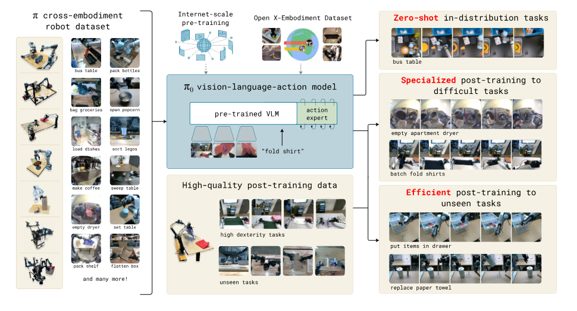
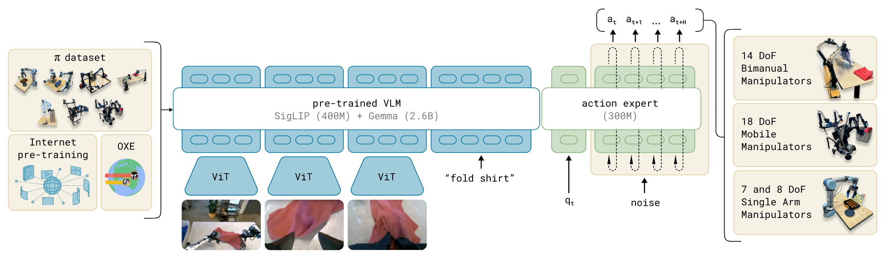
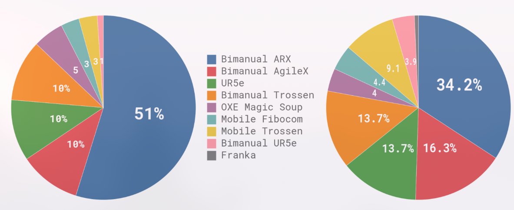
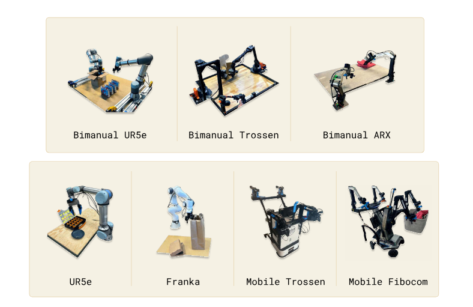
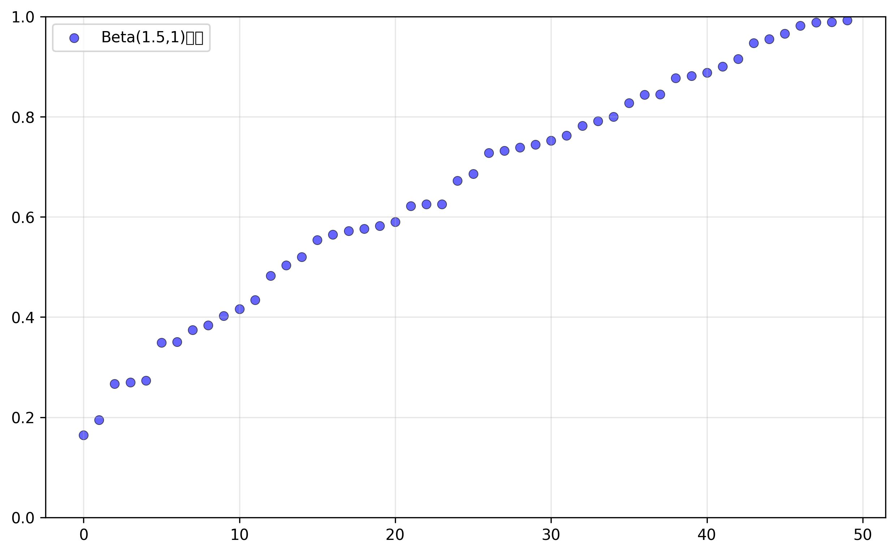

> Paper: https://link.zhihu.com/?target=https%3A//www.physicalintelligence.company/download/pi0.pdf
> Code: https://github.com/Physical-Intelligence/openpi
> Refer: https://zhuanlan.zhihu.com/p/7040420479 , https://blog.csdn.net/v_july_v/article/details/143472442 , https://blog.csdn.net/v_JULY_v/article/details/146068251

## Abstract

机器人学习（Robot learning）有望充分释放灵活、通用且灵巧的机器人系统的潜力，并回答人工智能领域中一些最深刻的问题。然而，将机器人学习提升到有效现实世界系统所需的**通用**性水平，在**数据、泛化能力和鲁棒性方面**面临着重大障碍。

本文

1. 提出了一种基于预训练 VLM 构建的新型流匹配架构，以**继承互联网规模的语义知识**。
2. 讨论了如何在多个灵巧机器人平台（包括单臂机器人、双臂机器人和移动操作机器人）上收集的庞大且多样化的数据集上训练该模型。
3. 从**直接提示执行任务**的能力、**遵循人类和高级 VLM 策略的语言指令**的能力，以及**通过微调获得新技能**的能力等方面对模型进行了评估。

## Introduction

> A human being should be able to change a diaper, plan an invasion, butcher a hog, conn a ship, design a building, write a sonnet, balance accounts, build a wall, set a bone, comfort the dying, take orders, give orders, cooperate, act alone, solve equations, analyze a new problem, pitch manure, program a computer, cook a tasty meal, fight efficiently, die gallantly. Specialization is for insects.  --Robert A. Heinlein, Time Enough for Love

人工智能有各种各样的形式和功能，从高度专业化的系统解决人们难以触及的复杂问题，如预测蛋白质结构，到文生图。但是人类智能对比机器智能的超越是**多功能性**的：在真实的物理世界中解决复杂的问题，并且同时智能地应对环境限制、语言指令和意外干扰。

机器智能中体现该多功能性的最新进展就是 VLM，已被证明具有广泛的指令遵循和问题解决能力，但是其未在真实物理世界中训练，对物理交互的理解完全基于抽象描述，因此还需要在物理情景数据上进行训练——来自**具身机器人代理**的数据。

灵活且通用的机器人基础模型具有巨大的实际意义，也可能为机器人学习今天面临的最棘手的挑战提供解决方案，例如数据的可用性、泛化能力和鲁棒性。在 cv 和 nlp 领域，在多样化多任务数据集上的预训练模型往往比狭隘定制且专业化的模型表现更好。

因此可以猜想：对于有效的专业机器人系统来说，首先在高度多样化的机器人数据上进行预训练，然后针对所需任务进行微调或提示，可能更为有效。

1. 可以解决数据稀缺的挑战，因为通用模型有更多的数据来源——包括来自其他任务、其他机器人甚至非机器人来源的数据。
2. 可能解决鲁棒性和泛化能力的挑战，因为多样化数据涵盖了更多的观察和行动，提供了各种场景、纠正措施和恢复行为，这在专业化数据中并不存在。

**挑战**

1. 必须在非常大的**规模**上进行（大模型的涌现能力）。
2. 需要能够有效利用多样化数据源的正确**模型架构**，能够表示与复杂物理场景交互所必需的复杂且微妙的行为。
3. 正确的训练 **配方**（数据集），也许是最重要的，VLM 中的许多进展很大程度上依赖于精心策划预训练和后训练数据。



本文的**通用机器人策略**使用了一个预训练的 VLM 作为骨干网络（引入互联网规模的数据，并基础可以继承 VLM 的通用知识，语义推理和问题解决能力），以及一个包含多种灵巧操作任务的多样化数据集。

通过添加一个单独的**动作专家（action expert）**，该模型被适配到机器人控制中，该专家通过 **流匹配 (flow matchting)** 生成连续动作 (action chunks)，从而实现精确且流畅的操作技能。然后可以直接使用该模型根据提示执行任务，或者在高质量数据上进行微调，以实现复杂的多阶段任务，例如折叠多件衣物或组装一个盒子。

## RELATED WORK

在机器人控制之外，许多模型已经被提出将预训练语言模型与扩散模型结合起来，包括专门将扩散与自回归大型语言模型混合的模型（Playground V3，Mars，Transfusion，都是用于图像生成）。

机器人任务包含：抓取、推动、物体重新定位、基本的家具操作（如打开抽屉）、系鞋带、煮虾、衣物折叠、桌面清理。要添加复杂性可以按照顺序执行，以及识别新的物体，如识别桌面清理中的垃圾与非垃圾。

## OVERVIEW



**预训练混合数据集** 由我们自己的灵巧操作数据集的加权组合组成，这些数据集是在 7 种不同的机器人配置上为 68 个不同的任务收集的，以及整个 OXE 数据集（包含来自 22 个机器人的数据）。预训练阶段还使用了多样化的语言标签，结合了任务名称和片段注释（子轨迹的细粒度标签，通常持续约 2 秒）。

对于复杂且灵巧的任务，随后采用后训练程序，该程序使用高质量数据来使模型适应特定的下游任务。我们研究了使用少量到中等量数据的高效后训练，以及使用更大数据集进行复杂任务（如洗衣折叠和移动操作）的高质量后训练。

**这里使用 PaliGemma 是因为其大小更小，以便于实时控制。**

模型架构受到了 Transfusion 的启发，连续动作的 token 使用 flow matching loss 监督，而离散的输出（文本等）使用交叉熵监督。本文还发现，为机器人特定（动作和状态）标记使用单独的一组权重可以提高性能。这种设计类似于混合专家，其中有两个混合元素，第一个元素用于图像和文本输入，第二个元素用于机器人特定的输入和输出。我们将第二组权重称为动作专家。

形式上，我们希望建模数据分布 $p(A_t|o_t)$，其中 $A_t = [a_t, a_{t+1}, …, a_{t+H-1}]$ 对应于未来动作的一个动作块（我们为我们的任务使用 $H = 50$），而 $o_t$ 是一个观测值。观测值由多个 RGB 图像、语言命令和机器人的本体感知状态组成，使得 $o_t = [I^1_t, …, I^n_t, \ell_t, q_t]$，其中 $I^i_t$ 是第 $i$ 个图像（每个机器人有 2 个或 3 个图像），$\ell_t$ 是一系列语言标记，而 $q_t$ 是一个关节角度向量。图像 $I^i_t$ 和状态 $q_t$ 通过相应的编码器进行编码，然后通过线性投影层投影到与语言标记相同的嵌入空间中。

对于 action  chunk $A_t​$ 中的每个动作 $a_{t^′}$ ​，我们都有一个对应的动作标记，我们将其通过动作专家进行处理。在训练期间，我们使用 conditional flow matching loss 来监督这些动作标记

$$
L^\tau (\theta) = \mathbb{E}_{p(A_t|o_t),q(A^\tau_t|A_t)}\|v_\theta (A^\tau_t, o_t) - u(A^\tau_t|A_t)\|^2
$$

其中下标表示机器人的时间步，上标表示流匹配的时间步，且 $\tau \in [0, 1]$。最近在高分辨率图像和视频合成方面的工作表明，当与简单的线性 - 高斯（或最优传输）概率路径结合时，流匹配可以实现强大的经验性能，该路径由 $q(A^\tau_t|A_t) = \mathcal{N} (\tau A_t, (1 - \tau )I)$ 给出。在实践中，网络通过采样随机噪声 $\epsilon \sim \mathcal{N} (0, I)$，计算“噪声动作” $A^\tau_t = \tau A_t + (1 - \tau )\epsilon$，然后训练网络输出 $v_\theta (A^\tau_t, o_t)$ 以匹配去噪向量场 $u(A^\tau_t|A_t) = \epsilon - A_t$ 来进行训练。动作专家使用完整的双向注意力掩码，因此所有动作标记彼此关注。在训练期间，我们从强调较低（更嘈杂）时间步的贝塔分布中采样流匹配时间步 $\tau$。

在推理时，我们通过从 $\tau = 0$ 到 $\tau = 1$ 积分学习到的向量场来生成动作，从随机噪声 $A^0_t \sim \mathcal{N}(0, I)$ 开始。我们使用前向欧拉积分规则：

$A^{\tau+\delta}_t = A^\tau_t + \delta v_\theta(A^\tau_t, o_t)$

其中 $\delta$ 是积分步长。在我们的实验中，我们使用了 10 个积分步骤（对应于 $\delta = 0.1$）。注意，通过缓存前缀 $o_t$ 的注意力键和值，并只为每个积分步骤重新计算对应于动作标记的后缀，可以高效地实现推理。

## Training



右图说明了预训练混合数据集中不同数据集的权重。左图说明了它们相对于步数（可能是 timestep）的大小。对于有些 robot-task 组合比较多的数据，加权值为 $n^{0.43}$, $n$ 为数据集的样本数量。

配置向量 $q_t$ ​和动作向量 $a_t$ ​始终具有数据集中最大机器人的维度（在我们的例子中为 18，以容纳两个 6 自由度的机械臂、2 个夹持器、一个移动底座和一个垂直驱动的躯干）。对于配置和动作空间维度较低的机器人，我们对配置和动作向量进行零填充。对于图像少于三张的机器人，我们还会屏蔽缺失的图像槽。

后训练使用特定数据集进行微调，最简单的任务只需要 5 小时，最复杂的需要 100 小时。



$\pi_{0}$ 实验中所使用的机器人包括具有 6 自由度和 7 自由度手臂的单臂和双臂操作器，以及全向和非全向移动操作器。

视觉语言大模型本身就可以充当机器人的大脑，给机器人做顶层任务规划（如**SayCan**、清华的 ViLa、CoPa），需要语义推理和高层策略的更复杂任务，例如清理桌子，也可以通过高层策略来受益，即将高层任务 (如“清理桌子”) 分解为更直接的子任务 (如“拿起餐巾”或“将餐巾扔进垃圾桶”)。

## Code

`src/openpi/models.py` ：主要存放数据格式和模型接口类

`src/openpi/gemma.py`：gemma 语言模型代码的实现，定义了 RMSNorm、Embedder、Attention、FeedForward 等模块，且提供了不同规模 Gemma2B 和 300M 模型的配置。

`src/openpi/gemma.lora`：带有 lora 的 Enisum 和 FeedForward 实现，并且 Enisum 自带一个权重，用于映射 qvk。

`src/openpi/gemma.siglip`：实现了视觉编码器，基于 Vision Transformer (ViT)，定义了位置编码、注意力池化等组件，支持不同大小的模型变体。

`src/openpi/pi0.py`：pi0 模型代码的实现

```python
class Pi0Config(_model.BaseModelConfig):
    dtype: str = "bfloat16"
    paligemma_variant: _gemma.Variant = "gemma_2b"
    action_expert_variant: _gemma.Variant = "gemma_300m"

    # Set the model specific defaults.
    action_dim: int = 32
    action_horizon: int = 50
    max_token_len: int = 48
    
	@override # 定义了输入格式
    def inputs_spec(self, *, batch_size: int = 1) -> tuple[_model.Observation, _model.Actions]:
	    ...
	# 返回被冻结的训练参数名，主要是用于lora的微调
	def get_freeze_filter(self) -> nnx.filterlib.Filter:
		...
	
```

可以看到 action expert 使用 `gemma_300m`

```python
class Pi0(_model.BaseModel):
    def __init__(self, config: Pi0Config, rngs: nnx.Rngs):
        super().__init__(config.action_dim, config.action_horizon, config.max_token_len)
        paligemma_config = _gemma.get_config(config.paligemma_variant)
        action_expert_config = _gemma.get_config(config.action_expert_variant)
        # TODO: rewrite gemma in NNX. For now, use bridge.
        llm = nnx_bridge.ToNNX(
            _gemma.Module(
                configs=[paligemma_config, action_expert_config],
                embed_dtype=config.dtype,
            )
        )
        llm.lazy_init(rngs=rngs, method="init")
        img = nnx_bridge.ToNNX(
            _siglip.Module(
                num_classes=paligemma_config.width,
                variant="So400m/14", # patch_size 14
                pool_type="none",
                scan=True,
                dtype_mm=config.dtype,
            )
        )
        img.lazy_init(next(iter(config.fake_obs().images.values())), train=False, rngs=rngs)
        self.PaliGemma = nnx.Dict(llm=llm, img=img)
        self.state_proj = nnx.Linear(config.action_dim, action_expert_config.width, rngs=rngs) # 投影机器人状态
        self.action_in_proj = nnx.Linear(config.action_dim, action_expert_config.width, rngs=rngs) # 动作输入投影到动作专家维度
        self.action_time_mlp_in = nnx.Linear(2 * action_expert_config.width, action_expert_config.width, rngs=rngs) # 动作-时间输入
        self.action_time_mlp_out = nnx.Linear(action_expert_config.width, action_expert_config.width, rngs=rngs) # 动作-时间输出
        self.action_out_proj = nnx.Linear(action_expert_config.width, config.action_dim, rngs=rngs) # 动作输出

	@at.typecheck
    def embed_prefix(
        self, obs: _model.Observation
    ) -> tuple[at.Float[at.Array, "b s emb"], at.Bool[at.Array, "b s"], at.Bool[at.Array, " s"]]:
        input_mask = []
        ar_mask = []
        tokens = []
        # embed images
        for name in obs.images:
            image_tokens, _ = self.PaliGemma.img(obs.images[name], train=False) # siglip处理图像

            tokens.append(image_tokens)
            input_mask.append(
                einops.repeat(
                    obs.image_masks[name],
                    "b -> b s",
                    s=image_tokens.shape[1],
                )
            )
            # image tokens attend to each other
            ar_mask += [False] * image_tokens.shape[1] # 双向注意力，非时序tokens

        # add language (aka tokenized inputs)
        if obs.tokenized_prompt is not None:
            tokenized_inputs = self.PaliGemma.llm(obs.tokenized_prompt, method="embed") # paligemma处理文本获得embedding,而不是前向传播
            tokens.append(tokenized_inputs)
            input_mask.append(obs.tokenized_prompt_mask)
            # full attention between image and language inputs
            ar_mask += [False] * tokenized_inputs.shape[1] # 双向注意力
        tokens = jnp.concatenate(tokens, axis=1)
        input_mask = jnp.concatenate(input_mask, axis=1)
        ar_mask = jnp.array(ar_mask)
        return tokens, input_mask, ar_mask

    @at.typecheck
    def embed_suffix(
        self, obs: _model.Observation, noisy_actions: _model.Actions, timestep: at.Float[at.Array, " b"]
    ) -> tuple[at.Float[at.Array, "b s emb"], at.Bool[at.Array, "b s"], at.Bool[at.Array, " s"]]:
        input_mask = []
        ar_mask = []
        tokens = []
        # add a single state token
        state_token = self.state_proj(obs.state)[:, None, :] # 投影状态
        tokens.append(state_token)
        input_mask.append(jnp.ones((obs.state.shape[0], 1), dtype=jnp.bool_)) # 全部有效
        # image/language inputs do not attend to state or actions
        ar_mask += [True] # mask, 图像和语言输入看不到状态和动作

        # embed timestep using sine-cosine positional encoding with sensitivity in the range [0, 1]
        time_emb = posemb_sincos(timestep, self.action_in_proj.out_features, min_period=4e-3, max_period=4.0)
        # mix timestep + action information using an MLP
        action_tokens = self.action_in_proj(noisy_actions) # 映射带噪声的actions
        time_tokens = einops.repeat(time_emb, "b emb -> b s emb", s=self.action_horizon)
        action_time_tokens = jnp.concatenate([action_tokens, time_tokens], axis=-1) # 动作和时间信息统合，一般不是用加？
        action_time_tokens = self.action_time_mlp_in(action_time_tokens)
        action_time_tokens = nnx.swish(action_time_tokens)
        action_time_tokens = self.action_time_mlp_out(action_time_tokens)# mlp
        tokens.append(action_time_tokens)
        input_mask.append(jnp.ones(action_time_tokens.shape[:2], dtype=jnp.bool_))
        # image/language/state inputs do not attend to action tokens
        ar_mask += [True] + ([False] * (self.action_horizon - 1)) # 第一个动作token使用双向注意力
        tokens = jnp.concatenate(tokens, axis=1)
        input_mask = jnp.concatenate(input_mask, axis=1)
        ar_mask = jnp.array(ar_mask)
        return tokens, input_mask, ar_mask
    @override
    def compute_loss(
        self, rng: at.KeyArrayLike, observation: _model.Observation, actions: _model.Actions, *, train: bool = False
    ) -> at.Float[at.Array, "*b ah"]:
		'''
		对原始动作加噪声，并预测该噪声，噪声动作减去该噪声即可获得原始动作。
		对噪声的预测通常比对原始输入的预测更简单，并且噪声通常是标准化的，如高斯噪声
		在推理的时候，针对一个随机生成的纯噪声，基于observation(包含图像和机器人状态)，逐步去噪生成机器人的动作序列
		'''
        preprocess_rng, noise_rng, time_rng = jax.random.split(rng, 3)
        observation = _model.preprocess_observation(preprocess_rng, observation, train=train) # 输入预处理

        batch_shape = actions.shape[:-2] # b, len, dim, 应该是[b]
        noise = jax.random.normal(noise_rng, actions.shape) # 生成噪声
        # 从Beta分布采样时间点，范围为[0.001, 1]，Beta(1.5, 1)偏向较低的值
        # 非均匀时间步调度，因为不同阶段对模型训练贡献不同
        # 早期阶段噪声较小，重建难度较低。
		# 中期阶段模型需要学习复杂的去噪模式，对训练最关键。
		# 后期阶段任务简单，但对最终生成质量影响较小
        time = jax.random.beta(time_rng, 1.5, 1, batch_shape) * 0.999 + 0.001 
        time_expanded = time[…, None, None]
        x_t = time_expanded * noise + (1 - time_expanded) * actions # 加噪的动作，根据时间点不同增加噪声的比例
        u_t = noise - actions # 目标，要求模型预测该噪声

        # one big forward pass of prefix + suffix at once
        prefix_tokens, prefix_mask, prefix_ar_mask = self.embed_prefix(observation)
        suffix_tokens, suffix_mask, suffix_ar_mask = self.embed_suffix(observation, x_t, time)
        input_mask = jnp.concatenate([prefix_mask, suffix_mask], axis=1)
        ar_mask = jnp.concatenate([prefix_ar_mask, suffix_ar_mask], axis=0)
        attn_mask = make_attn_mask(input_mask, ar_mask)
        # 位置编码
        positions = jnp.cumsum(input_mask, axis=1) - 1
        (_, suffix_out), _ = self.PaliGemma.llm(
            [prefix_tokens, suffix_tokens], mask=attn_mask, positions=positions
        ) # prefix不直接参与loss计算
        v_t = self.action_out_proj(suffix_out[:, -self.action_horizon :]) # 映射回动作大小
		
        return jnp.mean(jnp.square(v_t - u_t), axis=-1) # l2 loss

	@override
    def sample_actions(
        self,
        rng: at.KeyArrayLike,
        observation: _model.Observation,
        *,
        num_steps: int | at.Int[at.Array, ""] = 10,
    ) -> _model.Actions:
	    # 数据预处理，不进行数据增强
        observation = _model.preprocess_observation(None, observation, train=False)
        # note that we use the convention more common in diffusion literature, where t=1 is noise and t=0 is the target
        # distribution. yes, this is the opposite of the pi0 paper, and I'm sorry.
        dt = -1.0 / num_steps # 时间步长
        batch_size = observation.state.shape[0]
        noise = jax.random.normal(rng, (batch_size, self.action_horizon, self.action_dim))

        # first fill KV cache with a forward pass of the prefix
        # 先计算prefix, 并保存
        prefix_tokens, prefix_mask, prefix_ar_mask = self.embed_prefix(observation)
        prefix_attn_mask = make_attn_mask(prefix_mask, prefix_ar_mask)
        positions = jnp.cumsum(prefix_mask, axis=1) - 1 # 用于位置编码、
        # 得到kv_cache来优化
        _, kv_cache = self.PaliGemma.llm([prefix_tokens, None], mask=prefix_attn_mask, positions=positions)
		# 单步去噪声
        def step(carry):
            x_t, time = carry
            # 计算suffix
            suffix_tokens, suffix_mask, suffix_ar_mask = self.embed_suffix(
                observation, x_t, jnp.broadcast_to(time, batch_size)
            )
            # `suffix_attn_mask` is shape (b, suffix_len, suffix_len) indicating how the suffix tokens can attend to each
            # other
            suffix_attn_mask = make_attn_mask(suffix_mask, suffix_ar_mask)
            # `prefix_attn_mask` is shape (b, suffix_len, prefix_len) indicating how the suffix tokens can attend to the
            # prefix tokens
            prefix_attn_mask = einops.repeat(prefix_mask, "b p -> b s p", s=suffix_tokens.shape[1])
            # `combined_mask` is shape (b, suffix_len, prefix_len + suffix_len) indicating how the suffix tokens (which
            # generate the queries) can attend to the full prefix + suffix sequence (which generates the keys and values)
            full_attn_mask = jnp.concatenate([prefix_attn_mask, suffix_attn_mask], axis=-1)
            assert full_attn_mask.shape == (
                batch_size,
                suffix_tokens.shape[1],
                prefix_tokens.shape[1] + suffix_tokens.shape[1],
            )
            # `positions` is shape (b, suffix_len) indicating the positions of the suffix tokens
            positions = jnp.sum(prefix_mask, axis=-1)[:, None] + jnp.cumsum(suffix_mask, axis=-1) - 1
			# 前向
            (prefix_out, suffix_out), _ = self.PaliGemma.llm(
                [None, suffix_tokens], mask=full_attn_mask, positions=positions, kv_cache=kv_cache
            )
            assert prefix_out is None
            # 预测出单步噪声
            v_t = self.action_out_proj(suffix_out[:, -self.action_horizon :])
			# dt小于0，就是减去单步噪声
			# 时间也减小
            return x_t + dt * v_t, time + dt

        def cond(carry):
            x_t, time = carry
            # robust to floating-point error
            return time >= -dt / 2

        x_0, _ = jax.lax.while_loop(cond, step, (noise, 1.0))
        return x_0
```



非均匀采样图片，进行了排序，50 个样本点
