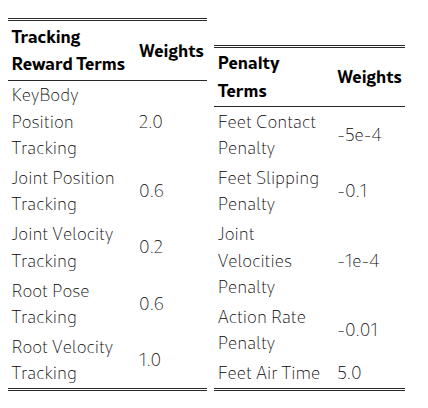
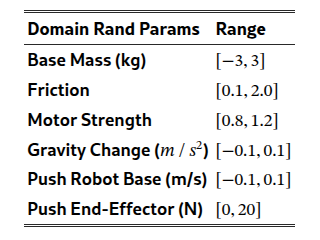

> Paper: [TWIST: Teleoperated Whole-Body Imitation System](https://arxiv.org/html/2505.02833v1)
>
> Page: https://yanjieze.com/TWIST/
>
> Code: https://github.com/YanjieZe/TWIST

## Abstract

通过全身运动模仿实现人形机器人的遥操作，是迈向通用机器人智能的重要一步，人体运动为控制所有自由度提供了一个理想的接口。然而，大多数现有的人形遥操系统未能实现协调的全身行为，通常仅限于孤立的行走或操作任务。

Teleoperated Whole-Body Imitation System（TWIST，遥操全身模仿系统）是一个通过全身运动模仿实现人形遥操作的系统。

1. 通过将人体动作捕捉数据重定向到人形机器人，生成参考运动片段。
2. 利用强化学习和行为克隆（RL+BC）的结合，开发出一种稳健、自适应且响应迅速的全身控制器。

通过系统分析，本文展示了如何通过引入特权（privileged）未来运动帧和真实世界动作捕捉（MoCap）数据来提高跟踪精度。

TWIST 使真实世界的人形机器人能够通过单一统一的神经网络控制器实现前所未有的、多功能的、协调的全身运动技能——涵盖全身操作、腿部操作、行走和富有表现力的动作。

## Introduction

使人形机器人具备多功能全身灵巧性的一个有前景的方法是**模仿人类动作**。然而，由于人形机器人与人类之间存在体现差异 (embodiment gap)，仅仅模仿离线的人类动作数据对于人形机器人的视觉运动控制是不够的；我们必须构建一个全身遥操系统来获取人形机器人的观察 - 动作数据。

此类系统的一个关键要求是控制器能够自主地将任意实时人类动作转换为平衡的机器人运动，同时紧密匹配人类的行为。为此，我们将全身遥操表述为**实时运动重定向和跟踪问题**

1. 通过将运动捕捉（MoCap）设备捕获的任意人类动作重定向，**推导出跟踪目标**——人形机器人的关节位置和根部速度。
2. 在大规模模拟环境中使用强化学习（RL）结合人类动作数据训练单一策略。

最终的控制器能够在每个时间步稳健且准确地跟踪目标机器人关节位置和根部速度，同时保持全身平衡。为了应对实时全身运动跟踪和遥操作的实际挑战，训练流程引入了几项关键技术，包括：

- 为了确保遥操的低延迟，RL 策略只能观察**当前时间步的参考运动**，这与将未来参考运动作为观测值的策略相比，会导致更保守和犹豫的行为。这种犹豫行为在实时遥操系统中被放大，*因为人类演示者在人形机器人上体验到犹豫行为时，往往会补偿自己的动作，从而导致无效的遥操控制*。为了解决这一问题，提出了一个两阶段的教师 - 学生框架：教师策略在**有权访问未来运动帧**的情况下进行训练，以学习更平滑的行为，随后指导仅跟踪单帧的学生策略。
- 离线人类动作数据集通常质量高且平滑，而实时人类动作和实时重定向并不那么稳定和平滑，导致在线遥操出现分布偏移。因此使用在线 MoCap 和重定向设置收集了一个小规模的 MoCap 人类数据集（150 个片段），并将其与 15K 离线动作片段结合，作为训练 RL 控制器的训练集。令人惊讶的是，尽管只使用了一小部分在线动作，但控制器在未见测试动作和真实世界遥操作中的表现显著更好且更稳定。
- 在离线重定向人类动作时，可以通过多次优化迭代来确保高质量的动作数据。然而，在遥操作期间的在线重定向时，快速推理至关重要，往往以牺牲平滑性为代价。联合优化 3D 关节位置和方向有助于缓解这种离线到在线的差距。
- 由于控制器的学习目标仅仅是运动跟踪，因此需要**施力的任务**（举起盒子）而不是到达目标位置的任务代表了分布外的场景，这会导致控制器偶尔产生抖动行为。为了使控制器能够学习施力，本文提出**在末端执行器受到大扰动的情况下训练控制器**，这显著提高了在需要接触和施力的任务中的鲁棒性。

## Related Works

### 基于学习的人形机器人全身控制

近年来，基于学习的方法，尤其是从仿真到现实的强化学习，在开发人形机器人的全身控制器方面取得了显著进展，使得人形机器人能够实现一系列技能，例如行走、跳跃、跑酷、跳舞、单脚跳以及跌倒恢复。然而，这些工作大多专注于为单一特定任务开发控制器，限制了其方法的**通用性**。

### 人形机器人的遥操系统

遥操是使人形机器人能够与复杂的真实世界环境互动并执行操作任务的关键。先前的研究探索了多种遥操作方式，例如稀疏的虚拟现实关键点、外骨骼、动作捕捉服和基于摄像头的姿态估计。然而，大多数系统显示出有限的协调全身技能，使其不足以用于一般家庭任务。例如，Mobile-TV 和 HOMIE 将上身和下身控制分离，通过操纵杆或脚踏板等外部命令引导运动，但限制了全身任务，如踢球或跨越障碍。

与本工作更密切相关的是，HumanPlus 和 OmniH2O 试图通过训练低级控制器来跟踪人类动作以实现全身遥操作。

- HumanPlus 依赖于基于摄像头的姿态估计，这在根位置精度方面存在挑战，影响了行走的保真度。
- OmniH2O 使用虚拟现实关键点，仅捕捉上身运动，仍然缺乏完整的全身控制。

## Method

### Curating Humanoid Motion Datasets

大部分数据来自公开可用的动作捕捉（MoCap）数据集——AMASS 和 OMOMO ，这两个数据集总共包含超过 15,000 个片段（大约 42 小时），其中一些不切实际的动作（如爬楼梯）被过滤掉了。

还使用自己的动作捕捉系统收集了一个小型的内部数据集，包含 150 个片段（大约 0.5 小时）。这个内部数据更好地反映了真实世界遥操作的条件，例如噪声和不完美的校准。值得注意的是，并没有设计这些动作来匹配遥操作任务——它们是随机收集的。

由于人形机器人与人类之间存在体现（embodiment）差异，直接跟踪原始人类动作并非易事。相反，将它们重定向到人形机器人格式更容易计算跟踪误差。对于大规模的公开数据集，采用了一个类似于 PHC 的离线重定向器，它优化了关键身体部位的位置，并且本文还优化了时间平滑性。尽管离线重定向可以产生更高质量的动作，但它涉及迭代优化，这使得它不适合实时遥操作。

为了模拟实时遥操的设置，我们在小规模的内部数据集上使用了一个在线重定向器，它使用逆向运动学（IK）方法高效地调整身体方向和脚部位置。尽管这种方法速度更快且适合实时使用，但它通常会导致动作不够平滑，可能会影响遥操的性能。

因此通过增强在线重定向器的优化目标，**联合优化 3D 关节位置和方向**，来缩小这种质量差距。这一改进减少了离线和在线动作质量之间的差异。

### Training A Whole-Body Controller in Simulation

简单的方法通常使用单阶段强化学习（RL）来训练一个可部署的跟踪策略，该策略仅跟踪当前的动作帧。然而，这通常会导致诸如脚滑等伪影，并且无法产生适合遥操作的平滑控制，这主要是**由于无法访问完整的动作序列**。

相比之下，本系统采用了一个两阶段的方法：

1. 通过强化学习训练一个**有权访问未来参考动作**的特权专家（教师）策略。
2. 使用强化学习和行为克隆（BC）联合优化一个可部署的学生策略，该策略仅依赖于**本体感知**和**每个时间步的一个参考帧**。

**特权教师策略**

教师策略 $π_{tea}$ 将未来参考运动帧序列（跨度为 2 秒）作为输入的一部分，使教师能够预测并规划即将到来的跟踪目标，从而进一步实现平稳的行走步态。此外，选择跟踪关节位置和机器人局部坐标系中的根部速度，而不是世界坐标系中的速度

1. 减轻累积跟踪误差和不完美的重定向；
2. 确保与现实世界的遥操设置更好地保持一致性。

 教师策略通过 PPO 进行优化，其奖励结构 $r_{tea}$ 强调准确跟踪，同时惩罚诸如抖动和脚部打滑等伪影，$r_{tea}=r_{track}+r_{penalty}$。

 

**可部署的学生策略**

由于在部署期间无法获得特权信息（如未来的运动帧），因此必须将专家策略 $π_{tea}$ 提炼为仅使用本体感知输入和即时参考运动目标的可部署学生策略 $π_{stu}$。由于输入模态不同而产生的观察差距给标准模仿方法（如 DAgger）带来了挑战，这些方法无法完全解决这一问题。因此，采用混合强化学习和行为克隆方法 (Learning humanoid locomotion over challenging terrain)，使用以下损失函数优化学生策略：

$$
L(π_{stu})=L_{RL}(π_{stu})+λD_{KL}(π_{stu}∥π_{tea}),(1)
$$

其中 $L_{RL}$ 表示使用与教师相同的奖励 $r_{tea}$ 的 PPO 损失，$D_{KL}$ 表示 KL 散度，用于鼓励模仿专家，权重 $λ$ 在训练过程中逐渐减小。结果表明，这种 RL+BC 策略显著优于纯 BC 和纯 RL，能够实现更平稳的运动和更好的泛化能力。

### Real-World Humanoid Teleoperation

获得全身控制器 $π_{stu}$ 后，由于对领域随机化（见上表）的精心调整，策略可以零样本部署到真实机器人上。

为了在现实世界中实现精确的实时运动跟踪，本文建立了一个在线流式传输和重定向流程，该流程使用 OptiTrack 以 120Hz 的频率捕获高质量人类运动，重定向为 50Hz 的人形运动。现实世界中的高质量跟踪目标确保了机器人能够以统一的方式执行跨越操作和行走的多样化任务。然后，$π_{stu}$ 将重定向的运动作为输入，并在 Nvidia RTX 4090 GPU 上以 50Hz 的频率输出关节位置指令，发送给运行在 1000Hz 的机器人的 PD 控制器。

## Experiments

主要在 Unitree G1 上进行实验，并分析了影响 TWIST 性能的关键因素。也可以迁移到其他机器人如 Booster T1。此外，还分析了 TWIST 的可达性、遥操作延迟和故障案例。

### Main Results on Whole-Body Humanoid Teleoperation

Unitree G1 是一款拥有 29 个自由度、身高 1.3 米的类人机器人，进一步在 Booster T1[47] 上对其进行了评估。具体效果看论文。

### Ablation Experiments

为了进一步评估 TWIST 的不同组成部分对其遥操效果的影响，收集了另一个小规模的动作捕捉（MoCap）运动数据集（50 个片段）用于评估，这些片段均未在训练中使用。

**关键发现 1**：RL+BC > RL > BC (DAgger)。纯 RL 方法由于无法预测未来的运动目标，常常会出现脚部滑动的伪影。与此同时，由于缺乏像 RL 那样的任务奖励指导，DAgger 有时无法稳定且稳健地跟踪未见运动。总之，尽管 RL 的泛化能力优于 BC，但将这两种方法结合起来可以显著提升性能。

**关键发现 2**：内部 MoCap 数据至关重要。我们发现，即使是添加一小部分内部 MoCap 序列——在线重定向以模拟真实的遥操作——也能显著降低对未见运动的跟踪误差。这种收益源于两个因素：

1. 内部捕获本身噪声更大且稳定性较差，受到校准漂移和遮挡的影响；
2. 在线重定向器产生的参考运动与离线版本相比不够平滑。让控制器接触这些现实世界的不完美之处，可以弥合干净的公共数据集与遥操作中遇到的变化之间的差距，从而提升泛化能力。

**关键发现 3**：学习施加力。没有末端执行器扰动的训练策略会导致在静止姿势期间出现漂移和不稳。在**训练中加入扰动可以显著提高稳定性**，这对于**接触丰富**的任务尤其重要。

**关键发现 4**：更好的在线重定向器，更好的跟踪效果。通过同时优化三维位置和方向来改进我们的在线重定向器，可以产生更平滑的人形参考运动。

### System Analyses

末端执行器——手和脚——表现出最大的跟踪误差，这与其在人形机器人运动学树的末端位置一致。

下肢部位，如脚和膝盖，通常比上肢部位（如肘部和手）产生更高的跟踪误差，这证实了我们的直觉，即由于更复杂的接触动力学，**跟踪下肢本身更具挑战性**。

系统总遥操作延迟约为 0.9 秒，如图 5 所示。主要开销来自于生成跟踪目标（0.7 秒），而策略推理仍然高效（0.2 秒）。进一步降低这种延迟将是**未来改进的关键重点**。

通过利用全身自由度，我们的遥操作系统显著提高了可达性，机器人几乎可以用手触摸到脚趾，展现出卓越的全身可达性。

大多数故障源于硬件不可靠。特别是，本文的机器人在连续运行 5-10 分钟后，电机容易过热，尤其是在需要蹲下的任务中，这需要在测试之间进行冷却。尽管如此，即使在极端测试条件下，我们的策略也表现出稳健的平衡控制能力。

## Limitations

尽管 TWIST 在遥操作人形机器人方面展示了强大的能力，但仍存在一些局限性和未来改进的方向：

缺乏机器人反馈。目前，没有将机器人的以自我为中心的视觉信息流式传输回人类操作员。因此，当发生视觉遮挡时，有效进行遥操作变得具有挑战性。此外，没有触觉反馈来告知操作员抓取动作是否成功，这限制了操作的自然性和可靠性。

硬件可靠性。当前一代人形硬件无法维持长期连续运行。未来的机器人硬件改进可能会显著增强整个系统的功能和鲁棒性。

对动作捕捉系统的依赖。该系统既不便于携带，也难以普及，尽管展示了使用全身人类运动数据的潜力。在未来，计划探索基于 RGB 的姿势估计技术，以弥合这一差距，并更便捷地近似动作捕捉数据的质量。
