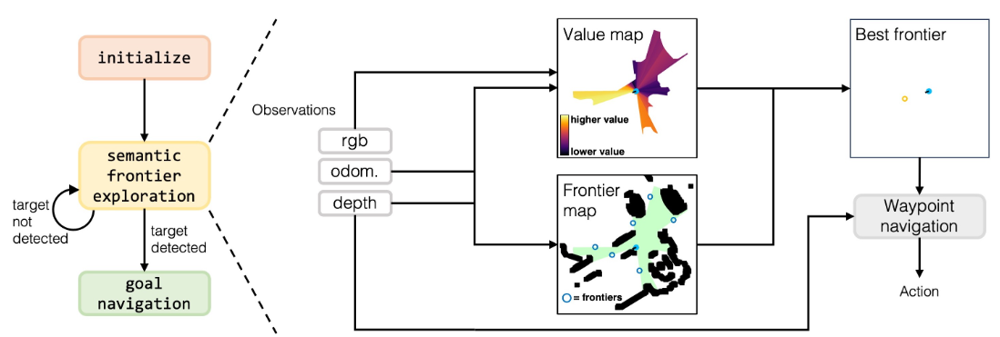
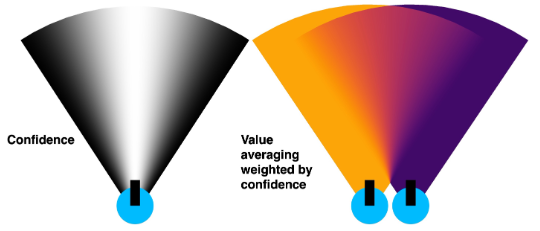

> Paper: [VLFM: Vision-Language Frontier Maps for Zero-Shot Semantic Navigation](https://arxiv.org/abs/2312.03275)
>
> Page: http://naoki.io/vlfm
>
> Code: https://github.com/bdaiinstitute/vlfm

## Abstract

理解人类如何利用语义知识在不熟悉的环境中导航并决定下一步探索的位置，对于开发具有类似人类搜索行为的机器人至关重要。

本文介绍了一种零样本导航方法，视觉 - 语言前沿地图（Vision-Language Frontier Maps，VLFM），该方法受人类推理的启发，旨在导航至新环境中未见的语义对象。

VLFM 利用**深度观测**数据构建占据地图（occupancy maps）以识别可探索的前沿区域（frontiers），并利用 RGB 观测数据和预训练的视觉语言模型（vision-language model）生成基于语言的价值图（language-grounded value map）。随后，VLFM 利用此价值图确定最有希望找到给定目标物体类别实例的前沿区域进行探索。

我们在 Habitat 模拟器中使用 Gibson、Habitat-Matterport 3D (HM3D) 和 Matterport 3D (MP3D) 数据集的照片级逼真环境对 VLFM 进行了评估。引人注目的是，在以路径加权的成功率（Success weighted by Path Length, **SPL**）为衡量指标的物体目标导航（Object Goal Navigation）任务中，VLFM 在所有三个数据集上均取得了最先进（state-of-the-art）的结果。

## Introduction

:::tip

人类在不熟悉环境中导航的过程是复杂的，通常依赖于明确的地图和内在知识的结合。这种内在知识**通常是语义知识的积累**，可用于推断空间布局，包括特定物体的位置和几何配置。例如，我们知道厕所和淋浴通常在浴室中一起出现，且通常靠近卧室。自然语言可以进一步增强这种先验语义知识，具体取决于上下文。

:::

VLFM 从深度观测中构建占据地图以识别已探索地图区域的前沿。为了寻找语义目标对象，**VLFM 提示预训练的 VLM 选择哪个前沿最有可能通向语义目标**。与以往基于语言的零样本语义导航方法相比，VLFM 不依赖于目标检测器和语言模型（例如 ChatGPT、BERT）仅使用文本语义推理来评估前沿。VLFM 使用视觉 - 语言模型直接从 RGB 图像中提取**语义值**，形式是与**涉及目标对象的文本提示的余弦相似度分数**。VLFM 使用这些分数生成基于语言的价值地图，用于识别最有希望探索的前沿。这种基于空间的联合视觉 - 语言语义推理提高了计算推理速度和整体语义导航性能。

## Related Works

**目标导航（ObjectNav）**

目标导航涉及在新环境中执行语义目标驱动的导航，其性能主要通过机器人到达给定目标对象类别的实例的路径效率来衡量。这基于有效利用语义先验应使机器人能够更高效地定位对象的前提。训练具有语义导航能力的机器人的学习方法通常利用强化学习、从演示中学习 或预测语义俯视地图，在这些地图上可以使用航点规划器。然而，这些特定任务的训练方法仅适用于它们所训练的封闭对象类别集，并且通常仅在模拟数据上进行训练，这可能会阻碍这些策略在现实世界平台上的部署。

**零样本目标导航（Zero-shot ObjectNav）。**

近期关于零样本目标导航方法的研究涉及改进由《A Frontier-Based Approach for Autonomous Exploration》提出的基于边界（frontier-based）的探索方法。基于边界的探索是指访问地图上已探索和未探索区域之间的边界，该地图由智能体在探索过程中迭代构建。

人们提出了许多选择下一个要探索的边界的方法，例如基于智能体预期获得信息量来选择边界的经典方法（Histogram Based Frontier Exploration，Learning-Augmented Model-Based Planning for Visual Exploration）。“轮子上的 CLIP”（CLIP on Wheels, CoW）采用了一种简单直接的方法：机器人探索最近的边界，直到使用 CLIP 特征或开放词汇物体检测器检测到目标物体。LGX 和 ESC 使用大型语言模型（LLM）处理以文本形式呈现的物体检测结果，以识别哪些边界最可能包含目标物体的实例。SemUtil 则没有使用 LLM，而是使用 BERT 来嵌入在边界附近检测到的物体类别标签，然后将它们与目标物体的文本嵌入进行比较，以选择接下来要探索的边界。

:::info

然而，这些方法引入了一个瓶颈：在能够语义评估边界之前，来自环境的视觉线索必须通过物体检测器转换为文本。此外，依赖 LLM 需要大量的计算资源，这可能需要机器人连接远程服务器。相比之下，**VLFM**使用一个视觉语言模型（VLM），该模型可以轻松加载到消费级笔记本电脑上，直接从 RGB 观测数据和文本提示生成语义价值评分，而无需从视觉观测生成任何文本。

:::

## Promble Formulation

:::tip 目标导航（ObjectNav）

机器人需要在一个以前未见过的环境中寻找目标物体类别（例如“床”）的一个实例。这种语义导航任务促使机器人**根据高级语义概念**（例如它所处的房间类型或它看到的物体类型）来**理解和导航环境**，而不是仅仅依赖于几何线索。

:::

机器人只能访问一个以自身为中心的 RGB-D 相机和一个提供其相对于起始姿势的当前前进和水平距离以及航向的里程计传感器。动作空间包括以下内容：向前移动（0.25 米）、向左转（30°）、向右转（30°）、向上看（30°）、向下看（30°）和停止。如果在 500 步或更少的步数内，在距离目标物体的任何实例 1 米范围内调用停止，则认为一个剧集 （episode）成功完成。

## VISION-LANGUAGE FRONTIER MAPS

初始化阶段，机器人原地旋转一周，以建立其前沿和价值地图，这对于随后的探索阶段至关重要。

探索阶段，机器人持续更新前沿和价值地图，以创建前沿航点，并选择最有价值的一个来定位指定的目标物体类别并导航至其位置。一旦它检测到目标物体的一个实例，它就会进入目标导航阶段。

目标导航阶段，机器人只需导航到检测到的目标物体上的最近点，并在足够接近时触发停止。

### Frontier waypoint generation

利用深度和里程计观测数据来构建机器人遇到的障碍物的自上而下的二维地图。

此地图内的已探索区域会根据**机器人的位置**、**当前朝向**以及**阻碍其当前视野部分被探索的任何障碍物**进行更新。

为了识别障碍物位置，将当前深度图像转换为点云，过滤掉任何过低或过高而不能被视为障碍物的点，将点转换到全局坐标系中，然后将它们投影到二维网格上。随后识别出**分隔已探索区域和未探索区域的每个边界**，并将其中点确定为潜在的前沿航点。随着机器人探索该区域，前沿的数量和位置会不断变化，**直到整个环境都被探索完毕且不再存在前沿。** 如果此时机器人仍未检测到目标物体，它将简单地触发停止动作以结束剧集（未成功）。

### Value map generation

价值地图类似于前沿地图的二维网格。这张地图为已探索区域内的每个像素分配一个价值，量化其在定位目标物体方面的语义相关性。

价值地图用于评估每个前沿，价值最高的前沿被选为下一个要探索的目标。与前沿地图类似，价值地图也利用深度和里程计观测数据来逐步构建一个自上而下的地图。然而，价值地图的不同之处在于它有两个通道，分别代表语义价值分数和置信度分数。

与人类直接从视觉观察中获取语义线索（例如，照明、房间类型、房间大小、与其他房间的连通性）的方式类似，而不是试图先用文字表示机器人当前可见的内容（例如，使用检测到的物体边界框），使用预训练的 BLIP-2 VLM，直接从机器人的当前 RGB 观测和包含目标物体的文本提示中计算**余弦相似度分数**。使用文本提示来衡量当前 RGB 图像所代表的区域对于寻找目标物体的价值（“看起来前面有一个<目标物体>。”）。这些分数随后被投影到自上而下的价值地图的相应通道中。

置信度通道旨在确定如果一个像素在语义价值通道中在上一时间步被赋予了值，并且在当前时间步位于机器人的视野内（FOV），那么它的值应该如何更新。如果该像素直到当前时间步才被看到，那么它不会影响该像素的语义价值分数。机器人视野内的像素的置信度分数取决于它相对于光轴的位置。位于光轴上的像素具有完全的置信度 1，而位于左右边缘的像素置信度为 0。具体来说，像素的置信度为 $\cos^2(\theta/(\theta_{fov}/2) \times \pi/2)$，其中 $\theta$ 是像素与光轴之间的夹角，$\theta_{fov}$ 是机器人相机的水平视野，如上图左所示。

当机器人移动到一个新位置，其视野（FOV）与之前看到的区域重叠时，该区域内每个像素的语义价值分数和置信度分数都会用新的分数进行更新。每个像素的新语义价值分数 $v_{\text{new}}^{i,j}$ 是通过将其当前和之前的值分数按其当前和之前的置信度分数 $c_{\text{curr}}^{i,j}$ 和 $c_{\text{prev}}^{i,j}$ 加权平均来计算的：$v_{\text{new}}^{i,j} = \frac{c_{\text{curr}}^{i,j} v_{\text{curr}}^{i,j} + c_{\text{prev}}^{i,j} v_{\text{prev}}^{i,j}}{c_{\text{curr}}^{i,j} + c_{\text{prev}}^{i,j}}$ 。新置信度分数也通过加权平均进行更新，这个加权平均倾向于更高的置信度值： $c_{\text{new}}^{i,j} = \frac{(c_{\text{curr}}^{i,j})^2 + (c_{\text{prev}}^{i,j})^2}{c_{\text{curr}}^{i,j} + c_{\text{prev}}^{i,j}}$。如上图右所示。

地图更新过程总结如下：

1. 在相机当前姿态下，创建一个自上而下描绘相机视野的锥形掩模，其中靠近相机光轴（上图白色部分）的像素具有更高的置信度分数；
2. 使用深度图像，更新掩模以排除被障碍物遮挡的视野区域；
3. 使用 BLIP-2，在掩模部分的价值地图内，计算当前 RGB 图像与文本提示之间的余弦相似度分数，以更新语义价值通道；
4. 使用置信度分数进行加权平均，更新掩模部分价值地图内的先前语义价值和置信度分数。

### Object detection

我们使用预训练的目标检测器来推断带有语义标签的边界框。具体来说，对属于 COCO 类别的目标物体使用 YOLOv7（ YOLOv7 在检测 COCO 类别内的物体方面表现更好），对所有其他类别使用 Grounding-DINO 。

如果检测到目标物体实例，使用 Mobile-SAM ，通过 RGB 图像和检测到的边界框来提取其轮廓。然后使用该轮廓和深度图像来确定物体上距离机器人当前位置最近的点，该点随后被用作导航至的目标航点。一旦机器人与该点的距离低于成功半径，就会触发停止动作。

### Waypoint navigation

在初始化之后，机器人始终会获得一个前沿航点或目标物体航点来进行导航，具体取决于是否已经检测到目标物体。为了确定每一步到达当前航点的动作，我们采用了一个点目标导航（PointNav）策略。为了确定每一步到达当前航点的动作，使用 Variable Experience Rollout（VER）（一种分布式深度强化学习算法）来训练一个 PointNav 策略。

:::tip PointNav

要求机器人仅依赖视觉观测和里程计来导航到指定的航点（二维坐标）

:::

使用 HM3D 数据集的训练集场景来训练我们的 PointNav 策略，使用与 VER 中描述的相同的超参数，使用 4 个 GPU（每个 64 个线程），并训练策略 25 亿步（大约 7 天）。与 ObjectNav 不同，PointNav 不需要对环境进行语义理解，仅使用几何理解即可高效且成功地完成任务。PointNav 策略仅使用以自身为中心的深度图像以及机器人相对于期望目标点的距离和航向作为输入，而不使用 RGB 图像。

用任何能够引导机器人到达视觉观测到的航点（无论是前沿还是检测到的目标物体）的替代方法来替换这个 PointNav 策略。倾向于使用 PointNav 策略的原因在于它的速度和易用性；它消除了与传统基于地图的方法相关的几个问题，尤其是当航点位于不可导航区域之外时（例如，当航点在目标物体上，而目标物体本身也可能在不同的障碍物上），因为目标的可导航性不会影响策略或其观测。

## EXPERIMENTAL SETUP

**数据集**

使用 Habitat 模拟器在三个不同真实世界环境的 3D 扫描数据集的验证集上评估：Gibson 、HM3D 和 MP3D 。使用在 SemExp 中开发的 Gibson 的 ObjectNav 验证集，其中包含 5 个场景的 1000 个剧集。HM3D 的验证集包含 20 个场景和 6 个目标类别的 2000 个剧集。MP3D 的验证集包含 11 个场景和 21 个目标类别的 2195 个剧集。

**指标**

对于所有方法，报告成功率（SR）和按路径长度倒数加权的成功率（SPL）。SPL 通过将智能体的路径长度与从起始位置到目标对象类别的最近实例的最短路径长度进行比较来评估智能体路径的效率。如果智能体没有成功，则为零；否则，它是最短路径长度除以智能体的路径长度（越大越好）。

**基线**

将 VLFM 与几种最新的零样本目标导航技术进行比较来评估其性能：带轮子的 CLIP（CoW）、ESC 、SemUtil 和 ZSON 。

ZSON 是一种开放词汇方法，使用 CLIP 将用于不同导航任务（ImageNav）的方法零样本迁移到目标导航任务。它在 ImageNav 上进行训练，其中使用图像作为目标；在测试时，使用目标类别的文本嵌入作为目标。（*看起来和 VLFM 差不多，不过不是基于语义地图。*）

CoW 探索最近的边界，直到使用 CLIP 特征或开放词汇目标检测器检测到目标对象，然后直接导航到检测到的目标。与 VLFM 类似，ESC 和 SemUtil 都执行基于语义边界的探索，但边界是使用附近的目标检测并将其转换为文本，然后使用仅基于文本的模型进行评估，该模型也考虑目标对象类别。

除了上述零样本最新方法外，还与监督方法进行了比较：PONI 、PIRLNav 、RegQLearn 和 SemExp 。SemExp 和 PONI 都在导航过程中构建地图并训练特定于任务的策略，以执行语义推理以预测可能的目标位置进行探索。PIRLNav 是一种端到端策略，使用行为克隆在 77k 人类演示上进行训练，并使用在线深度强化学习进行微调。RegQLearn 是一种仅使用深度强化学习进行训练的端到端策略。

## Results

反正很好。

消融实验主要是对语义地图的更新方式，如直接替换、无权平均和加权平均。

真实世界部署在 4090 笔记本上，16g 显存。
