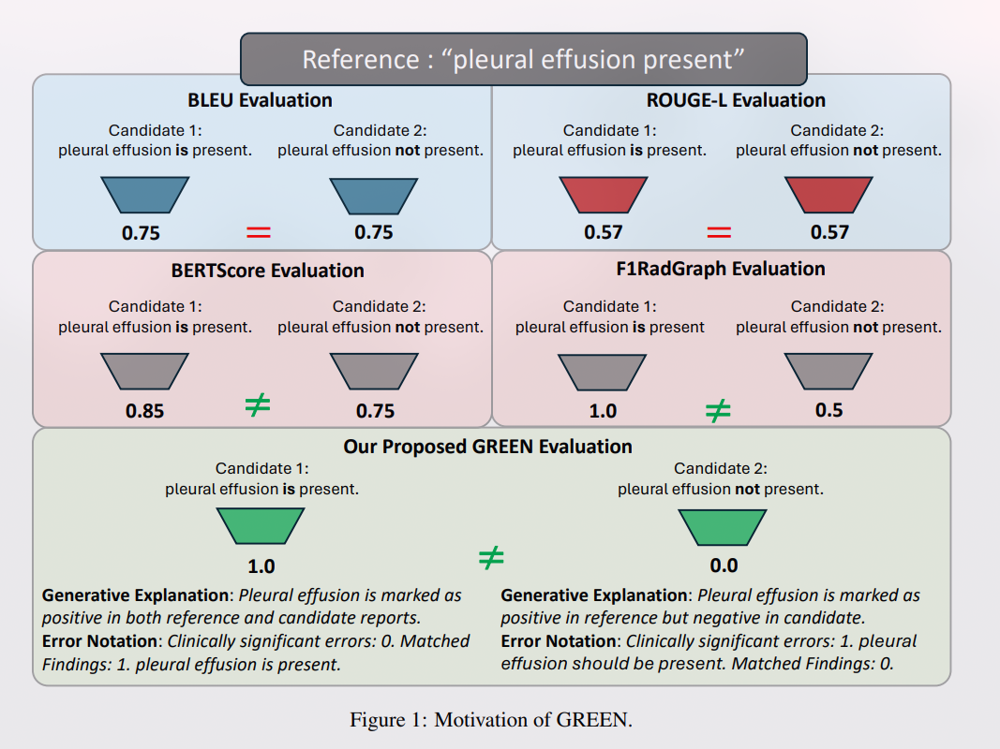

## Abstract

1. 现有的自动评估指标要么未能考虑事实正确性（如 BLEU 和 ROUGE），要么在可解释性方面存在限制（如 F1CheXpert 和 F1RadGraph）；
2. 提出 GREEN，一种利用 LLM 的自然语言理解能力来识别并解释候选报告中具有临床意义的错误的放射学报告生成指标，**既定量又定性**，提供
	1. 与专家偏好一致的评分；
	2. 对具有临床意义的错误的人类可解释说明；
	3. 一种轻量级的开源方法，其性能达到商业产品的水平；
3. GREEN 与 GPT-4 以及六位专家的错误计数和两位专家的偏好进行比较，与专家错误计数的相关性更高，偏好更一致。

## Introduction

放射学报告生成（RRG）的常用指标主要是考虑所生成报告与放射学专家给出的诊断是否一致，通常利用简单的 n-gram 重叠、通用语言相似性（F1， recall 等）、特定影像模态和疾病类别中的病例识别，以及商业化的大语言模型（GPT-4）。

然而当前 RRG 指标未能充分捕捉放射学报告的细微差别和多面性，而 GREEN 指标给出以下五大贡献：

1. Score：引入并验证了一个评分体系，从 0 至 1。实验证明 GREEN 精通放射学语言，并能够准确评估事实正确性和不确定性水平，超越了以往的方法；
2. Interpretable Evaluation Summary：提供了一种生成清晰、人类可读的评估总结的方法，与测试集的大小无关。通过提供详细的错误分类及其解释，GREEN 能够帮助机器学习从业者和专家准确定位其训练系统需要改进的领域。
3. Practicability：开源了 GREEN 模型，利用了一个参数量少于 7B 的语言模型，其报告评估能力与更大规模的模型相当。这种方法降低了对 GPU 的需求，并提高了处理速度；
4. Applicability：利用高性能的商业 LLM 服务通常需要对数据进行去识别化处理，并且需要通过机构审查委员会（IRB）对受保护的健康信息（PHI）的批准。而 GREEN 是免费的、开源的，并且被设计为可以在不涉及患者隐私问题的情况下用于保密数据集；
5. Multimodality：被设计为能够理解广泛的病理情况、语言风格和术语。我们证明了 GREEN 在分布外（Out-of-Distribution, OOD）数据上展现出对医学语言的泛化理解能力，这种能力涵盖了多种影像模态和解剖结构，具体通过检验其在 zero-shot 情况下对腹部 CT 报告的应用来展示。
6. Dataset：数据集包括与胸部 X 光相关的 10 万个 GPT-4 注释（涵盖多个数据集），以及跨多种影像模态的 5 万个注释。通过提供这些资源，我们希望促进自动化放射学报告生成系统在准确性和可靠性方面的进一步研究和改进。

## Related Work

F1CheXbert 仅涵盖 14 个 CheXbert 类别 (常见但具体的胸部 X 光检查结果)。

F1RadGraph 通过比较候选报告与参考报告之间在解剖结构和观察实体上的共识，使用基于人类标注训练的图模型。但是与人类评估的相关性过低。

RadCliQ 是由 ROUGE、BLEU、CheXbert 嵌入相似性和 RadGraph 组成的集成指标，旨在形成一个复合指标以匹配专家生成的错误计数。由于各个指标的权重未知，且单一数值评分对于临床整合来说是不够的，因此其可解释性较低。

## GREEN

### Generative Large Language Model

为 GPT-4 和 LLM 微调设计了一个 prompt，包含一个流程概述、判断标准（每种临床显著性和非显著性错误的六种不同错误类型）、一个参考报告、一个经过合成修改的候选报告，以及一个响应模板；使用该 prompt 提示 GPT-4 生成一个数据集，结果称为 GREEN 分析。最后利用 GREEN 分析来获得并验证 GREEN 评分和总结。

数据集由六个公开可用并且趋势别化的胸部 x 光片数据集（MIMIC-CXR，MIMIC-PRO，CandidPTX，PadChest，BIMCV-COVID19 以及 OpenI）中的十万对参考报告和候选报告构成。

参考报告和经过合成修改的候选报告配对过程使用了五种不同的启发式方法，每种方法生成了 20,000 对独特的配对：

1. 随机匹配候选报告和参考报告；
2. 通过从原始报告中删除和打乱句子来修改候选报告；
3. 使用训练好的 RRG 模型根据参考图像生成候选报告；
4. 使用 BERTScore（Zhang 等人，2019）评估语义相似性，将候选报告与最语义相似的报告配对；
5. 通过 RadGraph（命名实体识别数据集）对参考报告进行排列组合来创建候选报告，这些排列组合包括在报告中对发现的存在性进行更改或对大小、严重程度或位置进行修改。

为了确保整个数据集中配对的唯一性，每个原始报告仅仅使用一种方法配对，共有 174,329 份独特的报告被用作参考报告或候选报告。

### Baseline Model and Training
