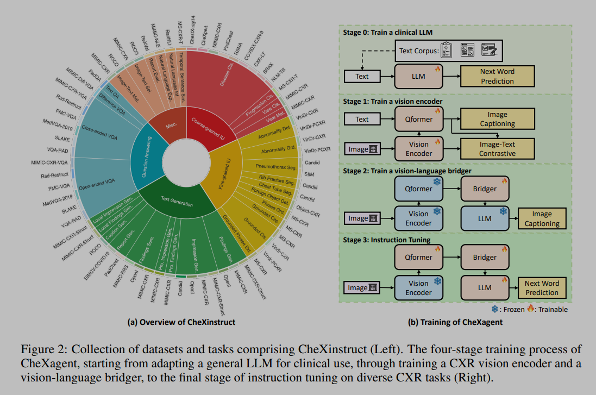

> 论文名称: [CheXagent: Towards a Foundation Model for Chest X-Ray Interpretation](https://arxiv.org/pdf/2401.12208)

> Code: https://github.com/Stanford-AIMI/CheXagent

## 摘要与介绍

目前基础模型在解读胸片所遇到的挑战有：

1. 医学影像领域大规模数据的有限可用性，由于患者隐私问题，很多数据受到严重限制；
2. 缺乏能捕捉医学数据复杂性的视觉编码器；
3. 缺乏评估基础模型在该任务上的评估框架。

本文

1. 引入 CheXinstruct，一个从 28 个公开数据集中获取的大规模指令微调数据集，大约六百万样本，每个样本是胸片 - 文本 -AQ 的组合；从 34 个任务和 65 个数据集中收集指令，包括粗/细粒度图像理解、问答以及文本生成等方式。
2. 提出 CheXagent，能够分析和总结胸片，大约 8B；
3. 构建 CheXbench，新颖的基准测试，旨在系统性评估模型在 8 个临床相关的胸片解读任务（7 个胸片数据集）上的表现。

与五位专家放射科医生的定量评估和定性评审表明，CheXagent 在 CheXbench 任务上的表现优于之前开发的通用和医学领域的基础模型。此外，为了提高模型透明度，本文还进行了跨性别、种族和年龄因素的公平性评估，以突出潜在的性能差异。

## CheXinstruct

由 4 个层级组成：

1. 能力层级，明确了一个胸片基础模型应具备的基本技能和能力；
2. 任务层级，概述了与每个确定的能力相对应的广泛特定任务，为 FM 在 CXR 背景下应能完成的任务提供了清晰的框架；
3. 数据集层级，识别并分类了各种 CXR 数据集，每个数据集都与特定任务相关联；确保数据集的相关性，并适当地与它们旨在支持的任务相匹配；
4. 实例层级，在最细粒度的层面上定义了每个数据集中的单个实例；每个实例包括一个输入（如 CXR ）及其相应的标签，构成了训练和评估 FM 的基本单位。

数据集中包含如下任务：

1. 粗粒度图像理解，它定义了对 CXRs 的整体理解，例如，视图分类（胸片的三种视图）和疾病分类；
2. 细粒度图像理解，它定义了对 CXRs 的局部理解，例如，异常检测，异常定位，以及异物检测；
3. 问题回答，它定义了回答与 CXRs 相关的问题的能力，例如，封闭式 VQA，开放式 VQA，差异 VQA，以及文本 QA；
4. 文本生成，它定义了生成放射学报告部分的能力，包括对发现的描述，印象生成，发现总结，以及局部发现生成；
5. 其他：这一类定义了对 CXR FM 至关重要的其他能力，例如，报告评估 ，以及自然语言解释 。

数据来源上，收集了现有公开数据集，或从现有数据集中提取出带有 **新标签** 的数据；对于每个数据集，制定不同任务，并按照官方的 train/val 分割方式分割（如果有的话）；并且未每个任务手动编写十个指令模板来创建指令。

因此最后 CheXinstruct 由三元组组成，包括图像（可以为空，如有不基于图像的任务），问题以及答案。

## CheXagent

模型由视觉编码器，视觉 - 语言连接器和语言解码器组成，训练过程分为四个阶段：

1. **第零阶段**，训练临床 llm，因为没有现有的好的临床 llm，基于 Mirstral-7B-v 0.1，使用了五种不同的文本来源进行训练：（i）PMC 文章摘要，（ii）MIMIC-IV 中的放射学报告，（iii）MIMIC-IV 出院摘要，（iv）维基百科上的医学术语，以及（v）CheXinstruct 中的 CXRs。对于 MIMIC-IV 数据，精心排除了 MIMIC-CXR 验证集和测试集中的任何研究，以防止数据泄露。
2. **第一阶段**，训练视觉编码器，这里参考了 Blip2 的方式，使用了包含图像 - 文本对的数据集，特别是来自 MIMIC-CXR、PadChest 和 BIMCV-COVID-19 的数据集；初步研究表明，使用图像文本对比 ITC 和图像字幕 IC（Image Captioning）可以带来性能提升；**这里使用了 LoRA 训练编码器和 QFormer**；
3. **第二阶段**，训练连接器，保持 LLM 和视觉编码器冻结，使用与第一阶段相同的数据，任务为 IC；
4. **第三阶段**，在完成第二阶段后，我们获得了一个为 CXR 解读量身定制的多模态大型语言模型（LLM）。在这个阶段，我们的重点转移到在 CheXinstruct 框架内对各种任务进行模型训练。在训练之前，考虑两个关键方面：（i）将某些任务 - 数据集对专门保留用于评估目的，以及（ii）确定最佳数据集比例，以确保在不同能力之间进行平衡训练。对于第一点，隔离了包括 OpenI、SLAKE 和 SIIM 在内的数据集，这有助于更流畅的评估过程（在论文第 5 节讨论）。对于第二点，通过仔细评估每个数据集的质量和多样性，**启发式** 地建立数据集比例。这种方法为未来探索自动化数据集选择和平衡留下了空间（高情商）。这种训练是使用下一个词预测目标进行的，损失计算仅限于答案（和 llava 一样，训练也是整个 llm 和连接器）。

具体细节上，使用 EVA-CLIP-g 作为视觉编码器，BERT 作为 QFormer，一个线性层作为连接器，Mistral 作为 LLM。

## CheXbench

通过两个维度评估，图像感知和文本理解，在 CheXinstruct 测试集的特定子集上进行。

**图像感知**

目标是

1. 评估 FMs 对各种数据分布的泛化能力；
2. 包括一系列具有挑战性、临床相关的任务；

为此，引入了 7 个数据集中的 6 个任务，使用**多项选择格式**，提出一张图像和一个问题，并考虑多个选项。由于评估 FMs 的开放式、**自由文本输出具有挑战性，我们改为计算与每个选项相关的对数似然分数**；然后选择得分最高的选项作为响应。对于每个任务，报告准确率。

任务如下：

1. 视图分类（700 个样本）：在 CheXpert 测试集上执行视图分类，有三个可能的选项（前后位、后前位和侧位），以及在 MIMIC-CXR 测试集上进行，有四个可能的选项 AP, PA, Lateral, LL（前后位、后前位、侧位和左旋位）；
2. 二元疾病分类（433 个样本）：在 CheXpert 测试集上进行二元疾病分类，有十二个疾病标签，在 RSNA 数据集上有一个疾病标签，在 SIIM 数据集上也有一个疾病标签。有两个可能的选项 yes or no（是和否）;
3. 单一疾病识别（864 个样本）：在 CheXpert 测试集上实现单一疾病识别（疾病标签来自专家放射科医生的注释）和 OpenI（疾病标签来自医学主题词表（MeSH）代码）。每个问题都有四个可能的选项，每个选项包括一个单一的疾病标签（例如“pneumonia 肺炎”）;
4. 多疾病识别（1387 个样本）：使用 CheXpert 和 OpenI 实现多疾病分类。每个问题都有四个可能的选项，每个选项包括一组多种疾病（例如“pneumonia, pleural effusion, cardiomegaly" “肺炎、胸腔积液、心脏肥大”）;
5. 视觉问题回答（1319 个样本）：在两个标准的 VQA 基准测试中评估 FMs：SLAKE 和 Rad-Restruct。SLAKE 包含有两个选项（是和否）的问题，而 Rad-Restruct 包含有两到四个选项的问题；
6. 图像 - 文本推理（380 个样本）：与单一疾病分类任务不同，这项任务采用困难的否定选项；每个问题都与两个具有挑战性的选项相关联，这两个选项仅通过一个表示位置或严重程度的单词来区分（例如，“左侧胸腔积液”与“右侧胸腔积液”）。我们使用 OpenI 数据集实现图像 - 文本推理。

**文本理解**

引入了以下 2 个任务：使用一系列自动化指标（ROUGE-L，CheXbertScore ，BERT-Score ，RadGraph-Score 和 GPT-4）以及来自五位放射科医生的人类专家评估，来评估开放式回答。

1. 发现部分生成：涉及识别图像的关键特征，例如异常的存在。使用 MIMIC-CXR。由于现有的医学基础模型通常在 MIMIC-CXR 上训练，本文还在一个私有数据集上评估这些模型；
2. 发现总结：给定放射学报告的发现部分，基础模型的任务是将关键观察结果总结成简洁的陈述。这项任务不包括图像。在 MIMIC-CXR 上评估发现总结。

## 结果

好。

尤其是视图分类，准确率 96%+，比以往的工作提高了 100%+。
