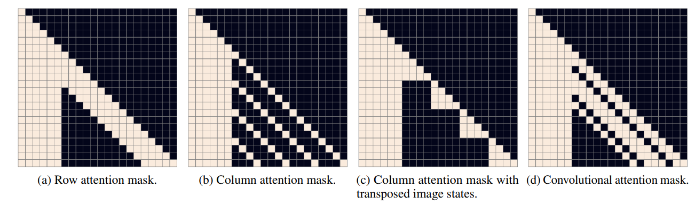
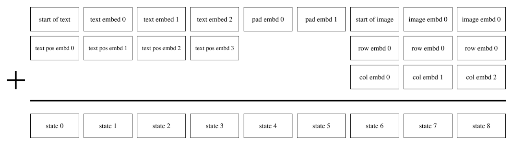

> 论文名称：[Zero-Shot Text-to-Image Generation](https://arxiv.org/abs/2102.12092)
>
> 作者：Aditya Ramesh 1 Mikhail Pavlov 1 Gabriel Goh 1 Scott Gray 1 Chelsea V oss 1 Alec Radford 1 Mark Chen 1 Ilya Sutskever 1
>
> Code：https://github.com/OpenAI/DALL-E

DALL-E 的目标是训练一个 Transformer，通过自回归的方式同时建模文本和图像 Tokens。然而直接使用图像的像素作为 tokens 需要大量的内存。

> Likelihood objectives tend to prioritize modeling short-range dependencies between pixels (Salimans et al., 2017), so much of the modeling capacity would be spent capturing high-frequency details instead of the low-frequency structure that makes objects visually recognizable to us.

于是通过一个两阶段的训练方式来解决这些问题。

## 训练方案

首先训练一个离散变分自编码器，将一个 $256\times 256$ 的 RGB 图像压缩为一个 $32\times 32$ 的 token，其中每个元素有 8192 种取值，这样，便将 tokens 压缩了 196 倍而不损失太多视觉质量。也就是编码器的输出是一个 $32\times 32 \times 8192$ 的特征，然后使用 `argmax` 再 flatten 为一个 $1024$ 的 `code_book_indices`，dalle 中会有一个可训练的词表 embedding，这被假设为一个均匀的离散分布，从中取值可以得到需要的 `img_seq`。

这里在训练的时候为了可训练，采用了重参数化的技巧，即利用 gumble softmax 来重参数化 argmax。

在重建图像时，真实的像素值是在一个有界区间内，在许多 $VAE$ 实现中，潜在变量的先验分布通常假定为正态分布。然而，$DALL-E$ 的作者发现，使用正态分布作为潜在变量的先验分布可能会限制模型的表达能力 $VAE$ 中使用的 $Gaussian$ 分布和 $Laplace$ 分布都是在整个实数集上，这造成了不匹配的问题。为了解决这个问题，论文中提出了 $logit-Laplace$ 分布，具有更重的尾部和更高的峰值。

dVAE 训练完毕之后固定参数，只使用编码器，将序列长度为 $256$ 的 BPE 编码的文本 $token$ 与总长度为 $1024(32 \times32)$ 的 $img_seq$ 相拼接，训练一个自回归的 $Transformer$ 来建模文本和图像的联合分布。

上述过程可以被视为最大化在图像 `x`、caption`y` 和 tokens`z` 上的联合似然分布的 `证据下限` （evidence lower bound），通过因式分解 $p_\alpha$ ,

在推理时，将 $transformer$ 的输出传给 $dVAE$ 的解码器用于生成新的图像，这其中可以单独使用文本或者是文本和图像结合的方式。

## 分布式并行

使用了一些多机分布式并行的方法，由于现在现有的算法很多，这里不再赘述。

## 稀疏注意力



针对其中的 image token 使用了三种稀疏注意力：

1. 行注意力
2. 列注意力
3. 卷积注意力

上图是 $text\ length$ 为 6，$image\ size$ 为 $4\times 4$ 的情况，因此 mask 是一个 22 的方阵；首先自回归模型是一个 causal attention 模型，因此整个上三角都会被 mask；而对于 Row Attention 来说，就是在 image token 的行上做注意力，即 token 只计算与同一行 token 的注意力，Column Attention 同理；关键代码如下：

```python
# split q, k, v to text and img
        split_index = L + padding - img_seq_len
        (q_text, q_img), (k_text, k_img), (v_text, v_img) = [
            F.split(t, [split_index], axis=1) for t in (q, k, v)]

        # text normal attention
        attn_text = q_text @ k_text.transpose(0, 2, 1)
        mask_value = get_minium_value(attn_text)

        attn_text = F.where(build_causal_attention_mask(
            *attn_text.shape[-2:]), mask_value, attn_text)

        attn_text = self.softmax(attn_text)

        text_out = attn_text @ v_text

        # image sparse attention

        q_img, k_img, v_img = [self.split(t) for t in (q_img, k_img, v_img)]

        image_attn = q_img @ k_img.transpose(0, 1, 3, 2)
        image_to_text_attn = q_img @ expand(
            k_text, repeats=self.image_size, axis=1).transpose(0, 1, 3, 2)

        attn = F.concat([image_to_text_attn, image_attn], axis=-1)

        # build mask
        mask = self.build_attention_mask(
            attn.shape, self.image_size, text_len, mask)

        attn = F.where(mask, mask_value, attn)
        attn = self.softmax(attn)

        # aggregate
        image_to_text_attn, image_attn = F.split(
            attn, nsplits_or_sections=[text_len], axis=3)
        image_to_image_out = image_attn @ v_img
        image_to_text_out = image_to_text_attn @ expand(
            v_text, repeats=self.image_size, axis=1)

        image_out = image_to_image_out + image_to_text_out

        # merge
        image_out = self.merge(image_out)

        # combination
        out = F.concat([text_out, image_out], axis=1)
```
流程如下：
1. 首先将 text 和 image token 分开，这样可以减少无用的计算，因为有些地方本身是被 mask 掉的；
2. text 之间做普通的 causal attention；
3. image 的 token 则需要进行形状变换，将需要计算的维度转置到后面，再进行矩阵乘，转换代码如下：
```python
def split(self, x):
	B, _, C = x.shape
	x = x.reshape(B, self.image_size, self.image_size, C)
	if self.axial_type == self.COLUMN:
		x = x.transpose(0, 2, 1, 3)
	return x
```
1. image 和 text 之间做注意力
2. 最后聚合起来。


## embedding



对 text 使用 position embedding，而对图像使用两个 row 和 col embedding 相加，此外，对于 text 不足 256 的部分，使用一个可以训练的 pad embedding 来补全。
