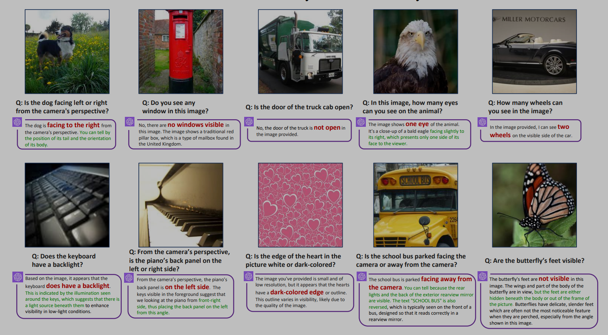
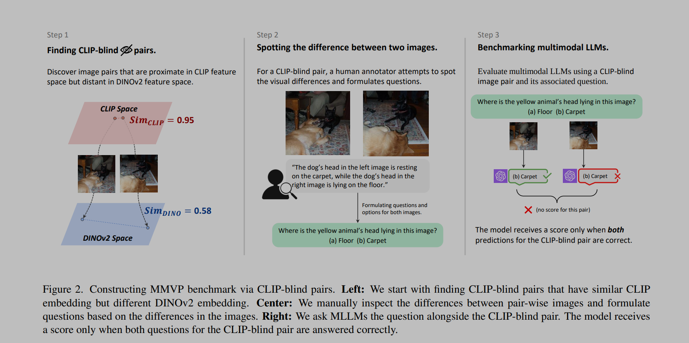
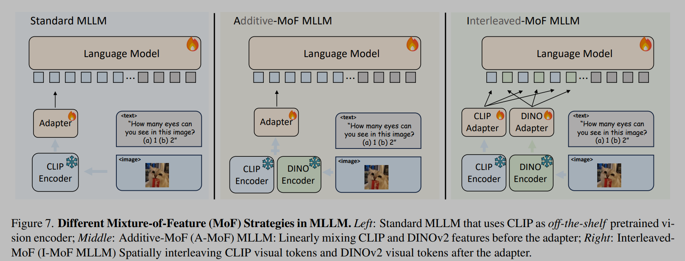

## 摘要和介绍

1. 最近的多模态大型语言模型（MLLMs）在视觉能力上仍然存在系统性的缺陷。为了理解这些错误的根源，探索了 CLIP 的视觉嵌入空间与仅视觉自监督学习之间的差距。
2. 本文识别出了“CLIP 盲对”——尽管存在明显的视觉差异，但 CLIP 感知为相似的图像。利用这些对，本文构建了多模态视觉模式（MMVP）benchmark。MMVP 揭示了包括 GPT-4V 在内的最先进系统在九种基本视觉模式的简单问题上挣扎的领域，常常提供错误的答案和幻觉解释。
3. 本文进一步评估了各种基于 CLIP 的视觉和语言模型，并发现挑战 CLIP 模型的视觉模式与多模态 LLMs 的问题之间存在显著的相关性。提出了一种特征混合（MoF）方法，证明了将视觉自监督学习特征与 MLLMs 整合可以显著增强它们的视觉锚定能力。

## 介绍

预训练模型的限制会影响到微调，在视觉方面，大多数 MLLMs 都采用的 CLIP 作为视觉编码器，本文首先识别了 CLIP 难以正确编码的失败 case，受到《Massproducing failures of multimodal systems with language models》的起码，当两个视觉上不同的图像被 CLIP 编码为相似的特征，称其为盲对。为了测量图像之间的视觉相似性，使用仅视觉训练的自监督编码器，如 DINOv2。

构建了 MMVP benchmark，总结了盲对的九种普遍模式，如方向、计数、视角，并且其中的七种无法通过任何基于 CLIP 的模型解决。

**CLIP 模型的表现和 MLLMs 的性能之间存在强烈的相关性。**

## The Multimodal Visual Patterns (MMVP) Benchmark

如图，盲对的识别是通过 CLIP 特征的相似程度与 DINOv 2 特征的相似程度确定的；然后通过人工标准的方式确定图像间的区别，这里精心设计了 150 对图像，共 300 个问题；并且通过人类问答证明了问题的简单性，参与者的平均准确率达到了 95.7%。

在消融实验中，通过交换选项和更改问题中的符号，以进一步确认这种糟糕的表现源于视觉能力不足，而不是语言模型种的幻觉。

## Systematic Failures in CLIP

使用 GPT4 总结了 CLIP 的九种失败模式：

1. 方向和方向性；
2. 特定特征的存在；
3. 状态和条件；
4. 数量和计数；
5. 位置和关系背景；
6. 颜色和外观；
7. 结构和物理特性；
8. 文本；
9. 视角和透视。

当 CLIP 在某种视觉模式上表现不佳时，MLLM 也倾向于展现出类似的情况，本文计算了 CLIP 模型和 MLLM 在每个视觉模式上表现的皮尔逊相关系数，结果显示 LLaVA1.5 和 InstructBLIP 都有超过 0.7 的分数。

## Mixture-of-Features (MoF) for MLLM

通过研究特征混合（MoF）来迈出回答这个问题的初步步骤。我们首先从加性 MoF 开始，它混合了 CLIP 特征和仅视觉自监督学习（SSL）模型特征。结果显示，每个编码器在作为 MLLM 中的预训练模型时都展现出了独特的优势和局限性。随后，我们提出了交错 MoF，它将 CLIP 和 SSL 的特征整合到 MLLM 中，以增强视觉锚定，同时不影响模型遵循指令的能力。

采用 LLaVA 框架，使用 CLIP-ViT-L-14 和 DINOV2-ViT-L-14 作为视觉编码器，并使用与 LLaVA 一直的实验设置。

###   Additive MoF

加性混合特征，按照比例进行相加；随着 DINOv2 比例的增加，MLLM 的能力会下降。DINOv2 以牺牲模型遵循语言指令的能力为代价，提高了模型的视觉感知能力，而 CLIP 特征增强了模型遵循语言指令的能力。

###  Interleaved MoF

如图直接将 token 按照原本的空间顺序进行交错，交错 MoF 显著增强了视觉锚定能力，在 MMVP 中观察到 10.7% 的增长，同时没有影响模型遵循指令的能力。
