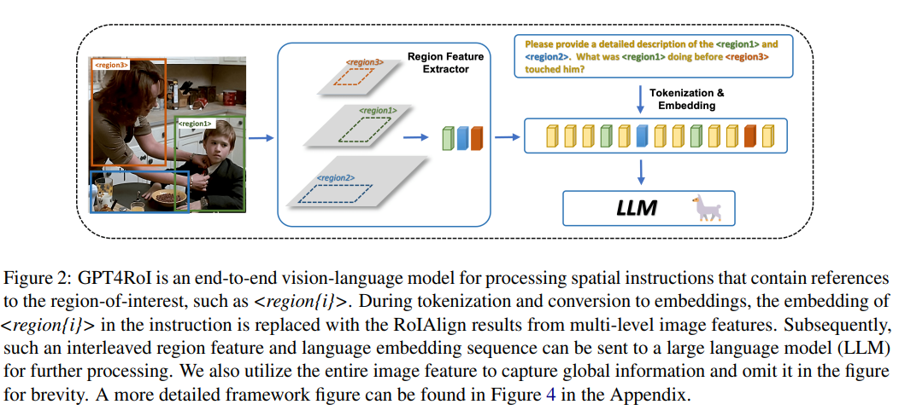
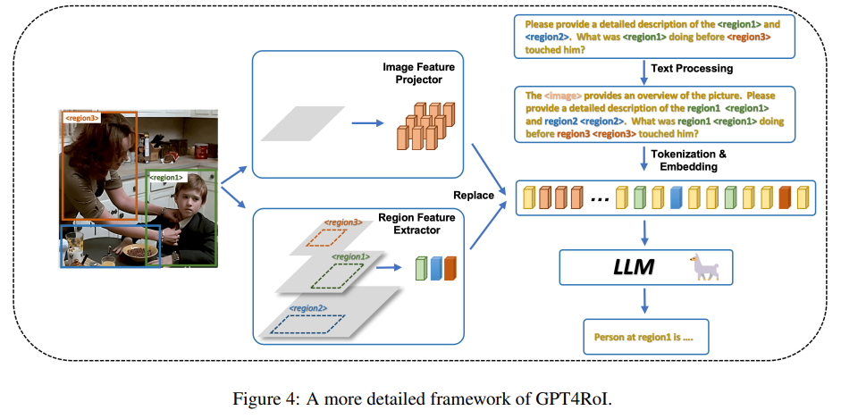
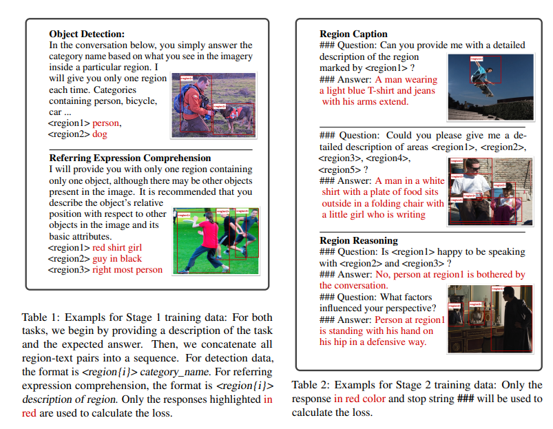

>论文名称：[GPT4RoI: Instruction Tuning Large Language Model on Region-of-Interest](https://arxiv.org/pdf/2307.03601)
>
>Code: https://github.com/jshilong/GPT4RoI

## 介绍

1. 视觉指令调整大型语言模型（LLM）在图像 - 文本对上已经实现了通用的视觉 - 语言能力。然而，区域 - 文本对的缺乏限制了它们在细粒度多模态理解方面的进展。
2.在本文中，我们提出了空间指令调整，它在指令中引入了对感兴趣区域（RoI）的引用。在发送到 LLM 之前，引用被 RoI 特征替换，并与语言嵌入交错作为序列。
3. 超越语言的交互：用户可以通过语言和绘制边界框与我们的模型交互，灵活调整引用的粒度。
4. 多样化的多模态能力：GPT4RoI 可以挖掘每个 RoI 内的多种属性信息，例如颜色、形状、材料、动作等。
5. 它可以基于常识对多个 RoI 进行推理。

关键词：spatial instruction learning。



## GPT4RoI



整体由视觉编码器、图像级特征投影器、区域特征提取器和大型语言模型（LLM）组成，实际上还是 LLaVA 架构，这里的区域特征提取器采用了目标检测领域中广泛使用的模块，主要是基于视觉编码器构建了一个多级的特征金字塔，再采用 RoIAlign 根据用户指令中的区域引用在每个级别上提取区域特征，然后融合为一个单一的嵌入（长度为 1 的 Token），直接作为区域表示。在 CLIP 中选择四层特征，再使用五个轻量级的 shuffle 模块。代码如下：

```python
    # mlvl_feats 长度为4的列表
    def forward(self, mlvl_feats, bboxes):
        if mlvl_feats[0].dim() == 3:
            h = w = int(math.sqrt(mlvl_feats[0].shape[1]))
            assert h == 16
            assert w == 16
            b, c = mlvl_feats[0].shape[0], mlvl_feats[0].shape[-1]
            # reshape回二维
            mlvl_feats = [item.reshape(b, h, w, c).permute(0, 3, 1, 2) for item in mlvl_feats]
        base_shape = mlvl_feats[0].shape[-2:]
        num_level = len(mlvl_feats)
        ## 插值回原来的大小
        to_shape = [(base_shape[0] * 2 ** level, base_shape[1] * 2 ** level) for level in range(num_level)]
        to_shape = to_shape[::-1]
        for level in range(num_level):
            feat = mlvl_feats[level]
            shape = to_shape[level]
            mlvl_feats[level] = F.interpolate(feat, size=shape, mode='bilinear', align_corners=True)

        mlvl_feats = self.mlvl_fuse(mlvl_feats)

        return self.roi_align(mlvl_feats, bboxes)
```

fuse 模块由几个轻量级的卷积组成，forward 如下

```python

    def forward(self, inputs, ):
        feat_size = [item.shape for item in inputs]
        new_inputs = []
        for feat, single_feat_size in zip(inputs, feat_size):
            # 这里好像是一个常见的操作
            coord_feat = self.generate_coordinate(single_feat_size, device=inputs[0].device)
            feat = torch.cat([feat, coord_feat], dim=1)
            new_inputs.append(feat)
        inputs = new_inputs

        # 4 个 卷积
        inputs = [self.input_conv[lvl](item) for lvl, item in enumerate(inputs)]
         # 5 个
        for conv_m in self.fuse_convs:
            inputs = self._single_shuffle(inputs, [conv_m])
        return inputs

```

shuffle 的操作如下，就是把当前 level 特征图的部分通道和更高/低层特征图的部分通道结合起来，最后再使用卷积；看起来是所有通道交错，最后都会被利用到。

```python
    def _single_shuffle(self, inputs, conv_module):
        if not isinstance(conv_module, (nn.ModuleList, list)):
            conv_module = [conv_module]
        for single_conv_m in conv_module:
            fused_inputs = []
            for fuse_lvl_tuple in self.fuse_lvl_list:
                tar_lvl, top_lvl, dow_lvl = fuse_lvl_tuple
                tar_input = inputs[tar_lvl]
                top_input = inputs[top_lvl]
                down_input = inputs[dow_lvl]
                remain = tar_input[:, :self.remain_chs]
                from_top = top_input[:,
                           self.remain_chs:][:,
                           self.shuffle_channles:]
                from_top = F.interpolate(from_top.to(torch.float32),
                                         size=tar_input.shape[-2:],
                                         mode='bilinear',
                                         align_corners=True)
                from_down = down_input[:, self.remain_chs:][:, :self.
                shuffle_channles]
                from_down = F.interpolate(from_down.to(torch.float32),
                                          size=tar_input.shape[-2:],
                                          mode='bilinear',
                                          align_corners=True)
                fused_inputs.append(
                    torch.cat([remain, from_top, from_down], dim=1))
            fused_inputs = [single_conv_m(item) for item in fused_inputs]
            inputs = fused_inputs
        return inputs

```

特征提取模块用了 `RoIAlign` ，搞不懂啊，得到相应的特征之后再替换 `<bbox>`：

```python
                        if spi_feat is not None:
                            spi_embeds = torch.zeros_like(cur_new_input_embeds)
                            spi_mask = (cur_input_ids ==
                                        self.tokenizer.convert_tokens_to_ids(
                                            ['`<bbox>'])[0])
                            # 替换到 spi_embeds 上
                            spi_embeds[spi_mask] = spi_feat.to(spi_embeds.dtype)
                            # 再替换到input_embeds上
                            cur_new_input_embeds = cur_new_input_embeds * (
                                                                              ~spi_mask).to(
                                cur_input_embeds.dtype)[:, None] + spi_embeds


```

### Region Token

定义了一个特殊的 token `<region{i}>`，作为占位符，在分词和嵌入之后被对应的区域特征替换。并且在每个指令前添加一个特殊的前缀提示：“The `<image>` provides an overview of the picture”，这里的 `<image>` 是一个特殊的 token 占位符，表示图像的全局信息。

### 训练



使用 next-token prediction loss，模型预测下一个 token；同样是两阶段训练：

1. 第一阶段使用包含颜色、位置和类别描述的简单区域 - 文本对，目的是对齐区域特征和 LLM 中的 word embedding；这里直接加载了 LLaVA 在 initial stage（第一阶段？）训练之后的权重，只训练区域特征提取器。这一阶段的数据来自于常规检测数据集和具有简短表达形式（通常在五个单词以内）指代检测数据集，具体来说，COCO、RefCOCO、RefCOCO+；具体训练中，对于 COCO 数据集，首先在提示中解释任务，然后进行单字（一个单词）区域标题预测，对于后两种，同样给出人物定义，但是训练模型生成区域的基本属性描述，只有上图中红色部分用于计算损失。
2. 第二阶段则处理更复杂的概念，如动作、关系和常识推理，保持图像编码器冻结，旨在使得模型能够准确跟随用户指令并解决复杂的单/多区域理解任务；单区域标题从 VG 和 RefCOCOg 构建，多区域标题从 Flicker30K 构建。为了模拟用户指令，为每个标题任务创建了 20 个问题；区域推理人物，从视觉常识推理（VCR）构建。同时为了提高模型在多轮对话中的能力和生成更像人类的回应，使用了 LLaVA150K 数据集，使用 LVIS 检测器，从每张图片中提取多达 100 个检测框，这些框以“`<region{i}>` 可能包含一个 class_name”的形式与用户指令连接，LLaVA150K 显著提高了模型的多轮对话能力。

## 局限性

主要在与指令混淆和区域内细粒度信息的错误识别。

### 模型架构

224 的图像尺寸过小，过大的输入则会带来更高的计算成本。

### 区域级别指令

实际使用中用户可能会就任意数量的区域提出问题，而现有的数据不能满足。

### 交互模型

目前只支持自然语言和边界框，可以引入更多交互方式，如点击、涂鸦和基于图像的搜索等。

## Other Region Reference Format

使用文本坐标或额外位置标记，需要通过在大量数据集上训练，将大量的位置标记与图像中的位置对齐；但这实际上是很简单的操作，可以通过外部的目标检测器实现，这也是本文的动机，GPT4RoI 需要的数据量少得多，并且允许快速适应特定领域的特定问题；缺点是框架看起来不够优雅，其**假定了输入包含所有要分析的区域**。

建模几何属性具有一定挑战性，检测领域使用 L1 或 IOU loss 可以自然地处理 bbox 这样的几何约束，而将其加入使用交叉熵的 next-token prediction task 存在挑战。
