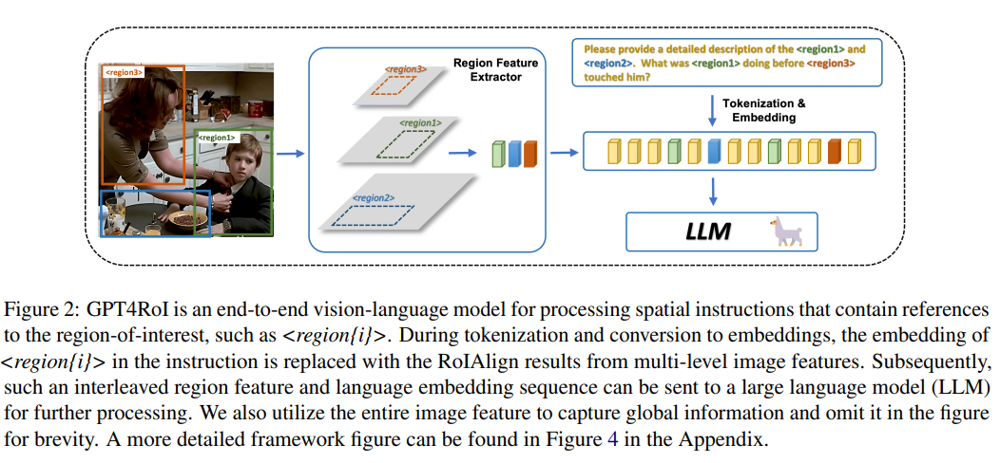
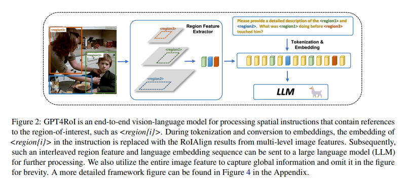
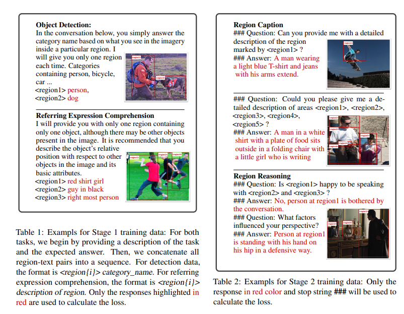

>论文名称：[GPT4RoI: Instruction Tuning Large Language Model on Region-of-Interest](https://arxiv.org/pdf/2307.03601)
>Code: https://github.com/jshilong/GPT4RoI

## 介绍

1. 视觉指令调整大型语言模型（LLM）在图像 - 文本对上已经实现了通用的视觉 - 语言能力。然而，区域 - 文本对的缺乏限制了它们在细粒度多模态理解方面的进展。
2.在本文中，我们提出了空间指令调整，它在指令中引入了对感兴趣区域（RoI）的引用。在发送到 LLM 之前，引用被 RoI 特征替换，并与语言嵌入交错作为序列。
3. 超越语言的交互：用户可以通过语言和绘制边界框与我们的模型交互，灵活调整引用的粒度。
4. 多样化的多模态能力：GPT4RoI 可以挖掘每个 RoI 内的多种属性信息，例如颜色、形状、材料、动作等。
5. 它可以基于常识对多个 RoI 进行推理。

关键词：spatial instruction learning。

## GPT4RoI

整体由视觉编码器、图像级特征投影器、区域特征提取器和大型语言模型（LLM）组成，实际上还是 LLaVA 架构，这里的区域特征提取器采用了目标检测领域中广泛使用的模块，主要是基于视觉编码器构建了一个多级的特征金字塔，再采用 RoIAlign 根据用户指令中的区域引用在每个级别上提取区域特征，然后融合为一个单一的嵌入，直接作为区域表示

### Region Token

定义了一个特殊的 token \<region{i}\>，作为占位符，在分词和嵌入之后被对应的区域特征替换。并且在每个指令前添加一个特殊的前缀提示：“The \<image\> provides an overview of the picture”，这里的 \<image\> 是一个特殊的 token 占位符，表示图像的全局信息。

应该就是Flamingo那种，但是用了RoIAlign。

### 训练

使用 next-token prediction loss，模型预测下一个 token；同样是两阶段训练：
1. 第一阶段使用包含颜色、位置和类别描述的简单区域-文本对，目的是对齐区域特征和 LLM 中的 word embedding；这里直接加载了 LLaVA 在 initial stage（第一阶段？）训练之后的权重，只训练区域特征提取器。这一阶段的数据来自于常规检测数据集和具有简短表达形式（通常在五个单词以内）指代检测数据集，具体来说，COCO、RefCOCO、RefCOCO+；具体训练中，对于 COCO 数据集，首先在提示中解释任务，然后进行单字（一个单词）区域标题预测，对于后两种，同样给出人物定义，但是训练模型生成区域的基本属性描述，只有上图中红色部分用于计算损失。
2. 第二阶段则处理更复杂的概念，如动作、关系和常识推理，保持图像编码器冻结，旨在使得模型能够准确跟随用户指令并解决复杂的单/多区域理解任务；单区域标题从 VG 和 RefCOCOg 构建，多区域标题从 Flicker30K 构建。为了模拟用户指令，为每个标题任务创建了20个问题；区域推理人物，从视觉常识推理（VCR）构建。同时为了提高模型在多轮对话中的能力和生成更像人类的回应，使用了 LLaVA150K 数据集，使用 LVIS 检测器，从每张图片中提取多达100个检测框，这些框以“\<region{i}\>可能包含一个 class_name”的形式与用户指令连接，LLaVA150K 显著提高了模型的多轮对话能力。

