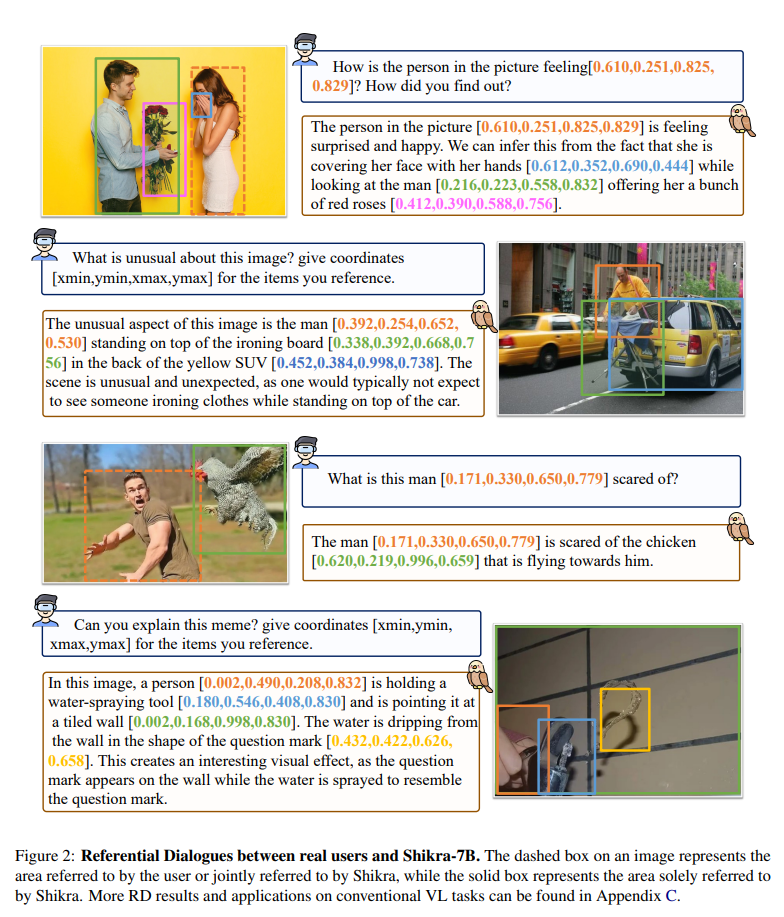

>论文名称：[Shikra: Unleashing Multimodal LLM’s Referential Dialogue Magic](https://arxiv.org/pdf/2304.15195)
>
>Code: https://github.com/shikras/shikra

## 摘要

1. 在人类对话中，个体可以在场景中指明相关区域，同时与他人交流。相应地，对方可以根据需要引用特定区域进行回应。这种自然的指代能力在当前的多模态大型语言模型（MLLMs）中仍然缺失。
2. 本文提出了一个名为 Shikra 的 MLLM，能够处理自然语言中的空间坐标输入和输出，无需额外的词汇表、位置编码器、预/后检测模块或外部插件模型，所有输入和输出都以自然语言形式呈现。
3. 指代对话是各种视觉 - 语言（VL）任务的超集。Shikra 能够自然地处理与位置相关的任务，如 REC 和 PointQA，以及传统的 VL 任务，如图像字幕和 VQA。

## 介绍与相关工作

主要介绍了指代对话。

### 位置表示

将兴趣区域输入到模型中呈现了各种方法。一些方法直接将裁剪的图像补丁与原始图像作为模型输入进行连接。还有一些方法使用 0/1 掩码或高斯图输入与原始图像一起，以强调用户兴趣的区域。一些方法首先将点和框编码为位置编码，然后将它们添加到中间特征或学习到的查询中。输出兴趣区域是一种高度集中的技术，存在许多定位范式。基于锚点的方法利用预定义的滑动窗口和提议候选区域进行分类，例如，Fast R-CNN。一些单阶段方法去除锚点，直接回归四个值用于边界框坐标，例如，FCOS。一些方法采用一对一的标签分配将目标检测发展为端到端的方式，例如，DETR 和 POTP。一个有趣的流派是，它将检测任务形式化为序列生成任务。它希望图像的空间位置在 1,000 个箱中，并使用 1,000 个词汇表来表示它。对于检测，Pix2seq 以自回归的方式对坐标词汇表进行分类。在 Pix2seq 之后，几种方法，例如 OFA、Unified-IO、UniTab、GIT 和 VisionLLM 引入了类似的坐标词汇表以及语言词汇表用于目标检测和 REC 任务。不同地，Shikra 将位置输入/输出制定为最自然和灵活的语言形式。

还有在自回归模型中实现检测对象的方法，引入了额外的词汇表（如 `<bin_0>`, …, `<bin_100>`）来表示空间离散化图像中的坐标。实验显示，直接使用数字更加直观，但是当框太多时，会导致计算成本增加。

## 当前多模态大模型的棋盘测试

当前的多模态大型语言模型（MLLM）能否理解绝对空间位置？目前的 MLLM 无法直接输出坐标；因此设计一个棋盘测试，将对象定位简化为部分选择任务。具体来说，将一个图像划分为 2×2 的棋盘。接下来，询问：“`<image>` Which part is `<expr>` in if the picture is divided equally into four 2 by 2 parts? Choose from: (A) Top-left (B) Top-right (C) Bottom-left (D) Bottom-right.”其中 `<image>` 和表示输入图像标记和类别名称。我们从 LVIS 构建测试数据，这是一个感知检测，拥有超过 1000 个入门级对象类别。我们选择完全位于某个特定部分的对象（即不考虑模糊位置）。总共，我们每个部分选择 600 张图像，总共在 945 个类别中有 2400 张图像。

我们使用 LLaVA-13B 进行棋盘测试，但结果并不令人满意。我们尝试了各种指令方法，LLaVA 应该达到的准确率为 25.96%，这与随机选择相当。这表明以前的粗粒度视觉 - 语言对齐预训练可能不足以使 MLLM 捕捉图像的确切空间位置。我们需要探索合适的坐标表示和更细粒度的训练数据。

## Shikra

### 架构

看起来像 LLaVA。

### 位置的数值表示

使用 $[x_{min},y_{min},x_{max},y_{max}]$ 来表示框，$[x_{center},y_{center}]$ 表示区域中心，根据图像大小进行归一化，并保留三位小数，记录坐标的方括号可以出现在句子中，作为句子的任意成分，像普通文本一样，无差别的进行分词处理。
