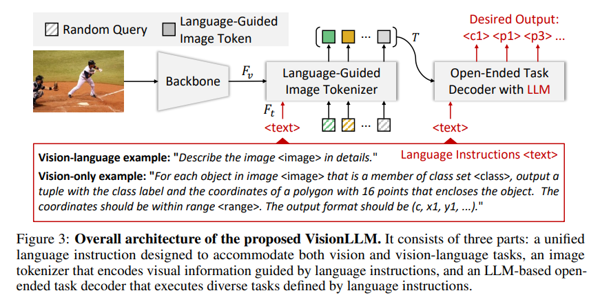
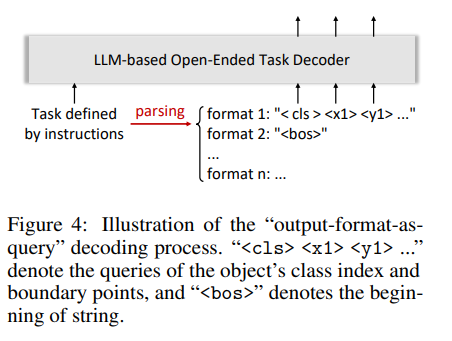
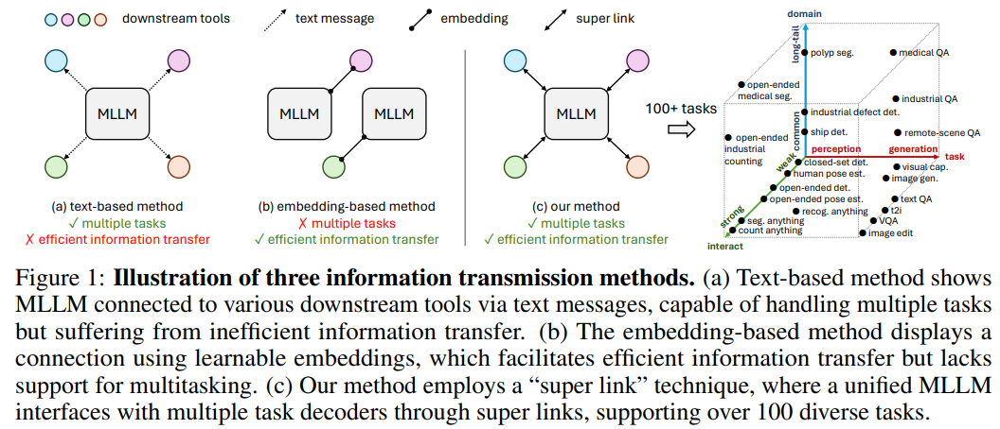
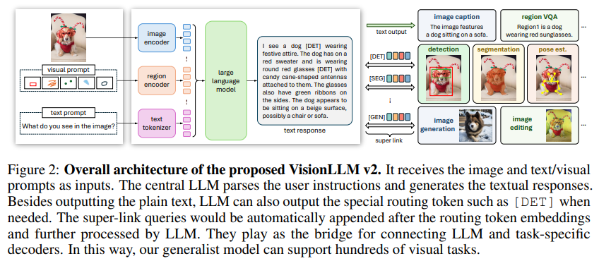

> 论文名称：[VisionLLM: Large Language Model is also an Open-Ended Decoder for Vision-Centric Tasks](https://arxiv.org/pdf/2305.11175)

> V2: [VisionLLM v2: An End-to-End Generalist Multimodal Large Language Model for Hundreds of Vision-Language Tasks](https://arxiv.org/pdf/2406.08394)

> 代码：https://github.com/OpenGVLab/VisionLLM

## 介绍

1. CV 领域中的强大视觉基础模型受限于预先定义形式的人物，难以与 LLMs 的开放式任务能力相比；
2. 本文提出了一个基于 LLM 的面向视觉人物的框架 VisionLLM，将图像视为一种外语，为视觉和语言任务提供了统一的视角。

## VisionLLM

### overall architecture



提供了一个语言引导的图像分词器，根据给定的 language prompt 对视觉信息进行编码，以及一个基于 LLM 的开放式任务解码器，利用前者编码的视觉信息进行生成。

### 统一的语言指令

对于 Vision-Language Tasks，image captioning 任务使用 The image is `<image>`. Please generate a caption for the image: ；VQA 使用 The image is `<image>`. Please generate

an answer for the image according to the question: `<question>`

对于 Vision-Only Tasks，设计有效的语言指令十分具有挑战性，本文通过提供任务描述并使用语言指令指定期望的输出格式。

### Language-Guided Image Tokenizer

使用视觉主干网络提取给定图像的四个不同尺度，利用文本编码器（如 BERT 等）从给定的提示中提取语言特征，通过 cross attention 将语言特征嵌入每个尺度的视觉特征中，产生多尺度的语言感知视觉特征，对其多模态间的特征。

随后采用基于 Transformer 的网络，如（Deformable DETR）和 M 个随机初始化的 Query Token 来捕获图像的高级信息。

### LLM-based Open-Ended Task Decoder

解码器使用 Alpaca，用于处理各种与语言引导相关的视觉任务，但是其一些缺陷：

1. 词汇表中只有少数数字标记（0-9）；
2. 使用多个标记来表示类别名称，在分类任务中效率不高；
3. 是一个因果模型，对视觉感知任务不好。

因此本文扩展了额外的标记，为视觉任务所设计，如位置标记，-512 到 512，引入了与语义无关的分类 token `<c0>` - `<c511>`。



最后引入了以查询形式的输出格式解码，首先使用 LLM 从任务指令中解析结构化输出格式，然后将结构化输出格式的 token 作为查询输入到解码器中。

这样，图像位置和输出都被制定为一种外语，从而统一视觉任务到 token classification 的形式，并且可以使用交叉熵损失训练。

## VisionLLM V2

### 介绍

提出了一种新的信息传输机制，称为 super link 超级链接，作为链接 MLLM 和特定任务解码器的媒介；允许 MLLM 在多个下游解码器直接传输任务信息和梯度反馈，还有效解决了多任务场景中的训练冲突，因此本模型在数百个 language-vision tasks 上训练。



如图，Text-based 方法允许 MLLM 链接多种下游任务，但是信息传输低效，Embedding-based 方法使用可训练的 embedding 来达成信息传输，但是不可以适用于多任务，而本文的 super link 兼具两者优点。

### 模型设计



主要由四个部分组成：

1. 图像编码器和区域编码器；
2. 大语言模型；
3. 一系列特定任务的解码器，执行下游任务了；
4. super link，使用 routing tokens 和 super link queries 进行高效无冲突信息传输。

对于图像输入，使用预训练的视觉基础模型，如 CLIP，采用动态分辨率方法处理图像数据，类似 LLaVA 1.5，先放大原图，分块，每块大小 336，再将整张图像变为 336，一起处理。

对于 visual prompt，使用二进制掩码表示，沿通道维度拼接，使用三层下采样 14 倍，再添加全图图像的特征图来增强，最后使用网格采样在掩码区域提取特征，最后平均化形成一个 1xC 的特征。

**下游解码器**：

1. Grounding DINO 进行对象级定位，在其基础上增加一个掩码解码器，以获得分割能力
2. 使用 UniPose 作为关键点解码器；
3. 整合 SD 和 InstructPix2Pix 作为图像解码器，赋予模型生成和编辑图像的能力。

### Super link

包括两个部分——特殊 token（[DET],[POSE],[GEN],[EDIT] 等，被添加到 MLLM 的词汇表中，当 MLLM 预测到特殊的路由 token 时，会触发适当的解码器），超级链接查询（与路由 token 绑定，可训练并且随机初始化的权重，附在路由标记之后）。

使用 ChatGPT 为不同人物构建了一些指令模板，帮助模型理解人物性质，并在生成的文本中适当插入路由标记。

Super link query $\mathbb R^{N\times C}$，作为一组查询，当 LLM 预测路由标记时，query 会自动附在其后，最后提取他们对应的最后一层隐藏状态，并使用 MLP 投影，随后使用特征的解码器。

代码和 Flamingo 类似，在添加对应的 query 之前还添加了一个 [emb] token 长度即为 N，说对训练和生成都有效。

```python
        # for each batch
        for cur_input_ids, cur_input_embeds, cur_emb_embeddings_det, cur_emb_embeddings_pose, cur_emb_embeddings_gen, cur_emb_embeddings_edit in zip(
                input_ids, inputs_embeds, emb_embeddings_det, emb_embeddings_pose, emb_embeddings_gen, emb_embeddings_edit):
            emb_start_pos_det = torch.where(cur_input_ids==self.det_tool_id)[0]
            emb_start_pos_seg = torch.where(cur_input_ids==self.seg_tool_id)[0]
            emb_start_pos_grd = torch.where(cur_input_ids==self.grd_tool_id)[0]
            emb_start_pos_det = torch.cat([emb_start_pos_det, emb_start_pos_seg, emb_start_pos_grd], dim=0) # using gdino
            emb_start_pos_pose = torch.where(cur_input_ids==self.pose_tool_id)[0]  # using unipose
            emb_start_pos_gen = torch.where(cur_input_ids==self.gen_tool_id)[0]    # using sd
            emb_start_pos_edit = torch.where(cur_input_ids==self.edit_tool_id)[0]  # using ip2p
            cur_new_input_ids = cur_input_ids
            cur_new_input_embeds = cur_input_embeds
            # using gdino
            for i, _start_pos in enumerate(emb_start_pos_det):
                # concat emb ids
                cur_new_input_ids = torch.cat(
                    [
                        cur_new_input_ids[: _start_pos + 1],
                        emb_ids,
                        cur_new_input_ids[_start_pos + self.num_embs + 1 :]
                    ], dim=0
                )
                # repalce with emb embeddings
                cur_new_input_embeds = torch.cat(
                    [
                        cur_new_input_embeds[: _start_pos + 1],
                        cur_emb_embeddings_det,
                        cur_new_input_embeds[_start_pos + self.num_embs + 1 :]
                    ], dim=0
                ).contiguous()  # replace with self.emb_embeddings
            # using unipose
            for i, _start_pos in enumerate(emb_start_pos_pose):
                # concat emb ids
                cur_new_input_ids = torch.cat(
                    [
                        cur_new_input_ids[: _start_pos + 1],
                        emb_ids,
                        cur_new_input_ids[_start_pos + self.num_embs + 1 :]
                    ], dim=0
                )

            ...
```
