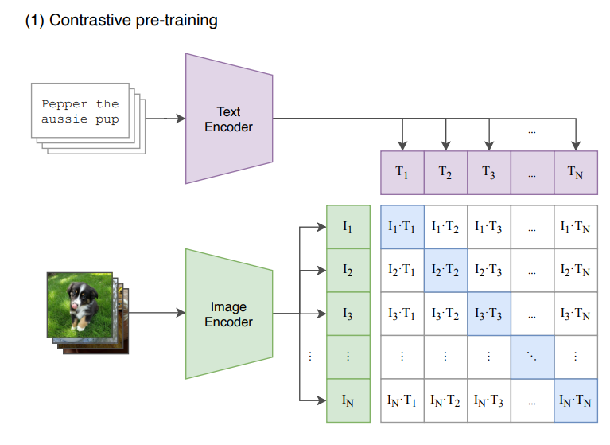
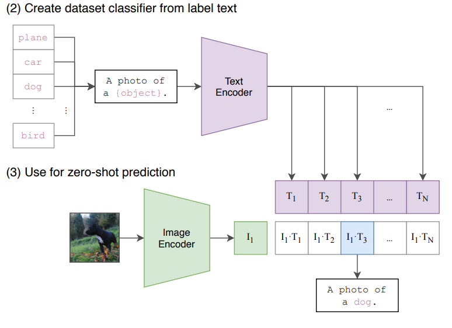
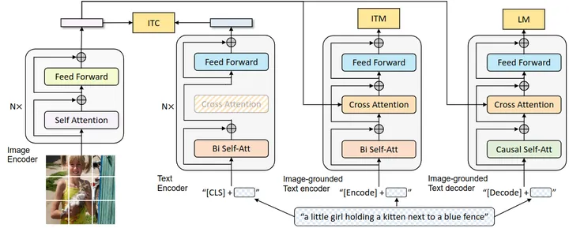
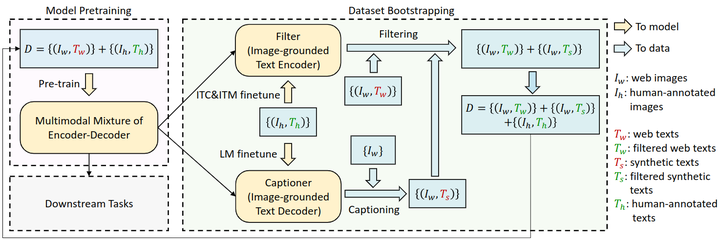

> 论文名称：[Learning Transferable Visual Models From Natural Language Supervision](https://arxiv.org/pdf/2103.00020.pdf)
>  代码： https://github.com/OpenAI/CLIP

## 摘要

1. 现有的视觉监督范式多是在固定的数据集上训练和预测，一是需要人工标记，二是大大限制了其泛化性；
2. 直接从图像的原始文本中学习是一种很有前途的选择，本文通过在 4 亿个图像文本对上进行简单的预训练，实现了在下游任务上的通用性，并且具有极强的零样本能力。

## 介绍和相关工作

### Pre-training

预训练方法已经改变了 NLP 领域，如自回归模型和 masked 模型，大大提高了模型的泛化能力，如 GPT3，可以轻松利用与训练模型在下游任务达成优秀的效果。这表明在大规模的网络数据下，利用现代的预训练方法可以超过高质量的人工标准数据集。但在 CV 领域，目前仍然需要精细的人工标注。

### Multimodal

介绍了一些古早（1999-2020）的多模态工作，通过利用语言和图像可以达到不错的效果，并且能证明模型对图像的“认知”有进步，因而具有零样本能力。

>VirTex (Desai & Johnson, 2020), ICMLM (Bulent Sariyildiz et al., 2020), and ConVIRT (Zhang et al., 2020) have recently demonstrated the potential of transformer-based language modeling, masked language modeling, and contrastive objectives to learn image representations from text.

这一系列工作代表了当前在从有限数量的监督“黄金标签”中学习和从几乎无限数量的原始文本中学习之间的务实中间立场。

## 方法

### 大规模数据集

CV 中的数据集多是质量高但是数量少，一些数量大的数据集质量很差，因此构建了一个大规模网络数据集，拥有 4 亿个图像文本对。

### 使用自然语言作为监督

使用自然语言监督模型，我们不需要再去标注数据，也不需要限定类别的数量，可以方便的扩大数据集规模。

与 CV 中的大多数自监督或无监督不同，使用自然语言不仅学习一种表征 （representation），还学习了语言到表征的对应关系，从而可以实现灵活的零样本迁移。

### 对比学习

对于大规模数据训练，效率是一个很重要的问题，先前工作通过一个 **预测性问题** 来实现自然语言的监督作用，即通过模型预测对应的文本，效率较低。

本文的对比学习方式通过设置代理任务——判断图像与文本是否对应，实现方式也很简单，如下图所示，



代码为

```python
def forward(self, image, text=None):
        image_features = self.encode_image(image)
        text_features = self.encode_text(text)

        # normalized features
        image_features = image_features / F.norm(image_features, axis=1, keepdims=True)
        text_features = text_features / F.norm(text_features, axis=1, keepdims=True)

        # cosine similarity as logits
        logit_scale = F.exp(self.logit_scale)
        logits_per_image = matmul(
            logit_scale * image_features,
            text_features.transpose(1, 0)
        )
        logits_per_text = logits_per_image.transpose(1, 0)

        # shape = [global_batch_size, global_batch_size]
        return logits_per_image, logits_per_text
```

将两个编码器得到的输出求余弦相似度（先归一化在转置相乘），获得一个矩阵，表明每个元素之间的相似度，显然，对角线的部分相似度应该最高，使用交叉熵，代码为

```python
labels = torch.arange(n)
loss_i = cross_entropy_loss(logits, labels, axis=0) 
loss_t = cross_entropy_loss(logits, labels, axis=1) 
loss = (loss_i + loss_t) / 2
```

其中一个是图像的 loss 一个是文本的 loss。

在推理时则与平常的模型不同，如对于分类任务，`CLIP` 需要一些文本模板/提示来描述某一张图片，比如：`a photo of {}.`，`a photo of many {}.` 等，大括号中可以填入各种类别名称。这样为每一个类别都生成 n 句话，再使用文本编码器和图片编码器的输出向量做相似度计算，得分高者则认为其为该类的概率更高，如下图所示：



此外 CLIP 实现中还有一些细节：

1. 由于数据集规模较大，因此不会有 overfitting 的问题；
2. 最后并没有用这种非线性的投射层，而是用了一个线型的投射层。在 SimCLR，MOCO 这一系列对比学习论文中，非线性的投射层会比用线性的投射层带来将近 10 个点的这个性能提升。但在多模态预训练过程，线性非线性没有太大关系，非线性的投射层应该只是用来适配纯图片的单模态学习；
3. 算法不需要做数据增强，只用了随机裁剪；
4. temperature 这个超参数非常重要，本文将它设置成一个可学习标量，就是上文中的 `logit_scale`，直接在模型训练过程中优化而不需要当成一个超参数，最后再去调参。

## Limitation

CLIP 在很多数据集上平均看可以和一个比较简单的基线模型效果相同，比如 ImageNet 上训练的 res 50 的模型，但 res 50 比 state of the art 差很远，CLIP Zero Shot 在 ImageNet 上 76.2，最新最大的 Vision Transformer 或者 MAE 都是 88 89 甚至 90，还是有一定差距。如果扩大规模，也就是增加数据集，加大模型，CLIP 的性能还能继续提高，但若想弥补十几个点的差距，还要在现在训练 CLIP 计算量的基础上乘以 1000，即如果要和 vit 平手，需要 4000 亿数据，代价太大，需要有新的方法。

CLIP 在有些数据集上 Zero Shot 的结果并不好，比如在某些细分类的数据集，或者抽象的更难的任务比如计数效果不行

CLIP 虽然泛化很好，对于很多自然图像的分布偏移相对稳健，但如果推理的时候，数据和训练的数据差的非常远，out of distribution，CLIP 模型泛化照样很差，比如 MNIST 这种生成数据集。

虽然 CLIP 可以做 Zero Shot 的分类任务，但还是从给定的类别里去做的选择，一种更灵活的方式就是直接生成图像的标题，这样一切都是模型自动化处理，生成新的输出，但受限于计算资源的问题，无法训练图像标题生成的基线网络，最好能将对比学习的目标函数和生成式的目标函数合在一起，这样既有对比学习训练模型的高效性，又有生成式模型的灵活性。

数据利用率低，训练需要 4 亿数据，最好能减少数据用量，比如数据增强，自监督，伪标签等

CLIP 用的 27 个数据集做测试，但这 27 个不一定就具有代表性，而且训练过程中反复用这些数据集测试，可能无形之中已经做了指导，最好是能够有新的 zero shot 的数据集供大家测试。

数据从网上爬取的，没有审查过滤清洗，可能带有偏见。

CLIP 模型的提出并不是为了 Few shot 的这种情况，所以就导致一个非常奇怪的现象，当给 CLIP 提供了一些训练样本 one shot two shot four shot 的时候，结果反而还不如直接用 zero shot。

## BLIP

针对视觉语言训练框架的两个常见问题作出改进：

1. 大多数现有的预训练只在基于理解或者生成的人物表现出色，很少有可以兼顾的模型；
2. 目前的数据集多从网络上收集，噪声太大。提出了一种高效率利用噪声的方法，先使用带有噪声的数据训练一遍 blip，再使用 blip 的生成能力生成一系列文本，在通过过滤功能过滤，得到干净的数据集，再进行训练。



blip 包含一个视觉编码器、文本编码器和视觉文本编码器/解码器，其中：

1. 视觉编码器使用 CLS token 来表示全局的图像特征；
2. 文本编码器使用 BERT 架构，但是采用了双向自注意力，同样使用 CLS token 来表示全局文本特征，最后会用于做对比学习；
3. 视觉文本编码器使用 Cross-Attention，根据给定的图像特征和文本输入做二分类，同样使用双向自注意力。使用 Encode token，作为图像和文本的联合表征；
4. 视觉文本解码器使用了 causal 注意力与 Cross-Attention，添加了一个额外的 Decoder token 和结束 token，作为生成起点和终点。

:::info

图中颜色相同的部分权重共享，即文本编码器、视觉文本编码器/解码器共享除了 Self-Attention 之外的所有参数，文本编码器前向时不使用 Cross-Attention。

:::

训练阶段包含了三个损失函数，分别为理解任务与生成任务：

1. 对比学习 ITC，用于对齐视觉和文本特征，使得正样本图文对特征相似更大，使用了 ALBEF 中的动量编码器，可以产生一些伪标签；
2. 图文匹配 ITM，是一个二分类任务，使用分类头来预测图像文本对是否是正样本，使用了 ALBEF 中的 hard negative mining 技术；
3. 语言模型 LM，目标为根据给定图像以自回归的方式生成文本描述。



提出了 Captioning and Filtering (CapFilt) 来高效利用噪声数据，包含一个 Captioner 和 Filter，前者为给定图片生成字幕，在 COCO 数据上使用 LM 微调；后者用于过滤噪声图像文本对，判断文本与图像是否匹配，在 COCO 上使用 ITC 和 ITM 微调。
