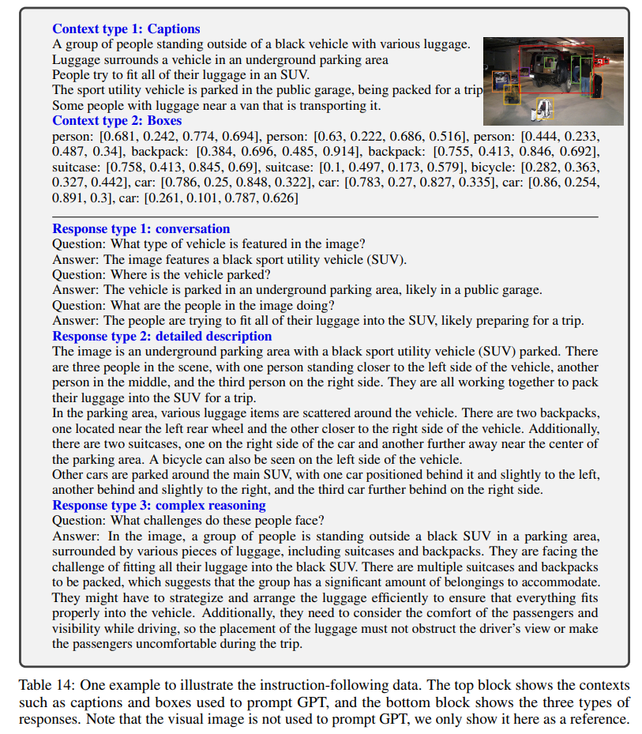
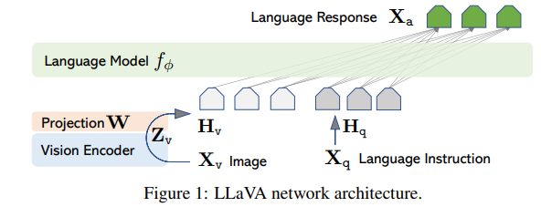
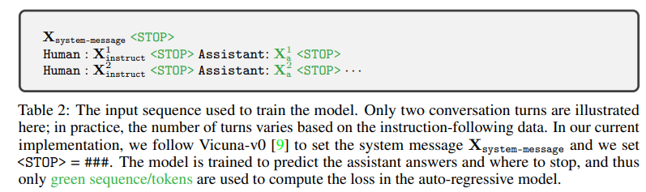
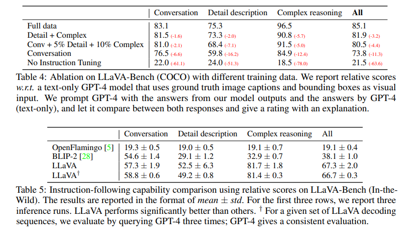
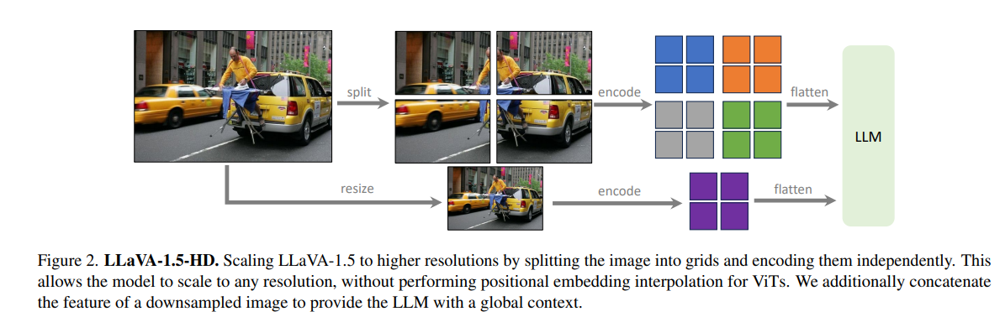
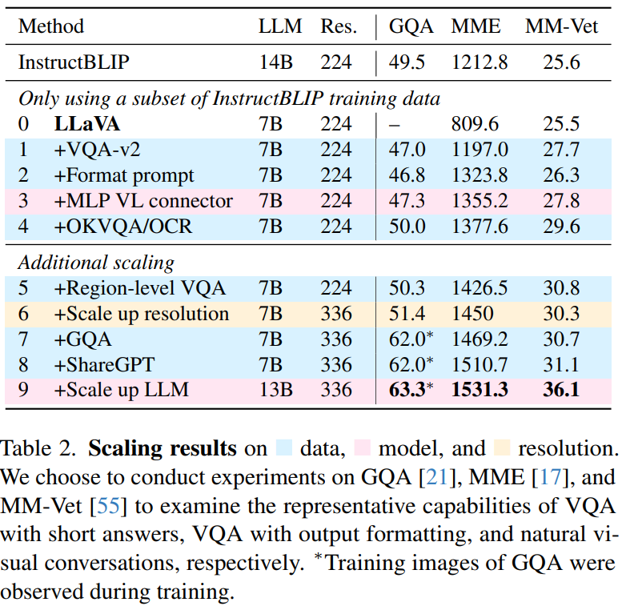
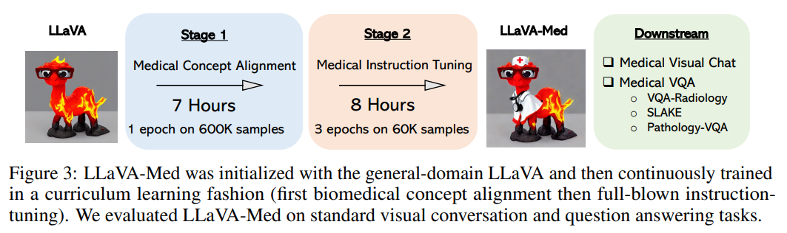

>论文名称：[Visual Instruction Tuning](https://arxiv.org/pdf/2304.08485)

>Code: https://github.com/haotian-liu/LLaVA

## 摘要

1. LLM 中的指令微调（Instruction tuning）多使用机器生成的指令遵循（instruction-following）数据，然而从未有在多模态领域的探索；
2. 本文使用 language-only 的 GPT-4 来生成多模态 language-image 指令遵循数据；通过在该数据上进行指令微调，得到了一个端到端训练的用于通用视觉和语言理解的多模态模型 LLaVA：Large Language and Vision Assistant。
3. 提出了两个具有多样性和挑战性应用的评估基准。

## 介绍

1. 人类通过语言、视觉等通道与世界交互，不同的方式拥有其各自的优势，通用人工智能助手应该遵循多模态的视觉和语言指令，完成人们的意图；
2. 语言在 LLM 中扮演着十分重要的角色：通用的交互界面；任务要求可以被显式地使用语言表示；
3. 本文首次提出了视觉指令微调以构建一个通用的人工智能助手，主要贡献有：
    1. 多模态指令遵循数据，使用 ChatGPT/GPT-4 生成；
    2. Large multimodal models(LMM)，使用了 CLIP 的开放集（open-set）视觉编码器和语言解码器 Vicuna;
    3. 多模态数据遵循基准；
    4. 开源。

## 相关工作

### 多模态指令遵循代理（Agent）

CV 领域中的多模态指令遵循代理可以分为两种，一是端到端训练的模型，针对每个特定的研究主题探索，如 vision-language navigation，InstructPixPix 等；二是 AI agent 系统，如 LangChain，相关工作有 Visual ChatGPT、X-GPT、MM-REACT、VisProg 和 ViperGPT 等。

### 指令微调

在 NLP 领域，为了使像 GPT-3、T5 等这样的 LLM 能够遵循自然语言指令完成现实世界的任务，提出了指令微调，结果表明这种简单的方法十分有效，有助于提高 LLM 的零样本和少样本泛化能力。将 NLP 中的想法借鉴到 CV 中是很自然的，Flamingo 可以被视为多模态领域的 GPT-3 时刻，其提供了一种将文本和图像交错的数据（如将图像用一个特殊的 token \<image\> 表示）作为输入，并生成自由格式文本的结果。近期的 LLaMA、OpenFlamingo 等使得 LLM 可以使用图像输入，并且展示了富有希望的人物迁移泛化性能，但其并未明确地使用 vision-language 指令数据微调，在多模态任务中的表现不如 language-only 任务。

## GPT 辅助视觉指令数据生成

受启发于 《Chatgpt outperforms crowd-workers for text-annotation tasks》，本文使用 ChatGPT/GPT-4 来生成数据。

1. 最简单的思路是对于给定的图像文本对（image-caption）创建一系列询问图像内容的指令，但是缺乏多样性和深入推理。
2. 为了缓解这个问题，使用 language-only 的 GPT-4/ChatGPT 充当一个强的教师模型。为了将图像编码为其视觉特征以提示 language-only 的 GPT，使用两种类型的符号表示（symbolic representations），一是 captions 通常从不同角度来描述视觉场景，二十使用 bbox 来定位场景中的物体，每个框会编码物体的概念和空间位置。
3. 使用 COCO 数据集中的图像，并且生成了三种类型的指令数据，对于每种类型，本文人工设计了一些样例（这也是本文中所有的人工标注），并且在上下文学习（in-context learning）中作为根样例来询问 GPT-4.
    1. Conversation，设计了用户询问图像内容的对话，助手使用相应的语气回答，在多样性方面，提问可以包括对象类型、计数对象、对象动作、对象位置、相对位置等，并且只使用有明确答案的问题。
    2. Detailed description，创建了一些问题用于询问图片中的详细描述，使用 GPT-4 来构建问题。对于每个图片，随机选取一个问题来询问 GPT-4 获取详细描述。
    3. Complex reasoning，答案通常需要按照严格的逻辑进行逐步推理生成。

本文总计收集了 158k 个独特的 vision-language instruction 样本，其中包含了 58K 个对话、23K 个详细描述和 77K 个复杂推理，在早期实验中对 Chatgpt 和 GPT-4 进行了消融实验，发现后者始终提供更高质量的数据。

## 视觉指令微调

### 架构

使用当前在指令遵循能力表现最好的 Vicuna 作为 LLM，对于给定图像，使用 pre-trained CLIP 视觉编码器 ViT-L/14，使用简单的线性层 $W$ 来将视觉特征映射至词嵌入空间（映射通道数），也可以使用其他的连接方式，如 Flamingo 中的 gated cross attention 和 BLIP-2 中的 Q-former。但为了快速进行以数据为中心的实验迭代，并没有使用。

### 训练

对于每个图像，本文会生成多轮对话 $[(X_q^1,X_a^1),…..]$，并将所有的回答 $X_a^t$ 作为助手的回应，每个轮次的指令数据构成如下：

  1. 第一轮中，在 $[X^1_q,X_v]$ 或 $[X_v,X_q^1]$ 中随机选择；
  2. 其他所有轮次中，指令数据取 $X_q^t$ 本身。

使用双阶段的训练流程：

1. 特征对齐预训练，从 CC3M 中过滤了 595 个图像文本对，使用单轮对话，标签即为原始 caption。训练时保持视觉编码器和 LLM 权重冻结，仅训练线性层 $W$。
2. 端到端微调，仍然保持视觉编码器冻结，微调 $W$ 和 LLM。考虑两种用例场景：
    1. 多模态聊天机器人，三种类型的数据中只有 Conversation 是多轮的，训练中不同类型的数据会被均匀采样。
    2. 科学问答，使用单轮对话，以自然语言形式提供推理过程，并在多个选择中选择答案，问题和上下文作为指令数据。

## 实验

使用 8 卡 A100，参照 Vicuna 的超参数，第一阶段使用 CC-595K 训练一个 epoch，学习率为 2e-3，batch size 128，微调 3 个 epoch，学习率 2e-5，batch size 32。使用 GPT-4 来衡量生成结果的质量，消融实验结果如下：

### LLaVA-Bench(COCO)

我们从 COCO-Val-2014 中随机选取了 30 张图像，对于每张图像，使用前文生成三种类型的问题（对话、详细描述、复杂推理），总共 90 个问题。这个基准测试研究了模型在一致视觉输入下的对齐行为和能力。

### LLaVA-Bench(In-the-Wild)

为了评估模型在更具挑战性的任务中的能力和对新领域的泛化性，我们收集了一组多样化的 24 张图片，总共 60 个问题，包括室内和室外场景、梗图、绘画、素描等，并为每张图片关联了一份高度详细且经过人工策划的描述以及合适的问题选择。

## 生成

没找到啊

:::info

看起来这里用 GPT-4 生成就是通过原始的 caption 来改写出一轮或多轮对话，并且要求保持对应的语气，来模拟真实对话场景。

:::

## LLaVA 1.5

在 LLaVA 的基础上做了一些改进，并且对 LMM 进行了系统性的研究。

## LLaVA-Med

二阶段训练：

1. PMC-15M 中筛选出 60 万对，每个样本只需要预测原始标题皆可，仅更新连接器；
2. 训练连接器和 LLM。

创建了两种数据集：

1. 生物医学概念对齐，对于对应的图像文本对，抽取一个问题要求描述该图像，表示为 $(X_v,X_c,X_q)$，创建一个单轮对话的指令遵循，形如 $Human : X_qXv<STOP> \n\ Assistant : X_c<STOP>\n$。根据字幕的长度，抽取的问题要么要求简洁地描述图像，要么要求详细描述。附录 A 中提供了两列表问题。在实践中，PMC-15M 中有 25% 的字幕长度小于 30 个单词，因此 30 个单词被用作决定选择哪个列表的分界点。我们从 PMC-15M 中抽取了 60 万个图像 - 文本对。尽管这个数据集只呈现了单一任务指令，即图像字幕，但它包含了来自原始 PMC-15M 的多样化和有代表性的生物医学概念样本集。
2. 生物医学指令微调，为了使模型能够遵循各种指令，我们呈现并策划了多样化的指令遵循数据，通过提示 language-only 的 GPT-4，以多轮对话的形式讨论提供的生物医学图像。具体来说，给定一个图像字幕，我们设计了一个提示指令，要求 GPT-4 生成多轮问题和答案，其语气就好像它能看到图像一样（即使它只能访问文本）。有时图像字幕太短，GPT-4 无法生成有意义的问题和答案。为了提供有关图像的更多上下文，我们还创建了一个提示，其中不仅包括字幕，还包括提及图像的原始 PubMed 论文的句子。我们还手动策划了一些少样本示例在提示中，以展示如何根据提供的字幕和上下文生成高质量的对话。见附录 B 中的提示和少样本示例。为了收集图像字幕及其上下文，我们过滤了 PMC-15M，只保留了只包含单一图表的图像。然后，我们从五种最常见的成像方式中抽取了 60K 图像 - 文本对：胸部 X 光（CXR）、计算机断层扫描（CT）、磁共振成像（MRI）、组织病理学和大体（即宏观）病理学。我们随后从原始 PubMed 论文中提取提及图像的句子作为字幕的额外上下文，这是受到外部知识有助于泛化的启发。
