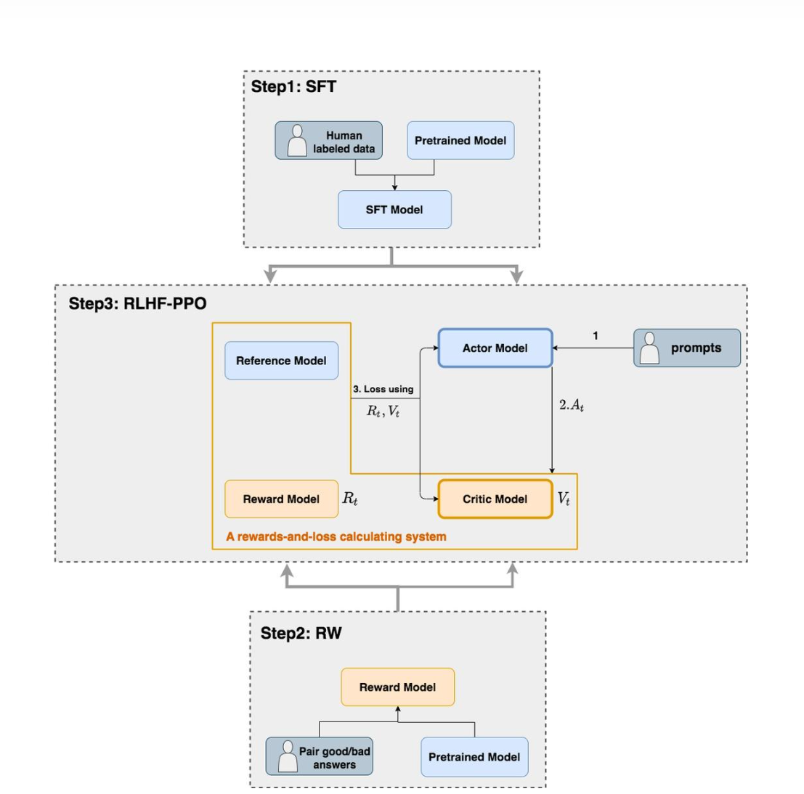

https://zhuanlan.zhihu.com/p/7461863937

https://zhuanlan.zhihu.com/p/677607581

## Overview

PPO 表示近端策略优化，由以下几个部分构成：

1. Policy ($π_θ$)：经过预训练或 SFT 的 LLM；
2. Reward model ($R_ϕ$)：经过训练并且冻结的模型，用于给模型输出打分；
3. Critic ($V_γ$)：价值函数，是一个可学习的网络，接收部分模型输出，并预测分数。

整体流程如下：

1. 给定输入，LLM 生成多个回答；
2. Reward model 给每个回答打分；
3. 使用 GAE 计算优势（advantages）；
4. 根据目标更新 LLM；
5. 训练价值函数。

## Terminologies: states and actions

states 和 actions 都是 token level 的，在 LLM 中，前者表示当前条件（如输入 prompt 和已经生成的 actions），后者表示生成的每个 token。

##  General Advantage Estimation（GAE）

Advantage 直观上可以定义为特定的 action（即 token 或 word）对比相同状态下（prompt+ 已经生成的 actions）的平均 action 有多好。

现有两种主流方法来估计 Advantage：

1. **Monte-Carlo (MC)**：蒙特卡洛方法，使用完整的回答。该方法由于奖励稀疏而具有高方差，并且从 LLM 中获取足够多的样本代价过高，但其具有低偏差，使得我们能准确地建模奖励；
2. **Temporal difference (TD)**：时间差分方法，只衡量刚刚生成的词在给定 prompt 下的质量，可以计算 token 级别的奖励，因此显著降低了方差，但是偏差增加，不如 MC 精准。

### Value Function

引入价值函数（critic 评价器）来衡量生成一个词之前和之后的奖励变化，其 **被训练用于仅根据部分状态来预测最终奖励**，以便计算时间差分方法。

目标函数为在给定的 **部分状态** 下与 **奖励模型在最终状态** 下奖励的 l2loss，这里的奖励模型已经被训练好并且被冻结，而 critic 与 LLM 一同训练，这就是强化学习中所说的 **演员 - 评价器** 方法。

###  Back to GAE

给定价值函数 $V_{\gamma}$， 对于第 K 步的 Advantage，计算公式为：

$$
A_{K}^{GAE}= \delta_{0} + \lambda\delta_{1} + \lambda^{2}\delta_{2}=\sum_{t=0}^{K-1}(\lambda)^t \delta_{t}
$$

其中 $\delta_{t}$ 是第 t 步的 TD 误差，计算方式为：

$$
\delta_{t} = V_{\gamma}(s_{t+1}) - V_{\gamma}(s_{t})
$$

:::note

就是用局部状态去估计整体的表现，贪心。

这里的 $\lambda$ 用于控制方差和偏差之间的权衡，当 $\lambda=0$，GAE 简化为单步 TD，当 $\lambda=1$，GAE 变为蒙特卡洛方法（存疑，看起来蒙特卡洛方法应该使用完整的输出才对）。

:::

在 RLHF 中，我们希望最大化 Advantage，从而最大化 LLM 生成的每一个 token 的奖励。

:::note

原始公式中实际上还有一个折扣因子 $\eta$：

$$
A_{K}^{GAE}=\sum_{t=0}^{K-1}(\lambda \eta)^t \delta_{t}
$$

并且同样应用于 TD error：

$$
\delta_{t}=R(s_{t})+\eta V_{\gamma}(s_{t+1})-V_{\gamma}(s_{t}) \tag 1
$$

但由于我们几乎总是令 $\eta=1,R(s_{t})=0$（因为奖励函数对不完整的答案总是返回 0）该式就简化为上式。

:::

:::info

看了一些其他教程，似乎 $R(s_{t})$ 并非总是为 0，而是可以计算出即时奖励。

公式 1 中的前半部分：

$$
R(s_{t})+\eta V_{\gamma}(s_{t+1})
$$

实际上就是当前状态的及时奖励和从当前状态出发能够获得的未来奖励，用于表示当前状态的一个总收益，而 $V_{\gamma}(s_{t})$ 则是在当前状态下的未来奖励，二者相减则称为 **Advantage**。

公式 1 仅仅考虑了当前状态下的优势，实际上我们可以引入对未来优势的考量，则变为了 GAE。

代码从前向后推导即可：

```python
 def get_advantages_and_returns(self, values, rewards, start):
        """
        Adopted from https://github.com/CarperAI/trlx/blob/main/trlx/models/modeling_ppo.py#L134
        
        没有引入GAE前的t时刻的优势值：
        detal_t = r_t + gamma * V_t+1 - V_t
        其中：
            - r_t表示t时刻的即时收益
            - V_t+1表示未来时刻的预期收益
            - r_t + gamma * V_t+1可理解成t时刻的实际预期收益
            - V_t可理解成t时刻的预估预期收益（是模型，例如critic model自己估算出来的）
        
        引入GAE后的t时刻的优势值：
        A_t = delta_t + gamma * lambda * A_t+1
        粗暴理解为在t时刻时，不仅考虑当下优势，还考虑了未来的优势
        为了知道A_t, 我们得知道A_t+1，所以在本算法中采取了从后往前做动态规划求解的方法，也即：
        假设T是最后一个时刻，则有A_T+1 = 0, 所以有: A_T = delta_T
        知道了A_T, 就可以依次往前倒推，把A_t-1, A_t-2之类都算出来了
        
        引入GAE后t时刻的实际预期收益
        returns_t = A_t + V_t
                  = delta_t + gamma * lambda * A_t+1 + V_t
                  = r_t + gamma * V_t+1 - V_t + gamma * lambda * A_t+1 + V_t
                  = r_t + gamma * (V_t+1 + lambda * A_t+1)
        
        注意，这里不管是advantages还是returns，都只算response的部分
        """
        
        # Adopted from https://github.com/CarperAI/trlx/blob/main/trlx/models/modeling_ppo.py#L134
        lastgaelam = 0
        advantages_reversed = []
        length = rewards.size()[-1]
        # 注意这里用了reversed，是采取从后往前倒推计算的方式
        for t in reversed(range(start, length)):
            nextvalues = values[:, t + 1] if t < length - 1 else 0.0
            delta = rewards[:, t] + self.gamma * nextvalues - values[:, t]
            lastgaelam = delta + self.gamma * self.lam * lastgaelam
            advantages_reversed.append(lastgaelam)
        advantages = torch.stack(advantages_reversed[::-1], dim=1) # 优势
        returns = advantages + values[:, start:] # 实际收益
        # values: 预期收益
        return advantages.detach(), returns
```

这里的演员 - 评价器方法主要包括四个模型：



- **Actor Model：演员模型**，这就是我们想要训练的目标语言模型
- **Critic Model：评论家模型**，根据当前状态来估计最终状态的 reward
- **Reward Model：奖励模型**，它的作用是计算即时奖励
- **Reference Model：参考模型**，它的作用是在 RLHF 阶段给语言模型增加一些“约束”，防止语言模型训歪（朝不受控制的方向更新，效果可能越来越差）
:::

## PPO

PPO 目标函数由几个组成部分构成，具体包括：

1. **剪切的代理目标（Clipped Surrogate Objective）**：这是 PPO 算法的核心，它通过限制策略更新的幅度来避免策略梯度更新导致的过大的变化。具体来说，它计算新策略与旧策略之间的概率比值，并将这个比值限制在一个剪切范围内，以确保更新的稳定性。

2. **熵奖励（Entropy Bonus）**：为了鼓励策略的探索性，PPO 在目标函数中加入了一个熵奖励项。熵是衡量策略不确定性的指标，较高的熵意味着策略更加随机，有助于探索未知的状态空间。通过 **最大化熵**，可以避免策略过早地收敛到局部最优解。

3. **KL 散度惩罚（KL Penalty）**：KL 散度是衡量两个概率分布之间差异的指标。在 PPO 中，通过限制新策略与旧策略之间的 KL 散度，可以进一步确保策略更新的稳定性。如果新策略与旧策略之间的 KL 散度超过了预设的阈值，将对目标函数施加惩罚，以抑制过大的策略变化。

综上所述，PPO 目标函数可以表示为：

$$
\mathcal{L}_{\text{PPO}}(\theta, \gamma) = \underbrace{\mathcal{L}_{\text{clip}}(\theta)}_{\text{Maximise reward}} + \underbrace{w_1 H(\theta)}_{\text{Maximise entropy}} - \underbrace{w_2 \text{KL}(\theta )}_{\text{Penalise KL divergence}} - \underbrace{w_3 \mathcal{L(}\gamma)}_{\text{Critic L2}}
$$

###  The clipped surrogate objective

$$
\begin{align} L^{\text{clip}}(\theta) = \mathbb{E}_t \left[ \min(c_t(\pi_\theta)A^{GAE}_t, \text{clip}(c_t(\pi_\theta),1-\epsilon, 1+\epsilon)A^{GAE}_t)\right], \end{align}
$$

这里是我们要最大化 Advantage 的地方，目的是使得 LLM 预测的每个 token 都能最大化奖励，裁剪比例为：

$$
c_t(\pi_\theta) = \frac{\pi_\theta (a_t | s_t)}{\pi_{\theta_{\text{old}}} (a_t | s_t)}
$$

$\epsilon$ 控制裁剪的范围。

:::tip

这里的 $c_t(\pi_\theta)$ 实际上是 KL 散度变化过来的，不过去除了 log，并添加了 clip 。

:::

### KL divergence penalty

防止模型更新得过多

$$
\begin{align} \text{KL}(\theta) = \mathbb{E}_{s_t} \left[ \mathbb{D}_{\text{KL}}(\pi_{\theta\text{orig}}(\cdot | s_t) || \pi_{\theta}(\cdot | s_t)) \right] \end{align}
$$

KL 散度是通过取序列和批次的平均值来估计的。

伪代码如下：

```python
# Compute KL divergence between original and current policy/model
logits_orig = original_model(states)  # Original model's logits
logits_current = current_model(states)  # Current model's logits

probs_orig = F.softmax(logits_orig, dim=-1)
log_probs_orig = F.log_softmax(logits_orig, dim=-1)
log_probs_current = F.log_softmax(logits_current, dim=-1)

kl_div = (probs_orig * (log_probs_orig - log_probs_current)).sum(dim=-1)
kl_penalty = kl_div.mean()  # Average over sequence and batch
```

### Entropy bonus

熵奖励通过惩罚低熵来鼓励 LLM 生成过程中的探索性。具体来说，熵是衡量策略不确定性的指标，较高的熵意味着策略更加随机，从而有助于探索未知的状态空间。通过在目标函数中加入熵奖励项，可以避免策略过早地收敛到局部最优解，从而提高模型的泛化能力。

$$
\begin{align} H(\theta) = - \mathbb{E}_{a_t} [\log \pi_\theta (a_t | s_t)]. \end{align}
$$

伪代码

```python
# Compute entropy of current policy
probs_current = F.softmax(logits_current, dim=-1)
log_probs_current = F.log_softmax(logits_current, dim=-1)

entropy = -(probs_current * log_probs_current).sum(dim=-1)
entropy_bonus = entropy.mean()  # Average over sequence and batch
```
