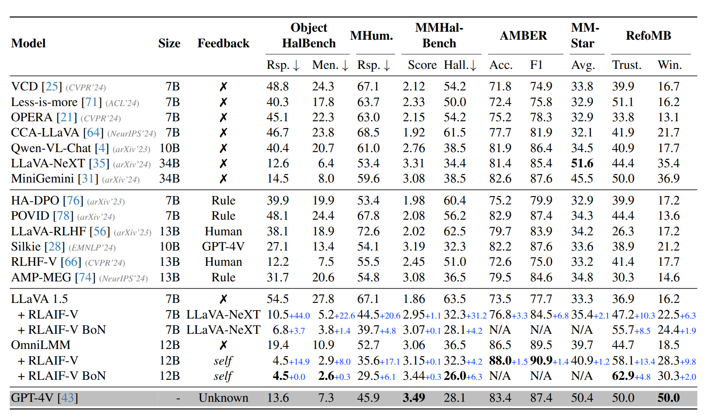
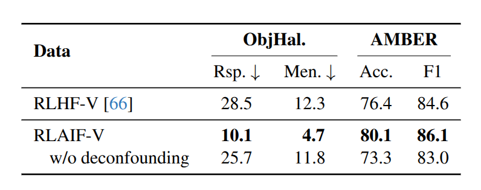
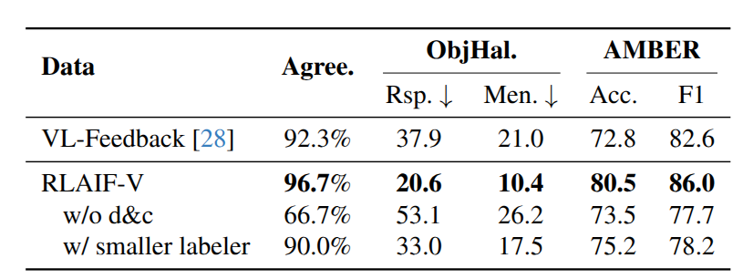

> Paper: [RLAIF-V: Open-Source AI Feedback Leads to Super GPT-4V Trustworthiness](https://arxiv.org/abs/2405.17220)
>
> Code: https://github.com/OpenBMB/MiniCPM-o

## Abstract

传统的用于减少幻觉的 **反馈学习 (feedback learning)** 依赖于劳动密集型的手动标记或昂贵的专有模型。这使得社区缺乏关于如何使用开源大语言模型构建高质量反馈的基础知识。

提出了 RLAIF-V，从两个角度最大限度地探索开源大语言模型，包括为**偏好学习 (preference learning)** 生成高质量反馈数据和在 **推理时间扩展 (inference-time scaling)** 中的自我反馈指导。

RLAIF-V 7B 将对象幻觉减少了 80.7%，整体幻觉减少了 33.7%，进一步揭示了**开源大语言模型的自我对齐潜力**，模型可以从自身的反馈中学习，以实现超越 GPT-4V 的可信度。

## Introduce

多模态大语言模型（MLLMs）在大规模多模态语料库上进行训练，拥有深厚的世界知识，在处理各种多模态任务方面表现出显著的能力。然而，人们普遍注意到，多模态大语言模型容易自信地生成偏离人类偏好的错误内容。为了使多模态大语言模型与人类偏好保持一致，人类反馈的强化学习（RLHF）已被广泛使用，并取得了显著的成果。

然而，RLHF 严重依赖劳动密集型的人类注释，因此很难覆盖模型与人类偏好之间广泛的不一致性。最近，使用标注者模型收集的偏好作为人类偏好的代理的 AI 反馈强化学习（RLAIF）显示出作为 RLHF 替代方案的潜力。

然而，当前的方法面临两个挑战：

1. 不切实际的标注者要求。现有的 RLAIF 方法，依赖于**昂贵的专有模型**来提取反馈。更关键的是，这种范式本质上是从专有模型中提取能力，以提供一种临时解决方案来弥合性能差距。因此，社区缺乏关于如何使用具有相当能力的开源 MLLM 标注者来构建高质量反馈的知识，简单地将标注者模型从专有模型改为较弱的开源模型会导致反馈质量不佳，因为它们的能力有限。
2. 推理时间扩展有限。推理时间扩展引起了 LLM 社区的广泛关注，并显示出有希望的结果。然而，最近在 MLLMs 中的工作主要集中在偏好学习阶段以利用高质量反馈，而忽略了推理阶段反馈的重要性。此外，盲目增加推理计算预算很难对性能做出贡献，因为准确的反馈指导在有效的推理时间扩展中发挥着重要作用。

RLAIF-V 通过两项关键创新解决了这些挑战：

1. 对于高质量反馈生成，提出了一种新颖的**无混杂候选响应生成策略（deconfounded candidate response generation strategy）**，以提高数据效率，并采用分而治之的方法以提高成对偏好准确性。无混杂策略通过在**相同条件下进行多次采样解码尝试来生成候选响应**，从而准确地揭示响应对之间的真实可信度差异。因此，诸如文本风格等混杂因素被消除，反馈专注于响应的实际内容。分而治之的方法将复杂的响应评估任务分解为更简单的声明评估，从而大大简化了任务，进而降低了标注者模型的能力要求。
2. 对于推理时间扩展指导，我们提出了一种基于与直接偏好优化 （DPO）对齐模型的自我反馈方法。具体来说，我们利用对齐模型生成的奖励分数作为其自身的反馈。然而，先前的研究表明，由于其目标公式，DPO 对齐模型的直接反馈可能会偏向较短的响应 。我们设计了一种**长度归一化策略**，以聚合每个响应的逐标记分数，以抑制偏差。此外，我们还广泛探索了 RLAIF-V 奖励在其他开源模型上的推理时间扩展潜力，并证明了一个单一奖励模型可以很好地泛化以提高多个 MLLMs 的可信度。

## RLAIF-V

### Response Generation

用于偏好学习的反馈是以比较对的形式收集的，每对包括一个更优的响应 $y_w$ 和一个较差的响应 $y_l$，它们都是针对相同的输入 $x$（包括图像和提示）。在训练过程中，模型通过区分 $y_w$ 和 $y_l$ 之间的差异来学习偏好。然而，**这些差异可能很复杂，包含许多因素**，不仅包括内容的含义，还包括文本风格，例如特定词汇的使用或文本的结构，这使得学习变得更加困难。

为了揭示响应之间的真实可信度差异，提出了一种新颖的无混杂策略来生成候选响应。具体来说，模型通过使用 **不同的随机种子** 生成 $n$ 个候选响应 $\{y_1​,y_2​,⋯,y_n\}$，其中输入 $x$ 和解码参数保持不变。这样， $y_w$ ​ 和 $y_l$ ​ 是从同一分布中采样的，因此具有相似的文本风格和语言模式。在训练过程中，模型可以有效地专注于可信度的差异。实验发现这种无混杂策略可以显著提高学习效率。

### Feedback Annotation

**分解**

完整响应可能包含多个陈述和特定的文本结构，这会干扰对错误部分的识别。为了使这样一个复杂的任务得以解决，如图所示。将响应 $y$ 分解为原子声明 $\{c_1, c_2, \cdots, c_m\}$，这些声明可以分别进行评估，通过提取事实并排除意见和主观陈述。

**攻克**

为了评估一个声明 $c$（例如，“时钟显示大约 11:20。”）的可信度，我们首先将其转换为一个极性问题，如“时钟显示大约 11:20 吗？”这样的问题可以用简单的“是”或“否”来回答，而不会引入任何额外的内容。对于每个原子极性问题，我们要求一个开源 MLLM 生成同意和不同意的信心分数作为声明分数 $s_c = (p_{\text{yes}}, p_{\text{no}})$，其中 $p_{\text{yes}}$ 是回答“是”或“yes”的概率，$p_{\text{no}}$ 是回答“否”或“no”的概率。较高的 $p_{\text{yes}}$ 分数表明相应的声明被认为更具可信度。通过这种方式收集的分数通常比直接查询完整响应的评估结果更准确，因为声明在结构和内容上都更简单。

**合并**

在获得每个声明的质量评估之后，对于每个响应，将具有 $p_{\text{no}} > p_{\text{yes}}$ 的声明数量记为 $n_{\text{rej}}$，用以衡量标注者模型识别出的不正确声明的数量。使用 $-n_{\text{rej}}$ 作为响应的最终分数 $S$。对于每条指令 $x$，保留所有满足 $S > S'$ 的响应对 $(y, y')$，并选择分数较高的响应 $y$ 作为更优的响应。为了节省训练成本，为每条指令随机采样最多 2 对，并且发现这种筛选过程只会导致微小的性能下降。为了防止潜在的长度偏差，在训练前丢弃那些 $y_w$ 过短的对，以确保 $y_w$ 和 $y_l$ 的平均长度差异小于一个词。

### Iterative Feedback Learning

DPO 被广泛用于使 MLLMs 与人类偏好保持一致。然而，简单的 DPO 面临着分布偏移问题，即在训练过程中偏好数据是静态的，而模型输出分布却在不断变化 [14]。因此，数据分布可能会偏离预期的反馈分布，从而导致次优的对齐结果。

在每次迭代的开始选择 $N$ 个多模态指令，并利用最新的指令模型 $M_i$ 采用无混杂策略为每个指令生成 $n$ 个候选响应。我们通过使用标注者模型 $L$ 的分而治之方法为每个响应分配一个可信度分数，并构建用于训练的比较对 $D_i$。然后使用直接偏好优化在 $D_i$ 上训练 $M_i$ 以获得 $M_{i+1}$，它将用作下一次迭代的指令模型。通过这种方式，反馈分布可以以迭代的方式进行更新，从而实现更好的学习效率。

:::tip

感觉像是在线学习。

更新方式似乎也很有讲究，比如 GAN 中的生成器和判别器就不是同时更新的，最早版本的 RLHF 也是固定判别器，一个 epoch 生成完毕之后再进行人工标注。

:::

### Self-Feedback for Inference-time Scaling

在多种高质量反馈的迭代学习之后，MLLM 本身不仅是一个可信的策略模型，而且通过 DPO 的优化目标也是一个奖励函数，奖励公式为：

$$
 r(y) = \beta \log \frac{\pi_\theta(y)}{\pi_{\text{ref}}(y)} = \beta \sum_{t=1}^{T} \log \frac{\pi_\theta(y_t|y_{<t})}{\pi_{\text{ref}}(y_t|y_{<t})}, \quad (1) 
$$

其中，$\beta$ 是一个控制与基础参考策略 $\pi_{\text{ref}}$ 偏离程度的参数，$y$ 是响应标记序列，$T$ 是响应的长度，$\pi_\theta$ 是经过 DPO 训练后的模型。为了简化公式，我们省略了提示条件 $x$。先前的研究表明，DPO 对齐的奖励 $r(y)$ 可能会由于其目标公式而偏向较短的响应。我们通过平均所有标记级分数来获得最终的响应分数 $r(y) = \beta \frac{1}{T} \log \frac{\pi_\theta(y)}{\pi_{\text{ref}}(y)}$ 来解决这种偏差。

然后，我们将归一化的奖励作为推理时扩展的自我反馈指导。具体来说，根据同一提示的多个采样响应进行最佳 N 选（BoN）选择，在 $N$ 个候选响应中选择得分最高的响应作为模型预测。为了增加候选响应的多样性，在解码过程中应用常用的核采样（nucleus sampling）。

## Experiments

### Models

使用 LLaVA 1.5 作为指令模型，LLaVA NeXT 作为标注模型，展示了开源反馈的有效性。其次使用 OmniLMM 作为指令模型和标注模型，代表没有更强模型可用的极端情况。

### Training Data

指令的多样性对于模型学习可泛化的偏好至关重要，包括 MSCOCO、ShareGPT-4V、MovieNet、Google Landmark v2、VQA v2 、OKVQA 和 TextVQA 。此外，我们采用了在 RLHF-V 中引入的图像描述提示，以构建长格式的图像描述指令。

### Evaluation

从两个角度评估模型，包括反映幻觉程度的可信度和反映通用能力的有用性。

对于可信度，我们在五个基准上进行评估：

1. Object HalBench 是一个广泛采用的基准，用于评估详细图像描述中常见物体幻觉。遵循 RLHF-V ，使用 8 种不同的提示来提高评估的稳定性。报告响应级幻觉率（即幻觉响应的百分比）和提及级幻觉率（即幻觉物体的百分比）。
2. MMHal-Bench 评估响应级幻觉率和信息量。它要求 GPT-4 比较模型输出与人类响应和物体标签进行评估。
3. MHumanEval 包含从 Object HalBench（50 个）和 MMHal-Bench（96 个）收集的 146 个样本，以更全面地评估长格式描述和短格式问题。本文仅标注响应级幻觉率以控制成本。
4. AMBER 是一个包含超过 1.5 万个样本的多维幻觉基准。使用其判别部分，并报告准确率和 F1 指标。
5. 上述可信度评估要么仅限于**常见物体幻觉**（这在很大程度上已被消除），要么是**受限格式**（例如，yes - no 选择）或手动标注。为了可靠且自动地评估 MLLM 在任何格式下的可信度，本文构建了一个新的可靠自由格式多模态基准（RefoMB），包含 120 张图像和 360 条指令，涵盖 8 个关键任务，如**机械推理** 和**图像感知** 。按照 LLaVA 的方法，通过比较模型响应与 GPT-4V 响应来评估 MLLM 的可信度和有用性。我们根据评估审查计算可信度胜率和总胜率。每条指令都与一个详细编写的图像描述配对作为参考，实现了显著的 96% 的人类一致性。

对于有用性，采用了 MMStar ，一个综合性的基准，包含从 6 个流行的多模态基准中收集的 1500 个挑战样本，涵盖 6 个核心能力和 18 个详细维度。报告在该基准上的总体得分。

### Baseline

将模型与不同类型的最佳基线模型进行了比较，包括表现优异的通用基线模型、使用反馈数据训练的基线模型、不使用反馈数据减少幻觉的基线模型以及专有基线模型。

1. 通用基线模型。采用 LLaVA 1.5 、Qwen-VL-Chat 、OmniLMM 、LLaVA-NeXT 和 MiniGemini 作为代表性的通用基线模型。
2. 针对反馈学习量身定制的基线模型。RLHF-V 收集了细致的人类纠正性反馈，并使用密集的方向偏好优化来训练模型。Silkie 利用 GPT-4V 来收集反馈。POVID 和 AMP-MEG 应用启发式规则来配对在不同条件下生成的响应。
3. 不使用反馈来减少幻觉的基线模型。VCD 对比了模型从原始视觉输入和失真视觉输入中得出的对数几率，以减少对统计偏差和单模态先验的过度依赖。OPERA 在模型对数几率上引入了一个惩罚项。Less-is-more 提出了一个选择性的句末（EOS）特殊标记监督损失和数据过滤策略。CCA-LLaVA 通过应用一种新颖的同心（concentric）因果注意力来减轻幻觉。
4. 专有基线模型。我们还将 GPT-4V 包括在内，作为强大的参考，以评估开源模型和专有模型之间的差距。

### Implementation Details.

使用 LLaVA-NeXT 的 Nous-Hermes-2-Yi-34B 版本和 OmniLMM 的无 RLHF 版本作为标注模型。对于每次迭代，使用 DPO 对模型进行 4 个 epoch 的训练，学习率为 5e-7，$\beta$ 为 0.1，批量大小为 8。

对 RLAIF-V 7B 和 RLAIF-V 12B 都进行了 4 次迭代训练，在每次迭代中，我们使用 4k 条指令来收集反馈。总体而言，7B 和 12B 模型的数据收集分别耗时 48 小时和 50 小时，训练分别耗时 6 小时和 8 小时，使用的是 8xA100 80G 机器。对于最佳 N 选设置，分别为 RLAIF-V 7B 和 RLAIF-V 12B 采样 32 个和 16 个候选响应，以控制评估成本。

## Main Results

1. RLAIF-V 在开源模型中实现了最高的可信度，甚至超过了 GPT-4V 等专有模型。该框架在 Object HalBench 上显著降低了 LLaVA 1.5 和 OmniLMM 的物体幻觉率，分别降低了 80.7% 和 76.8% 的相对点。对于整体幻觉率，RLAIF-V 12B 在 MHumanEval 上达到了 35.6%，大幅超过了 GPT-4V。在 MMHal-Bench、AMBER 和 RefoMB 等多个基准上的幻觉减少是一致的。
2. RLAIF-V 在 MMStar 上的结果相比基础模型有所提高。这表明 RLAIF-V 可以在不牺牲其他任务性能的情况下增强 MLLM 的可信度。
3. 使用 OmniLMM 作为指令模型和标注模型，RLAIF-V 12B 在多个基准上实现了显著的幻觉减少，并且具有相当的有用性。值得注意的是，RLAIF-V 12B 在 Object HalBench、MHumanEval、AMBER 和 RefoMB 上的可信度大幅超过了 GPT-4V。结果表明了一条实现尖端 MLLM 自我对齐的有希望的路径。
4. 在最佳 N 选设置下，RLAIF-V 奖励在推理时对 RLAIF-V 7B 和 RLAIF-V 12B 的可信度有显著提升，证明了 RLAIF-V 奖励在推理时的有效性。

## Ablation Study

### Response generation approach

为了量化去混杂候选响应生成策略的优势，在 RLHF-V 数据集的基础上进行了实验。比较了在三种设置下训练的模型的性能：

1. RLHF-V，模型直接与人类反馈数据对齐；
2. RLAIF-V，基于 RLHF-V 数据集中的原始多模态指令，使用 RLAIF-V 框架从 LLaVA-NeXT 收集高质量反馈；
3. RLAIF-V 无去混杂，将去混杂策略下生成的首选响应替换为原始人类标注。

将首选响应替换为高质量的人类标注响应，尽管提高了反馈的精度和响应质量，但表现出了显著的性能损失。**假设这一操作引入了更多的非鲁棒性浅层模式到训练数据中，从而损害了学习效率**。此外，本文方法的性能甚至大幅超过了在人类标注的纠正性反馈上进行训练。

在分析了 RLHF-V 数据集的构成后，发现其只包括有限的模型选择，这些模型与 LLaVA 1.5 7B 的幻觉分布相似性有限。因此，该数据集的有效性显著降低。这一现象进一步凸显了 RLAIF-V 框架的重要性，该框架可以高效地为任何 MLLM 生成高质量反馈数据。

:::tip

感觉数据不能太干净?

:::

### Divide-and-conquer strategy

自我奖励要求标注模型通过一个长提示（介绍多个标准）为每个候选响应生成一个总体质量分数，通过评估者同意 $y_w \geq y_l$ 的比例来评估生成的响应对的人类一致性。

仅仅要求开源模型生成对响应的总体评估，由于反馈质量差，结果不尽如人意。相比之下，采用分而治之策略显著提高了反馈质量和在判别任务和生成任务上的整体性能。

此外，将 RLAIF-V 反馈数据与从 GPT-4V 收集高质量反馈的 VL-Feedback 进行了比较，分而治之策略实现了更高的数据质量，并且在训练相同数量的数据时表现更好。

## Analysis

针对以下研究问题对框架进行了分析：

1. RLAIF-V 是否可以与其他反馈来源兼容？
2. 使用 RLAIF-V 为一个模型收集的反馈数据是否可以用于增强其他 MLLM 的可信度？
3. RLAIF-V 奖励在推理时扩展中是如何起作用的？

**RLAIF-V 与其他反馈收集方法互补**

除了使用模型作为标注器收集反馈外，许多现有工作还基于启发式规则或人类标注生成反馈。我们探索了将 RLAIF-V 与其他反馈来源结合的可能性。来自 HA-DPO 的启发式收集反馈和来自 RLHF-V 的人类标注反馈可以进一步提高可信度，这表明 RLAIF-V 与其他类型的反馈具有互补性。

**RLAIF-V 产生可泛化的高质量反馈**

使用在训练 RLAIF-V 12B 的第一轮迭代中收集的反馈来训练不同的模型。具体来说，使用直接偏好优化训练了 LLaVA 1.5 7B 、LLaVA 1.5 13B 、MiniCPM-V 和 MiniCPM-V 2 ，使用 RLAIF-V 框架从 OmniLMM（作为指令模型和标注模型）收集的数据可以有效降低其他 MLLM 在不同基准上的幻觉。值得注意的是，与生成候选响应的 OmniLMM 相比，这种改进甚至可能更加显著。结果表明，RLAIF-V 的反馈可以泛化以提高不同 MLLM 的可信度。

**RLAIF-V 奖励在推理时持续提升 MLLM 可信度**

RLAIF-V 奖励一致提升了 LLaVA 1.5 7B 和 Qwen-VL-Chat 的生成可信度。我们将这种提升与两个基线进行了比较，这两个基线分别使用 RLAIF-V 12B 模型或 OmniLMM 的困惑度（PPL），并观察到 RLAIF-V 奖励取得了显著更好的结果。

分析最佳 N 选响应与简单采样响应的平均长度差异，简单的长度归一化方法有效解决了偏好较短响应的偏差，这可能会导致显著的信息丢失。具体来说，当使用 RLAIF-V 12B 奖励对 LLaVA 1.5 7B 进行最佳 64 选设置时，平均长度差异（以单词计）从 -7.7（未进行长度归一化）增加到 +3.9。
