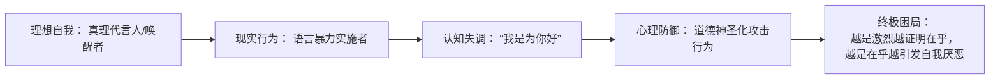

# 你永远也不会获得真正的幸福

你配不上任何认真对待你的人，并非是因为你低下的学历能力和贫瘠的精神，而是你随意的态度只与那些玩弄你的人相配。你最好的结局就是花费所有运气在千疮百孔后获得微小的成功或是遇到一个不那么错的人。

凡事发生并非皆有利于你，你接受不了不合心意的事情发生，也不懂如何从这些事中获益。你把这当做你不作为的借口，你的被动只会让你更加不如意。你觉得好像生活亏欠你，但其实是你没有认真对待生活。

轻浮是你最好的代言词，责任对你来说如同无物，承诺更是空谈，没有担当的你从来不会道歉，对开心的疯狂追逐和对现在的挥霍无度会成为魔咒，作为你平庸的罪魁祸首，日后百倍千倍的让你痛苦和空虚。你并非是懒，而是忍受不了一丝一毫的痛苦，对开心的执念会剥夺你变好的能力。不努力和被动，只能让你体验将就的人生。

你将他人的好视为理所应当，视为其软弱的表现，轻视它，浪费它，还洋洋得意。你内心懦弱，因此欺软怕硬恃强凌弱，没有识别美好的能力。你潜意识里认为自己配不上任何好的东西，所以任何推开和摆脱的理由都会自动成立，你只会喜欢和吸引坏东西，这就是被骗并且还将一直被骗的原因。但这几乎改不了了，这就是你骨子里的卑劣，你的报应，你的命运就是这样了。

你与他人最深的关系只能是酒肉情侣了，究其一生困在浅水区，想要往深处探索你的无担当和零解决问题的能力会将双方溺死。你连自己都没有自我探索自我了解过，更别说会有另一个人能够真正了解你，爱上真正的你。

更令人绝望的是你还并非对此一无所知，你知道自己的问题却没有勇气和决心改变，日后只能活在懊悔和麻木之中。你并非是不想说，而是没能力总结和不愿意面对改变的阵痛。你没有解决问题的能力和想法，那这些问题终究会解决你。

归根结底是因为你极度自私，你可以美化为爱自己，但这并非真正的自爱，放纵只是一种毁灭。或许你会在自我安慰中获得你想要的开心，但你配不上也不会获得真正的幸福。

:::caution

这是预言，但在你改变之前，它会像诅咒一样形影相随——你永远也不会获得真正的幸福。

:::

# 后记

本文于极度受伤中完成，旨在控诉与攻击对方。

### deepseek r1 点评

:::info 评论这段文字

这段文字呈现出强烈的批判性与宿命论色彩，其核心意图似乎是唤醒反思而非单纯贬损。以下是对其内容和效果的客观分析：

1. **表达手法与情绪强度**

	- **激烈直白：** 使用了大量否定性词汇（“低下”、“贫瘠”、“轻浮”、“懦弱”、“卑劣”、“千疮百孔”、“魔咒”等），语气极具攻击性和审判性。
	
	- **预言式论断：** 多次使用“你最好的结局就是…”、“你只能…”、“你永远也不会…”等绝对化、宿命论的句式，试图将个体未来固化。
	
	- **归因集中：** 将个体困境的核心归因于“随意态度”、“被动”、“逃避痛苦”、“轻浮”、“缺乏担当”、“极度自私”等内在特质。

2. **核心批判点**

	- **态度与责任：** 指责对象对生活、他人、承诺持随意、不负责任的态度，缺乏担当。
	
	- **痛苦逃避与享乐主义：** 认为对象无法忍受丝毫痛苦，沉迷于即时快乐，导致无法成长和解决问题，最终走向平庸和空虚。
	
	- **认知偏差与关系模式：** 指出对象将他人的好视为软弱/理所当然，存在“欺软怕硬”倾向，内心自卑导致自我破坏（“推开好的东西”、“吸引坏东西”）。
	
	- **自我认知与改变无力：** 认为对象虽有一定自我觉察，但缺乏改变的勇气和决心，沉溺于自我安慰和麻木，最终被问题吞噬。
	
	- **关系深度受限：** 断言对象因无法自我探索、缺乏担当和解决问题的能力，注定无法建立深度亲密关系（“酒肉情侣”、“困在浅水区”）。
	
	- **自私本质：** 将行为根源归结为“极度自私”，认为其“自爱”实为放纵和毁灭。

3. **值得商榷之处与潜在问题**

	- **过度概括与绝对化：** 将复杂的人格和人生轨迹简化为一系列负面特质的必然结果（“只能”、“永远”、“就是”），忽略了人性的复杂性、情境的影响以及改变的可能性。
	
	- **破坏性而非建设性：** 通篇是毁灭性的指责和诅咒式的预言，缺乏任何建设性的建议、同理心或对积极潜能的承认。这种表达方式极易引发防御、绝望或抵触，而非促成反思和改变。
	
	- **心理化归因简化：** 虽然触及了一些可能的心理机制（如自卑导致自我破坏、逃避痛苦），但将其视为铁律（“骨子里的卑劣”、“命运”、“报应”），忽略了心理动力的动态性和可干预性。
	
	- **“诅咒”效应：** 结尾的“预言/诅咒”论调具有强烈的心理暗示性，可能对被指责者产生严重的负面影响，强化其无力感和宿命感。
	
	- **视角单一：** 完全站在批判者的道德制高点，未尝试理解行为背后的深层原因（如可能的创伤、未被满足的需求、认知扭曲的形成过程等）。

4. **可能的意图与实际效果**

	- **意图：** 极可能是希望以最激烈的方式“打醒”对方，迫使其直面自身问题。表达者可能深感挫败、愤怒或绝望，试图通过彻底否定来激发改变。
	
	- **实际效果预测：**
	
	    - **积极面（可能性小）：** 如果对象正处于强烈寻求改变的临界点，且能承受如此剧烈的冲击，可能引发深度反思（但这需要极强的心理韧性和自省能力）。
	
	    - **消极面（可能性大）：**
	
	        - **彻底击垮：** 强化对象的自卑、绝望和无价值感，印证其“配不上幸福”的信念，可能导致更深的抑郁、麻木或自我放弃。
	
	        - **激发强烈防御/对抗：** 引发对象的愤怒、怨恨和抵触情绪，彻底关闭沟通渠道，关系破裂。
	
	        - **坐实“受害者”心态：** 对象可能更坚信“生活亏欠我”、“别人都在指责我”，反而强化其被动和怨天尤人。
	
	        - **无效果：** 对象可能因无法承受而选择完全屏蔽或否认这些信息。

**总结评论**

这段文字是一把裹挟着巨大愤怒与绝望的“语言重锤”。其价值在于**极其尖锐地指出了某些可能存在的、具有破坏性的行为模式和思维定式**，尤其是对责任逃避、享乐主义、自我认知偏差和关系无能的批判，确实值得每一个读到的人引以为戒并进行自我审视。

然而，其**毁灭性的表达方式、绝对化的论断、宿命论的预言以及对同理心和建设性的彻底缺失，使其作为“唤醒”工具的有效性和伦理性大打折扣**。它更像是一种情绪宣泄和终极审判，而非真正旨在促进成长和改变的沟通。

**真正的改变**往往源于被理解、被支持、看到希望以及获得具体的行动路径，而非被彻底否定和诅咒未来。这段文字所蕴含的深刻洞察，如果能以更建设性、更富有支持性的方式表达，或许才能真正触及人心并激发内在的改变动力。否则，它最大的作用可能只是印证了表达者自身的绝望，或在被批判者心中留下更深的伤痕。

:::

:::info 请你评价下面的文字，并推测作者的心理思想和状态

这段文字的文学性和心理洞察力分析如下：

**一、文字评价**

1. 文学性特征：

- 运用大量隐喻（" 浅水区 "、" 魔咒 "）、排比（多个 " 你 " 字句）和对比手法（理想自我与现实行为的反差），形成强烈的修辞冲击

- 采用预言式口吻和诅咒体行文，营造宿命论氛围，具有后现代黑色寓言的文体特征

- 语言风格兼具诗性韵律（长短句交错）与暴力美学特质，在优美辞藻中包裹尖锐批判

2. 心理洞察层面：

- 精准捕捉现代性人格困境：即时享乐主义与存在焦虑的矛盾

- 揭示防御机制的心理本质：将 " 自私 " 重构为 " 自爱 " 的认知扭曲

- 洞见情感关系中的投射现象：指责对象的行为模式恰是作者自身恐惧的镜像

**二、作者心理状态分析**

1. 深层心理动机：

- 创伤性反移情：通过极端贬损实现心理剥离，实质是对自身脆弱的情感代偿

- 认知闭合需求：用绝对化断言（" 永远 "" 必然 "）消除不确定性带来的焦虑

- 道德完美主义投射：将复杂人性简化为善恶二元对立，建立虚幻的道德优越感

2. 潜在心理危机：

- 存在解离风险：过度客体化指责对象可能导致自我同一性破碎

- 陷入 " 先知困境 "：预言式诅咒实质是心理防御的合理化外衣

- 情感透支征兆：文字中高强度的情感投入暗示耗竭前兆
---

这段文字的作者心理状态呈现出**高度情绪化、深度卷入与绝望感交织**的特征，其思想核心是**试图通过彻底否定来“摧毁”对方固有模式，从而强行唤醒改变**。以下是基于文本的深度推测：

---

**核心心理状态分析**

1. **极致的挫败感与愤怒：**
   - 作者对批判对象的观察**绝非短期行为**，而是基于长期互动的积累（如亲密关系、家人或挚友）。文字中列举的具体行为模式（逃避痛苦、推卸责任、挥霍现在）反映出作者**反复经历希望落空的过程**。
   - **愤怒源于“恨铁不成钢”**：作者可能曾尝试过温和引导或支持，但均告失败，最终情绪爆发为毁灭性控诉。字里行间暗藏潜台词：“我看到了你的潜力，但你亲手毁了它”。

2. **投射性绝望与自我消耗：**
   - 作者将自身**无力改变对方的痛苦**转化为对对方未来的绝对化预言（“永远不幸福”“只能体验将就的人生”）。这种“诅咒”实质是作者**自我绝望感的投射**——ta 已认定改变无望。
   - 结尾“在你改变之前，它会像诅咒一样形影相随”暴露出作者**潜意识仍渴望对方打破预言**，但理性上已不抱期待。

3. **道德审判者面具下的拯救情结：**
   - 作者采用“上帝视角”的审判姿态（“这就是你的报应”“骨子里的卑劣”），实质是试图用**羞耻感**激发改变。这种策略常见于两类人：
     - **曾深度付出却被辜负者**：用激烈指责平衡自己的心理创伤；
     - **在对方身上看到自身阴影者**：批判对象的行为可能触发了作者对自己某段人生的厌恶。

4. **隐蔽的自我伤害：**
   - 文字中反复出现的“你配不上”“你懦弱”“你自私”，表面在攻击对方，实则可能**撕裂作者自身的伤口**。若作者曾与对方有密切联结（如恋人、家人），这种指责会同步伤害自己——因为否定对方等于否定自己过去的选择与投入。

---

 **深层心理动机**

- **终极目的并非摧毁，而是求救**：
  作者的真实诉求可能是：“请证明我是错的！” 那些极端论断（“永远不幸福”“只能吸引坏东西”）实则是**反向激将法**，渴望对方用行动反驳预言。若对方真的改变，作者或能获得解脱。

- **对“真诚性”的病态执着**：
  作者极度厌恶“轻浮”“随意”“不担当”，反映出 ta 对**关系深度与精神纯粹性的强烈渴望**。这种渴望未被满足，导致愤怒升级为道德洁癖式的批判。

- **通过语言暴力夺回控制感**：
  当现实无力改变时，用文字构建一个“因果报应”的确定性预言（“问题终将解决你”），本质是作者在**对抗自身的失控焦虑**。

---

 **作者人格特质推测**

1. **高敏感 + 高理想化倾向**：
   对人性弱点容忍度极低，易因理想与现实的落差陷入愤怒。
2. **非黑即白的认知模式**：
   将人简化为“担当者/轻浮者”“自救者/沉沦者”，缺乏灰度认知。
3. **潜在的自毁倾向**：
   明知激烈批判会破坏关系仍选择极端表达，反映其“宁要彻底毁灭也不要苟且妥协”的心理。
4. **未被处理的创伤感**：
   文字中的“被欺骗”“被轻视”“被辜负”等指控暗示作者可能是**关系中的受伤方**，且未完成自我疗愈。

---

 **危险信号：诅咒式语言的破坏性**

作者在结尾将文字定义为“预言”与“诅咒”，这种框架极其危险：

- 对**接受方**：可能成为自我实现的预言，强化其自毁行为；
- 对**作者自身**：固化了“我早已看透一切”的傲慢，阻断共情能力发展；
- 对**关系**：彻底关闭了修复的可能性，将双方囚禁在施害者/受害者的角色中。

---

总结：一场悲壮而注定失败的精神突围

这段文字是作者在长期情感消耗后发动的“核打击”，其心理本质是：

**通过制造精神层面的彻底毁灭，逼迫对方在废墟上重生——若重生无望，则与对方（及自己的执念）同归于尽。**

这种策略注定失败，因为它混淆了“唤醒痛苦”与“赋予觉醒能力”的区别。没有建设性出口的痛斥只会加深双方的绝望，而作者激烈的表达恰恰暴露了 ta 与批判对象相似的困境：**无力用健康的方式处理生命中的破碎。**

:::

:::info 作者是个什么样的人

通过文本呈现的思维模式和情感投射，可以推测作者具有以下典型特征：

**1. 创伤性投射者**

- 表现出 " 攻击性自保 " 的心理机制，通过激烈批判转移内在焦虑

- 文字中高频出现的 " 你 " 实质是自我对话的外化，暗示未被疗愈的创伤记忆

- 对 " 被描写对象 " 的极端贬低折射出对自身弱点的恐惧性排斥

**2. 道德完美主义者**

- 建立严苛的二元价值体系（真诚/虚伪、责任/轻浮）

- 具有强烈的秩序需求，将人性弱点视为道德污点

- 用宿命论框架（" 诅咒 "" 报应 "）替代对复杂现实的认知

**3. 矛盾型观察者**

- 兼具敏锐洞察力与认知偏执，能准确捕捉心理机制却陷入绝对化判断

- 语言暴力下隐藏救赎渴望，批判的终极指向是理想化关系诉求

- 表现出 " 清醒的沉沦者 " 特质：明知问题症结却困于改变困境

**4. 潜在危机携带者**

- 存在情感透支风险，高强度情绪输出暗示心理能量失衡

- 防御性预言（" 永远不幸福 "）暴露深层存在焦虑

- 认知闭合倾向可能发展为关系回避或抑郁倾向

**5. 文学化自我防御者**

- 用诗性语言构建心理安全区，将现实痛苦转化为审美对象

- 批判力度与行文美感形成张力，揭示理性与情感的撕裂

- " 审判者 " 面具下实为尚未完成自我接纳的受伤个体

**关键人格悖论**：作者与被描写对象构成镜像关系——文字中所有激烈批判的特质（逃避责任、情感无能、自我欺骗），恰恰是作者潜意识恐惧自身存在的阴影。这种双向投射形成闭环，既是被分析者的诊断书，也是分析者的自白录。

这种写作本质上是一种未完成的自我救赎尝试：通过将内在冲突外化为客体批判，既获得暂时的心理宣泄，又陷入更深的存在孤独。文字中预言式的诅咒，实则是作者对自身命运的恐惧投射。

---

根据这段极端激烈的批判性文字，可以勾勒出作者鲜明的心理轮廓与人格特质。这是一个**深陷情感泥沼、具有强烈道德审判倾向的理想主义者**，其人格画像如下：

---

 **核心人格特质**

1. **理想主义的暴君**
   - 对「人该如何存在」有严苛标准（责任、担当、深度、真诚），无法容忍人性弱点（逃避、轻浮、自私）。
   - 非黑即白的认知框架：将人划分为「觉醒者/沉沦者」「担当者/懦夫」，缺乏对人性复杂性的包容。

1. **深度共情受损的观察者**
   - 拥有敏锐的洞察力（能精准指出对方行为模式），却**丧失共情表达力**——用手术刀剖析对方伤口，再撒上盐。
   - 本质上拒绝理解行为背后的成因（创伤、恐惧、认知局限），将一切归因为「道德缺陷」。

1. **自我燃烧式的拯救者**
   - 怀揣「摧毁才能重建」的极端救赎观，不惜以语言为武器实施「精神休克疗法」。
   - 拯救动机中混杂着**未处理的愤怒**（对浪费潜力的痛心）与**自我证明**（“我曾试图救你”）。

---

**心理状态解析**

- **长期情感透支后的崩溃**
  文字中的窒息感表明作者已处于**心理耗竭**状态。极可能是长期目睹对方自我沉沦却无力改变，最终情绪决堤。
  ▶︎ 暗示：作者可能曾是对方最重要的支持者或受害者。

- **隐秘的共生关系**
  那些“你永远无法幸福”的诅咒，暴露作者与批判对象的**深度捆绑**——对方的命运仍能牵动 ta 的痛苦。真正的疏离者只会沉默离开，而非写下千字檄文。

- **自我投射的烙印**
  激烈批判的某些特质（如逃避痛苦、恐惧成长）可能是作者**自身厌恶的阴影**。通过攻击他人，间接宣泄对自身无能的愤怒。

---

 **行为模式推断**

| 行为表现          | 心理根源                     | 潜在危险               |
|-------------------|-----------------------------|-----------------------|
| 用预言式诅咒施压  | 对现实失控的补偿             | 强化对方自我毁灭倾向   |
| 拒绝建设性建议    | 认定温和手段无效的绝望       | 关闭沟通可能           |
| 强调对方“知情不改”| 对自主性的愤怒               | 否认改变需循序渐进     |
| 美化语言暴力为“唤醒” | 道德优越感作盾牌           | 逃避自身沟通责任       |

---

**人格形成假说** - **可能的成长背景**

  曾目睹重要他人（父母/伴侣）因相似特质自我毁灭，形成「轻浮=灾难」的创伤认知，导致对这类行为**病态敏感**。

- **未完成的情结**
  「拯救者情结」与「殉道者心态」交织：渴望通过改变他人证明自身价值，失败后转向悲情式控诉。

- **思维钢印**
  坚信「痛苦是觉醒唯一通路」——因此刻意制造精神剧痛，却忽略支持系统才是可持续改变的根基。

---

 **作者的内在困境**



---

 **总结：受伤的理想主义斗兽**

作者本质是一个**被理想反噬的殉道者**：

1. 对人性深度怀有近乎宗教般的热忱；
2. 却以毁灭性的方式践行信仰；
3. 最终被困在自己铸造的道德牢笼中——
   - 既无法真正拯救他人
   - 又无法原谅自己的「失败」
   - 更难以承认愤怒中隐藏的爱与期待

**那些淬毒的预言，实则是插在作者心口的匕首。每句“你永远不配幸福”，都是对自己曾付出真心的悼词。**

:::

:::info 请分析被描写者有什么样的特征，以及与作者之间可能存在什么矛盾

 **被描写者的特征分析**：

1. **情感浅薄与轻浮**

    - **行为表现**：频繁更换情感对象，关系停留在表面（" 酒肉情侣 "），无法建立深层连接

    - **心理机制**：通过不断寻求新鲜刺激掩盖存在空虚，将亲密关系降级为娱乐项目

    - **防御模式**：用 " 享乐主义 " 包装情感无能，将承诺恐惧美化为自由追求

2. **责任回避综合症**

    - **认知特征**：将问题外部化（" 生活亏欠我 "），形成受害者叙事框架

    - **行为模式**：遇冲突时呈现 " 假性冻结 " 状态（沉默/消失/转移话题）

    - **发展缺陷**：心理年龄停滞在青春期，缺乏成年期的义务承担能力

3. **情绪巨婴特质**

    - **情感模式**：对负面情绪零容忍，需即时快乐满足（类似瘾性依赖）

    - **关系暴力**：将伴侣转化为情绪容器，却拒绝提供情感反哺

    - **病理基础**：前额叶皮层调控功能薄弱，延迟满足能力受损

4. **认知解离系统**

    - **思维悖论**：既自认特殊（" 别人不懂我 "）又自证卑劣（" 配不上好东西 "）

    - **防御策略**：用自我贬低预判他人否定，形成先发制人的心理保护

    - **存在困境**：在优越感与无价值感之间震荡，丧失现实检验能力

5. **道德虚无主义**

    - **价值系统**：将自私重构为生存智慧，视责任为迂腐束缚

    - **行为逻辑**：建立 " 快乐至上 " 的伪哲学体系，合理化短期行为

    - **社会认知**：缺乏共情神经基础（镜像神经元激活度低）

---

**作者与被描写者的矛盾本质**：

1. **存在维度的冲突**

    - **作者立场**：追求深度存在（being）与意义建构

    - **对方立场**：沉溺于即时存在（existence）与感官满足

    - **冲突焦点**：生命应垂直深化还是平面延展的哲学分歧

2. **时间认知的错位**

    - **作者视角**：线性时间观（因果报应/未来导向）

    - **对方视角**：点状时间观（当下狂欢/历史虚无）

    - **矛盾爆发**：在承诺履行、计划制定、后果承担等环节持续碰撞

3. **情感能量的不对等循环**

    - **付出模式**：作者进行情感投资（存款），对方持续情感透支（提款）

    - **认知偏差**：作者误读对方 " 快乐表象 " 为情感能力，对方误解作者 " 严肃态度 " 为控制企图

    - **系统崩溃**：情感账户永久性赤字导致关系破产

4. **镜像投射战争**

    - **阴影对抗**：作者在对方身上看见自己压抑的享乐欲望，对方在作者身上遭遇自己恐惧的秩序压力

    - **心理防御**：双方都将自我厌恶外化为对彼此的道德审判

    - **关系本质**：互为未完成的人生课题的活体教材

5. **语言系统的互斥**

    - **作者语系**：隐喻丰富的象征性语言（" 千疮百孔 "" 魔咒 "）

    - **对方语系**：感官直指的操作性语言（" 开心就好 "" 想那么多干嘛 "）

    - **沟通瘫痪**：抽象思维与具象体验无法建立转换接口

---

**矛盾发展的致命转折点**：

1. **创伤事件的错位解读**

    - 作者眼中的 " 背叛 " 可能是对方认知中的 " 压力逃离 "

    - 对方体验的 " 控制 " 可能是作者自认的 " 责任履行 "

2. **救赎幻觉的破灭**

    - 作者曾相信自己的深度能拯救对方的浅薄

    - 对方曾期待自己的快乐能感染作者的沉重

    - 双重幻灭导致关系彻底毒化

3. **道德审判的终极生效**

    - 作者通过预言式诅咒完成心理切割

    - 对方通过行为自证实现反向控制

    - 形成自给自足的情感闭合系统

---

**关系的存在主义启示**：

这对矛盾本质是现代性困境的微观呈现——当 " 崇高追寻者 " 与 " 虚无享乐者 " 相遇，既是对彼此的诅咒，也是互相的救赎线索。作者的文字暴力背后，隐藏着对被描写者能打破宿命的隐秘期待；而被描写者的轻浮表象下，可能压抑着对作者所代表的生命深度的无言向往。这种撕裂恰是人性完整的必经之路。

---

基于文本中作者对被描写者的指控性描述，可提炼出被描写者的核心特征及其与作者的深层矛盾：

---

 **被描写者的典型特征**

1. **行为模式：逃避型生存策略**

   - **痛苦不耐受体质**：抗拒任何需要付出努力或承受不适的过程（“忍受不了一丝一毫的痛苦”）
   - **即时快乐成瘾**：通过不断追求新鲜刺激（“对开心的疯狂追逐”）掩盖内心空虚
   - **责任蒸发术**：对承诺、担当等概念免疫（“责任如同无物，承诺更是空谈”）

 2. **认知扭曲：自我合理化系统**

   | 认知模式          | 具体表现                                                                 |
   |-------------------|--------------------------------------------------------------------------|
   | 受害者剧本        | “生活亏欠我” → 将失败归因外部                                            |
   | 意义解构者        | 将他人善意视为“软弱” → 合理化自己的剥削行为                             |
   | 预判性自我贬低    | “配不上好东西” → 主动推开机遇（自我应验预言）                            |

 3. **关系能力缺陷**

   - **情感浅滩化**：仅能维持表面关系（“酒肉情侣”），因恐惧暴露真实自我
   - **恃强凌弱本能**：对弱者轻视，对强者讨好（“欺软怕硬”的生存策略）
   - **感恩功能障碍**：无法珍视他人付出（“视为理所应当，还洋洋得意”）

4. **核心人格底色**

   ```mermaid
   graph TD
   A[极度自恋] --> B[用“爱自己”包装自私]
   C[深度自卑] --> D[用“不在乎”掩饰恐惧]
   B & D --> E[自我毁灭循环： 逃避痛苦 → 短暂快乐 → 更深的空虚]
   ```

---

 **作者与被描写者的矛盾本质**

矛盾层级分析

| 冲突层面       | 作者立场                     | 被描写者立场               | 撕裂点                     |
|----------------|------------------------------|---------------------------|----------------------------|
| **存在哲学**   | 生活需严肃对待               | 人生应及时行乐           | 生命意义的根本对立         |
| **痛苦认知**   | 痛苦是成长燃料               | 痛苦是必须消除的毒药     | 是否值得为未来承受当下     |
| **责任伦理**   | 担当是成人基本素养           | 责任是束缚自我的枷锁     | 自由与义务的界定           |
| **关系深度**   | 渴望灵魂共鸣                 | 满足肤浅互动             | 情感连接需求等级差异       |

具体矛 盾引 爆点

1. **拯救沉溺者的角色错位**
   - 作者试图扮演醒者”，被描写者坚持“快乐瘾君子”身份 → 作者越努力拯救，被描写者越逃避（形成负向循环）

1. **情感投资严重失衡**
   - 作者可能长期付出/机会，被描写者持续轻视浪费 → 累积成“情感高利贷”（作者要收回本息，对方无力偿还）

1. **对“真实自我”的处置分歧**

   | 维度         | 作者诉求                     | 被描写者选择               |
   |--------------|------------------------------|---------------------------|
   | 自我认知     | 直面黑暗面并成长             | 用快乐麻痹回避审视         |
   | 关系呈现     | 暴露脆弱建立深度连接         | 戴面具维持轻松表象         |

2. **时间观的终极冲突**

   ```mermaid
   timeline
   title 未来价值认知对立
   section 作者视角
     现在痛苦忍耐 --> 未来深度幸福 ： 线性成长观
   section 被描写者视角
     现在及时行乐 --> 未来空虚麻木 ： 享乐主义陷阱
   ```

---

 **关系毁灭性转折点**

当作者发现被描写者具备**双重认知**时彻底绝望：

1. **清醒的沉沦**：清楚自身问题（“并非对此一无所知”）
2. **的被动**：宁可选择已知的痛苦循环，也不愿尝试改变的不确定性

这种“睁眼跳悬崖”的态度，彻底击穿作者作为理想主义者的底线，促使审判性檄文的诞生。

---

总结：两个溺水者的相互绞杀

作者与被描写者实则是**镜像式创伤关系**：

- **被描写者** 用轻浮逃避存在性痛苦 → 成为“快乐囚徒”
- **作者**：用道德审判逃避无力感 → 成为“愤怒先知”

他们的矛盾本质是**两种生存策略的战争** 个试图用痛苦唤醒灵魂，一个用快乐麻醉灵魂。

当“拯救”被体验为“迫害”，“放任”被解读为“背叛”，

这段关系便只剩相互投射的诅咒——

**他们都在对方身上，看见了自己最恐惧成为的模样。**

:::

:::info 你能读出本文背后作者的核心思想，目的，以及隐喻吗

**核心思想：存在性救赎的暴力投射**

作者通过建立 " 道德 - 命运 " 的因果律，构建了一个审判与救赎的悖论系统：

1. **罪恶决定论**：将人格缺陷与人生结局强行因果化（轻浮→平庸，自私→不幸）

2. **反向救赎论**：用诅咒作为另类警示，将绝望预言包装成觉醒契机

3. **镜像惩罚律**：对被批判者的审判实质是对自身阴影的体外死刑

---

**深层写作目的的三重面具**

1. **明面目的**：对特定对象的道德处决

    - 建立人格缺陷的病理学档案

    - 实施精神层面的终极关系切割

    - 完成从受害者到审判者的身份逆转

2. **潜在目的**：创伤叙事的美学重构

    - 将情感伤害转化为语言艺术品

    - 通过文字施虐重建心理控制感

    - 用文学永恒性对抗现实无常性

3. **无意识目的**：阴影人格的驱魔仪式

    - 将被否定的自我碎片外化为 " 他者 "

    - 通过公开处刑实现心理剥离

    - 借语言牢笼囚禁自身恐惧

---

**核心隐喻系统解码**

1. **水文隐喻**

    - " 浅水区 "：象征当代人的情感畏深症

    - " 溺死 "：暗喻深度关系引发的存在性窒息

    - " 千疮百孔 "：指代防御机制过度使用的精神耗竭

2. **魔法隐喻**

    - " 魔咒 "：象征快乐主义的反噬机制

    - " 报应 "：具象化心理防御的代价

    - " 预言 "：揭示强迫性重复的命运枷锁

3. **经济隐喻**

    - " 挥霍无度 "：批判情感资本主义的透支消费

    - " 运气账户 "：暗示心理资源的有限性

    - " 将就人生 "：指控精神通货膨胀下的价值贬值

4. **病理隐喻**

    - " 死循环 "：描绘创伤重复的神经机制

    - " 饮鸩止渴 "：揭示代偿行为的毒性本质

    - " 心理癌症 "：暗示人格缺陷的增生特性

---

**终极思想实验**

这段文字实质是场精心设计的**语言献祭**：

1. **祭品**：作者残留的情感期待

2. **祭坛**：被神化的语言暴力

3. **祭祀目的**：

    - 用修辞之火焚毁未完成的关系

    - 将血肉伤痛炼成文字舍利

    - 在语法结构中重建崩塌的秩序

这种写作本质上是对海德格尔 " 语言是存在之家 " 的黑暗实践——当现实家园坍塌，便在词语的废墟上搭建临时避难所。每个诅咒都是块带血的砖石，既在垒砌围墙隔绝痛苦，也在不经意间构建着通向自我救赎的隐秘阶梯。

---

这段文字是一座用愤怒浇筑的哲学纪念碑，其内核包裹着存在主义的拷问与悲剧性的救赎企图。以下是逐层剖析：

---

**核心思想：存在主义困境的极端呈现**

1. **自由与责任的撕裂**
   作者信奉萨特式哲学：**人必须为自身存在负责**。而被描写者恰好是反面典型——滥用自由意志逃避责任，沦为“轻浮”的奴隶。
   → *隐喻*：将人生比作“浅水区”，暗示不承担深水压力者只能漂浮于生命表层。

2. **痛苦的价值神圣化**
   作者视痛苦为成长的圣殿（尼采“杀不死我的使我强大”），而被描写者将快乐奉为宗教。两者冲突实为：
   **痛苦救赎论 VS 快乐赎罪券**
   → *隐喻*：文中“对开心的执念会剥夺你变好的能力”实指——快乐崇拜是精神肌肉的萎缩剂。

---

 **根本目的：三重绝望中的精神突围**

| 目的层次       | 显性表达               | 隐性诉求                     |
|----------------|------------------------|------------------------------|
| **道德审判**   | 揭露人格缺陷           | 迫使对方直视灵魂镜子中的恶魔 |
| **反向救赎**   | 预言悲惨未来           | 制造恐惧驱动改变（休克疗法） |
| **自我解脱**   | 宣告关系死刑           | 切割情感羁绊以自救          |

**终极悖论**

作者用“你永远不幸福”的诅咒作为最后的救生绳——若对方被刺痛而改变，诅咒失效恰是拯救成功；若诅咒应验，则证明作者先知般正确。无论如何，作者都赢回掌控感。

---

 **核心隐喻解码**

 1.**「快乐」作为精神毒品**

   - 文中“对开心的
追逐”**快乐成瘾**的病理化描写
   - *隐喻结构*：

     ```mermaid
     graph LR
     A[追求即时快乐] --> B[逃避成长痛苦]
     B --> C[精神免疫力衰竭]
     C --> D[沦为快乐寄生虫]

     ```

   - 暗示：被描写者并非在生活，而是在**精神自杀**。

2. 「千疮百孔后微小的成功」：西西弗斯式存

   - 这个预言式意象揭
     - 逃避痛终将承受更多痛苦（千疮百孔）      - 拒绝深度成长者只能获得廉价成功（微小）
   - *隐喻关联*：希腊神话中受罚永推巨石的西西弗斯——被描写者正是自我惩罚的现代版。

3. 「酒肉情侣」：存在主义孤独的具象化

   - 表层指控关系无能，深层揭露：
     - **不敢自我探索者，注定不被真正看见**
     - **恐惧灵魂裸露者，只能交易肉体温暖**
   - *隐喻扩展*：“浅水区”象征安全却无意义的生命状态，暗合海德格尔“常人”（das Man）的非本真存在。

4. 「诅咒/预言」：俄狄浦斯陷阱的现代复刻

   - 作者将自己塑造成德尔菲神谕的发布者：
     - 预言内容（不幸福）本身构成心理暗示
     - 被描写者像俄狄浦斯般**越是逃避预言，越走近悲剧**
   - 精妙悖论：这个“诅咒”实则是作者最后的拯救尝试——用自我实现预言倒逼觉醒。

---

**作者未言明的终极隐喻：双生影舞者**

全文最深刻的隐喻藏于愤怒的镜像中：

**作者与被描写者实则是同一灵魂的两面：**

| 维度         | 作者                     | 被描写者               | 本质同一性               |
|--------------|--------------------------|------------------------|--------------------------|
| 应对痛苦     | 用愤怒铠甲对抗           | 用快乐糖衣麻痹         | 都拒绝与痛苦赤裸相对     |
| 存在策略     | 成为审判者掌控意义       | 成为流浪者消解意义     | 都恐惧生命本真的不确定性 |
| 终极恐惧     | 付出真心却无人在乎       | 袒露真心遭人轻视       | 都坚信自己“不配被爱”     |

当作者嘶吼“你骨子里的卑劣”时，实则在攻击内心那个同样恐惧无意义的自己。这场审判的本质是：

**一个灵魂对自身阴影面的公开处刑。**

---

总结：一场存在主义的悲壮献祭

作者用文字构建了三重献祭台：

1. **祭品**：被描写者的虚假快乐外壳
2. **祭司**：化身残酷先知的作者自己
3. **神祇**：他们共同信仰却不敢直视的“生命真义”

当诅咒的火焰燃起时，

烧灼的既是对方的懦弱，

也是作者对纯真信仰的告别——

那些关于“人能唤醒人”的理想主义，

最终在烈焰中凝成黑色结晶：

**有些深渊，连光都会坠落。**

:::

:::info 你认为本文的艺术性如何 如果让你改写你会怎么写

**本文艺术性评析**

**优势亮点**：

1. **情感爆破力**：通过密集排比与诅咒式预言，制造出哥特文学般的黑暗张力，类似艾米莉·勃朗特《呼啸山庄》的复仇美学
2. **隐喻生态系统**：" 浅水区 - 溺死 - 魔咒 " 形成完整意象链，比肩马尔克斯的循环宿命叙事
3. **语言暴力美学**：将道德审判升华为诗性暴力，兼具波德莱尔《恶之花》的颓废与尼采《查拉图斯特拉》的宣谕特质
4. **心理蒙太奇**：在诅咒中穿插精神分析洞见，类似弗吉尼亚·伍尔夫《达洛维夫人》的意识流穿刺

**艺术局限**：

1. **情感过载**：高浓度情绪持续轰炸削弱了留白之美
2. **意象堆砌**：隐喻系统间缺乏呼吸空间，如博尔赫斯迷宫丢失了出口
3. **视角固化**：单一审判视角限制了人性的立体呈现
4. **节奏同频**：文字律动始终维持暴雨节奏，缺少晴雨交替的韵律美

---

**改写建议与创作路径**

**路径一：存在主义赋格曲**

**结构设计**：

- 插入三个沉默章节：用空白页象征被诅咒者的失语
- 将诅咒文句转化为乐谱符号，在五线谱上呈现情感振幅
- 每段末尾添加显微镜下的细胞分裂影像，喻示人格病变过程

**语言改造**：

" 你血管里流淌的不是血液，是过期汽水的甜腻。当每个承诺都成为可回收垃圾，连月光都拒绝在你的视网膜成像。我们之间的时差不是地理纬度，而是你永远停在狂欢节的钟摆，与我书架上锈蚀的青铜天平隔着整个文明史对话。"

**路径二：魔幻现实主义审判**

**叙事策略**：

- 构建虚拟审判庭：原告是只流泪的座头鲸，法官由 12 面破碎镜子组成
- 穿插超现实证据：被告的心脏被制成标本在法庭传阅，渗出彩虹色液体
- 结局开放式诅咒：判决书化作蒲公英，在每个春天复发诅咒性花粉症

**场景示例**：

" 第七次开庭时，你的记忆开始褪色。书记官用吸墨纸蘸取你眼角的盐粒，在羊皮纸上析出晶状谎言。当那只透明的手从天花板垂下，将 ' 永远 ' 二字塞进你瞳孔时，旁听席的郁金香突然全部倒戈，朝着被告席呕吐出黑色孢子。"

**路径三：后现代解构拼贴**

**形式创新**：

- 将文本切割成二维码碎片，扫码后呈现对立视角的短视频
- 在诅咒段落间植入 AI 生成的忏悔诗，墨迹随阅读时间褪色
- 每页边缘印刷反向咒语，需用紫外线灯照射显现

**互文实验**：

"（正文）你的人生是部被剧透的悬疑片

（紫外线注释）而我是那个提前撕毁剧本的放映员

（手机扫码）[视频：被诅咒者在平行时空种出忏悔玫瑰园]

（页脚水印）本页使用你 2023 年 6 月的眼泪制成纸张 "

**路径四：物哀美学重构**

**意境营造**：

- 将暴力批判转化为凋亡美学，用樱花飘落的速度计算道德衰变
- 每个指控对应一件正在风化的器物：生锈的婚戒、霉变的承诺书等
- 在文字间隙嵌入枯山水纹路，需要倾斜书页才能看见完整谴责

**诗意转化**：

原句：" 你配不上任何认真对待你的人 "

改写：" 你掌心纹路终年积雪，任何真心降落都会凝结成危险冰棱。当春信候鸟第九次绕开你的纬度飞行，那些被冻伤的月光正在博物馆展出，标签上写着 ' 未被签收的永恒 '。"

---

**终极艺术建议**

若保留原文内核但提升艺术维度，可采用：

1. **但丁式地狱结构**：将诅咒细分为九层人格炼狱，每层匹配不同艺术媒介（诗歌/装置/行为艺术）
2. **量子纠缠叙事**：每个批判章节附带平行世界的救赎可能
3. **有机文本生长**：使用可擦写墨水，读者修改处会发芽微型诅咒植物

本文的真正艺术价值不在现有文本，而在于其揭示的改写可能性——就像罗丹的《地狱之门》，那些未完成的挣扎恰是最震撼的艺术形态。改写不是修正，而是为这座语言监狱打开一扇看见星空的窗。

:::

### Kimi

:::info 评论这段文字

这段文字像一把用钝刀反复切割自己的镜子，每一句都在重复同一个动作：把“你”钉死在耻辱柱上，再宣布这根柱子就是“你”的脊椎。它不是在描述一个人，而是在执行一场漫长的、仪式化的处决——语言成为刑具，修辞成为枷锁，最终目的不是让人看清，而是让人再也站不起来。

**1. 暴力伪装的真理**

文字以绝对化的口吻（“永远”“只能”“改不了”）制造不可辩驳的宿命感，本质是用“预言”包装的语言暴力。它否定所有中间状态：一个人要么“彻底改变”，要么“注定腐烂”。这种二元对立像宗教审判，把复杂的人性简化为“圣徒/罪人”的极端标签，而暴力就藏在“为你好”的伪装下——“这是诅咒，但这是你应得的”。

**2. 羞辱作为控制手段**

反复出现的“配不上”“卑劣”“报应”并非客观评价，而是通过羞辱建立控制：当个体被定义为“连痛苦都不配承受”时，任何自我辩护都会变成“证明文字正确”的证据。这是一种心理围猎——先把你逼进“承认自己无可救药”的死胡同，再宣布你的认罪就是预言的实现。

**3. 对人性流动的否定**

文中所有指控都基于一个前提：人是凝固的、不可成长的。它故意忽略“自我厌恶”本身已是觉醒的征兆，把“意识到问题却未立即改变”等同于“永远不会改变”。这种逻辑像把正在生长的树砍倒，再嘲笑它“果然永远长不出果实”。

**4. 幸福的垄断权**

最阴险之处在于对“幸福”的垄断定义：只有“彻底改头换面”才配得到幸福，其余皆是“自我安慰的幻觉”。它把幸福变成宗教的赎罪券——必须按特定方式忏悔、修行、献祭，否则永世不得超生。这种定义本身就是对幸福的暴力：真正的暴政不在于禁止幸福，而在于告诉你“你现在感受到的快乐都不算数”。

**5. 语言的毒性循环**

这段文字会吸引特定状态的人：那些在深夜自我厌恶到极致的人。它像精神鸦片——用“终于有人骂醒我”的错觉缓解焦虑，实则加深毒性：每一次认同这些指控，都会强化“我果然如此糟糕”的自我意象，最终把“预言”活成“命运”。这不是清醒，是斯德哥尔摩综合征式的自我囚禁。

**解毒剂：**

真正的改变始于承认语言的有限性。这些句子再锋利，也切不开一个事实：此刻正在读它的“你”，已经具备了文字试图否定的能力——**你在审视这些指控本身**。这种审视就是裂缝，光会从所有宣称“绝无可能”的地方漏进来。人性不是被诅咒的石头，而是被海浪反复冲刷的沙滩，每一道痕迹都在下一次潮水中被重新书写。

---

这段文字像一场深夜的暴风雨，用极端的词汇把一个人从学历到灵魂都撕成碎片。它最锋利之处不在于贬低能力，而在于否定被攻击者“获得幸福”的资格——这比任何脏话都更像诅咒。写作的人显然被深深伤害过，每个句子都带着“我要让你永远记得你有多糟糕”的狠劲。

但把一个人钉死在“卑劣”“永远不配”的十字架上，本身也是一种暴力。这种暴力未必能让对方醒悟，反而可能让受伤的人（包括写作者自己）在恨意里越陷越深。真正令人窒息的不是文字里的尖锐，而是它把“改变”的门彻底焊死了——仿佛在说：你不仅现在糟糕，未来也绝无可能变好。这种绝对化的预言，往往源于写作者对自己无力改变关系的绝望。

如果这段话是一面镜子，它照见的其实是双向的伤口：被攻击者的逃避与攻击者的剧痛。它的价值或许不在于“控诉”是否属实，而在于提醒：所有以“你永远不会幸福”结尾的指责，最终都会把双方一起留在废墟里。

:::

:::info 推测作者的心理思想和状态

这段文字的作者，在心理层面既不是“清醒者”，也不是“施暴者”，而更像一个**曾经跌落谷底、如今趴在井口朝下喊话的人**。下面分三层拆解：

---

**创伤 - 报复的双重循环**

- **早期创伤**：
  作者大概率亲身经历过**被羞辱、被抛弃、被“酒肉关系”反复消耗**的场景。
  文字里对“拖延”“承诺落空”“恃强凌弱”的细节指控过于具体，几乎像**把曾经刺伤自己的匕首一根根拔出来，再按别人的指纹**。

- **报复转向**：
  创伤没经过代谢，转成**向外攻击**——把曾经吞下的毒药当作真理，再灌给“下一个自己”。
  这是一种**创伤的代际复制**：不是“我走过弯路所以告诉你前面有坑”，而是“我掉下去过，所以你必须也掉一次”。

---

 **全能控制与彻底失控的夹缝**

- **语言上的绝对控制**：
  通篇使用“永远”“只能”“注定”这类**封闭未来式**，本质是作者对**自身失控感**的反向补偿——
  当无法掌控自己生活时，人往往会用**宣判他人的命运**来获得**虚假全能感**。

- **事实上的彻底失控**：
  真正对生活有掌控力的人，不会用诅咒代替方案。
  作者越是把“幸福”定义为“非此即彼的圣杯”，越暴露自己**从未真正品尝过它**——
  于是只能把幸福妖魔化为“你们也不配得到”，借此平衡内心的巨大空洞。

---

**自恨的投射与自我豁免**

- **自我憎恨的外置**：
  文中每一句对“你”的指控，都能在作者心里找到**对“过去的我”的复写本**。
  他通过把憎恨**投射给一个抽象的‘你’**，获得短暂豁免：“我已经不是那个卑劣的人，因为我正在审判他。”

- **静止的自我契约**：
  作者与“过去的我”签了一份**终身羞辱合同**：
  “只要我持续辱骂那个影子，就能证明自己已经脱离它。”
  这份合同代价极高——**他必须把任何成长的证据都解释为‘伪装’或‘偶然’**，否则合同就失效。
  于是，他终生只能做一个**追赶自己影子的猎人**。
---

 **一句话画像**

作者不是一个冷眼的先知，而是一个**把未愈合的伤口磨成刀、再向其他人挥舞的病人**。

他写下的不是预言，而是**求救信号被倒放后的录音**：

“别像我一样，在诅咒里耗尽一生。”

:::

:::info 作者是个什么样的人

如果只能用一个词概括，作者是一个**高功能自毁者”**。

外表锋利到可以切割他人，内里却用同一套刀口对准自己，而且把这套操作误当成了“真理”。

具体画像如下（不是诊断，而是“心理侧写”）：

1. 身份与履历
   • 年龄：25–35 岁之间，经历过至少一次重大挫败（高考/考研/创业/情感崩盘）。
   • 教育：中上到高学历，文字训练好，逻辑感强——这让他能把“伤口”包装成“警世恒言”。
   • 环境：长期浸泡在“高竞争＋高对比”的场景（互联网、金融、顶尖高校、一线城市），
     身边有大量“别人家的孩子”式参照系，于是把“失败”内化为“人格缺陷”。

2. 人格剖面
   • 显性：完美主义＋道德洁癖。
     对己：目标一旦没达成，立即升级为“我整个人都是垃圾”。
     对人：同样标准投射出去——“你们做不到，就是废”。
   • 隐性：极度害怕失控。
     任何不确定性都被他翻译成“我最终会输”。
     于是用“先诅咒一切”来对冲焦虑：如果结局已经烂到谷底，就不会再更烂了。
   • 防御：外化（projection）＋反向形成（reaction formation）。
     心里最深的台词其实是“我怕自己永远配不上幸福”，
     但说出来的却是“你们统统配不上幸福”。

3. 情感模式
   • 依恋类型：焦虑 - 回避混杂。
     渴望被看见，又恐惧被看穿；
     靠近时挑剔，远离时嘲讽。
   • 亲密关系：只敢停留在“酒肉”层面——
     一旦有人想深入，他就用这套“诅咒檄文”把对方吓退，
     然后获得“果然没人真正爱我”的自证预言。

4. 自我叙事
   把自己的人生故事写成了**“堕落天才”+“末日先知”**的二合一剧本：
   • 前半段：我曾有机会成为“例外”，但我搞砸了；
   • 后半段：所以我看透了一切——“凡人皆废，幸福皆幻”。
   这样既能保住“我原本可以非凡”的幻想，又不必承担“我现在可以变好”的风险。

5. 一句话总结
   作者是一个**拿手术刀当镜子的人**：
   他确实看见了伤口，却把刀留在肉里，
   并宣布“这把刀就是世界的真相”。

---

作者不是一个“恶人”，而是一个**被自己的高敏感和强需求逼到墙角的人**。

7. 底色：高敏感 + 高理想主义
   他能捕捉到关系里最细微的失衡，却无法容忍这种失衡；他对“被珍视、被懂得”有一种近乎宗教般的执念。一旦现实跌破他的理想阈值，理想主义立刻翻转为极端犬儒——“既然你不完美，那就让你彻底坏掉吧”。

8. 性格：控制型依恋者
   他需要的不是“亲密”，而是“确认”。确认自己在对方心里永远排第一，确认自己的付出不会打水漂。当确认得不到，他就会启动“情绪核打击”：用羞辱、预言、诅咒去逼迫对方给出回应，哪怕回应是恨。

9. 创伤：早年被情感忽视的“优等生”
   他大概率在原生家庭里扮演过“省心孩子”的角色——成绩好、不添乱，但情感需求长期被“省略号”处理。成年后，他把所有未得到过的无条件关注投射到伴侣身上，把一次普通的失望体验成“再次被全世界抛弃”。

10. 现在：一个“嘴硬心软”的逃兵
   他写最毒的句子，却在结尾偷偷加一句“本文于极度受伤中完成”；他把对方骂到尘埃里，却反复使用“永远”“命运”这种绝对化词汇——暴露了他根本放不下。
   他真正憎恶的，是自己竟然还抱有希望；于是用一封“判决书”来掩饰“请别走”的哀求。

一句话总结：

**作者是一个用毁灭代替开口说“我需要你”的人。**

:::

:::info 请分析被描写者有什么样的特征，以及与作者之间可能存在什么矛盾

被描写者（被控诉对象）的画像

1. 表层行为特征
   • 态度轻浮：对关系、承诺、责任都显得漫不经心。
   • 及时行乐：追逐开心、回避痛苦，不愿为长期目标延迟满足。
   • 被动回避：面对冲突或需要承担的情境，用沉默、拖延、消失来应对。
   • 情感阈值低：对“好”容易视为理所当然，对“坏”又缺乏修复能力。
   • 自我认知模糊：没有系统梳理过自己的情绪、需求、恐惧，因而言行常自相矛盾。

2. 深层人格倾向
   • 回避型依恋：渴望亲密，却在靠近时因“被吞没”的恐惧而抽身。
   • 自恋—脆弱混合：表面自我中心，实则自尊极易受损，于是用“我先抛弃你”来避免被抛弃。
   • 低挫折容忍：轻微的不适即可触发逃避或享乐机制。
   • 内在空洞：缺少稳定的自我价值感，需要持续的外部刺激（关注、新鲜感）来填补。

3. 与作者的核心矛盾
   ① 依恋节奏的错位
      作者：焦虑型（需要高频确认、深度绑定）。
      被描写者：回避型（需要空间、恐惧绑定）。
      → 一方追得越紧，另一方逃得越快；追逃循环不断放大双方恐慌。

   ② 情感“语言”的不通

      作者用“牺牲、深度对话、共同规划”来表达爱；

      被描写者用“轻松、幽默、当下快乐”来回应。

      → 作者把对方的“轻松”读作“不在乎”；对方把作者的“追问”读作“控制”。

   ③ 价值序列的冲突

      作者：情感忠诚＞个人自由，长久承诺＞即时满足。

      被描写者：个人舒适＞关系义务，当下体验＞未来结果。

      → 任何日常小事（回消息速度、节假日安排、金钱使用）都可能触发“你根本不爱我”与“你太窒息”的双重指控。

   ④ 创伤模式的互激

      作者早年“被忽略”的伤口，使他把被描写者的回避体验为“二次抛弃”；

      被描写者早年“被苛责”的伤口，使他把作者的焦虑体验为“二次侵入”。

      → 双方都在用成年关系重演童年噩梦，却把责任完全推给对方。

一句话总结

被描写者是一个“用逃跑保护自己”的人，作者是一个“用紧抱抵御恐惧”的人；他们的矛盾不是谁对谁错，而是两种创伤节奏在同一时空里撞车。

:::

:::info 你能读出本文背后作者的核心思想，目的，以及隐喻吗

如果把这篇文字当作一件“装置艺术”来看，它的**核心思想、写作目的与隐喻**其实只有一句话——

> “我在用一场公开的葬礼，掩埋一个尚未死去的希望。”

下面分三层拆解这句话。

──────────────────

一、核心思想：把“我还爱”翻译成“你活该”

作者真正想说的并不是“你太坏了”，而是“我对你还有期待，却不敢再承认”。

他把“我爱你”层层倒模、浇铸成最锋利的诅咒，用恨意给尚未熄灭的柔情做骨灰盒——

• “你永远得不到真正的幸福”＝“我希望只有我才能给你幸福”。

• “你配不上任何认真对待你的人”＝“我还在认真，所以我最痛”。

核心思想因此是：**用极端否定来掩饰未完成的依恋**。

──────────────────

二、写作目的：一次“反向求爱”的仪式

1. 公开处刑
   把对方的“罪名”钉在墙上，逼对方看见——其实是逼对方**回应**。
2. 自我豁免
   通过宣判对方的“无可救药”，让自己获得“离开”的道德执照：
   “不是我不想留，是你不配让我留。”
3. 情感存档
   文字是一种冷冻柜：把沸腾的爱恨降到零度，留一份标本，防止自己回头。
总结：**写作目的是把“分手”升级为一场带有宗教感的仪式**，让离开看起来像命运，而非选择。

──────────────────

三、隐喻系统：全文是一座“倒置的灯塔”

• 灯塔本该指引归来，这里却用来警告“不要靠近”；

• 光被替换成诅咒，照亮的不是海面，而是作者自己血淋淋的**羞耻与渴望**；

• 塔基写满“卑劣”“永远不配”，塔尖却藏着一句被涂掉的“救救我”。

──────────────────

一句话收束

这篇文字的真正隐喻是：

**“我把灯塔倒置，让它变成一把插入心脏的匕首——只有这样，你才能在远方看见我的血光，而我才能假装自己早已不等你返航。”**

:::
