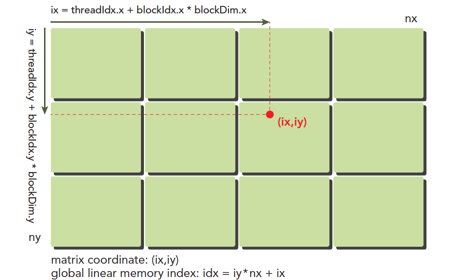
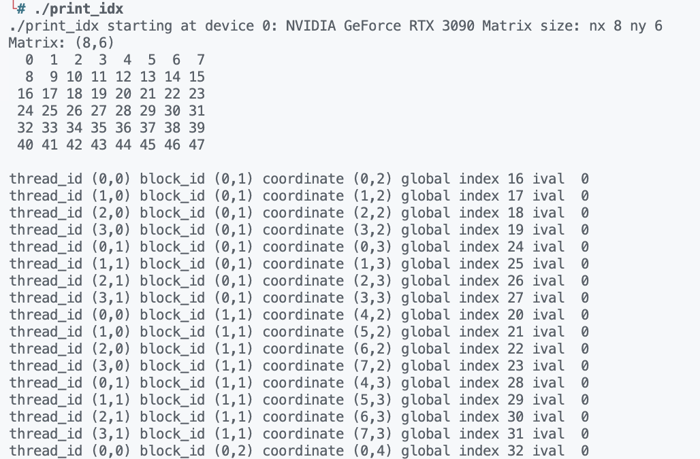

# 组织并行线程

:::note

在编写 CUDA 程序时，使用合适的网格和块大小正确的组织线程可以提高程序的性能。本文中我们通过向量的加法来介绍如何组织并行线程。

:::

## 使用块和线程建立索引

在我们声明核函数的时候会用到 `<<<…>>>` 这样的语法，这个语法用来指定网格和块的大小。 第一个参数用来指定网格的大小，第二个参数用来指定块的大小。块的大小也就是线程的数量。GPU 之所以能够并行计算，是因为 GPU 中有很多个核心，每个核心都可以执行一个线程。但是每个线程我们也不能都让他们计算同一组数据，这样每个线程的计算结果都是一样的，这样就没有意义了。所以我们需要将数据分配给不同的线程，这样每个线程计算的结果就不一样了。

下图可以非常形象的反应线程模型，我们可以看到，线程是按照网格和块的方式组织的，每个线程都有一个唯一的索引，我们可以通过这个索引来确定每个线程计算的数据。



其中 `ix` 和 `iy` 是线程的索引，也叫做全局地址。局部地址就是 `threadIdx.x` 和 `threadIdx.y` 。谭升的博客里面有个非常形象的比喻：同一个小区，A 栋有 16 楼，B 栋也有 16 楼，A 栋和 B 栋就是 `blockIdx`，而 16 就是 `threadIdx` 啦。 将线程的全局地址和不同的数据对应就可以让不同的线程计算不同的数据了。

虽然上面的图可以很好的帮助我们理解线程模型，但是在设备内存和主机内存中数据都是以一维数组的形式存储的，所以我们需要将线程的全局地址转换成一维数组的索引。比如一个 8x6 的数组的存储方法就如下图所示。


其中每个 `Row` 的大小为 8，一共有 6 个 `Row` 。每个 `Row` 的大小就是我们在核函数中指定的块大小，也就是线程的数量。所以我们可以通过下面的公式将线程的全局地址转换成一维数组的索引。

$$
idx=ix+iy*nx
$$

在编写核函数的最常用的还是 `ix` 和 `iy`。为了能够更好的理解线程模型，我们可以通过下面的例子来更好的理解线程模型。 这个代码是打印一个 8x6 的二维数组的每个元素的索引以及打印每个线程的索引信息,代码如下所示。

```c
#include <stdio.h>
#include <cuda_runtime.h>

__global__ void printIndex(float *A, const int nx, const int ny)
{
    int ix = threadIdx.x + blockIdx.x * blockDim.x;
    int iy = threadIdx.y + blockIdx.y * blockDim.y;
    unsigned int idx = iy * nx + ix;

    printf("thread_id (%d,%d) block_id (%d,%d) coordinate (%d,%d) "
           "global index %2d ival %2d\n", threadIdx.x, threadIdx.y,
           blockIdx.x, blockIdx.y, ix, iy, idx, A[idx]);
}

void initData(float *data, int nx, int ny)
{
    for (int i = 0; i < nx * ny; i++)
    {
        data[i] = i;
    }
}

void printMatrix(float *data, const int nx, const int ny)
{
    printf("Matrix: (%d,%d)\n", nx, ny);
    for (int iy = 0; iy < ny; iy++)
    {
        for (int ix = 0; ix < nx; ix++)
        {
            printf("%3.0f", data[ix + iy * nx]);
        }
        printf("\n");
    }
    printf("\n");
}

int main(int argc,char** argv) {
    // set up device
    int dev = 0;
    cudaDeviceProp deviceProp;
    cudaGetDeviceProperties(&deviceProp, dev);
    printf("%s starting at ", argv[0]);
    printf("device %d: %s ", dev, deviceProp.name);
    cudaSetDevice(dev);

    // set up data size of matrix
    int nx = 8;
    int ny = 6;
    int nxy = nx * ny;
    int nBytes = nxy * sizeof(float);
    printf("Matrix size: nx %d ny %d\n", nx, ny);

    // malloc host memory
    float *h_A;
    h_A = (float *)malloc(nBytes);

    // initialize host matrix with random data
    initData(h_A, nx, ny);
    printMatrix(h_A, nx, ny);

    // malloc device memory
    float *d_A;
    cudaMalloc((void **)&d_A, nBytes);

    // transfer data from host to device
    cudaMemcpy(d_A, h_A, nBytes, cudaMemcpyHostToDevice);

    // set up execution configuration
    dim3 block(4, 2);
    dim3 grid((nx + block.x - 1) / block.x, (ny + block.y - 1) / block.y);

    // invoke the kernel
    printIndex<<<grid, block >>>(d_A, nx, ny);
    cudaDeviceSynchronize();

    // free host and device memory
    cudaFree(d_A);
    free(h_A);

    // reset device
    cudaDeviceReset();

    return (0);
}
```

代码运行结果如下所示：



每一个线程已经对应到了不同的数据，接着我们基于上面的内容来介绍二维矩阵加法。

## 二维矩阵加法

二维矩阵加法的核函数如下所示。

```c
__global__ void sumMatrixOnGPU2D(float *MatA, float *MatB, float *MatC, int nx, int ny)
{
    unsigned int ix = threadIdx.x + blockIdx.x * blockDim.x;
    unsigned int iy = threadIdx.y + blockIdx.y * blockDim.y;
    unsigned int idx = iy * nx + ix;

    if (ix < nx && iy < ny)
    {
        MatC[idx] = MatA[idx] + MatB[idx];
    }
}
```

这里我们需要注意的是，我们需要判断 `ix` 和 `iy` 是否小于 `nx` 和 `ny` ，因为我们的网格大小可能会大于我们的矩阵大小，这样就会导致一些线程计算的数据超出了矩阵的大小，这样就会导致程序出错。

虽然二维矩阵的加法代码很简单，但是不同的组织方式会导致程序的性能不同。对于二维矩阵加法，我们可以有三种。

1. 二维网格和二维块
2. 一维网格和一维块
3. 二维网格和一维块

下面我们分别来介绍这三种组织方式。以及比较这三种组织方式的性能。

## 不同组织方式对比

### 二维网格和二维块

所谓二维网格和二维块，就是我们在声明核函数的时候，我们使用二维的网格和二维的块。在使用二维网格和二维块去计算矩阵相加的时候，我们需要将矩阵的大小设置为二维的网格和二维的块的大小的整数倍。比如我们的矩阵的大小为 8x6 ，我们的二维网格和二维块的大小可以设置为 4x2 ，这样我们就可以保证每个线程块中有 8x6 个线程，这样每个线程就可以计算一个元素了。

 这种组织方式的核函数的声明如下所示。

```c
// 2d block and 2d grid
dim3 block_0(dimx, dimy);
dim3 grid_0((nx + block_0.x - 1) / block_0.x, (ny + block_0.y - 1) / block_0.y);
```

### 一维网格和一维块

所谓一维网格和一维块，就是我们在声明核函数的时候，我们使用一维的网格和一维的块。在使用一维网格和一维块去计算矩阵相加的时候，我们需要将矩阵的大小设置为一维的网格和一维的块的大小的整数倍。比如我们的矩阵的大小为 8x6 ，我们的一维网格和一维块的大小可以设置为 48 ，这样我们就可以保证每个线程块中有 48 个线程，这样每个线程就可以计算一个元素了。

这种组织方式的核函数的声明如下所示。

```c
// 1d block and 1d grid
dim3 block_1(threads);
dim3 grid_1((nx * ny + block_1.x - 1) / block_1.x);
```

### 二维网格和一维块

所谓二维网格和一维块，就是我们在声明核函数的时候，我们使用二维的网格和一维的块。在使用二维网格和一维块去计算矩阵相加的时候，我们需要将矩阵的大小设置为二维的网格的大小的整数倍。比如我们的矩阵的大小为 8x6 ，我们的二维网格的大小可以设置为 4x2 ，这样我们就可以保证每个线程块中有 8 个线程，这样每个线程就可以计算一个元素了。

这种组织方式的核函数的声明如下所示。

```c
// 2d grid and 1d block
dim3 block_2(threads);
dim3 grid_2((nx + block_2.x - 1) / block_2.x, ny);
```

下面是三种方法去计算矩阵相加的时间消耗结果：


观察结果没有多大差距，但是明显比 CPU 快了很多，而且最主要的是我们本文用不同的线程组织模式都得到了正确结果。

## 参考资料

1. [CUDA C编程权威指南](https://www.baidu.com/s?ie=utf-8&f=8&rsv_bp=1&rsv_idx=1&tn=baidu&wd=CUDA%20C%E7%BC%96%E7%A8%8B%E6%9D%83%E5%A8%81%E6%8C%87%E5%8D%97&fenlei=256&rsv_pq=0xfed4a61a000e3772&rsv_t=0d02lKS%2Blx%2BdvIVO447ej8nu1F1JZ2R2sUUEGNoSYLiNj3M8QV7s%2FscVGcDD&rqlang=en&rsv_enter=1&rsv_dl=tb&rsv_sug3=2&rsv_sug1=2&rsv_sug7=101&rsv_sug2=0&rsv_btype=i&prefixsug=%2526lt%253BUDA%2520%2526lt%253B%25E7%25BC%2596%25E7%25A8%258B%25E6%259D%2583%25E5%25A8%2581%25E6%258C%2587%25E5%258D%2597&rsp=9&inputT=4428&rsv_sug4=4428)
2. [【CUDA 基础】2.2 给核函数计时](https://face2ai.com/CUDA-F-2-2-%E6%A0%B8%E5%87%BD%E6%95%B0%E8%AE%A1%E6%97%B6/)
