# CUDA 内存管理

:::note

CUDA 内存管理是 CUDA 编程中的一个重要部分。在本文中我们将会一起学习如何利用不同类型的 GPU 内存空间来提高数据访问的效率和速度，包括全局内存、共享内存、只读数据/缓存、寄存器等。如何使用锁页内存和统一内存来简化主机和设备之间的数据传输和同步，以及如何优化统一内存的性能。

:::

## 全局内存

Global memory 是 CUDA 中的一种内存类型，可以通过静态分配（使用 __device__）、动态分配（使用 device malloc 或 new）和 CUDA 运行时（例如使用 cudaMalloc）来分配。所有这些方法都分配物理上相同类型的内存，即从板载（但不是芯片上的）DRAM 子系统中划分出的内存。

### 协同/非协同全局内存访问

CUDA 编程模型中的 warp 是一个线程调度/执行的单元，SMs 中的基本执行单元。一旦一个块被分配到一个 SM，它就被划分为一个 32 个线程的单元，称为 warp。这是 CUDA 编程中的基本执行单元。为了说清楚 warp 的概念，让我们看一个例子。如果两个块被分配到一个 SM，每个块有 128 个线程，那么块内的 warp 数是 128/32=4 个 warp，SM 上的总 warp 数是 4*2=8 个 warp。下面的图显示了如何将 CUDA 块划分并调度到 GPU SM 上：


在 SM 和其核上如何安排块和 warp 的调度更多地是与架构相关的，对于 Kepler、Pascal 和最新的架构 Volta 等不同的代数，这将是不同的。现在，我们可以忽略调度的完整性。在所有可用的 warp 中，具有下一条指令所需操作数的那些 warp 将有资格进行执行。根据运行 CUDA 程序的 GPU 的调度策略，选择 warp 进行执行。当被选中时，warp 中的所有线程都执行相同的指令。

CUDA 遵循单指令多线程（SIMT）模型，即 warp 中的所有线程在同一时间获取并执行相同的指令。为了最大限度地利用来自全局内存的访问，访问应该协同。协同和非协同之间的区别如下：

- 协同全局内存访问：顺序内存访问是相邻的，线程访问相邻数据，因此产生一个 32 位操作和 1 个缓存未命中。
- 非协同全局内存访问：顺序内存访问不相邻，线程的访问是随机的，并且可能导致调用 32 个单宽操作，因此可能有 32 个缓存未命中，这是最坏情况。

以下图显示了更详细的访问模式示例。图表左侧显示了协同访问，其中来自 warp 的线程访问相邻数据，因此产生一个 32 位操作和 1 个缓存未命中。图表右侧显示了一个场景，在该场景中，来自 warp 内线程的访问是随机的，并且可能导致调用 32 个单宽操作，因此最坏情况下可能有 32 个缓存未命中。

这种区分协同和非协同全局内存访问对于优化 CUDA 程序非常重要，因为协同访问可以减少缓存未命中，从而提高性能。

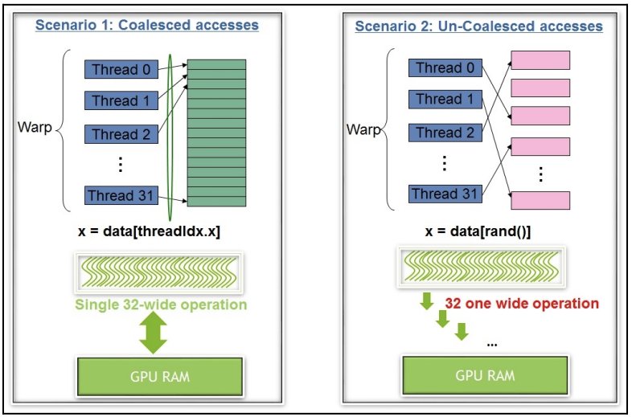

协同全局内存访问适用于线程访问连续内存位置的情况，而非协同全局内存访问适用于线程访问非连续内存位置的情况。最佳选择取决于你的应用程序的访存访问模式。

**示例 1：协同全局内存访问**

```cpp
__global__ void coalescedAccess(float* input, float* output, int size) {
    int tid = blockIdx.x * blockDim.x + threadIdx.x;
    
    if (tid < size) {
        // 协同内存访问，线程访问连续内存位置
        output[tid] = input[tid] * 2.0f;
    }
}
```

在上面的示例中，每个线程都访问连续的内存位置（`input[tid]` 和 `output[tid]`），这是协同内存访问的典型示例。这种情况下，应该使用协同内存访问，因为线程对内存的访问模式是相邻的，可以充分利用内存带宽，提高性能。

**示例 2：非协同全局内存访问**

```cpp
__global__ void nonCoalescedAccess(float* input, float* output, int size) {

    int tid = blockIdx.x * blockDim.x + threadIdx.x;

    
    if (tid < size) {
        // 非协同内存访问，线程访问非连续内存位置
        int nonCoalescedIndex = (tid * 2) % size; // 非协同访问的示例
        output[tid] = input[nonCoalescedIndex] * 2.0f;
    }

}
```

在上面的示例中，每个线程都访问非连续的内存位置（`input[nonCoalescedIndex]` 和 `output[tid]`），这是非协同内存访问的典型示例。这种情况下，应该使用非协同内存访问，因为线程对内存的访问模式不是连续的，协同内存访问可能不适用，可能导致性能下降。在这种情况下，使用非协同内存访问可能是必要的，但你仍然应该尽量减少非协同内存访问的次数，以减小性能损失。

### 内存吞吐量分析

对于应用程序开发者来说，理解应用程序的内存吞吐量变得非常重要。

想要进行性能分析可以使用，性能分析工具：

- NVIDIA Nsight 系列工具：NVIDIA 提供了一系列用于 GPU 性能分析的工具，如 Nsight Compute 和 Nsight Systems。这些工具可以提供关于内存带宽、内存利用率、内存事务等方面的详细信息。Nsight Compute 特别适用于分析内核函数的性能，而 Nsight Systems 用于系统级别的性能分析。
- AMD ROCm Profiler：对于 AMD GPU，ROCm Profiler 是一个性能分析工具，可以用于分析内存性能以及其他 GPU 性能方面的信息。
- Visual Profiling 工具：一些集成开发环境（IDE）如 Visual Studio 和 CodeXL 提供了 GPU 性能分析工具，用于分析内存吞吐量和其他性能指标。

如下的性能指标可以用于分析内存性能：

- 内存带宽：内存带宽是描述 GPU 内存性能的重要指标。它表示 GPU 能够每秒传输的数据量。你可以使用性能分析工具来查看内存带宽的实际利用率。
- 内存事务：内存事务描述了 GPU 与全局内存之间的数据交换。你可以查看内存事务的数量和类型（例如，全局内存、共享内存、L1/L2 缓存等）来评估内存访问的效率。
- 内存利用率：内存利用率表示 GPU 内存的使用情况。低内存利用率可能意味着存在内存浪费或未优化的内存访问模式。

## 共享内存

共享内存在 CUDA 内存层次结构中扮演着关键的角色，被称为用户管理缓存。它提供了一种机制，使用户能够以协同的方式从全局内存中读取/写入数据，并将其存储在一个**类似于缓存但可由用户控制的内存中**。在这一节中，我们将不仅介绍如何充分利用共享内存的步骤，还将讨论如何高效地从共享内存中加载/存储数据以及它在内部是如何组织的。

共享内存仅对同一块中的线程可见，同一块中的所有线程看到的是相同版本的共享变量。

**共享内存与 CPU 缓存类似，但与 CPU 缓存不同的是，共享内存可以显式地管理。它具有比全局内存低一个数量级的延迟，以及比全局内存高一个数量级的带宽**。然而，共享内存的主要用途在于**块内的线程可以共享内存访问**。CUDA 程序员可以使用共享变量来存储在内核执行期间多次重复使用的数据。此外，由于同一块内的线程可以共享结果，这有助于避免冗余计算。

在 CUDA Toolkit 的版本 9.0 之前，它并未提供可靠的线程之间通信的机制。我们将在后续章节中更详细地介绍 CUDA 9.0 中的通信机制。目前，我们可以假设在 CUDA 中，线程之间的通信只能通过利用共享内存来实现。

:::note

CUDA Toolkit 9.0 之后引入了一种新的通信机制，称为 "NVIDIA Cooperative Groups"，它提供了更灵活和可靠的线程之间通信方式。这个机制允许不同块中的线程进行协同操作，而不仅仅局限于同一块内的线程。

:::

### 共享内存上的矩阵转置

在本节中，我们将学习如何使用共享内存来实现矩阵转置。矩阵转置是一个常见的操作，它在很多应用中都有用到，例如矩阵乘法、图像处理等。在本节中，我们将学习如何使用共享内存来实现矩阵转置，以及如何利用共享内存来提高性能。

下面是用全局内存实现矩阵转置的代码：

```cpp
__global__ void matrix_transpose_naive(int *input, int *output) {
 int indexX = threadIdx.x + blockIdx.x * blockDim.x;
 int indexY = threadIdx.y + blockIdx.y * blockDim.y;
 int index = indexY * N + indexX;
 int transposedIndex = indexX * N + indexY;
 output[index] = input[transposedIndex];
}
```

这个代码片段中，我们使用了一个简单的内核函数来实现矩阵转置。这个内核函数的输入是一个二维矩阵，输出是转置后的矩阵。这个内核函数的实现非常简单，但是它的性能并不高。这是因为它的内存访问模式是非协同的，因此它的性能受到了内存带宽的限制。

我们可以使用 nvprof 来分析这个内核函数的性能。下面是 nvprof 的输出：

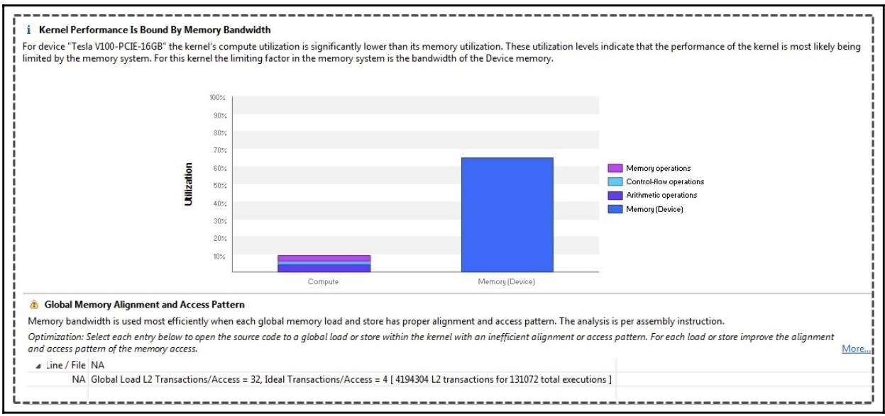

解决这个问题的一种方法是利用高带宽和低延迟的内存，比如共享内存。关键在于以协同的方式从全局内存中读取和写入数据。在这里，对共享内存的读取或写入可以是非协同的模式。使用共享内存可以提供更好的性能，将时间缩短到 21 微秒，速度提高了 3 倍。

```cpp
__global__ void matrix_transpose_shared(int *input, int *output) {
  __shared__ int sharedMemory[BLOCK_SIZE][BLOCK_SIZE];
  //global index
  int indexX = threadIdx.x + blockIdx.x * blockDim.x;
  int indexY = threadIdx.y + blockIdx.y * blockDim.y;
  //transposed global memory index
  int tindexX = threadIdx.x + blockIdx.y * blockDim.x;
  int tindexY = threadIdx.y + blockIdx.x * blockDim.y;
  //local index
  int localIndexX = threadIdx.x;
  int localIndexY = threadIdx.y;
  int index = indexY * N + indexX;
  int transposedIndex = tindexY * N + tindexX;
  //transposed the matrix in shared memory.
  // Global memory is read in coalesced fashion
  sharedMemory[localIndexX][localIndexY] = input[index];
  __syncthreads();
  //output written in global memory in coalesed fashion.
  output[transposedIndex] = sharedMemory[localIndexY][localIndexX];
}
```

这段代码实现了一个 CUDA 核函数（`__global__` 修饰的函数），用于将输入矩阵转置并将结果存储到输出矩阵中。以下是代码的解释：

1. `__shared__ int sharedMemory[BLOCK_SIZE][BLOCK_SIZE];`
   - 这行声明了一个共享内存数组 `sharedMemory`，它是一个二维数组，用于在共享内存中存储矩阵数据。`BLOCK_SIZE` 是一个常量，表示每个线程块（block）中的线程数。
2. 接下来的几行代码计算了当前线程的全局索引、转置后的全局索引和局部索引。这些索引将用于确定每个线程在输入矩阵和共享内存中的读取位置和在输出矩阵中的写入位置。
3. `int index = indexY * N + indexX;` 和 `int transposedIndex = tindexY * N + tindexX;`
   - 这两行计算了当前线程在输入矩阵和输出矩阵中的线性索引，以便读取和写入数据。
4. `sharedMemory[localIndexX][localIndexY] = input[index];`
   - 这行代码从全局内存中读取数据，并将其存储到共享内存中。读取操作是以协同的方式进行的，因为多个线程会同时读取相邻的数据。
5. `__syncthreads();`
   - 这是一个同步点，确保所有线程在继续执行之前都已经完成了共享内存的数据读取操作。这是必要的，因为后续的写入操作需要共享内存中的数据是完整的。
6. `output[transposedIndex] = sharedMemory[localIndexY][localIndexX];`
   - 这行代码从共享内存中读取数据，然后将其写入到全局内存中的输出矩阵中。写入操作也是以协同的方式进行的，因为多个线程会同时写入相邻的数据。

通过这个核函数，输入矩阵中的数据被有效地转置到输出矩阵中，而且由于共享内存的使用，读取和写入操作以协同的方式进行，从而提高了性能。这个核函数通常在 GPU 上并行处理大型矩阵时非常有用。

:::tip

在 CUDA 中，__shared__ 修饰符用于声明共享内存，这些共享内存是每个线程块（block）共享的，而不是每个线程独立拥有的。因此，在核函数内部声明的 sharedMemory 只会在每个线程块中创建一次，而不会在每个线程中重复创建。

:::

### 共享内存中的访存冲突

在上一节中，我们学习了如何使用共享内存来实现矩阵转置。在这一节中，我们将学习如何避免共享内存中的访存冲突，以提高性能。

访存冲突是指同一个 warp 中的线程访问共享内存时，如果有多个线程访问同一个 bank，就会导致访问冲突和延迟。bank 是共享内存的最小单元，每个 bank 可以同时为一个线程提供数据。如果多个线程同时访问同一个 bank，那么它们的访问就会被串行化，从而降低性能。为了避免或减少访存冲突，可以使用一些技巧，如改变数据布局、使用 padding、使用 shuffle 指令等。

下图就展示了一个访存冲突的例子。


上面我们写的用共享内存实现矩阵转置的代码，会产生访存冲突。我们可以使用 padding 来避免访存冲突。padding 是指在共享内存中的每个 bank 之间插入一些空间，从而使每个线程访问的 bank 不同。这样就可以避免访存冲突，提高性能。

只需要修改一句话，就可以避免访存冲突：

```cpp
__shared__ int sharedMemory[BLOCK_SIZE][BLOCK_SIZE + 1];
```

这里我们在共享内存的第二维度上增加了一个维度，从而使每个线程访问的 bank 不同，从而避免了访存冲突。在上述代码片段中，我们使用了 matrix_transpose_shared 核函数，展示了填充（padding）的概念，它消除了内存块冲突（bank conflicts），从而更好地利用了共享内存带宽。像往常一样，运行代码并使用 Visual Profiler 验证这种行为。经过这些改进，能看到核函数的执行时间缩短到 13 微秒，进一步提高了 60% 的速度。

在本节中，我们学习了如何最优地利用共享内存，它既提供读取又提供写入的功能，类似于一个临时存储区。但有时，数据是只读输入，不需要写入访问。在这种情况下，GPU 提供了一种称为纹理内存（texture memory）的优化内存。我们将在后续文章中详细介绍它，以及它为开发人员提供的其他优势。在接下来的部分，我们将介绍只读数据的处理方法。

## 只读缓存

只读数据对 GPU 中的所有线程可见。对于 GPU 来说，此数据被标记为只读，这意味着对此数据的任何更改将导致内核中的未指定行为。另一方面，CPU 对此数据具有读和写访问权限。在本节中，我们将提供如何利用只读缓存的详细信息，借助一个图像处理代码示例，进行图像调整。

这种缓存也被称为纹理缓存（texture cache）。虽然用户可以显式调用纹理 API 来利用只读缓存，但在最新的 GPU 架构中，开发人员可以在不显式使用 CUDA 纹理 API 的情况下利用这个缓存。通过最新的 CUDA 版本和像 Volta 这样的 GPU，标记为 `const __restrict__` 的内核指针参数被标记为只读数据，可以通过只读缓存数据路径进行传递。开发人员还可以使用 `__ldg` 内置函数来强制加载到此缓存中。

只读数据在算法要求**整个 warp 读取相同地址/数据**时表现最佳。纹理缓针对二维（2D）和三维（3D）数据的局部性进行了优化。这意味着它能够更有效地处理对于连续的 2D 或 3D 数据访问的情况，从而提高性能。由于线程属于相同的 warp，从具有 2D 和 3D 局部性的纹理地址读取数据往往会实现更好的性能。

下面，让我们看一个关于图形缩放的算法，以演示纹理内存的使用。

图像缩放需要对二维图像像素进行插值。纹理提供了这两个功能（插值和高效访问二维局部性）。使用纹理内存的图像缩放算法如下：

这段代码（[完整代码](https://github.com/PacktPublishing/Learn-CUDA-Programming/blob/master/Chapter02/02_memory_overview/05_image_scaling/image_scaling.cu)）用于创建并配置 CUDA 纹理对象，让我一步一步解释并给出详细注释：

首先需要指定纹理：

```cpp
struct cudaResourceDesc resDesc;
memset(&resDesc, 0, sizeof(resDesc));
resDesc.resType = cudaResourceTypeArray;
resDesc.res.array.array = cu_array;
```

- `cudaResourceDesc` 是一个用于描述 CUDA 资源的结构体。在这里，我们创建一个 `resDesc` 结构体实例。
- 使用 `memset` 函数将 `resDesc` 结构体的内存清零，以确保所有字段都初始化为零。
- `resDesc.resType = cudaResourceTypeArray;` 指定了资源的类型为数组（`cudaResourceTypeArray`），这意味着我们将使用数组作为纹理资源。
- `resDesc.res.array.array = cu_array;` 将数组 `cu_array` 分配给 `resDesc` 结构体的 `array` 字段，这个数组将被用作纹理资源。

第二步，需要指定纹理对象的参数。

```cpp
struct cudaTextureDesc texDesc;
memset(&texDesc, 0, sizeof(texDesc));
texDesc.addressMode[0] = cudaAddressModeClamp;
texDesc.addressMode[1] = cudaAddressModeClamp;
texDesc.filterMode = cudaFilterModePoint;
texDesc.readMode = cudaReadModeElementType;
texDesc.normalizedCoords = 0;
```

- `cudaTextureDesc` 是一个结构体，用于描述纹理对象的参数。在这里，我们创建一个 `texDesc` 结构体实例。
- 使用 `memset` 函数将 `texDesc` 结构体的内存清零，以确保所有字段都初始化为零。
- `texDesc.addressMode[0] = cudaAddressModeClamp;` 和 `texDesc.addressMode[1] = cudaAddressModeClamp;` 分别设置了纹理的 x 和 y 方向的地址模式为 Clamp 模式。Clamp 模式表示当纹理坐标超出范围时，将其夹紧到边界值，而不是循环或镜像。
- `texDesc.filterMode = cudaFilterModePoint;` 设置了纹理过滤模式为 Point 模式，这意味着在获取纹理值时不进行插值。
- `texDesc.readMode = cudaReadModeElementType;` 设置了纹理的读取模式为 ElementType 模式，这表示每个像素被读取为其原始数据类型，而不进行插值。
- `texDesc.normalizedCoords = 0;` 将规范化坐标设置为 0，这意味着纹理坐标不被规范化为 [0.0, 1.0] 范围内的值。

第三步创建纹理对象。

```cpp
cudaTextureObject_t texObj = 0;
cudaCreateTextureObject(&texObj, &resDesc, &texDesc, NULL);
```

- `cudaTextureObject_t` 是纹理对象的类型。
- 我们创建一个名为 `texObj` 的纹理对象，并初始化为零。
- `cudaCreateTextureObject` 函数用于创建纹理对象，它接受四个参数：纹理对象指针（`&texObj`）、资源描述符（`&resDesc`）、纹理描述符（`&texDesc`）和可选的额外参数（这里是 `NULL`）。这个函数将根据提供的描述符创建一个纹理对象，并将其赋值给 `texObj`。

上面这一部分代码的主要目的是为 GPU 上的纹理创建一个纹理对象，并配置其参数，以便在后续的 CUDA 内核中使用。这个纹理对象可以让内核从纹理内存中读取数据，根据指定的参数进行过滤和插值。

在创建和配置纹理对象之后，我们需要在内核中使用它。下面是内核函数的代码：

```cpp
__global__ void createResizedImage(unsigned char *imageScaledData, int scaled_width, float scale_factor, cudaTextureObject_t texObj)
{
  // 获取当前线程的在网格中的x和y坐标，以及计算线程在输出图像中的索引
  const unsigned int tidX = blockIdx.x*blockDim.x + threadIdx.x;
  const unsigned int tidY = blockIdx.y*blockDim.y + threadIdx.y;
  const unsigned index = tidY*scaled_width+tidX;
      
  // Step 4: 从CUDA内核中的纹理引用中读取纹理内存
  imageScaledData[index] = tex2D<unsigned char>(texObj,(float)  (tidX*scale_factor),(float)(tidY*scale_factor));
}
```

## GPU 中的寄存器

CPU 和 GPU 架构之间的一个主要区别是 GPU 相对于 CPU 具有丰富的寄存器资源。这个有助于 GPU 线程将大部分数据存储在寄存器中，从而减少上下文切换的延迟。因此，对寄存器内存的优化变得至关重要。

寄存器的作用范围限定在单个线程内部。在 GPU 的线程块中，每个启动的线程都拥有自己的私有变量副本，这意味着每个线程可以访问自己的私有变量，但无法访问其他线程的私有变量。例如，如果启动了一个包含 1,000 个线程的内核，那么每个线程都将拥有其私有变量的独立副本。

在内核中声明为局部变量的变量存储在寄存器中，中间计算结果也通常存储在寄存器中。每个 GPU 多处理器（SM）都具有一组固定数量的寄存器。在编译过程中，编译器（nvcc）会尝试找到每个线程所需的最佳寄存器数量。

如果寄存器数量不足，通常发生在 CUDA 内核较大且包含许多局部变量和中间计算时，数据将被推送到本地内存，该本地内存可能位于 L1/L2 高速缓存中，甚至位于内存层次结构中较低的位置，例如全局内存。这个过程被称为寄存器溢出。**通常建议不要声明大量不必要的局部变量**。如果寄存器资源限制了可以在多处理器上调度的线程数，开发者可能需要考虑重新组织代码，将内核拆分为两个或更多部分，以优化性能。

在 vecAdd 内核中声明的变量通常存储在寄存器内存中。而作为内核参数传递的 A、B 和 C 等变量指向全局内存，但这些变量的值本身可以存储在共享内存或寄存器中，具体取决于 GPU 架构。下图显示了 UDA 内存层次结构以及不同变量类型的默认存储位置。


## 固定内存

现在，让我们回顾一下数据的传输路径，即从 CPU 内存到 GPU 寄存器，最终由 GPU 核心进行计算。尽管 GPU 具有更高的计算性能和更高的内存带宽，但应用程序获得的整体加速可能会受限于 CPU 内存和 GPU 内存之间的数据传输速度。这种数据传输是通过总线、链路或协议完成的，例如 PCIe（适用于 Intel 和 AMD 等 CPU 架构）或 NVLink（适用于 OpenPower Foundation 等 CPU 架构）。

为了克服这些瓶颈，建议采用以下技巧和指南：

- 尽量减少主机和设备之间传输的数据量
- 通过使用固定内存，实现主机和设备之间更高的带宽是非常重要的
- 将小型传输批量处理为一个大传输。这有助于减少调用数据传输 CUDA API 所涉及的延迟，根据系统配置的不同，这个延迟可能在几微秒到几毫秒之间
- 应用程序可以利用异步数据传输来重叠内核执行和数据传输的时间

默认情况下，被称为 malloc() 的内存分配 API 分配的内存类型是可分页的。这意味着，如果需要，将内存映射为页面的部分可以被其他应用程序或操作系统本身交换出去。因此，大多数设备，包括 GPU 以及类似 InfiniBand 等设备，它们也连接到 PCIe 总线上，要求在传输数据之前将内存固定，以确保 GPU 能够访问它。默认情况下，GPU 不会访问可分页内存。因此，当发起内存传输时，CUDA 驱动程序会分配临时的固定内存，将数据从默认的可分页内存复制到这个临时的固定内存，然后通过设备内存控制器（DMA）将数据传输到 GPU 设备。

这个额外的步骤不仅增加了延迟，还可能导致所请求的页面被传输到 GPU 内存，而这些页面可能已被交换出去，需要重新加载到 GPU 内存中。

为了了解使用固定内存的影响，让我们尝试编译和运行一段示例代码，这段代码已经作为 CUDA 示例的一部分提供：

- 准备 GPU 应用程序，该代码位于 `<CUDA_SAMPLES_DIR>/1_Utilities/bandwidthTest` 目录下。
- 使用 make 命令编译应用程序。
- 运行可执行文件以测试可分页内存和固定内存两种模式，命令如下所示：

```bash
$ make
$ ./bandwidthTest --mode=shmoo --csv --memory=pageable > pageable.csv
$ ./bandwidthTest --mode=shmoo --csv --memory=pinned > pinned.csv
```

性能的影响可以从带宽测试的输出中看出，结果如下图所示。x 轴表示传输的数据量（以 KB 为单位），y 轴表示实际达到的带宽（以 MB/秒为单位）。

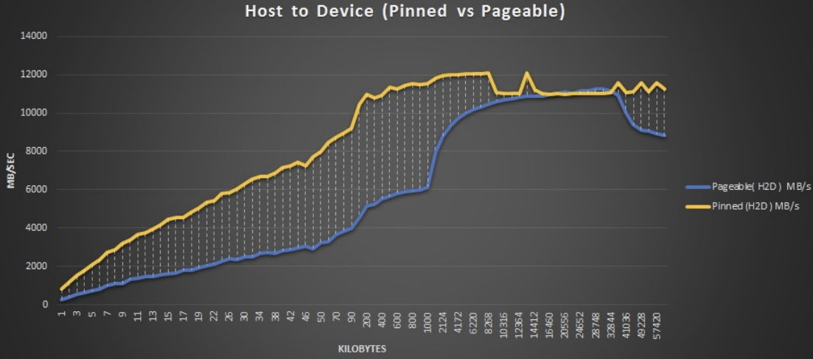

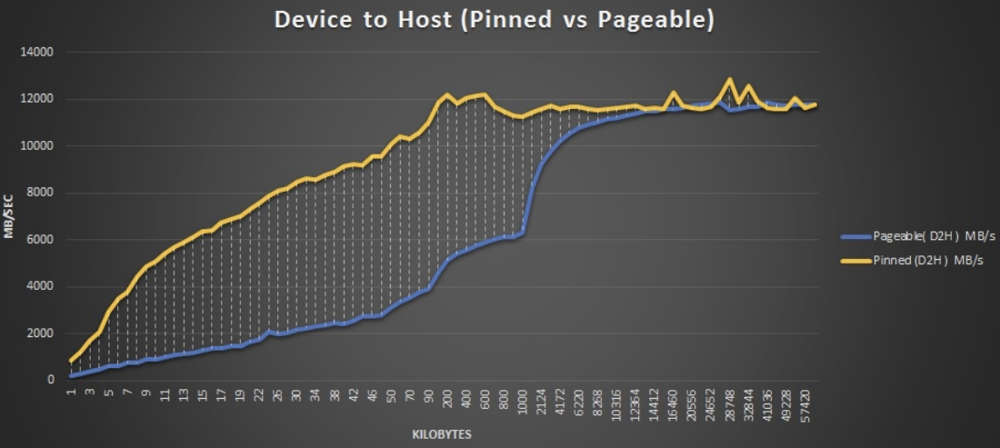

第一个图表显示的是主机到设备的数据传输，而第二个图表显示的是设备到主机的数据传输。可以看到，最大可实现的带宽约为 12 GB/秒。尽管 PCIe Gen3 的理论带宽为 16 GB/秒，但实际可达到的范围约为 12 GB/秒。可实现的带宽高度依赖于系统因素（主板、CPU、PCIe 拓扑等）的不同。

对于固定内存，带宽在较小的数据传输尺寸时始终较高，而对于较大的数据尺寸，可分页内存的带宽在一定程度上与之相当，这是因为驱动程序和 DMA 引擎开始应用重叠等概念来优化传输。**尽管建议尽量使用固定内存，但过度使用也有不利影响**。将整个系统内存都分配为固定内存可能会降低整体系统性能，因为这会占用其他应用程序和操作系统任务所需的页面。固定内存的适当大小高度依赖于应用程序和系统，没有通用的公式可供使用。最佳性能参数需要在可用系统上测试应用程序来选择。

此外，值得注意的是，新的互连技术，如 NVLink，为受数据传输限制的应用程序提供了更高的带宽和更低的延迟。

## 统一内存

简单来说，统一内存（UM）为用户提供了一个单一内存空间的视图，所有 GPU 和 CPU 都可以访问该内存空间。下面的图说明了这一点：

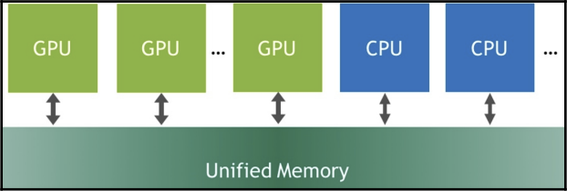

在本节中，我们将介绍如何使用 UM，优化它，并突出使用它的主要优点。与全局内存访问一样，如果以不连贯的方式执行，会导致性能不佳，如果未正确使用 UM 功能，也会导致应用程序整体性能下降。

### 统一内存的页面分配和传输

让我们从 UM 的简单实现开始。下面的代码演示了这个概念的基本用法。代码中的关键变化是使用 `cudaMallocManaged()` API 来分配内存，而不是使用 malloc，如下面的代码片段所示：

```cpp
float *x, *y;
int size = N * sizeof(float);
...
cudaMallocManaged(&x, size);
cudaMallocManaged(&y, size);
...
for (int ix = 0; ix < N; ix++) {
    x[ix] = rand() % 10;
    y[ix] = rand() % 20;
}
add<<<numBlocks, blockSize>>>(x, y, N);
```

我们会发现 x 和 y 变量都只被分配一次，并且指向统一内存。同一个指针被发送到 GPU 的 `add` 内核，并在 CPU 中使用 for 循环进行初始化。统一内存那么好用？不需要跟踪指针是指向 CPU 内存还是 GPU 内存。但这是否意味着我们一定能获得良好的性能或传输速度？未必，因此让我们尝试深入挖掘，通过对这段代码进行分析，如下面的截图所示：

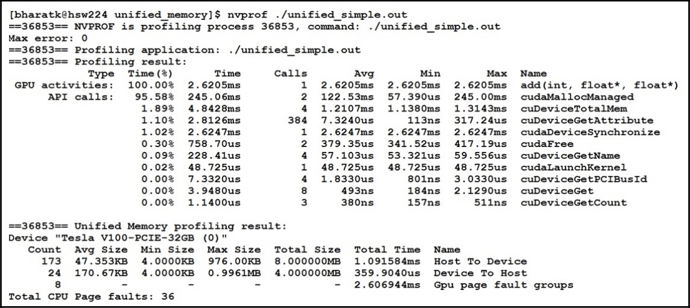

不出所料，大部分时间都花在 add 内核上。让我们尝试理论上计算带宽。使用以下公式计算带宽：

带宽 = 字节 / 秒 = (3 * 4,194,304 字节 * 1e-9 字节/GB) / 2.6205e-3s = 5 GB/s

为什么我们需要关注内存带宽呢？这是因为该应用程序受到内存限制，它执行了三次内存操作，而仅有一次加法操作。因此，内存性能才是更应该关注的问题。

从 Pascal 架构开始，`cudaMallocManaged()` 不再直接分配物理内存，而是基于首次访问原则来分配内存。如果 GPU 首次访问变量，页面将被分配并映射到 GPU 的页表；反之，如果 CPU 首次访问变量，页面将被分配并映射到 CPU 上。在我们的代码中，x 和 y 变量在 CPU 上用于初始化，因此页面被分配给了 CPU。在 `add` 内核中，当访问这些变量时，会触发页面错误，导致页面迁移时间被计入内核执行时间。这是导致内核执行时间增加的根本原因。下面，让我们一起看一下页面迁移的过程。

页面迁移的操作顺序如下：

1. 首先，我们需要在 GPU 和 CPU 上为新页面分配内存（基于首次访问原则）。如果页面不在，并且没有映射到其他页面，将触发设备页表页面错误。例如，当 GPU 尝试访问位于页面 2 中的 $^*x$，而该页面当前映射到 CPU 内存时，将发生页面错误。请参考下面的示意图：

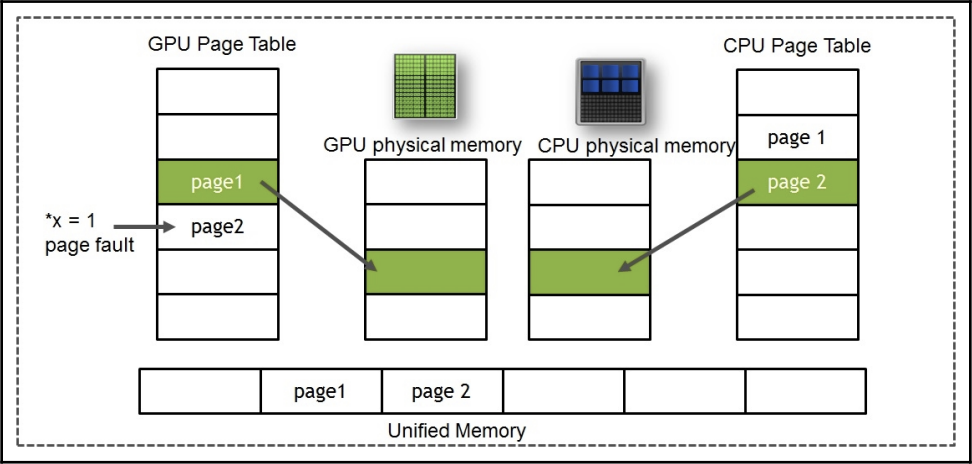

2. 接下来，在 CPU 上取消映射旧页面，如下图所示：

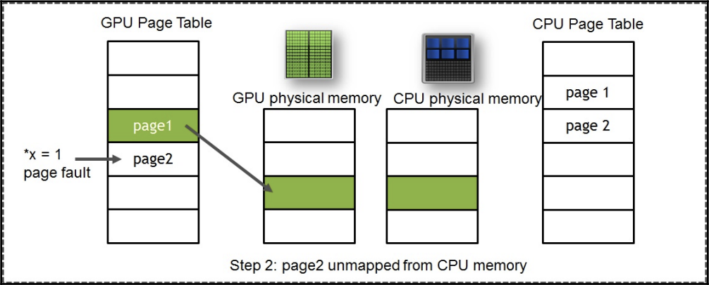

3. 然后，数据从 CPU 复制到 GPU，如下图所示：

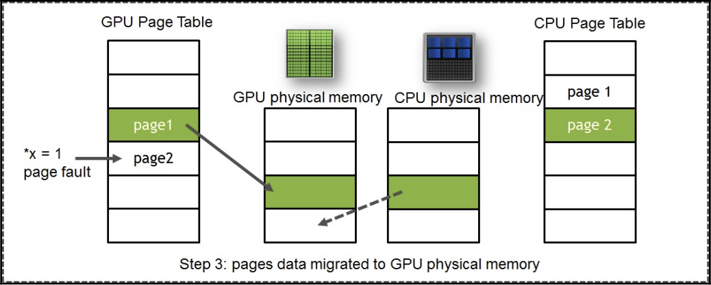

4. 最后，在 GPU 上映射新页面，同时在 CPU 上释放旧页面，如下图所示：

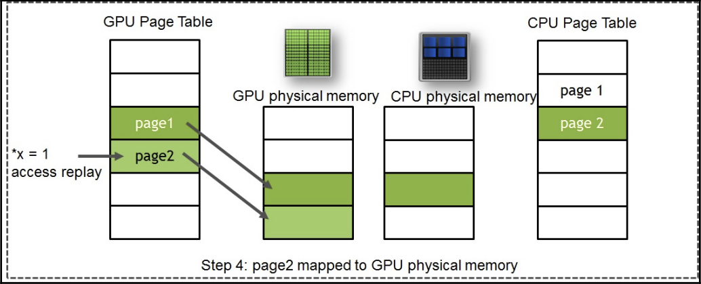

GPU 中的后备缓冲区（TLB）类似于 CPU 中的 TLB，负责将物理地址翻译为虚拟地址。**当发生页面错误时，相应 SM 的 TLB 被锁定**。这意味着新的指令将被阻塞，直到前述步骤完成并最终解锁 TLB。这是为了保持内部 SM 内存视图的一致性和协调性。驱动程序负责去除这些重复操作、更新映射，并传输页面数据。正如之前提到的，所有这些操作时间都会添加到总内核执行时间中。

现在，我们已经理解了问题所在，那么解决方案是什么呢？解决方法有两种：

1. 在 GPU 上创建一个初始化内核，以确保在 `add` 内核运行期间不会发生页面错误。然后，我们将通过使用每页一组的概念来优化页面错误。

2. 进行数据预取操作。

### 初始化内核

```cpp
__global__ void init(int n, float *x, float *y) {
    int index = threadIdx.x + blockIdx.x * blockDim.x;
    int stride = blockDim.x * gridDim.x;
    for (int i = index; i < n; i += stride) {
        x[i] = 1.0f;
        y[i] = 2.0f;
    }
}
```

我们通过在 GPU 内部添加一个用于初始化数组的内核。当在 init 内核中首次访问时，页面将被分配并映射到 GPU 内存。让我们看一下这段代码的分析结果输出，其中包括初始化内核的分析结果：

再次使用 nvprof 分析可得：

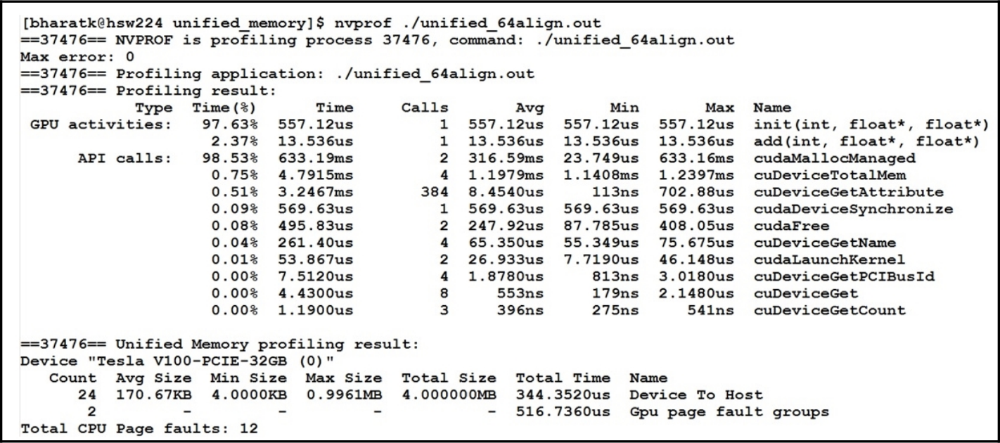

add 内核的时间已减少到 18 微秒。这实际上给了我们以下内核带宽：

带宽 = 字节 / 秒 = (3 * 4,194,304 字节 * 1e-9 字节/GB) / 18.84e-6s = 670 GB/s

这个带宽与非统一内存情况下的预期相符。正如我们从前面的初步实现中看到的，分析输出中没有主机到设备的行为。add 内核的时间减少了，但 init 内核并没有成为占用最多时间的热点。这是因为我们在 init 内核中首次访问内存。

### 数据预取操作

数据预取基本上是对驱动程序的提示，用于在设备使用数据之前预取我们认为会使用的数据。CUDA 提供了一个称为 `cudaMemPrefetchAsync()` 的预取 API 来实现这一目的。

```cpp
// 分配统一内存 -- 可由CPU或GPU访问
cudaMallocManaged(&x, N * sizeof(float));
cudaMallocManaged(&y, N * sizeof(float));

// 在主机上初始化x和y数组
for (int i = 0; i < N; i++) {
    x[i] = 1.0f;
    y[i] = 2.0f;
}

// 预取内存到GPU
cudaGetDevice(&device);
cudaMemPrefetchAsync(x, N * sizeof(float), device, NULL);
cudaMemPrefetchAsync(y, N * sizeof(float), device, NULL);

// 执行add内核
add<<<numBlocks, blockSize>>>(N, x, y);

// 预取内存到CPU
cudaMemPrefetchAsync(y, N * sizeof(float), cudaCpuDeviceId, NULL);

// 在访问主机之前等待GPU完成
cudaDeviceSynchronize();

// 计算最大误差
for (int i = 0; i < N; i++)
    maxError = fmax(maxError, fabs(y[i] - 3.0f));

```

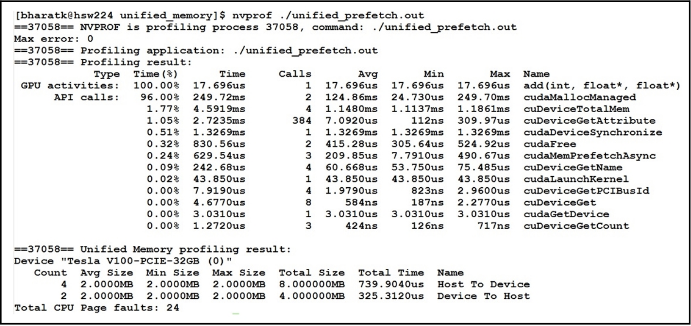

add 内核提供了我们期望的带宽。统一内存是一个不断发展的功能，随着每个 CUDA 版本和 GPU 架构的发布而发生变化。建议访问最新的 CUDA 编程指南（https://docs.nvidia.com/cuda/cuda-c-programming-guide/index.html#um-unified-memory-programming-hd）

UM 不仅提供了编程的便利性（不需要使用 CUDA API 来显式管理内存）,手动移动数据很容易出错，并需要调整内存大小。使用 UM 的一个关键优势之一是过度订阅（over-subscription）。与 CPU 内存相比，GPU 内存相对有限。Volta 卡 V100 每个 GPU 提供的最大内存为 32 GB。借助 UM，可以将多个 GPU 内存片段与 CPU 内存一起视为一个大内存。例如，具有 16 个 Volta GPU 的 NVIDIA DGX2 机器，总共提供了 323 GB 的内存，可以视为具有最大 512 GB 大小的 GPU 内存集合。对于计算流体力学（CFD）和分析等应用程序来说，这些优势是巨大的。以前，很难将问题规模适应 GPU 内存，现在却成为可能。

此外，高速互连技术（如 NVLink 和 NVSwitch）的出现使 GPU 之间的传输变得更快，带宽更高，延迟更低。这意味着，使用统一内存可以获得更高的性能！

数据预取与指定数据实际位置的 API 是结合使用的，对于需要同时访问相同数据的多个处理器非常有帮助。在这种情况下使用的 API 名称是 `cudaMemAdvice()` 。因此，通过深入了解您的应用程序，您可以使用这些 API 来优化访问。当前 API 接受的一些建议包括：

- `cudaMemAdviseSetReadMostly`：顾名思义，表示数据基本上是只读的。驱动程序创建数据的只读副本，从而减少页面错误。但需要注意，数据仍然可以被写入。在这种情况下，页面副本会失效，除了写入内存的设备之外。

    ```cpp
    // Sets the data readonly for the GPU
    cudaMemAdvise(data, N, ..SetReadMostly, processorId);
    mykernel<<<..., s>>>(data, N);
    ```

- `cudaMemAdviseSetPreferredLocation`：这个建议将数据的首选位置设置为属于设备的内存。设置首选位置不会立即导致数据迁移到该位置。例如，下面的代码中，`mykernel` 将会引发页面错误，并在 CPU 上直接映射数据。驱动程序会尽量阻止数据迁移出设置的首选位置。

    ```cpp
    cudaMemAdvise(input, N, ..PreferredLocation, processorId);
    mykernel<<<..., s>>>(input, N);
    ```

- `cudaMemAdviseSetAccessedBy`：这个建议表示数据将由设备访问。设备将在 CPU 内存中创建数据的直接映射，不会生成页面错误。

    ```cpp
    cudaMemAdvise(input, N, ..SetAccessedBy, processorId);
    mykernel<<<..., s>>>(input, N);
    ```

## 总结

本文，我们介绍了不同类型的 GPU 内存。详细探讨了全局内存、纹理内存、共享内存以及寄存器。此外，我们还研究了 GPU 内存演进所带来的新特性，比如统一内存，它有助于提升程序员的生产效率。最后，我们还讨论了如何使用统一内存来优化应用程序的性能。

## 参考

- [Learn CUDA Programming](https://github.com/PacktPublishing/Learn-CUDA-Programming/tree/master)
- [CUDA C++ Programming Guide](https://docs.nvidia.com/cuda/cuda-c-programming-guide/index.html)
