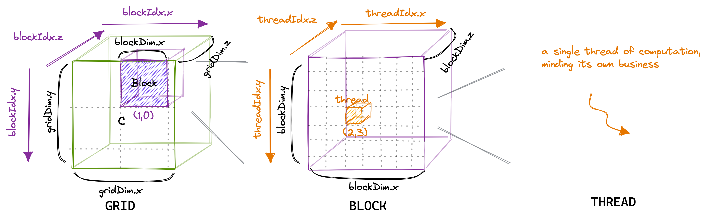
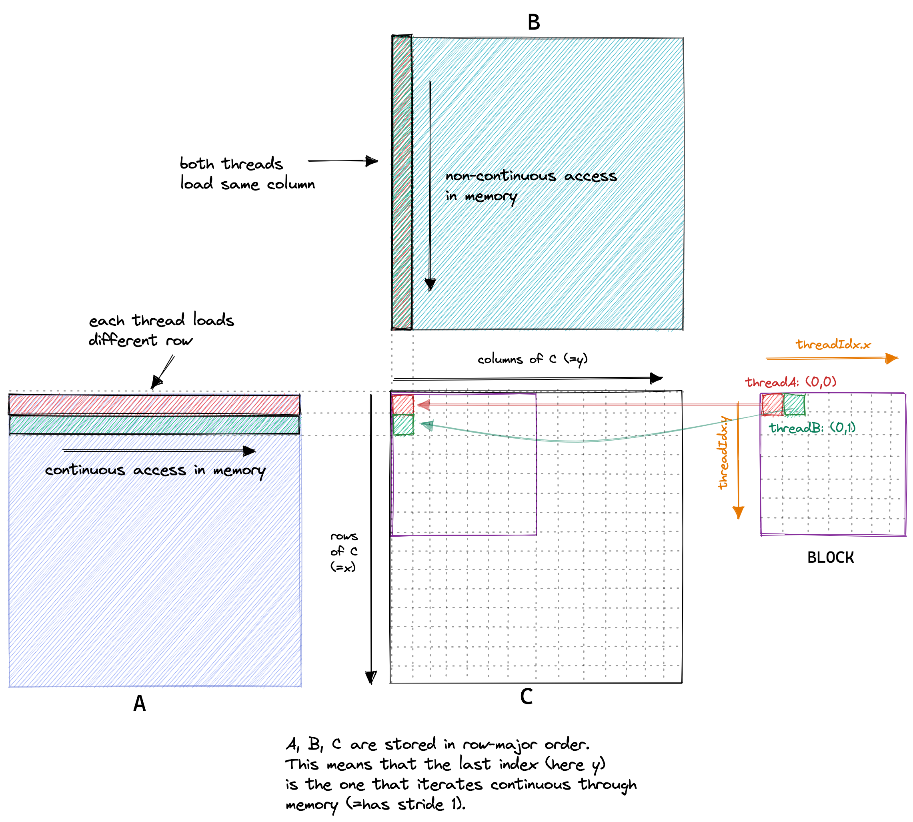
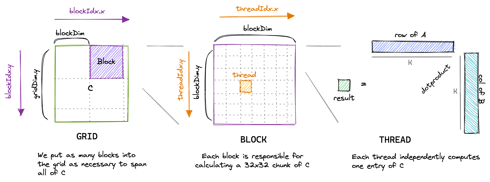

# 朴素 GEMM

目前，在训练和推理大型深度学习模型期间，矩阵乘法可能是最重要的算法之一。因此，从头开始编写一个高性能的 CUDA SGEMM（单精度=32 位）究竟需要多少工作呢？我将从一个简单的内核开始，逐步应用优化，直到我们的性能接近 cuBLAS（NVIDIA 的官方矩阵库）。

在 CUDA 编程模型中，计算按照三级层次进行排序。每次调用 CUDA 内核都会创建一个新的网格，该网格由多个块组成。每个块由最多 1024 个单独的线程组成。这些常数可以在 CUDA 编程指南中查找。处于同一块内的线程可以访问相同的共享内存区域（SMEM）。

块中的线程数可以使用一个通常称为 `blockDim` 的变量进行配置，它是一个由三个整数组成的向量。该向量的条目指定了 `blockDim.x`、`blockDim.y` 和 `blockDim.z` 的大小，如下图所示：



同样，网格中的块数可以使用 gridDim 变量进行配置。当我们从主机启动一个新的内核时，它会创建一个包含按照指定方式排列的块和线程的单一网格。重要的是要记住，我们刚刚讨论的线程层次结构主要涉及程序的正确性。然而，对于程序的性能，正如我们将在后面看到的那样，将同一块内的所有线程看作相等并不是一个好主意。

对于我们的第一个内核，我们将使用 grid、block 和 thread 的层次结构，每个线程计算结果矩阵 C 中的一个元素。该线程将计算矩阵 A 相应行和矩阵 B 相应列的点积，并将结果写入矩阵 C。由于矩阵 C 的每个位置仅由一个线程写入，我们无需进行同步。我们将以以下方式启动内核：

```cpp
// create as many blocks as necessary to map all of C
dim3 gridDim(CEIL_DIV(M, 32), CEIL_DIV(N, 32), 1);
// 32 * 32 = 1024 thread per block
dim3 blockDim(32, 32, 1);
// launch the asynchronous execution of the kernel on the device
// The function call returns immediately on the host
sgemm_naive<<<gridDim, blockDim>>>(M, N, K, alpha, A, B, beta, C);
```

:::info

注意这里除以 32 是因为 block 大小为 32，该 kernel 为输出结果的每一个位置设置一个线程用于计算。

实际上就是将一个输出矩阵（也就是一个 grid）分割为大小为 32 的窗口，如下图所示，每个 block 负责一个窗口内结果的计算。

计算过程中，首先需要得到某一个 block 中某个线程相对与整个 grid 的 **绝对坐标**：

1. x 的计算要用到块内 x 坐标（threadIdx.x），以及之前 block 的长度 （blockDim.x * blockIdx.x，前者表示一个 block 的长度即 32，后者表示是 x 方向的第几个 block）；
2. y 的计算同理。

得到绝对坐标后，计算便直接根据矩阵相乘的流程即可。

更新：看起来并不是相对与结果矩阵的绝对坐标，如下图所示，似乎有一个转置



首先明确 x， y 是线程在 grid 中的绝对坐标，分别表示横向和纵向，但从下面的写出代码中可以看出，x 应该是表示行号，然而实际上 x 表示 grid 中的列号，因此 grid 中的线程与结果矩阵应该有一个转置的对应关系。

```cpp
C[x * N + y] = alpha * tmp + beta * C[x * N + y];
```

而如果线程坐标就是其负责数据坐标，这样便可以直接全局内存合并，因此只需要调换 x 和 y 的值，并且更改判断条件即可，具体见第二章。

:::

:::warning

直接调换顺序应该是可行的，但是经过测试部分尺寸会有问题，不懂为啥😢。

:::

下图可视化了我们的内核的执行方式：



CUDA 代码是从单线程的视角编写的。在内核代码中，我们使用 `blockIdx` 和 `threadIdx`。这些变量的值会根据访问它们的线程而异。在我们的例子中，`threadIdx.x` 和 `threadIdx.y` 将根据线程在网格中的位置从 0 到 31 变化。同样，`blockIdx.x` 和 `blockIdx.y` 也将根据线程块在网格中的位置从 0 到 `CEIL_DIV(N, 32)` 或 `CEIL_DIV(M, 32)` 变化。

```cpp
__global__ void sgemm_naive(int M, int N, int K, float alpha, const float *A,
                            const float *B, float beta, float *C) {
  // compute position in C that this thread is responsible for
  const uint x = blockIdx.x * blockDim.x + threadIdx.x;
  const uint y = blockIdx.y * blockDim.y + threadIdx.y;

  // `if` condition is necessary for when M or N aren't multiples of 32.
  if (x < M && y < N) {
    float tmp = 0.0;
    for (int i = 0; i < K; ++i) {
      tmp += A[x * K + i] * B[i * N + y];
    }
    // C = α*(A@B)+β*C
    C[x * N + y] = alpha * tmp + beta * C[x * N + y];
  }
}
```

这个内核在 A6000 GPU 上处理三个 4092$^2$ 的 fp32 矩阵大约需要 0.5 秒。

## 参考文献

1. https://siboehm.com/articles/22/CUDA-MMM
