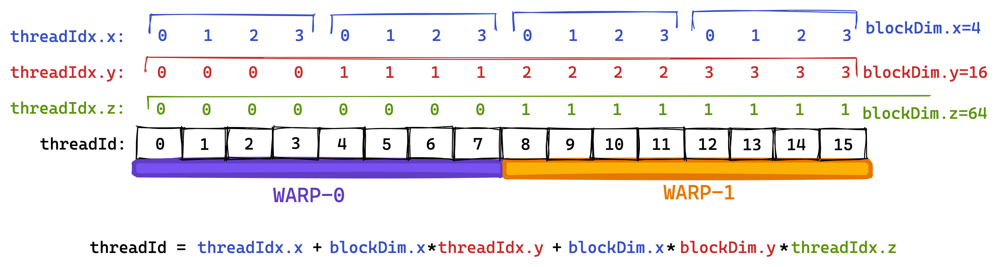
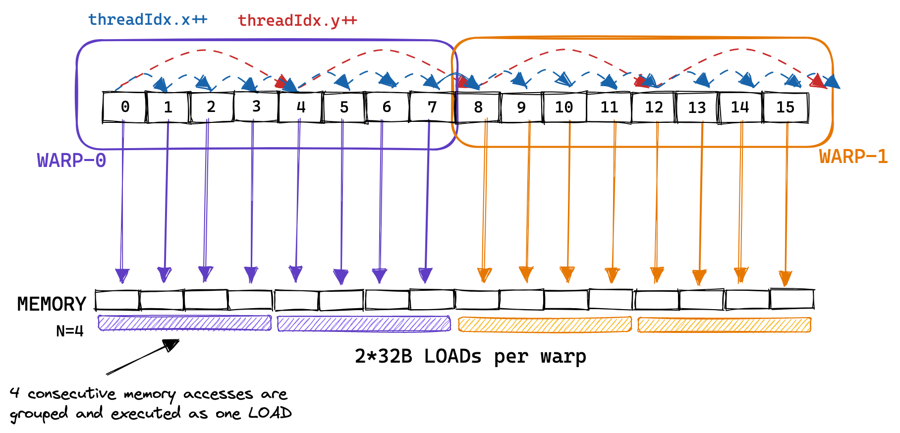
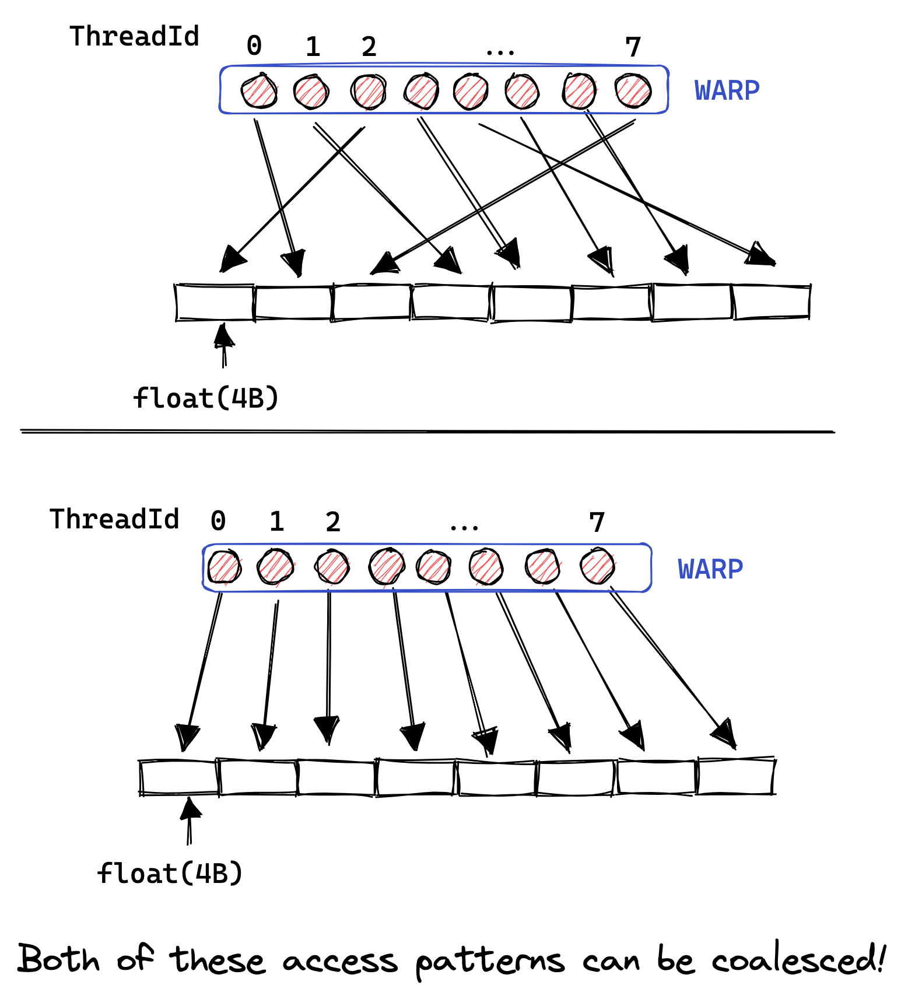
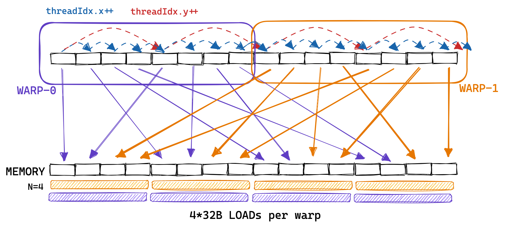
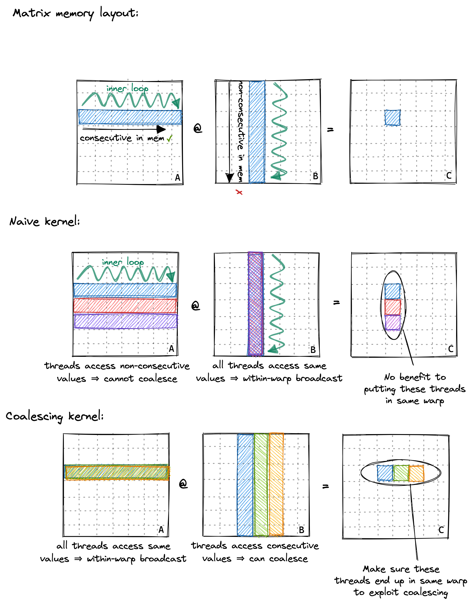

# 全局内存合并

在深入讨论全局内存合并之前，我们需要了解一下 warp 的概念。在执行过程中，一个块的线程被分组成所谓的 warp，每个 warp 包含 32 个线程。然后，一个 warp 被分配给一个 warp 调度器，即执行指令的物理核心。

在 Volta 架构之前，所有 warp 的线程都来自同一个指令流。在分支操作中，没有采用分支的线程会通过所谓的活动掩码进行停用。然而，自从 Volta 以来，依赖这种“warp 同步”行为已经不再是一个好主意，因为即使对于同一 warp 内的线程，不同分支的指令也可能交错执行。每个多处理器有四个 warp 调度器。warp 的分组是基于连续的线程 ID 进行的。如果我们将 blockDim 设置为多维度，那么线程 ID 的计算如下：

```cpp
threadId = threadIdx.x+blockDim.x*(threadIdx.y+blockDim.y*threadIdx.z)
```

:::note

该公式计算的是三维线程块的线程 id，而不是在 grid 中的 id，将其拆开：

```cpp
threadId = threadIdx.x+blockDim.x*threadIdx.y+blockDim.x*blockDim.y*threadIdx.z
```

以加号为分隔，分别是 1d, 2d, 3d 情况线程 idz 的计算公式。

根据线程 id 与 wrapsize 可以得知不同的线程是否处于同一个 wrap 当中。

:::

接着，具有相邻 threadId 的线程将成为同一 warp 的一部分。在下面的示例中，我试图使用较小的“warpsize”（实际 warps 始终包含 32 个线程）来进行说明。我喜欢将 threadId 的三个维度 x、y、z 看作是“列优先”的，因为第一个维度 x 在“warpspace”中是连续的。



第二个内核中，warp 的概念变得非常重要，因为属于同一 warp 的线程进行的顺序内存访问可以被合并并作为一个整体执行。这就是所谓的全局内存合并。在优化内核的 GMEM 内存访问以实现峰值带宽时，这是需要牢记的。

下面是一个示例，展示了属于同一 warp 的线程进行的连续内存访问被合并在一起，使得每个 warp 只需进行 2 次 32B 加载就能执行 8 次内存访问：



在实际情况中，GPU 支持 32B、64B 和 128B 的内存访问。因此，如果每个线程从全局内存加载一个 32 位的浮点数，warp 调度器（可能是 MIO）可以将这 32\*4B=128B 的加载合并为一个事务。这仅在加载的浮点数在内存中是连续的，并且访问是对齐的情况下才可能发生。因此，在 GPU 上优化全局内存合并的方式与在 CPU 上优化缓存行利用有很多相似之处。

有趣的是，为了允许合并，**warp 内的线程必须访问连续的地址，但这些访问不必在 warp 内是连续的**。如下图所示：如果它们不是连续的，或者由于其他原因无法合并访问，那么 GPU 将执行尽可能多的 32B 加载以获取所有浮点数，导致大量的带宽浪费。通过对我们的朴素内核进行分析，我们可以观察到非合并访问的有害效果，因为我们只能达到 15GB/s 的 GMEM 吞吐量。



回顾之前的内核，我们按以下方式为线程分配它们在矩阵 C 中的位置：

```cpp
const uint x = blockIdx.x * blockDim.x + threadIdx.x;
const uint y = blockIdx.y * blockDim.y + threadIdx.y;
```

因此，同一 warp 内的线程（即具有连续 `threadIdx.x` 的线程）从内存中非连续地加载矩阵 A 的行。朴素内核对 A 的内存访问模式看起来更像是：



为了实现内存合并，我们可以改变为线程分配结果矩阵 C 位置的方式。下面是对这种全局内存访问模式的改变进行的说明：



:::info

第一个图要说明的是 2d 矩阵的存放方式是行优先，即在行上是顺序排列的。

第二个图则是对 naive kernel 的解释，虽然单个线程访问左矩阵按照行顺序，但是同一个 warp 内的线程访问的内容不同，在右矩阵上，这些线程访问相同的位置，则会有 warp 内的广播。

**为什么 naive kernel 同一 warp 内的线程在结果矩阵上是竖着的？**

因为第一章矩阵和 block 的 x,y 是反过来的，这里的 x,y 是线程在 grid 中的绝对坐标，主要提供一个**唯一映射**线程与数据的作用。

第三个图则是进行改进，同一 warp 内的线程都会访问左矩阵相同的数据，因此有广播；对于右矩阵，这些线程会访问连续的数据（行），因此触发全局内存合并。

:::

要实现这一点，我们只需更改前两行代码：

```cpp
const int x = blockIdx.x * BLOCKSIZE + (threadIdx.x / BLOCKSIZE);
const int y = blockIdx.y * BLOCKSIZE + (threadIdx.x % BLOCKSIZE);

if (x < M && y < N) {
  float tmp = 0.0;
  for (int i = 0; i < K; ++i) {
    tmp += A[x * K + i] * B[i * N + y];
  }
  C[x * N + y] = alpha * tmp + beta * C[x * N + y];
}
```

:::info

实际上也没必要用一维 block，可以改成

```cpp
const int x = blockIdx.x * BLOCKSIZE + threadIdx.y;
const int y = blockIdx.y * BLOCKSIZE + threadIdx.x;
```

还是与前一章说的一样，xy 提供一个唯一映射的作用，不过该映射在 block 内转置。

:::

我们这样调用它：对我来说一开始并不明显，但启用 GEMM 协同并不会改变汇编代码，可以在 Godbolt 上查看 SASS 输出。协同访问是由硬件在内核运行时执行的。这是有道理的，因为协同访问要求对齐访问，在编译时无法保证，因为我们将矩阵指针作为函数参数传递。另外：汇编代码对我们的内部循环进行了部分展开，即使循环计数 K 在编译时是未知的。

```cpp
// gridDim保持不变
dim3 gridDim(CEIL_DIV(M, 32), CEIL_DIV(N, 32));
// 使blockDim成为1维，但不更改线程数
dim3 blockDim(32 * 32);
sgemm_coalescing<<<gridDim, blockDim>>>(M, N, K, alpha, A, B, beta, C);
```

全局内存协同将内存吞吐量从 15GB/s 提高到 110GB/s。性能达到 2000GFLOPS，与第一个简单内核的 300GFLOPS 相比有了很大的改进。对于下一个内核，我们将使用 GPU 的共享内存，来缓存将被重复使用的数据。

## 参考文献

1. https://siboehm.com/articles/22/CUDA-MMM
