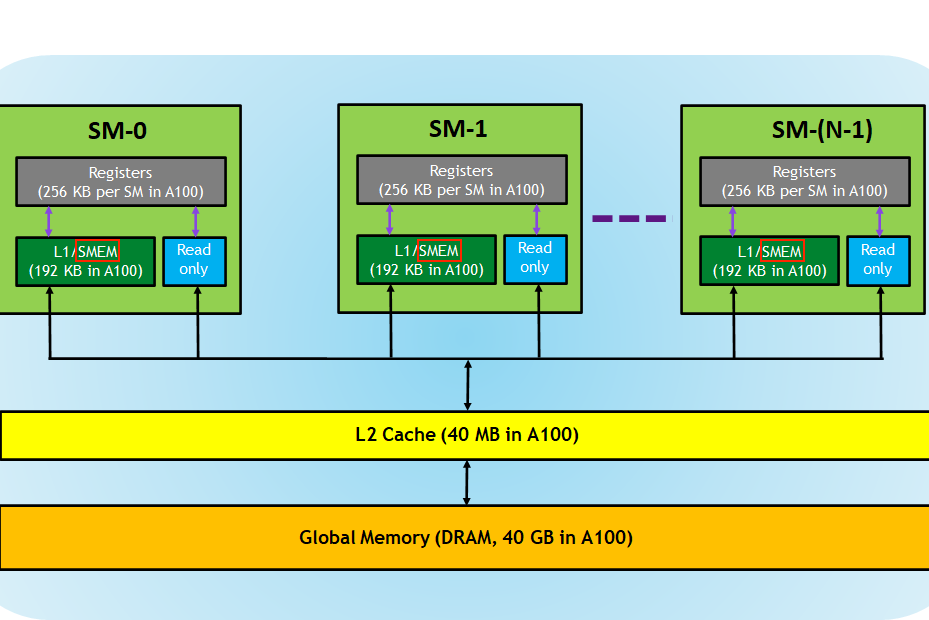
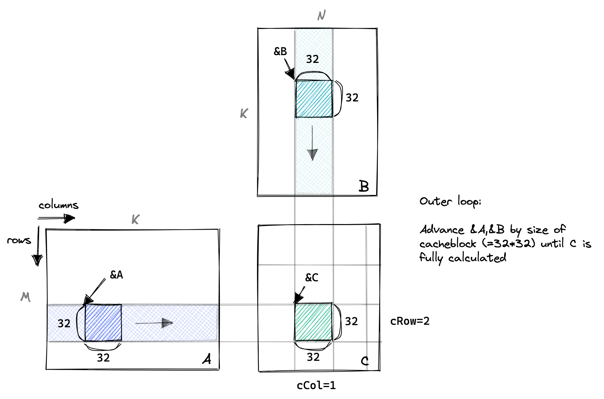
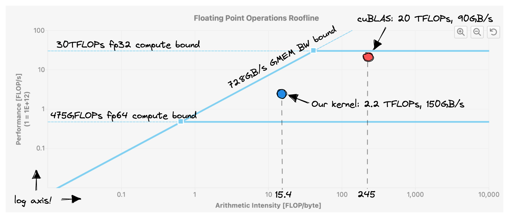

# 共享内存缓存块

在全局内存之外，GPU 还有一块位于芯片上的较小区域，被称为共享内存（SMEM）。每个 SM（流多处理器）都配备了一块共享内存。以下是 A100 GPU 内存层次结构的图示：



从逻辑上看，共享内存在各个块之间进行了分区。这意味着一个线程可以通过共享内存块与同一块内的其他线程进行通信。在我的 A6000 GPU 上，每个块最多可以访问 48KB 的共享内存。共享内存的大小是可配置的，可以通过权衡以获得更大的共享内存而减小 L1 缓存的大小。具体细节请参阅计算能力文档。此外，通过使用动态共享内存，可以超过每个线程 48KB 的 SMEM。

由于共享内存位于芯片上，其延迟较低，带宽较高。虽然我找不到 Ampere 架构的准确基准结果，但对于 2017 年发布的 Volta 架构，根据论文的基准测试报告，全局内存带宽为 750GiB/s，共享内存带宽为 12,080GiB/s。 从 Volta 以来，这些数字似乎并没有发生太大变化。

因此，对于这个新的内核，我们将 A 和 B 的全局内存一块加载到共享内存中。接着，我们将在这两块上尽可能多地执行计算，每个线程仍然分配给 C 的一个条目。我们将沿着 A 的列和 B 的行移动这些块，在 C 上执行部分求和，直到最终结果得出。

:::info

可以使用计算访存比来衡量 kernel 的优化水平，提升计算访存比有很大的好处，那么计算访存比可以无限提升吗，答案是否定的。因为要提升计算访存比，单个 thread 就需要计算一个更大的块，这就需要更多的寄存器，但寄存器的个数是有限的。以 Turing 架构的 GPU 为例，单个 SM 的寄存器总量为 65536，因为指令编码的限制，单个 thread 能使用的最大寄存器个数为 255，并且寄存器个数并不是用得越多越好。这里需要引入一个 Occupancy（占用率）的概念，Occupancy 是指每个 SM 中活动线程束（Warp）数量与最大并发线程束数量的比值，高的 Occupancy 不一定意味着高性能，但可以通过切换执行 Warp 来起到一定隐藏延迟的作用。而每个 SM 中的 Active Warp 数量，取决于 block 使用的资源数量，具体为每个线程使用的寄存器个数与 Shared Memory 用量。Occupany 可通过 CUDA Toolkit 中提供的 CUDA_Occupancy_Calculator.xls 工具获得。

在前面的 kernel 中，进行一次 FMA（乘累加）之前就需要进行两次读取操作，计算访存比只有三分之一，大量的时间被浪费在了访存之中，导致访存的延迟不能被隐藏。

:::

:::info

隐藏访存延迟应该有很多原因，目前还没有深究，最简单的就是 SM 中可以调度不在访存的 warp 进行计算，并且一次只加载少量数据，达成类似于流水线的效果？

:::



:::info

这里的图与之前的不同是因为以 block 的视角。

:::

以下是代码的重要部分，其中变量名称对应上面的图表：

```cpp
// 推进指针到起始位置
A += cRow * BLOCKSIZE * K;                    // 行=cRow，列=0
B += cCol * BLOCKSIZE;                        // 行=0，列=cCol
C += cRow * BLOCKSIZE * N + cCol * BLOCKSIZE; // 行=cRow，列=cCol

float tmp = 0.0;
// 外部循环推进 A 沿列和 B 沿行，直到我们完全计算出 C 中的结果。
for (int bkIdx = 0; bkIdx < K; bkIdx += BLOCKSIZE) {
  // 每个线程从全局内存加载 A 和 B 中的一个元素到共享内存中。
  // 将 threadCol（=threadIdx.x）设为连续的索引，以允许全局内存访问协同。
  As[threadRow * BLOCKSIZE + threadCol] = A[threadRow * K + threadCol];
  Bs[threadRow * BLOCKSIZE + threadCol] = B[threadRow * N + threadCol];

  // 阻塞本块内的线程，直到缓存完全填充
  __syncthreads();

  // 推进指针到下一个块
  A += BLOCKSIZE;
  B += BLOCKSIZE * N;

  // 在当前缓存块上执行点积
  for (int dotIdx = 0; dotIdx < BLOCKSIZE; ++dotIdx) {
    tmp += As[threadRow * BLOCKSIZE + dotIdx] *
            Bs[dotIdx * BLOCKSIZE + threadCol];
  }
  // 在最后需要再次同步，以避免更快的线程在较慢的线程完成之前将下一个块提取到缓存中
  __syncthreads();
}
C[threadRow * N + threadCol] =
    alpha * tmp + beta * C[threadRow * N + threadCol];

```

这段代码通过将 A 和 B 的一块加载到共享内存中，然后在共享内存中执行点积，以充分利用共享内存的低延迟和高带宽。此方法通过优化数据访问模式和减少全局内存访问次数来提高性能。通过测试，将其与 cuBLAS 的结果进行比较，可以验证内核的正确性。

这个内核实现了约 2200 GFLOPS，相较于之前的版本提高了 50%。部分原因是因为我们之前的内核已经具有相当良好的 L1 缓存命中率。然而，我们仍然离 GPU 可以提供的约 30 TFLOPs 相去甚远。这一点在下面的图中表现得非常明显：请注意，我们实现了比 cuBLAS 更高的内存带宽。但由于每个从内存加载的字节所需的工作量较小（算术强度较低），因此整体性能较差。



在将 CHUNKSIZE 设置为 32 的情况下，这个内核充分利用了 2\*32\*32\*4B=8KB 的共享内存空间。你也可以通过在编译时添加参数 --ptxas-options=-v 来获取相应的信息，输出结果为：Used 37 registers, 8192 bytes smem, 400 bytes cmem[0]。我的 A6000 GPU 每个块可用的最大共享内存空间是 48KB，因此我们离达到这个限制还有一些距离。但这并不一定是个问题，因为增加每个块的共享内存使用率也会带来一些不利因素。每个多处理器（SM）最多可用 100KB 的 SMEM。这就意味着，如果我们修改内核以使用完整的 48KB 可用的 SMEM，那么每个 SM 同一时间只能保持两个块加载。在 CUDA 的术语中，增加每块 SMEM 利用率可能会降低占用率。占用率定义为每个 SM 的活动 warp 数与每个 SM 的最大可能活动 warp 数之间的比率。

高占用率非常有用，因为它允许我们通过拥有更大的可发出指令池来掩盖操作的高延迟。在 GPU 上，像 FMA 这样的数学运算的延迟为 4 个周期，相当于在 1.5GHz 时钟下的 2.6ns。将这与最近的 x86 CPU 相比，那里 FMA 的延迟为 6 个周期，相当于在 3.5GHz 时钟下的 1.8ns。保持更多活动块加载到一个 SM 上有三个主要限制：寄存器数、warp 数和 SMEM 容量。

另一版本代码：

```cpp
#pragma once

#include <stdio.h>
#include <cuda_runtime.h>

template <const int BLOCKSIZE>
__global__ void sgemm_shared_mem_kernel(float *A, float *B, float *C, int M, int N, int K)
{
    // the output block that we want to compute in this threadblock
    // 输出结果所在block
    const uint c_row = blockIdx.x;
    const uint c_col = blockIdx.y;

    // allocate shared memory for the input and output submatrices
    __shared__ float A_shared[BLOCKSIZE][BLOCKSIZE];
    __shared__ float B_shared[BLOCKSIZE][BLOCKSIZE];

    // the inner row & col that we're accessing in this thread
    const uint thread_row = threadIdx.y;
    const uint thread_col = threadIdx.x;

    // advance pointers to the starting positions
    A += c_row * BLOCKSIZE * K;
    B += c_col * BLOCKSIZE;
    C += c_row * BLOCKSIZE * N + c_col * BLOCKSIZE;

    float tmp = 0.0f;
    for (int i = 0;i < K;i += BLOCKSIZE)
    {
        // load the next block of the input matrices into shared memory
        A_shared[thread_row][thread_col] = (c_row * BLOCKSIZE + thread_row < M && i + thread_col < K) ? A[thread_row * K + thread_col]: 0.0f;
        B_shared[thread_row][thread_col] = (c_col * BLOCKSIZE + thread_col < M && i + thread_row < K) ? B[thread_row * N + thread_col]: 0.0f;

        // wait for all threads to finish loading
        __syncthreads();

        // compute the partial sum
        for (int j = 0; j < BLOCKSIZE; j++)
        {
            tmp += A_shared[thread_row][j] * B_shared[j][thread_col];
        }

        // wait for all threads to finish computing
        __syncthreads();

        // advance the pointers
        A += BLOCKSIZE;
        B += BLOCKSIZE * N;
    }

    if (c_row * BLOCKSIZE + thread_row < M && c_col * BLOCKSIZE + thread_col < N) {
        C[thread_row * N + thread_col] = tmp;
    }
}
```

:::info

注意这里读入共享内存时也要注意有没有全局内存合并。

:::

:::note

共享内存在 block 内可见，因此每个线程只需要写出一个结果即可。

:::

## 参考文献

1. https://siboehm.com/articles/22/CUDA-MMM
2. https://zhuanlan.zhihu.com/p/410278370
