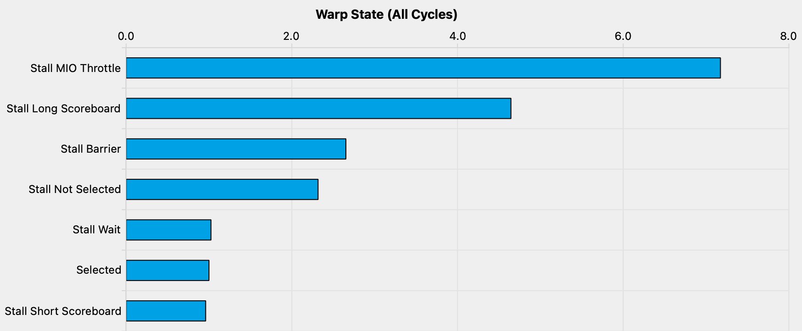

# 一维 Thread Tile 并行优化

:::info

如前文所述，要尽可能的使用计算来掩盖访存延迟，因此可以使用一个 thread 负责计算多个数据，本篇则使用一个 thread 在数据矩阵的行上进行分片，一个线程负责一小列的数据计算。

:::

这个新的内核与前一个内核相似，但增加了一个新的内循环，用于计算每个线程的多个 C 条目。我们现在使用的 SMEM 缓存大小为 `BM*BK + BN*BK = 64*8 + 64*8 = 1024` 个浮点数，每个块总共为 4KB。下面是一个可视化效果，我用橙色和红色突出显示了两个线程以及它们在内循环中访问的值。

:::info

之所以缓存变成了长方形，是因为一个线程负责一小列的计算，本文使用的分片大小为 8，实际上负责该区域的线程数量是 $64/8,8$。

:::


在这个内核中，所有重要的更改都发生在内循环中。与之前相比，从 GMEM 到 SMEM 的加载基本相同。具体来看，我们分配了一个线程本地缓存 `threadResults[TM]` 用于寄存器文件。

```cpp
// 为寄存器文件分配线程本地缓存
float threadResults[TM] = {0.0};

// 外循环遍历
for (uint bkIdx = 0; bkIdx < K; bkIdx += BK) {
  // 填充SMEM缓存（与之前相同）
  As[innerRowA * BK + innerColA] = A[innerRowA * K + innerColA];
  Bs[innerRowB * BN + innerColB] = B[innerRowB * N + innerColB];
  __syncthreads();

  // 推进外循环的指针
  A += BK;
  B += BK * N;

  // 计算每个线程的结果
  for (uint dotIdx = 0; dotIdx < BK; ++dotIdx) {
    // 我们将点积循环放在外循环中，这有助于重用Bs，我们可以将其缓存在tmp变量中。
    float Btmp = Bs[dotIdx * BN + threadCol];
    for (uint resIdx = 0; resIdx < TM; ++resIdx) {
      threadResults[resIdx] +=
          As[(threadRow * TM + resIdx) * BK + dotIdx] * Btmp;
    }
  }
  __syncthreads();
}
```

这个内核实现了约 8600 GFLOPs，比我们上一个内核快 2.2 倍。让我们计算一下在我们上一个内核中，每个线程执行了多少内存访问 （每个线程计算一个结果）：

- GMEM：K/32 次外循环迭代 \* 2 次加载
- SMEM：K/32 次外循环迭代 \* BLOCKSIZE（=32） \* 2 次加载
- 每个结果的内存访问：K/16 GMEM，K\*2 SMEM

对于我们的新内核，其中每个线程计算了八个结果：

- GMEM：K/8 次外循环迭代 \* 2 次加载
- SMEM：K/8 次外循环迭代 \* BK（=8）\*（1 + TM（=8））
- 每个结果的内存访问：K/32 GMEM，K\*9/8 SMEM

正如预期的那样，我们现在每个指令的循环周期中由于内存压力造成的停顿明显减少。



## 关于编译器优化的一点说明

在上述代码中，我们明确将 B 的条目缓存到 Btmp 中，并重新排列了两个内循环以提高效率。如果我们不这样做，那么代码看起来像这样：

```cpp
for (uint resIdx = 0; resIdx < TM; ++resIdx) {
  for (uint dotIdx = 0; dotIdx < BK; ++dotIdx) {
    threadResults[resIdx] +=
      As[(threadRow * TM + resIdx) * BK + dotIdx] * Bs[dotIdx * BN + threadCol];
  }
}
```

有趣的是，这对性能没有不利影响。这让人惊讶，因为我们的两个内循环现在引起了 BK（=8）* TM（=8）* 2 = 128 次 SMEM 访问，而不是之前的 72 次。查看汇编代码可以找到答案。

```
// first inner-most loop
ld.shared.f32   %f45, [%r9];
ld.shared.f32   %f46, [%r8];
fma.rn.f32      %f47, %f46, %f45, %f212;
ld.shared.f32   %f48, [%r9+256];
ld.shared.f32   %f49, [%r8+4];
fma.rn.f32      %f50, %f49, %f48, %f47;
ld.shared.f32   %f51, [%r9+512];
ld.shared.f32   %f52, [%r8+8];
fma.rn.f32      %f53, %f52, %f51, %f50;
ld.shared.f32   %f54, [%r9+768];
ld.shared.f32   %f55, [%r8+12];
fma.rn.f32      %f56, %f55, %f54, %f53;
ld.shared.f32   %f57, [%r9+1024];
ld.shared.f32   %f58, [%r8+16];
fma.rn.f32      %f59, %f58, %f57, %f56;
ld.shared.f32   %f60, [%r9+1280];
ld.shared.f32   %f61, [%r8+20];
fma.rn.f32      %f62, %f61, %f60, %f59;
ld.shared.f32   %f63, [%r9+1536];
ld.shared.f32   %f64, [%r8+24];
fma.rn.f32      %f65, %f64, %f63, %f62;
ld.shared.f32   %f66, [%r9+1792];
ld.shared.f32   %f67, [%r8+28];
fma.rn.f32      %f212, %f67, %f66, %f65;
// second inner-most loop
ld.shared.f32   %f68, [%r8+32];
fma.rn.f32      %f69, %f68, %f45, %f211;
ld.shared.f32   %f70, [%r8+36];
fma.rn.f32      %f71, %f70, %f48, %f69;
ld.shared.f32   %f72, [%r8+40];
fma.rn.f32      %f73, %f72, %f51, %f71;
ld.shared.f32   %f74, [%r8+44];
fma.rn.f32      %f75, %f74, %f54, %f73;
ld.shared.f32   %f76, [%r8+48];
fma.rn.f32      %f77, %f76, %f57, %f75;
ld.shared.f32   %f78, [%r8+52];
fma.rn.f32      %f79, %f78, %f60, %f77;
ld.shared.f32   %f80, [%r8+56];
fma.rn.f32      %f81, %f80, %f63, %f79;
ld.shared.f32   %f82, [%r8+60];
fma.rn.f32      %f211, %f82, %f66, %f81;
// ... continues like this for inner-loops 3-8 ...
```

编译器展开了这两个循环，因为循环次数在编译时是已知的。然后消除了 Bs 的重复 SMEM 加载，因此我们最终得到与我们优化过的 CUDA 代码相同数量的 SMEM 访问。

```cpp
LDS     R26, [R35.X4+0x800] // 从As加载的32位
LDS.128 R8,  [R2]           // 从Bs加载的128位
LDS.128 R12, [R2+0x20] 
LDS     R24, [R35.X4+0x900] 
LDS.128 R20, [R2+0x60] 
LDS     R36, [R35.X4+0xb00] 
LDS.128 R16, [R2+0x40] 
LDS.128 R4,  [R2+0x80] 
LDS     R38, [R35.X4+0xd00] 
```

**由于我们当前的内核的内存压力并不大。因此，我们打算再次采用每个线程计算更多的结果的优化策略。这让内核运行得更快的主要原因是它提高了算术强度，** 即在 GMEM 和 SMEM 之间传输的每字节执行的 FLOP 数（加载 + 存储）。下面我会尝试更直观地解释为什么每个线程计算更多的结果会提高算术强度：


计算每个线程的平方结果比计算结果的列更有效，因为这样我们可以共享更多的输入。


总的来说，虽然我们的所有内核执行的 FLOP 数量相同，但通过每个线程计算更多的结果，我们能够减少对 GMEM 的访问次数。只要我们仍然受制于内存，我们就应该继续致力于优化算术强度。

## 完整代码

```cpp
#pragma once

#include <stdio.h>
#include <cuda_runtime.h>

// block size in M, N, K dimension
template <const int BM, const int BN, const int BK, const int TM>
__global__ void sgemm_blocktiling_1d_kernel(float *A, float *B, float *C, int M, int N, int K)
{
    // the output block that we want to compute in this threadblock
    const uint c_row = blockIdx.y;
    const uint c_col = blockIdx.x;

    // allocate shared memory for the input and output submatrices
    __shared__ float A_shared[BM * BK];
    __shared__ float B_shared[BK * BN];

    // the inner row & col that we're accessing in this thread
    const uint thread_row = threadIdx.x / BN;
    const uint thread_col = threadIdx.x % BN;

    // advance pointers to the starting positions
    A += c_row * BM * K;
    B += c_col * BN;
    C += c_row * BM * N + c_col * BN;

    // use to avoid out-of-bounds accesses
    int global_m_pos = c_row * BM * K;
    int global_n_pos = c_col * BN;
    // size of two matrices
    const uint m_size = M * K;
    const uint n_size = N * K;

    assert(BM * BK == blockDim.x);
    assert(BN * BK == blockDim.x);

    const uint A_inner_row = threadIdx.x / BK; // warp-level GMEM coalescing
    const uint A_inner_col = threadIdx.x % BK;
    const uint B_inner_row = threadIdx.x / BN; // warp-level GMEM coalescing
    const uint B_inner_col = threadIdx.x % BN; 

    // allocate thread-local cache for results in registerfile
    // tile size in M dimension in C matrix
    float thread_results[TM] = {0.0};

    // outer loop over block tiles
    for (uint bk_idx = 0; bk_idx < K; bk_idx += BK)
    {
        // load the next block of the input matrices into shared memory
        A_shared[A_inner_row * BK + A_inner_col] = (global_m_pos + A_inner_row * K + A_inner_col < m_size) ? A[A_inner_row * K + A_inner_col] : 0.0f;
        B_shared[B_inner_row * BN + B_inner_col] = (global_n_pos + B_inner_row * N + B_inner_col < n_size) ? B[B_inner_row * N + B_inner_col] : 0.0f;


        // wait for all threads to finish loading
        __syncthreads();

        // advance the pointers
        A += BK;
        B += BK * N;
        global_m_pos += BK;
        global_n_pos += BK * N;

        // compute the partial sum
        for (uint dot_idx = 0; dot_idx < BK; dot_idx++)
        {
            // we make the dotproduct loop the outside loop, which facilitates
            // reuse of the Bs entry, which we can cache in a tmp var.
            float tmp_b = B_shared[dot_idx * BN + thread_col];
            for (uint res_idx = 0; res_idx < TM; res_idx++)
            {
                thread_results[res_idx] += A_shared[(thread_row * TM + res_idx) * BK + dot_idx] * tmp_b;
            }
        }

        // wait for all threads to finish computing
        __syncthreads();
    }

    for (uint res_idx = 0; res_idx < TM; res_idx++)
    {
        if (c_row * BM + thread_row * TM + res_idx < M && c_col * BN + thread_col < N)
        {
            C[(thread_row * TM + res_idx) * N + thread_col] = thread_results[res_idx];
        }
    }
}
```

启动 kernel 的线程设置为：

```cpp
const uint BM = 64;
const uint BN = 64;
const uint BK = 8;
const uint TM = 8;
dim3 grid_size(CEIL_DIV(n, BN), CEIL_DIV(m, BM));
dim3 block_size((BM * BN) / TM);
sgemm_blocktiling_1d_kernel<BM, BN, BK, TM>
	<<<grid_size, block_size>>>(A, B, C, m, n, k);
```

:::warning

注意这里线程数量的设置，一个 block 中为 512 个线程，而共享内存设置大小也为 512 个元素，这样一次加载即可，若每个线程要多次加载。

:::

## 参考文献

1. https://siboehm.com/articles/22/CUDA-MMM
